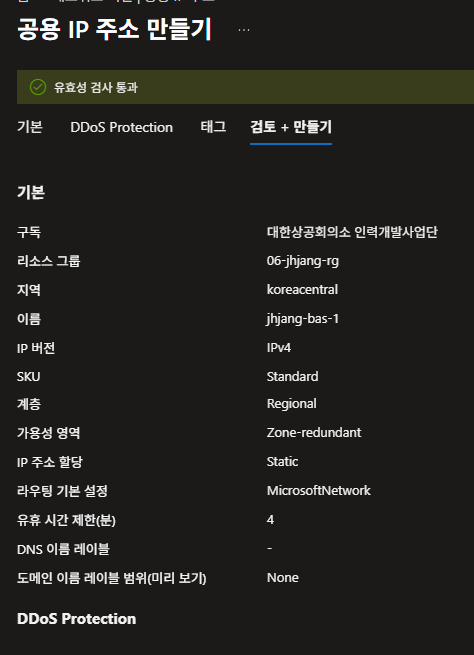

---
## 클라우드 정의

언제 어디서나 어떠한 단말을 사용하더라도 인터넷 접속만 가능하다면, 관리자의 개입 없이 원하는 서비스(리소스)를 비용을 지불하고 즉각적으로 이용할 수 있다.

**5가지 특징**

- On-Demand Self-Service
- Broad Network Access
- Measured Service
- Rapid Elasticity
- Resource Pooling

**공유 책임 모델**

- IaaS: 인프라(Hardware, 네트워크, OS) 제공 → 사용자가 MySQL, PHP, APP, Data 관리
- PaaS: 개발환경 제공 → 사용자가 App, Data 관리
- SaaS: Software 완전 제공 (완전관리형 모델)

**배포 유형**

- Public Cloud + Private Cloud = Hybrid Cloud
- Multi Hybrid Cloud: 통합된 관리 환경

---

## 클라우드 최초

- AWS(Amazon Web Service): Black Friday 트래픽 대응을 위해 시작

---

## Azure 사용법

**1. Resource 그룹 생성**

**2. 가상 네트워크 생성**

- Azure Bastion 사용 시 443포트 열기, outbound로 SSH/RDP 열기
- 특수한 서비스는 서브넷 용도를 지정해야 함
- 서브넷 크기: 최소 /16, 최대 /29
- 사용 가능한 IP가 251개인 이유: 처음/끝은 사용 불가, 1·2·3번은 Azure DHCP 예약
- public IP는 미리 만들어두는 것이 좋음
- Terraform은 NIC를 미리 만들어도 되지만 Azure 포털에서는 안 됨

**3. 공용 IP 주소 만들기**

- 리소스에서 공용 IP 주소 확인
- 공용 IP 접두사 생성 예시: `20.249.126.32/31` → 32, 33번 사용 가능
 

**4. 가상 머신 만들기**

- ARM: 저전력 프로세서 환경에서 사용
