---
## 오늘 목표

Azure + Terraform으로 인프라를 스크립트화한다.

---

## Azure 포털 실습

### 1. 리소스 그룹 생성

- 리소스 그룹 이름: `06-jhjang-rg1`
- 지역: Korea Central
- 유효성 검사 통과 후 만들기

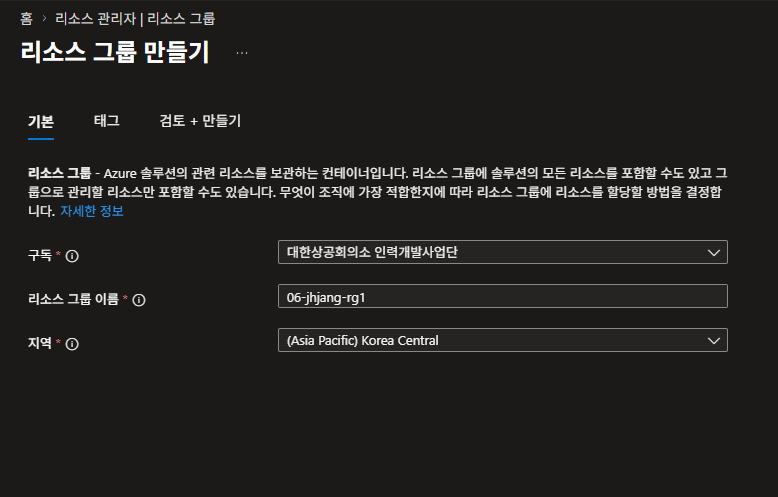

---

### 2. 가상 네트워크 생성

**VNet1 (10.0.0.0/16)**

- 이름: `jhjang-vnet1`

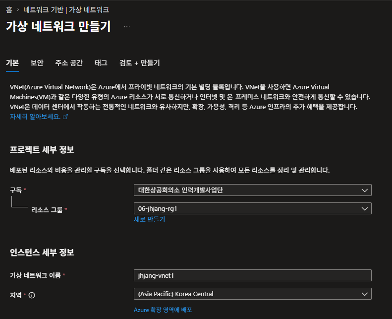

서브넷 4개 추가:
- `jhjang-bas1`: 10.0.0.0/24
- `jhjang-load1`: 10.0.1.0/24
- `jhjang-web1-1`: 10.0.2.0/24
- `jhjang-web1-2`: 10.0.3.0/24

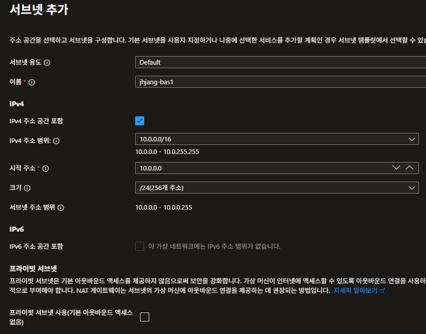


**VNet2 (192.168.0.0/26)**

서브넷 4개 추가:
- `jhjang-bas2`: 192.168.0.0/29
- `jhjang-load2`: 192.168.0.8/29
- `jhjang-web2-1`: 192.168.0.16/29
- `jhjang-web2-2`: 192.168.0.24/29


---

### 3. 공용 IP 주소 생성

- `jhjang-bas1-pubip`: IPv4, DDoS 보호 사용 안 함

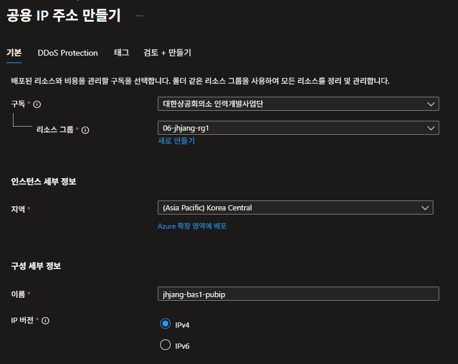


- `jhjang-load1-pubip`: 동일하게 생성

---

### 4. 공용 IP 접두사 만들기

- 이름: `jhjang-vnet2-pubip`
- 접두사 크기: /31 (주소 2개)
- 접두사 소유권: Microsoft 소유

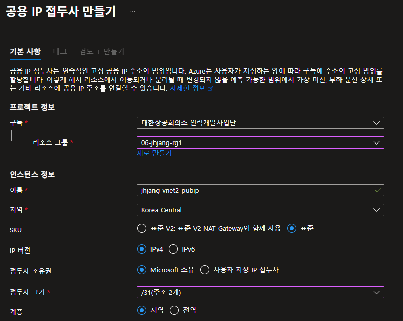

- `jhjang-bas2-pubip`: IP 주소 수동 지정 → `20.249.112.163`
- 수동 지정 시 범위 내 IP가 아니면 오류 발생

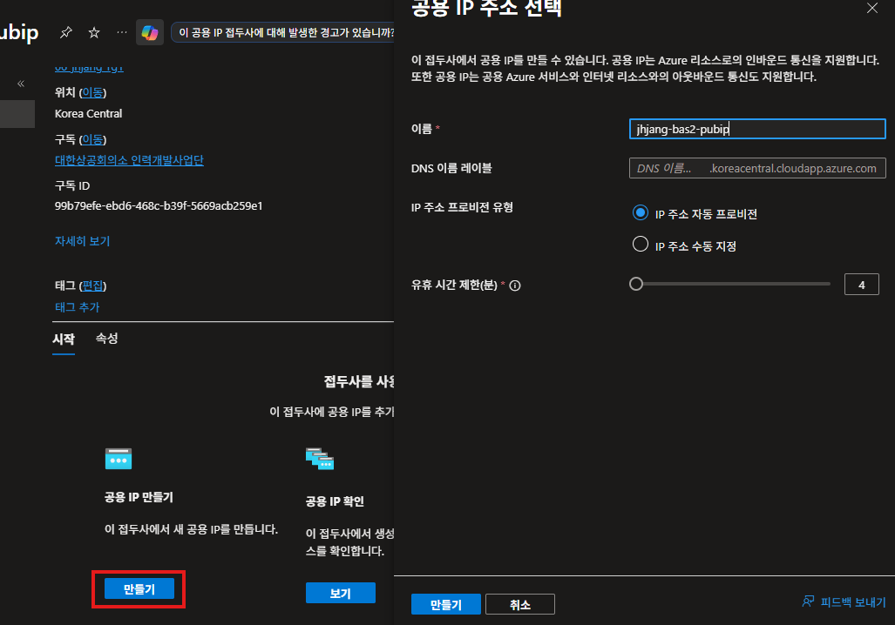

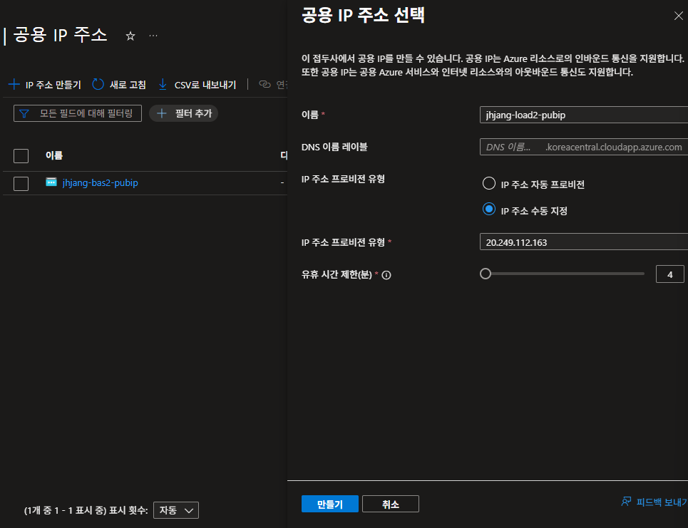

---

### 5. 가상 머신 생성

**공통 설정**
- 이미지: Rocky Linux 9 with LVM - x64 Gen2
- 인증 형식: SSH 공개 키 (기존 퍼블릭 키 사용)
- 사용자 이름: `jhjang`
- 디스크: 표준 SSD, 10GiB
- 모니터링: 부트 진단 사용 안 함

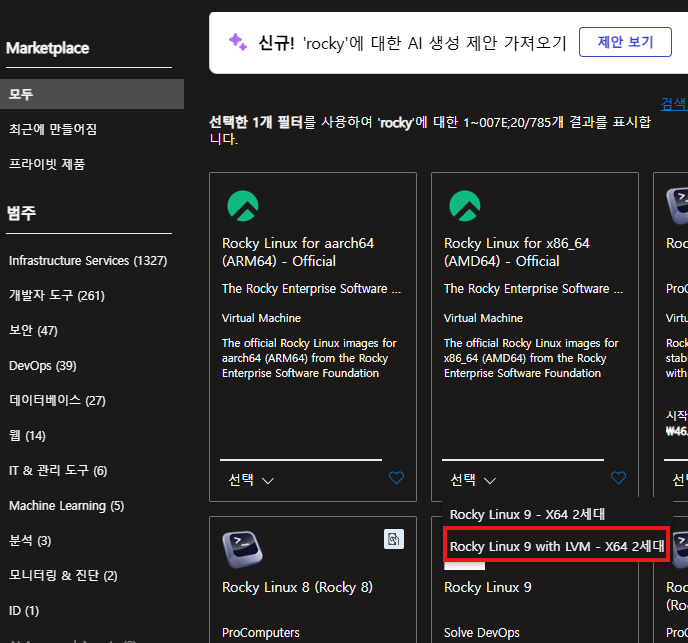

**bas1**
- 가상 네트워크: jhjang-vnet1 / 서브넷: jhjang-bas1 (10.0.0.0/24)
- 공용 IP: jhjang-bas1-pubip

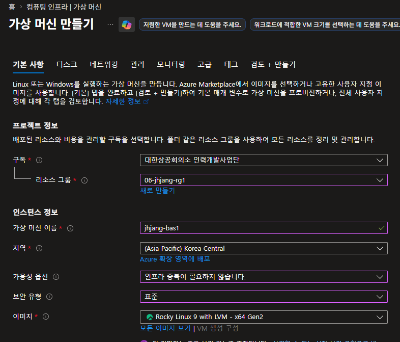

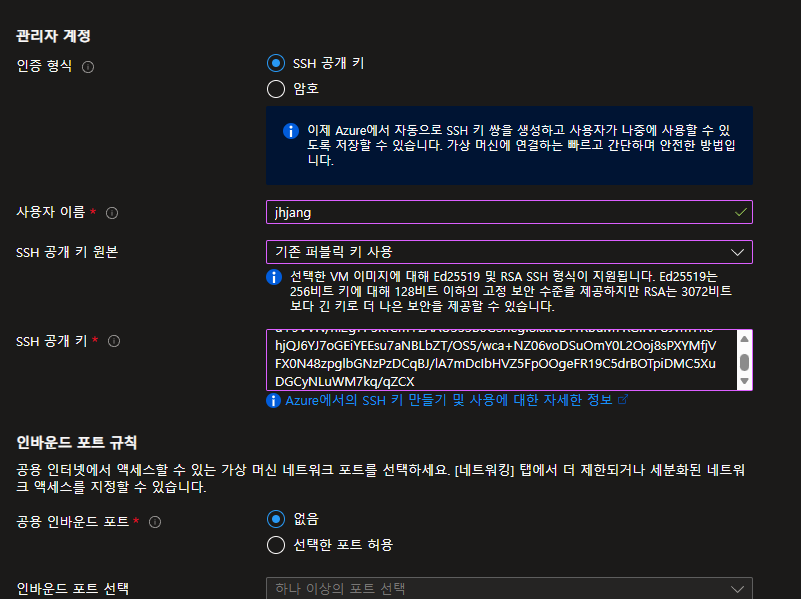

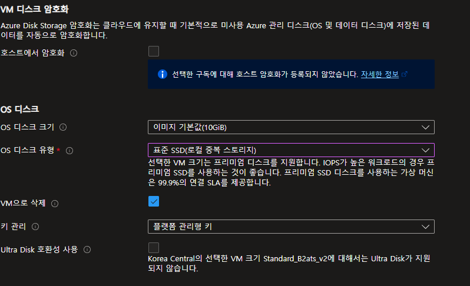


고급 → 사용자 지정 데이터:
```bash
#!/bin/bash
setenforce 0
grubby --update-kernel --args selinux=0
mkdir /test
echo "Hello World" > /test/test.txt
```


**web1-1**
- 가상 네트워크: jhjang-vnet1 / 서브넷: jhjang-web1-1 (10.0.2.0/24)
- 공용 IP: 없음 (내부 전용)

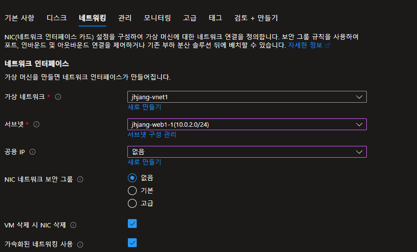

**bas2**
- 가상 네트워크: jhjang-vnet2 / 서브넷: jhjang-bas2 (192.168.0.0/29)
- 공용 IP: jhjang-bas2-pubip
- 고급 → 사용자 지정 데이터:
```bash
#!/bin/bash
setenforce 0
grubby --update-kernel --args selinux=0
echo -e "개인키" > /home/jhjang/.ssh/id_rsa
chmod 700 /home/jhjang/.ssh/id_rsa
```


**web2-1**: web1-1과 동일하게 생성

---

### 6. NSG 만들기

- 이름: `jhjang-nsg-ssh`

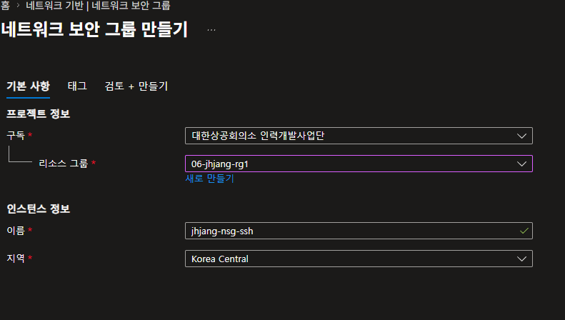

인바운드 규칙 추가:
- 서비스: SSH (포트 22) / 작업: 허용
- 우선순위: 100 (낮을수록 우선순위 높음)
- 이름: `allow-ssh`

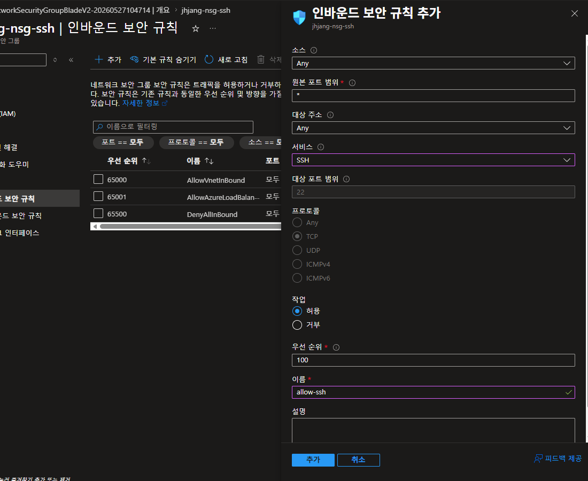

NSG → 네트워크 인터페이스에서 bas1, bas2 NIC에 연결


- jhjang-bas1: pri 10.0.0.4 / pub 공용IP
- jhjang-bas2: pri 192.168.0.4 / pub 공용IP

---

### 7. XShell 접속 테스트

물리PC에서 개인키를 bas1으로 전송:
```bash
scp .\.ssh\id_rsa jhjang@공개IP:/home/jhjang/.ssh/
```


bas1에서 web1-1로 SSH 접속:
```bash
chmod 700 .ssh/id_rsa
ssh jhjang@10.0.2.4
```


bas2에서 web2-1로 SSH 접속 전 소유자 변경:
```bash
sudo chown jhjang:jhjang /home/jhjang/.ssh/id_rsa
ssh jhjang@192.168.0.20
```


> bas2는 고급 스크립트로 개인키를 미리 넣었으므로 SCP 전송 과정은 불필요. 단, `chown`으로 소유자 변경은 필요.

---

### 8. NAT 게이트웨이 생성

- 이름: `jhjang-nat1` / SKU: 표준 V2 (권장)


아웃바운드 IP: `(신규) nat-pip` 생성


네트워킹 탭 → VNet: jhjang-vnet1 / 서브넷: jhjang-web1-1 연결


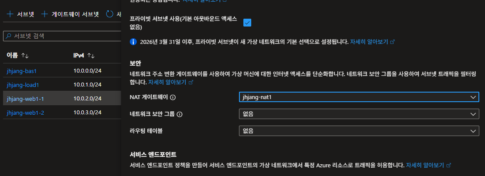

NAT 게이트웨이 연결 후 web1-1에서 인터넷 연결 확인:
```bash
ssh jhjang@10.0.2.4
ping google.com
sudo dnf install dhcp-server
```


> Azure는 ping이 보이지 않음. 하지만 실제 인터넷은 연결됨 (AWS는 ping 됨)

구성 원리:
```
물리PC(개인키) → bastion(개인키+공개키) → web(공개키)
```

---

## Terraform 설치 및 설정

VS Code에서 HashiCorp Terraform 확장 설치

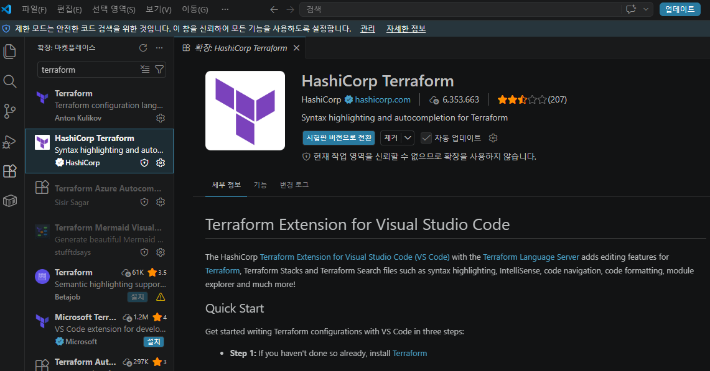

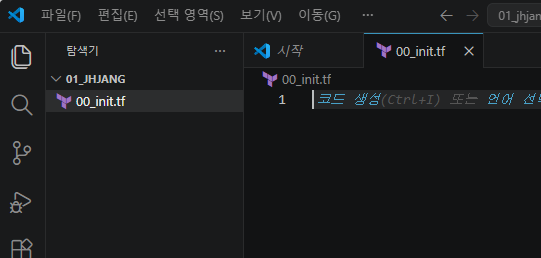

- [registry.terraform.io](https://registry.terraform.io) → AMD64 다운로드
- `C:\01_IaC\` 폴더에 `terraform.exe` 넣기
- `sysdm.cpl` → 고급 → 환경변수 → Path에 `C:\01_IaC\` 추가
- 새 cmd 창에서 `terraform` 입력 → 메시지 나오면 성공

```bash
az login
```

---

## Terraform 파일 작성

**00_init.tf**

```hcl
terraform {
  required_providers {
    azurerm = {
      source  = "hashicorp/azurerm"
      version = "=4.74.0"
    }
  }
}

provider "azurerm" {
  features {}
  subscription_id = "구독ID"
}
```

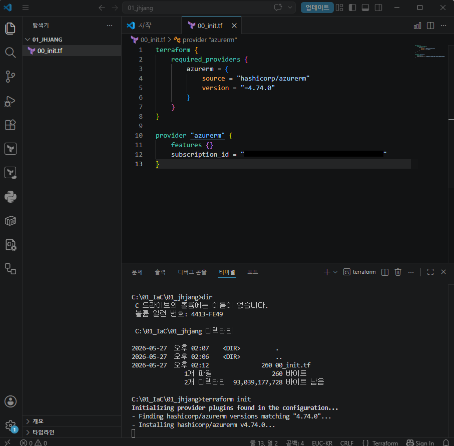

**01_rg.tf**

```hcl
resource "azurerm_resource_group" "jhjang_rg" {
  name     = "06-jhjang-rg"
  location = "Korea Central"
}
```

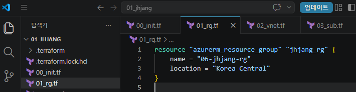

**02_vnet.tf**

```hcl
resource "azurerm_virtual_network" "jhjang_vnet" {
  name                = "jhjang-vnet1"
  address_space       = ["10.0.0.0/16"]
  location            = azurerm_resource_group.jhjang_rg.location
  resource_group_name = azurerm_resource_group.jhjang_rg.name

  depends_on = [azurerm_resource_group.jhjang_rg]
}
```

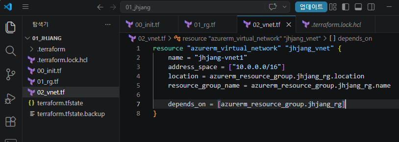

terraform plan 결과:

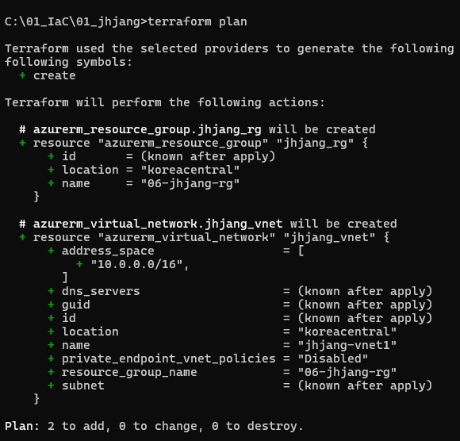

**03_sub.tf**

```hcl
resource "azurerm_subnet" "jhjang_bas1" {
  name                            = "jhjang-bas1"
  virtual_network_name            = azurerm_virtual_network.jhjang_vnet.name
  resource_group_name             = azurerm_resource_group.jhjang_rg.name
  address_prefixes                = ["10.0.0.0/24"]
  default_outbound_access_enabled = true
}

resource "azurerm_subnet" "jhjang_load1" {
  name                            = "jhjang-load1"
  virtual_network_name            = azurerm_virtual_network.jhjang_vnet.name
  resource_group_name             = azurerm_resource_group.jhjang_rg.name
  address_prefixes                = ["10.0.1.0/24"]
  default_outbound_access_enabled = true
}

resource "azurerm_subnet" "jhjang_web1_1" {
  name                            = "jhjang-web1-1"
  virtual_network_name            = azurerm_virtual_network.jhjang_vnet.name
  resource_group_name             = azurerm_resource_group.jhjang_rg.name
  address_prefixes                = ["10.0.2.0/24"]
  default_outbound_access_enabled = true
}

resource "azurerm_subnet" "jhjang_web1_2" {
  name                            = "jhjang-web1-2"
  virtual_network_name            = azurerm_virtual_network.jhjang_vnet.name
  resource_group_name             = azurerm_resource_group.jhjang_rg.name
  address_prefixes                = ["10.0.3.0/24"]
  default_outbound_access_enabled = true
}
```

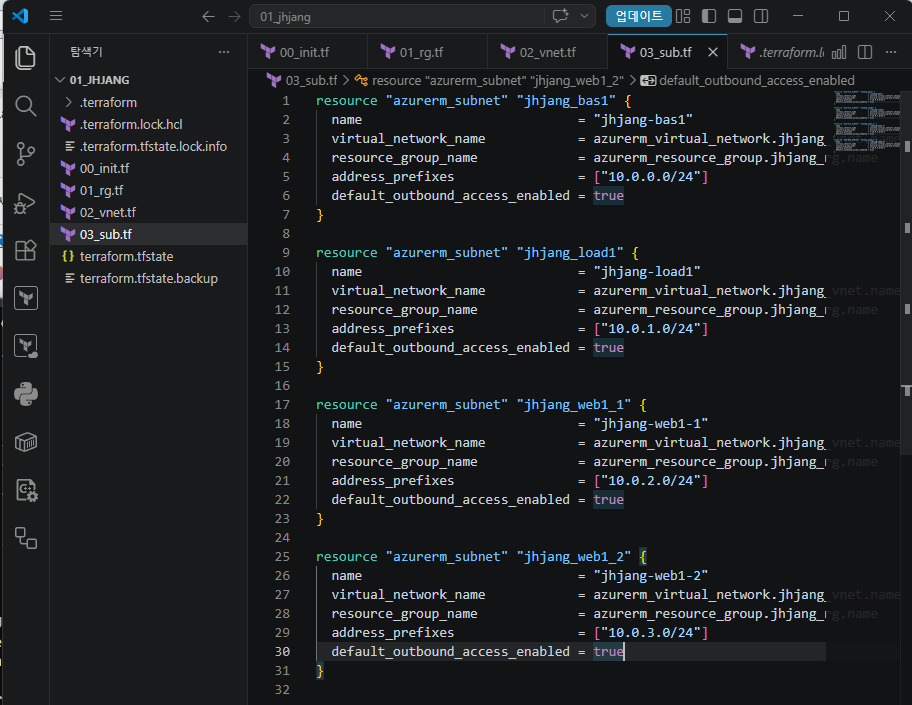

**Terraform 기본 명령어**
```bash
terraform init                  # provider 플러그인 초기화
terraform plan                  # 실행 계획 확인
terraform apply                 # 리소스 생성
terraform destroy               # 리소스 삭제
terraform apply --auto-approve  # 자동으로 yes 처리
```

> Azure는 자동으로 인터넷 게이트웨이가 붙음. AWS는 직접 붙여야 함.

> GitHub에 올릴 때 `subscription_id` 등 민감 정보와 terraform 바이너리는 반드시 제외할 것.

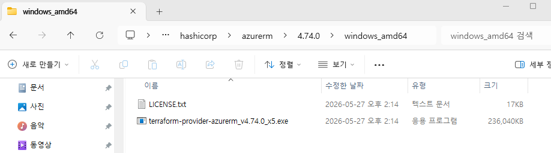
