---

Disk     파티션        pv           vg         lv       사이즈        file system      mount point
sdb       sdb1     /dev/sdb1    jhjang   jhjang1    3.3G            ext3               /f1
                                jhjang2    3.3G            ext4               /f2
                                jhjang3   나머지G         xfs                /f3

fdisk /dev/sdb
명령어를 모른다면? m

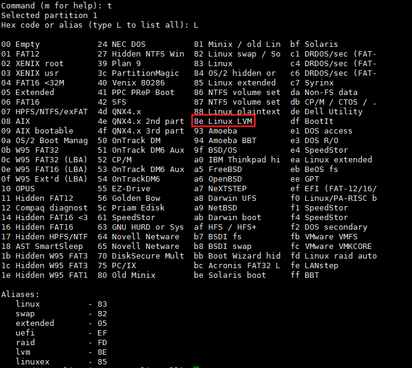

- 선호방식
lvscan 선호: 장치명도 나옴

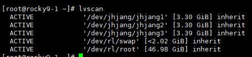

vgdisplay

pvs

아 3.39기가 남았구나 라고 생각

---
삭제는거꾸로

mount삭제 -> file system 삭제 -> lvm 삭제 -> volumn group 삭제 -> pv 삭제 -> 파티션 삭제

umount
wipefs -a -f /dev/jhjang/jhjang1
lvremove /dev/jhjang/jhjang3
vgremove
pvremove
fdisk /dev/sdb -> d -> w

---
재생성

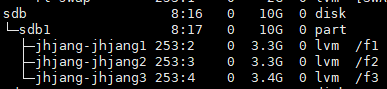

이게 만들어지면 성공

확장

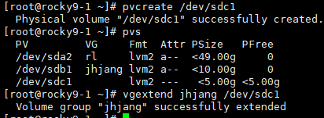

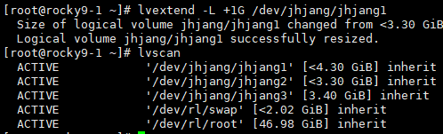

3.3 -> 4.3 넘어감

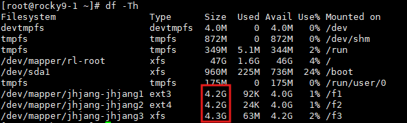

자동으로 늘어나있음

---
삭제과정

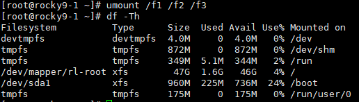

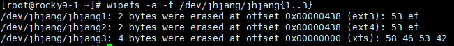

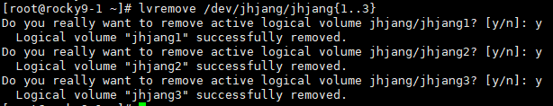

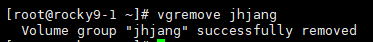

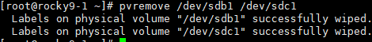

마무리로 fdisk /dev/sdc 삭제, fdisk /dev/sdb 삭제

---

