---
Docker: docker.io, hub.docker.com
쿠버네티스: 


commutication edi: 무료


Docker는 Guest OS를 사용하지않아 CPU 메모리 사용X
Host OS는 linux

gcp는 전부 container로 운영
웹서버는 메모리 많이 잡아먹음 -> 내부에 5개의 프로세스들이 움직이는중

jail: 제한풀어버리는기술


```bash
dnf -y install dnf-plugins-core
dnf config-manager --add-repo https://download.docker.com/linux/centos/docker-ce.repo
```

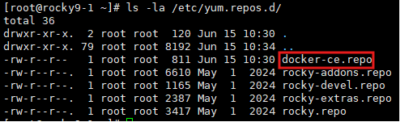

	docker-ce.repo 존재여부확인 후 설치진행

```bash
dnf -y install docker-ce docker-ce-cli containerd.io docker-buildx-plugin docker-compose-plugin
systemctl enable --now docker
docker run hello-world
```


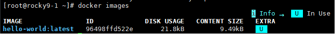

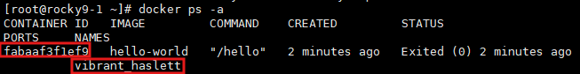

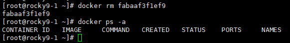

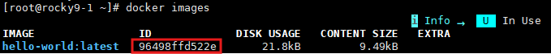

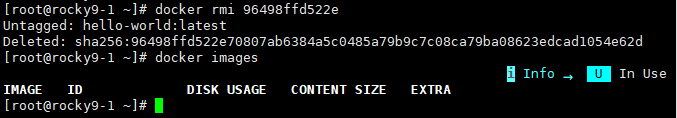

```bash
docker pull httpd
#docker pull httpd:latest
```

	태그값 생략하면 기본적으로 :latest가 붙음

```bash
docker images
docker run -p 60000:80
```

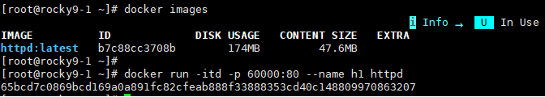

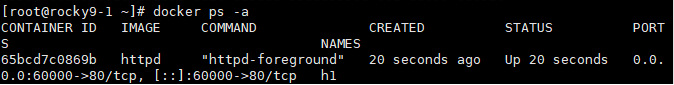

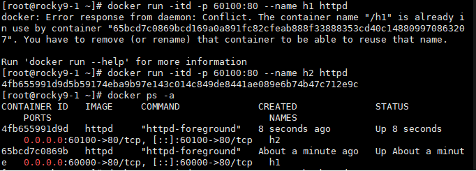

	h1이라는 이름이 사용중인데 똑같이 생성하려니까 문제발생 서로 이름이 달라야함

--> 10.0.0.11:60000, 10.0.0.11:60100 접속 시 접속성공 - 매우 가볍다는걸 알 수있음

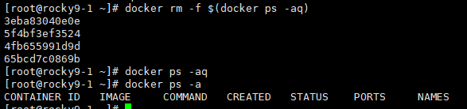

	삭제할 때 이렇게 하면 한번에 삭제 가능

##### alpine linux

	용량이 엄청 적음, 기능이 거의 다 존재

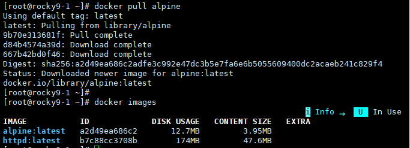

	12.7MB 밖에 되지않는걸 확인가능

```bash
docker pull alpine
docker pull busybox
docker pull httpd
docker pull nginx
docker pull rockylinux/rockylinux

docker images #image 확인 명령어
```

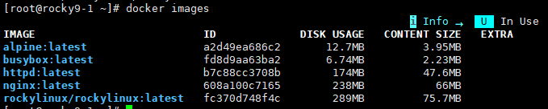

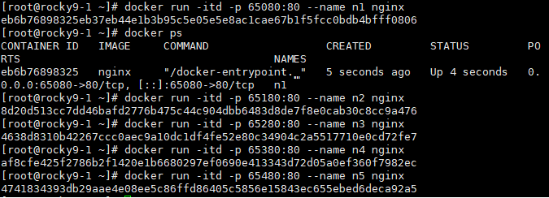

	여러개 생성가능

지울때 주의할점

docker rm n1으로 지우면 오류
docker rm -f n1
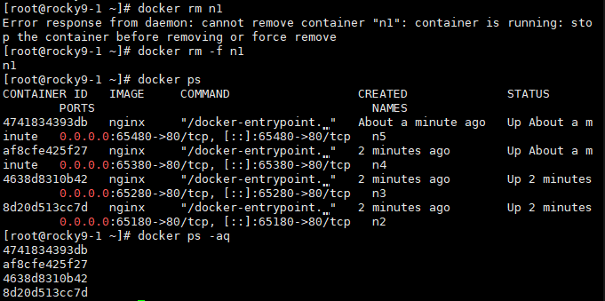

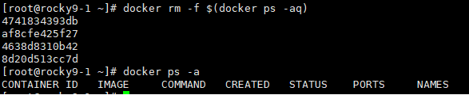

	삭제완료


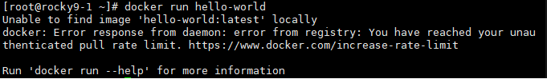

로그인안하고해서 limit걸림


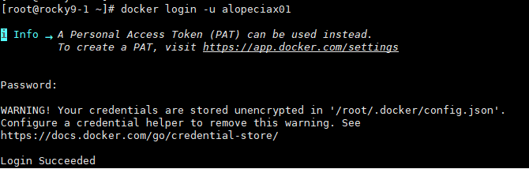

로그인 후 진행

```bash
docker search nginx --limit 10 #기본적으로는 25개까지 보임
```


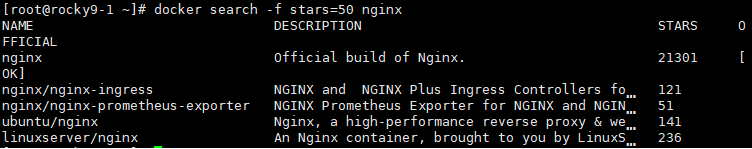

	접속하지 않고도 어떤게 있는지 확인가능?

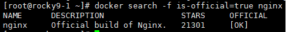

	공식이미지 존재여부 확인

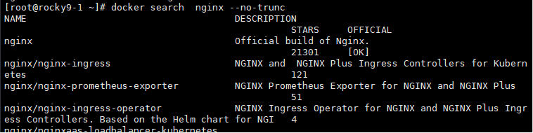

	생략없이 보고 싶으면 --no-trunc 붙이기


##### Docker Container LifeCycle

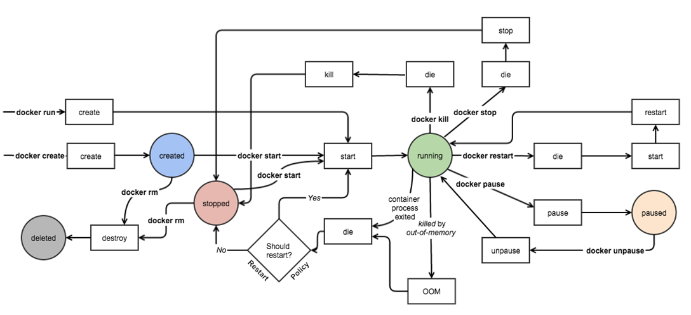

	create, run, start, stop, restart, pause, rm

그냥 쉘을 실행하는 경우는 -i -t를 사용해야 함(rocky linux, alpine, ...)
어플리케이션 실행하는 경우는 -d(데몬)을 붙여줘야 함

이게 쉘인지 앱인지모르겠다 -> -itd 쓰면 무조건 실행됨

 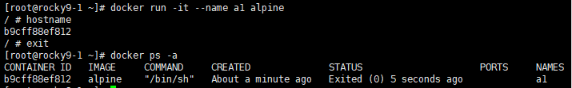

	exit로 나오니까 exited상태되버림

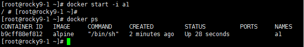

	ctrl+p+q 로 빠져나와야 up 상태를 유지한채로 빠져나올 수 있음

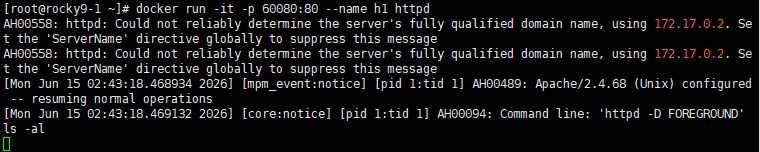

	내가 실행하는 웹서버는 foreground로 실행중임 (ctrl+backspace로 ^H 이런글씨 지울수있음 참고)


docker run -it -p 60080:80 --name h1 httpd
-p: policy
60080: 
80: 컨테이너의 포트

근데 docker run -d -p 60180:80 --name h2 httpd

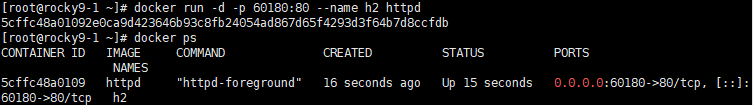

docker run -itd -p ~
: 실행은되지만 내부로 접속은되지않는다.


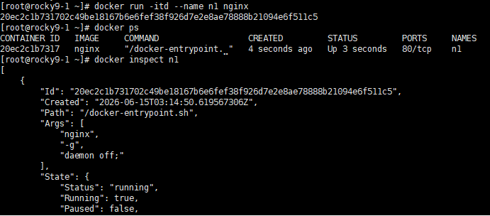

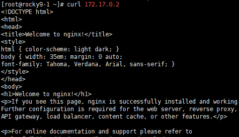

외부에노출시키고 싶지않다면 -p 안붙이면됨
ip a 해보면 docker0:으로 172.17.0.1 네트워크인터페이스카드가 붙은걸 볼 수 있음


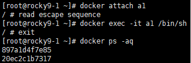

attach: 외부에있는쉘을실행시켜서 갖다 붙이는거
exec하면 ctrl + c하면 내부에있는쉘만 종료


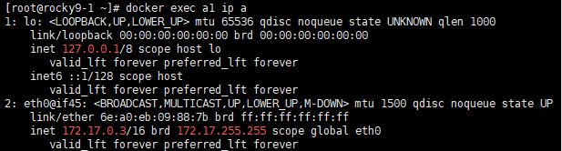

	컨테이너 내부 ip a 결과값을 보여준다


##### nginx 페이지 바꾸기

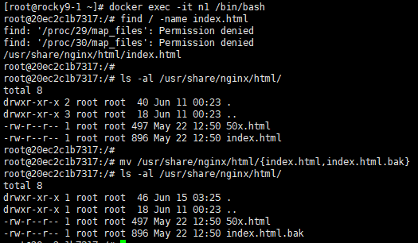

	 html바꾸기위한 밑작업

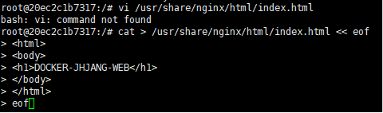

	vi 편집기가 없으므로 cat > 으로 저장

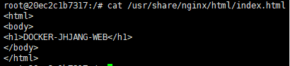

	바뀐걸 확인 가능

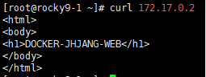

	실행중인 컨테이너의 html을 바꿀 수 있다.

마지막 삭제하면서 종료

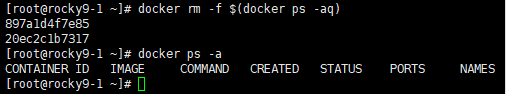


 박


---


1. repository: Linux 개발회사에서 운영하는 인터넷 상의 저장소
주로 package들이 이곳에 존재
dnf or apt, zypper 등의 명령어를 사용해서 다운로드함

2. package 설치 방법
- source 설치(Binary설치): 커스터마이징 가능(의존성 문제를 해결해야 함)
- rpm 설치: rpm 파일 다운로드 후 설치
- yum, dnf 설치: repository에서 rpm파일 다운로드 후 설치, 의존성 문제까지 해결
	인터넷 연결, 최신버전은 아님(개발사에서 올려놓은걸 다운로드하는 방식)
	커스터마이징 불가능

로컬접속 tty / 원격접속 pts
ps -ef: 프로세스/부모프로세스 보임
foreground, background 알기

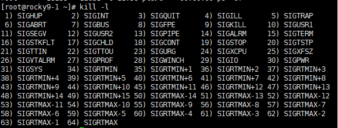

18: 재시작
