---

## 서버1 → 서버2 이미지 옮기기

Archive 방식을 가장 많이 씀

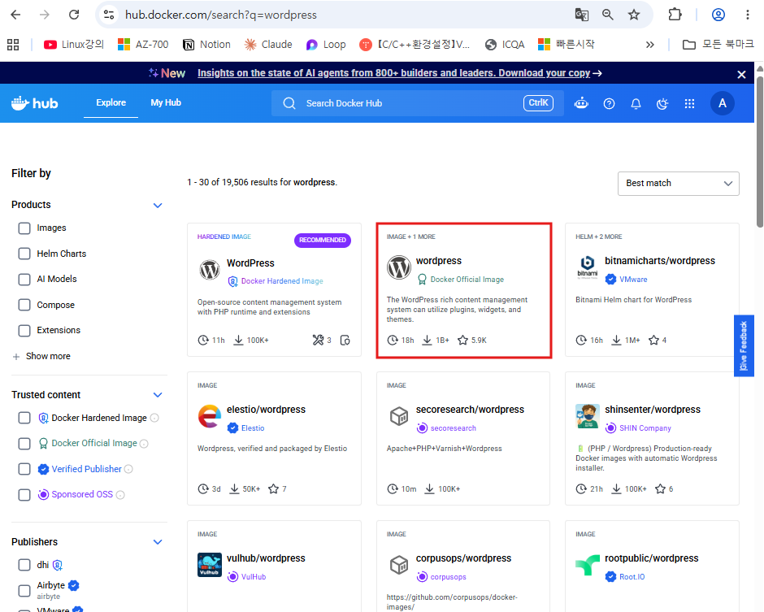

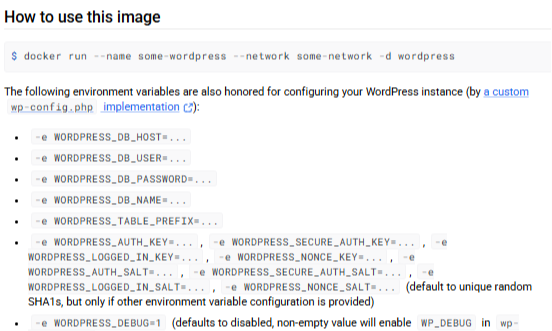

이게 없다면 wordpress는 정상동작하지않음

```bash
docker pull wordpress

docker pull mysql:8.0

dockerimages
docker save -o all.tar alpine busybox httpd mysql:8.0 nginx rockylinux/rockylinux wordpress
```


	하나의 파일을 묶고 풀면 거기에 풀어짐

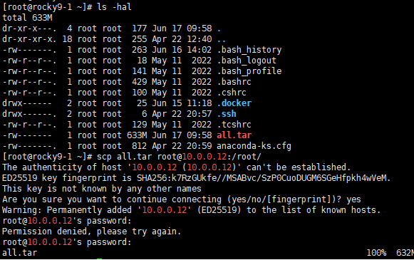

##### rocky9-2

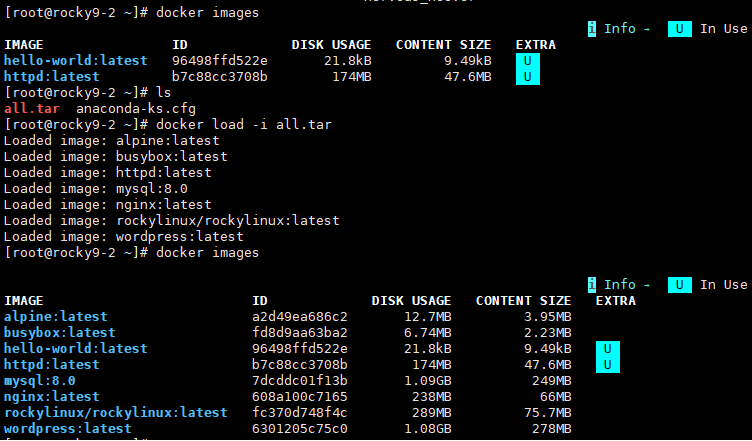


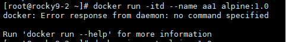

에러가 왜날까? 

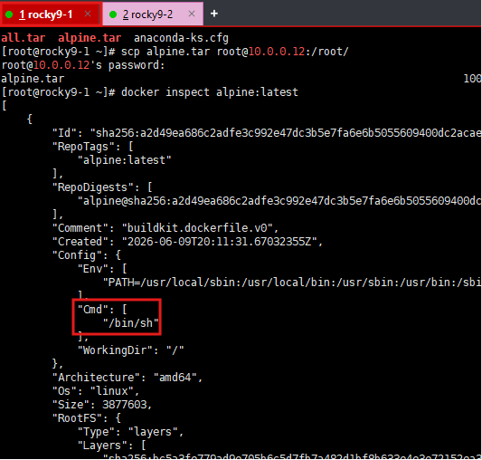

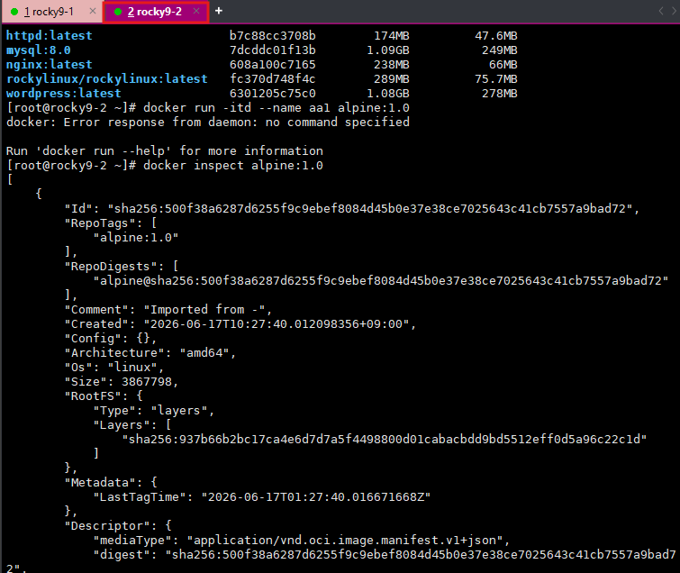

컨테이너를 복제하면 환경변수값이 초기화됨
그래서 임포트할때 추가해줘야 함

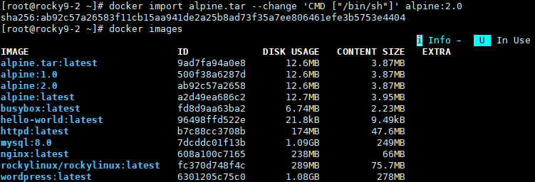

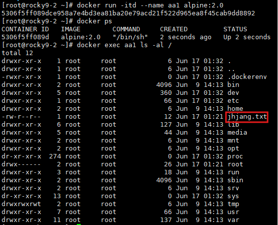

환경변수는 초기화되지만 나머지는 유지됨


--> 환경변수는 초기화되서 별로 좋아보이지않음


---

##### httpd

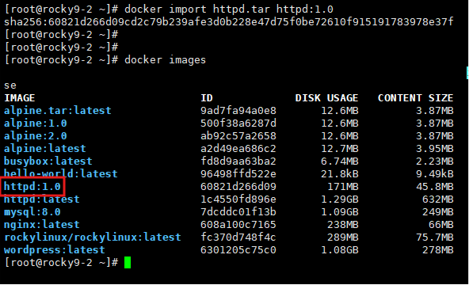

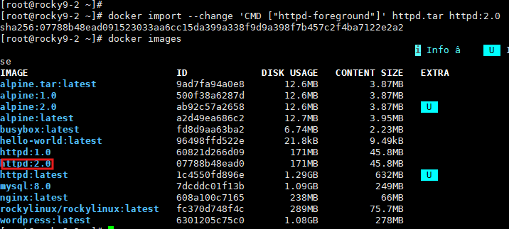

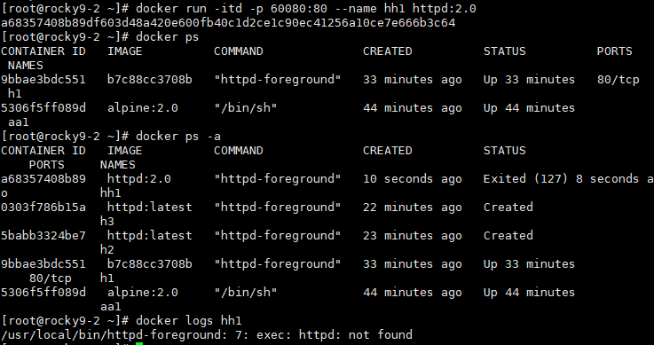

실행은 되는거같지만 exit상태임 -> 로그를 봐야함

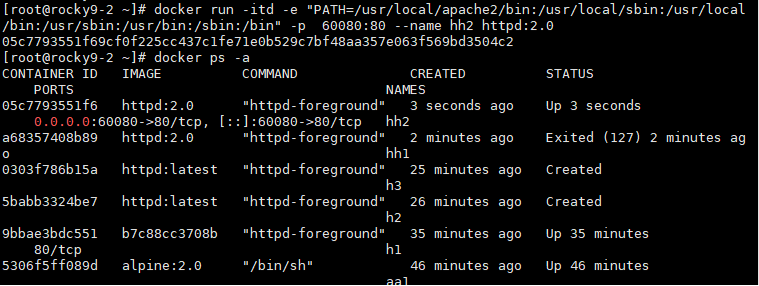

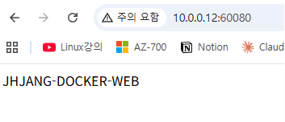

