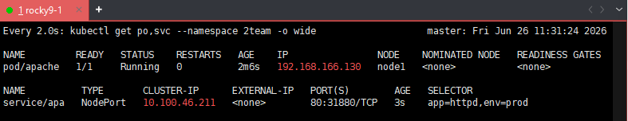
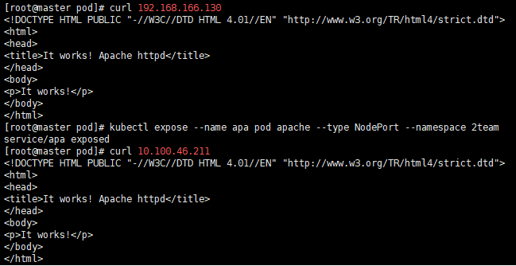
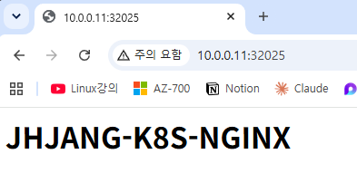
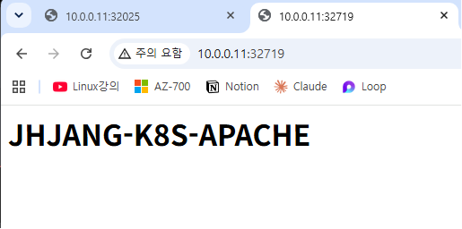
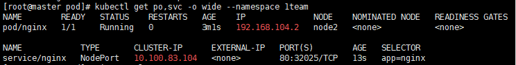
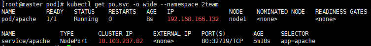

---

## 개요

kubectl은 Kubernetes 클러스터를 제어하는 CLI 도구다. 이 글은 노드/파드/서비스/네임스페이스 기본 조작과 YAML로 리소스를 생성하는 실습 내용을 정리한다.

---

## 서버 구성

- **rocky9-1**: Kubernetes Master
- **rocky9-2**: Worker Node1
- **rocky9-3**: Worker Node2
- **rocky9-docker**: Docker 전용 서버 (이미지 수집 및 전송)

---

## 주요 개념

- **kubectl**: Kubernetes object를 실행·관리하는 CLI. [kubectl cheat sheet](https://kubernetes.io/docs/reference/kubectl/cheatsheet/) 참고
- **Calico**: 파드 간 네트워크를 구성하는 CNI 플러그인
- **Namespace**: 하나의 클러스터 안에서 리소스 그룹을 논리적으로 분리하는 단위. 팀·환경별로 나눠 사용 가능
- **YAML 구조**: `인자값: 값` 형식. 주요 키는 `apiVersion`, `kind`, `metadata`(name, labels, env), `spec`

---

## STEP 1 — 클러스터 상태 확인

```bash
kubectl get nodes          # 노드 목록
kubectl get namespaces     # 네임스페이스 목록 (= kubectl get ns)
kubectl get pods           # 기본 네임스페이스 파드 목록
kubectl get pods -A        # 전체 네임스페이스 파드 목록
kubectl api-resources      # 리소스 종류 확인 (shortnames, kind 포함)
```

---

## STEP 2 — 파드 실행 및 확인

```bash
# 파드 생성
kubectl run app-nginx --image nginx --port 80

# 상태 확인
kubectl get pods
kubectl get pods app-nginx
kubectl get pods app-nginx -o wide    # IP 등 상세 정보 포함

# 상세 정보 / 로그
kubectl describe pods app-nginx
kubectl logs app-nginx
```

> `kubectl get pods app-nginx -o wide` 로 확인한 IP로 `curl` 테스트 가능  
> 단, 클러스터 내부 IP이므로 노드에서만 접근됨

---

## STEP 3 — 서비스(NodePort) 노출

```bash
kubectl expose pod app-nginx --type NodePort
kubectl get services
kubectl delete service app-nginx
```

NodePort를 사용하면 클러스터 외부에서 `노드IP:포트`로 파드에 접근할 수 있다.

---

## STEP 4 — 네임스페이스 관리

```bash
# 조회
kubectl get namespace          # = kubectl get ns

# 특정 네임스페이스 파드 조회
kubectl get pods --namespace kube-system
kubectl get pods --namespace kube-public

# 생성 / 삭제
kubectl create namespace 1team
kubectl delete ns 1team

# 네임스페이스 지정하여 파드 실행
kubectl run app-nginx --image nginx --port 80 --namespace 1team

# 파드 삭제 (네임스페이스 명시 필수)
kubectl delete po app-nginx --namespace 1team
```

> `default` 네임스페이스는 삭제 불가

---

## STEP 5 — YAML로 네임스페이스 생성

```bash
mkdir /pod && cd /pod
vi ns1.yml
```

**ns1.yml 예시**

```yaml
apiVersion: v1
kind: Namespace
metadata:
  name: 1team
  labels:
    env: study
```

```bash
kubectl apply -f ns1.yml      # 생성
kubectl get ns --show-labels  # 라벨 포함 확인
kubectl delete -f ns1.yml     # 삭제
```

---

## STEP 6 — Docker 이미지 준비 및 노드 배포

클러스터 노드가 인터넷에서 이미지를 직접 pull하기 어려운 환경이므로, **rocky9-docker** 에서 이미지를 받아 tar로 묶은 뒤 워커 노드로 전송한다.

**6-1. Docker 설치 (rocky9-docker)**

```bash
dnf -y install dnf-plugins-core
dnf config-manager --add-repo https://download.docker.com/linux/centos/docker-ce.repo
dnf -y install docker-ce docker-ce-cli containerd.io docker-buildx-plugin docker-compose-plugin
systemctl enable --now docker
```

**6-2. 이미지 pull (rocky9-docker)**

```bash
docker pull nginx
docker pull httpd
docker pull alpine
docker pull busybox
docker pull rockylinux/rockylinux
docker pull wordpress
docker pull mysql:8.0

docker images    # 목록 확인
```

**6-3. tar로 묶어서 워커 노드로 전송 (rocky9-docker)**

```bash
docker save -o all.tar alpine busybox httpd nginx rockylinux/rockylinux wordpress mysql:8.0

scp all.tar root@10.0.0.12:/root/    # → rocky9-2 (node1)
scp all.tar root@10.0.0.13:/root/    # → rocky9-3 (node2)
```

**6-4. containerd로 import (rocky9-2, rocky9-3 각각 실행)**

```bash
ctr -n k8s.io image import all.tar
# "saved" 메시지가 뜨면 정상

crictl -r unix:///run/containerd/containerd.sock image ls    # import 확인
```

---

## STEP 7 — kubeconfig 설정 (워커 노드)

워커 노드에서 kubectl을 사용하려면 kubeconfig를 직접 복사해야 한다.  
없으면 `localhost:8080 connection refused` 에러 발생.

```bash
ls ~/.kube/config                              # 파일 존재 여부 확인

mkdir -p ~/.kube
cp /etc/kubernetes/admin.conf ~/.kube/config
chown $(id -u):$(id -g) ~/.kube/config

kubectl get nodes                              # 연결 확인
```

---

## STEP 8 — YAML로 파드 생성 (1team 네임스페이스)

**nginx.yml**

```yaml
apiVersion: v1
kind: Pod
metadata:
  name: nginx
  namespace: 1team
  labels:
    env: prod
    app: nginx
spec:
  containers:
  - name: n1
    image: nginx
    imagePullPolicy: Never   # Never | IfNotPresent | Always
    ports:
    - containerPort: 80
```

**imagePullPolicy 옵션**
- `Never`: 로컬 이미지만 사용, pull 시도 안 함
- `IfNotPresent`: 로컬에 없을 때만 pull → 오프라인 환경 권장
- `Always`: 매번 레지스트리에서 pull

```bash
kubectl apply -f nginx.yml

# 실시간 상태 모니터링 (2초 간격)
watch -n 2 kubectl get po --namespace 1team -o wide
curl 192.168.166.130

kubectl expose --name apa pod apache --type NodePort --namespace 2team
curl 10.100.46.211
```






```bash
kubectl exec --namespace 2team -it apache -- /bin/bash

cat > htdocs.index.html << eof
```

접속 시 10.0.0.11:31880, 10.0.0.12:31880, 10.0.0.13:31880 모두 접속 가능

---
## 실습

1.첫번째: ng1.yml 파일 만들기
1.1. 첫번째 리소스: 1team namespace 만들기
1.2. 두번째 리소스: 1team namespace에 nginx 실행, pod명 nginx, container명: n1
1.3. 세번째 리소스는 명령어 사용, nginx pod를 외부에 공개 Type은 NodePort 사용
1.4. 화면에 출력되는 내용은 이니셜-K8S-NGINX

2.첫번째: ap1.yml 파일 만들기
2.1. 첫번째 리소스: 2team namespace 만들기
2.2. 두번째 리소스: 2team namespace에 apache 실행, pod명 apache, container명: a1
2.3. 세번째 리소스는 명령어 사용, apache pod를 외부에 공개 Type은 NodePort 사용
2.4. 화면에 출력되는 내용은 이니셜-K8S-APACHE

kubectl get svc,po --namespace ns명(1team, 2team) -o wide









## 요약

- 파드 생성: `kubectl run <이름> --image <이미지> --port <포트>`
- 서비스 노출: `kubectl expose pod <이름> --type NodePort`
- 네임스페이스 지정: `--namespace <이름>` 또는 `-n <이름>`
- YAML 적용: `kubectl apply -f <파일>.yml`
- 리소스 삭제: `kubectl delete -f <파일>.yml` 또는 `kubectl delete <kind> <이름>`
- 이미지 import: `ctr -n k8s.io image import <파일>.tar`
- 실시간 모니터링: `watch -n 2 kubectl get po --namespace <이름>`
- kubeconfig 설정: `cp /etc/kubernetes/admin.conf ~/.kube/config`
