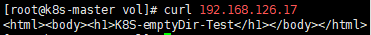

---
## 개념

emptyDir은 Kubernetes에서 가장 단순한 볼륨 타입이다. pod이 생성될 때 빈 디렉터리가 만들어지고, pod 안의 컨테이너가 그 디렉터리를 마운트해서 사용한다.

- pod이 살아있는 동안만 유지된다. pod이 삭제되면 데이터도 함께 사라진다.
- 실제로는 pod이 스케줄된 노드의 디스크에 저장된다. 그래서 그 노드에서 직접 파일을 확인하거나 만들 수 있다.
- 같은 pod 안에서 컨테이너가 재시작돼도 데이터는 유지된다. pod 자체가 삭제되면 사라진다.

이번 실습은 컨테이너 내부 경로가 실제로는 노드의 특정 디스크 위치를 그대로 가리키고 있다는 걸 확인하는 과정이다.

---

## 1차 실습 — 임의 경로(/test1)에 마운트

### 작업 디렉터리 생성

bash

```bash
mkdir /vol
cd /vol
vi nginx.yml
```

### nginx.yml

yaml

```yaml
apiVersion: v1
kind: Pod
metadata:
  name: nginx
  labels:
    app: nginx
    env: devel
spec:
  containers:
  - name: n1
    image: nginx
    imagePullPolicy: IfNotPresent
    ports:
    - containerPort: 80
    volumeMounts:
    - mountPath: /test1
      name: jhjang-vol
  volumes:
  - name: jhjang-vol
    emptyDir: {}
```

`volumeMounts`는 컨테이너 안에 위치해서 "무엇을 어디에 마운트할지"를 정하고, `volumes`는 `spec` 최상위에 위치해서 볼륨 자체를 정의한다. 이 둘의 위치를 헷갈리기 쉽다.

### 적용

bash

```bash
kubectl apply -f nginx.yml --dry-run=server
kubectl apply -f nginx.yml
kubectl get pod -o wide
```

`-o wide`로 이 pod이 어느 노드에 스케줄됐는지 확인한다. emptyDir 실제 경로를 보려면 그 노드로 가야 한다.

### 확인

bash

```bash
kubectl exec nginx -- ls /test1
```

아직 아무것도 넣지 않았으므로 비어있는 게 정상이다.

bash

```bash
kubectl delete pod nginx
```

---

## 2차 실습 — nginx 웹 루트(/usr/share/nginx/html)에 마운트

같은 구조로, 이번엔 마운트 경로를 nginx가 실제로 웹페이지를 읽는 경로로 바꾼다.

### nginx.yml

yaml

```yaml
apiVersion: v1
kind: Pod
metadata:
  name: nginx
  labels:
    app: nginx
    env: devel
spec:
  containers:
  - name: n1
    image: nginx
    imagePullPolicy: IfNotPresent
    ports:
    - containerPort: 80
    volumeMounts:
    - mountPath: /usr/share/nginx/html
      name: jhjang-vol
  volumes:
  - name: jhjang-vol
    emptyDir: {}
```

### 적용

bash

```bash
kubectl apply -f nginx.yml
kubectl get pod -o wide
```

### pod이 스케줄된 노드에서 실제 경로 찾기

**어디서: pod이 스케줄된 노드**

bash

```bash
find / -name jhjang-vol
```

결과로 나온 경로 예시:

```
/var/lib/kubelet/pods/<pod-uid>/volumes/kubernetes.io~empty-dir/jhjang-vol
```

bash

```bash
ls -al /var/lib/kubelet/pods/<pod-uid>/volumes/kubernetes.io~empty-dir/jhjang-vol
```

### 노드에서 직접 index.html 생성

bash

```bash
cat > /var/lib/kubelet/pods/<pod-uid>/volumes/kubernetes.io~empty-dir/jhjang-vol/index.html << EOF
<html><body><h1>K8S-emptyDir-Test</h1></body></html>
EOF
```

### 최종 확인 — pod IP로 curl

bash

```bash
kubectl get pod nginx -o wide
```

`IP` 컬럼에 나온 pod IP를 그대로 사용한다.

bash

```bash
curl <pod-IP>
```

노드 디스크에 직접 만든 `index.html`이 그대로 nginx 응답으로 나오면(`K8S-emptyDir-Test`), emptyDir이 컨테이너 내부 경로와 노드의 실제 디스크 경로를 연결하고 있다는 게 확인된 것이다.

---

## 핵심 요약

- **emptyDir**: pod 생성 시 만들어지는 임시 볼륨. pod 삭제되면 데이터도 삭제된다.
- **volumeMounts vs volumes**: `volumeMounts`는 컨테이너 안(마운트 위치), `volumes`는 spec 최상위(볼륨 정의). 위치를 서로 바꿔 쓰면 안 된다.
- **실제 저장 위치**: `/var/lib/kubelet/pods/<pod-uid>/volumes/kubernetes.io~empty-dir/<볼륨명>` — 노드의 이 경로가 컨테이너 안 마운트 경로와 동일한 내용을 가진다.
- **확인 방법**: pod이 뜬 노드에서 이 경로에 직접 파일을 만들고, `kubectl get pod -o wide`로 얻은 pod IP에 `curl`을 날려 결과가 그대로 반영되는지 확인한다.


---

httpd image를 이용해서 pod 생성
emptyDir를 활용해서 host와 pod간 volume 공유
host에서 index.html생성해서 K8S-emptyDir-Test 내용출력


