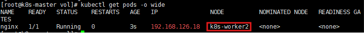

---
## 개념

emptyDir은 Kubernetes에서 가장 단순한 볼륨 타입이다. pod이 생성될 때 빈 디렉터리가 만들어지고, pod 안의 컨테이너가 그 디렉터리를 마운트해서 사용한다.

- pod이 살아있는 동안만 유지된다. pod이 삭제되면 데이터도 함께 사라진다.
- 실제로는 pod이 스케줄된 노드의 디스크에 저장된다. 그래서 그 노드에서 직접 파일을 확인하거나 만들 수 있다.
- 같은 pod 안에서 컨테이너가 재시작돼도 데이터는 유지된다. pod 자체가 삭제되면 사라진다.

이번 실습은 컨테이너 내부 경로가 실제로는 노드의 특정 디스크 위치를 그대로 가리키고 있다는 걸 nginx와 httpd 두 이미지로 각각 확인하는 과정이다.

---

## 1차 실습 — nginx, 임의 경로(/test1)에 마운트

### 작업 디렉터리 생성

```bash
mkdir /vol
cd /vol
vi nginx.yml
```

### nginx.yml

```yaml
apiVersion: v1
kind: Pod
metadata:
  name: nginx
  labels:
    app: nginx
    env: devel
spec:
  containers:
  - name: n1
    image: nginx
    imagePullPolicy: IfNotPresent
    ports:
    - containerPort: 80
    volumeMounts:
    - mountPath: /test1
      name: jhjang-vol
  volumes:
  - name: jhjang-vol
    emptyDir: {}
```

`volumeMounts`는 컨테이너 안에 위치해서 "무엇을 어디에 마운트할지"를 정하고, `volumes`는 `spec` 최상위에 위치해서 볼륨 자체를 정의한다. 이 둘의 위치를 헷갈리기 쉽다.

### 적용

```bash
kubectl apply -f nginx.yml --dry-run=server
kubectl apply -f nginx.yml
kubectl get pod -o wide
```

`-o wide`로 이 pod이 어느 노드에 스케줄됐는지 확인한다. emptyDir 실제 경로를 보려면 그 노드로 가야 한다.

### 확인

```bash
kubectl exec nginx -- ls /test1
```

아직 아무것도 넣지 않았으므로 비어있는 게 정상이다.

```bash
kubectl delete pod nginx
```

---

## 2차 실습 — nginx, 웹 루트(/usr/share/nginx/html)에 마운트

같은 구조로, 이번엔 마운트 경로를 nginx가 실제로 웹페이지를 읽는 경로로 바꾼다.

### nginx.yml

```yaml
apiVersion: v1
kind: Pod
metadata:
  name: nginx
  labels:
    app: nginx
    env: devel
spec:
  containers:
  - name: n1
    image: nginx
    imagePullPolicy: IfNotPresent
    ports:
    - containerPort: 80
    volumeMounts:
    - mountPath: /usr/share/nginx/html
      name: jhjang-vol
  volumes:
  - name: jhjang-vol
    emptyDir: {}
```

### 적용

```bash
kubectl apply -f nginx.yml
kubectl get pod -o wide
```

### pod이 스케줄된 노드에서 실제 경로 찾기

**어디서: pod이 스케줄된 노드**

```bash
find / -name jhjang-vol
```

결과로 나온 경로 예시:

```
/var/lib/kubelet/pods/<pod-uid>/volumes/kubernetes.io~empty-dir/jhjang-vol
```

```bash
ls -al /var/lib/kubelet/pods/<pod-uid>/volumes/kubernetes.io~empty-dir/jhjang-vol
```

### 노드에서 직접 index.html 생성

```bash
cat > /var/lib/kubelet/pods/<pod-uid>/volumes/kubernetes.io~empty-dir/jhjang-vol/index.html << EOF
<html><body><h1>K8S-emptyDir-Test</h1></body></html>
EOF
```

### 최종 확인 — pod IP로 curl

```bash
kubectl get pod nginx -o wide
curl <pod-IP>
```

노드 디스크에 직접 만든 `index.html`이 그대로 nginx 응답으로 나오면(`K8S-emptyDir-Test`), emptyDir이 컨테이너 내부 경로와 노드의 실제 디스크 경로를 연결하고 있다는 게 확인된 것이다.

---

## 3차 실습 — httpd(apache), 웹 루트(/usr/local/apache2/htdocs)에 마운트

같은 원리를 이미지만 바꿔서 다시 확인한다. httpd(apache)의 기본 웹 루트는 `/usr/local/apache2/htdocs`다.

### httpd.yml

**어디서: k8s-master (같은 `/vol` 디렉터리)**

```bash
vi httpd.yml
```

```yaml
apiVersion: v1
kind: Pod
metadata:
  name: httpd
  labels:
    app: httpd
    env: devel
    stor: ssd
spec:
  containers:
  - name: h1
    image: httpd
    imagePullPolicy: IfNotPresent
    ports:
    - containerPort: 80
    volumeMounts:
    - mountPath: /usr/local/apache2/htdocs
      name: jhjang-vol
  volumes:
  - name: jhjang-vol
    emptyDir: {}
```

### 적용

```bash
kubectl apply -f httpd.yml --dry-run=server
kubectl apply -f httpd.yml
kubectl get pod -o wide
```

`-o wide`로 어느 노드에 스케줄됐는지 확인하고, 그 노드로 이동한다.

### 노드에서 실제 emptyDir 경로 찾기

**어디서: pod이 스케줄된 노드**

```bash
find / -name jhjang-vol
```

결과 예시:

```
/var/lib/kubelet/pods/<pod-uid>/volumes/kubernetes.io~empty-dir/jhjang-vol
```

```bash
ls -al /var/lib/kubelet/pods/<pod-uid>/volumes/kubernetes.io~empty-dir/jhjang-vol
```

### host(노드)에서 index.html 생성

```bash
cat > /var/lib/kubelet/pods/<pod-uid>/volumes/kubernetes.io~empty-dir/jhjang-vol/index.html << EOF
<html><body><h1>K8S-emptyDir-Test</h1></body></html>
EOF
```

### 확인 — pod IP로 curl

```bash
kubectl get pod httpd -o wide
curl <pod-IP>
```

**실행 결과**

```
[root@k8s-master vol]# curl 192.168.126.17
<html><body><h1>K8S-emptyDir-Test</h1></body></html>
```


host(노드)에서 만든 `index.html`이 pod 안 httpd 컨테이너의 웹 루트로 그대로 공유되어, curl 응답에 `K8S-emptyDir-Test`가 정상적으로 출력됐다.

---

## 핵심 요약

- **emptyDir**: pod 생성 시 만들어지는 임시 볼륨. pod이 삭제되면 데이터도 함께 삭제된다.
- **volumeMounts vs volumes**: `volumeMounts`는 컨테이너 안(마운트 위치), `volumes`는 spec 최상위(볼륨 정의). 위치를 서로 바꿔 쓰면 안 된다.
- **실제 저장 위치**: `/var/lib/kubelet/pods/<pod-uid>/volumes/kubernetes.io~empty-dir/<볼륨명>` — 노드의 이 경로가 컨테이너 안 마운트 경로와 동일한 내용을 가진다.
- **이미지 무관성**: nginx든 httpd든, 마운트 경로만 각 웹서버의 실제 웹 루트로 맞춰주면 host와 pod 간 파일 공유가 동일하게 동작한다.
- **확인 방법**: pod이 뜬 노드에서 이 경로에 직접 파일을 만들고, `kubectl get pod -o wide`로 얻은 pod IP에 `curl`을 날려 결과가 그대로 반영되는지 확인한다.

---

```bash
kubectl get pod
kubectl delete pods httpd

vi nginx.yml
kubectl apply -f nginx.yml --dry-run=server
kubectl apply -f nginx.yml
kubectl get pods -o wide

vi httpd.yml
kubectl apply -f httpd.yml
```



지정해서 생성 가능

```bash
kubectl label nodes k8s-worker1 stor=hdd
kubectl label nodes k8s-worker2 stor=ssd

kubectl get nodes --show-labels
```

```bash
apiVerison: b1
kind: Pod
metadata:
	name: alpine
	labels:
		env: deve;
spec:
	nodeSelector:
		stor: nvme
	containers:
	- name: a1
	  image: alpine
	  imagePullPolicy: IfNotPresent
```
---

vi/vim의 **visual block 모드**는 텍스트를 사각형(블록) 형태로 선택해서 여러 줄을 한 번에 편집할 때 씁니다. yaml 파일에서 들여쓰기를 여러 줄 한꺼번에 맞출 때 특히 유용합니다.

### 진입 방법

일반 모드(Normal mode)에서:

```
Ctrl + v
```

(Mac 터미널에서 안 눌린다면 `Ctrl + q`로 대체되는 경우도 있음)

### 기본 사용법

1. `Ctrl+v`로 visual block 모드 진입
2. 방향키(↓, ↑)로 **세로로** 여러 줄 선택
3. 방향키(→, ←)로 블록 폭 조절 가능

### 자주 쓰는 조합

#### 여러 줄 앞에 문자 추가 (예: 주석 처리)

```
Ctrl+v          → 블록 모드 진입
↓ ↓ ↓          → 주석 처리할 줄만큼 아래로 선택
Shift+i         → 삽입 모드 (커서 위치에서)
#               → 넣고 싶은 문자 입력 (예: 주석 #)
Esc             → 전체 줄에 한꺼번에 적용됨
```

#### 여러 줄 삭제 (특정 세로 열만)

```
Ctrl+v          → 블록 모드 진입
↓ ↓ ↓          → 삭제할 범위 세로 선택
→ →            → 삭제할 폭만큼 가로 선택
d               → 선택한 블록 삭제
```

#### 여러 줄 들여쓰기 맞추기 (yaml 자주 씀)

```
Ctrl+v          → 블록 모드 진입
↓ ↓ ↓          → 들여쓸 줄들 선택
Shift+i         → 삽입 모드
스페이스 2번    → 원하는 만큼 공백 입력
Esc             → 전체 줄에 적용
```