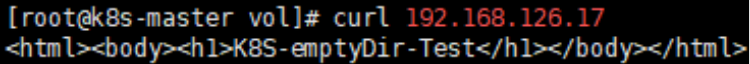

---
## 개념

emptyDir은 Kubernetes에서 가장 단순한 볼륨 타입이다. pod이 생성될 때 빈 디렉터리가 만들어지고, pod 안의 컨테이너가 그 디렉터리를 마운트해서 사용한다.

- pod이 살아있는 동안만 유지된다. pod이 삭제되면 데이터도 함께 사라진다.
- 실제로는 pod이 스케줄된 노드의 디스크에 저장된다. 그래서 그 노드에서 직접 파일을 확인하거나 만들 수 있다.
- 같은 pod 안에서 컨테이너가 재시작돼도 데이터는 유지된다. pod 자체가 삭제되면 사라진다.

이 글은 emptyDir → nodeSelector → hostPath → hostPath 기반 mysql 데이터 영속성 확인까지, 오늘 진행한 볼륨/스케줄링 실습을 순서대로 정리한다.

---

## 1차 실습 — nginx, 임의 경로(/test1)에 emptyDir 마운트

### 작업 디렉터리 생성

```bash
mkdir /vol
cd /vol
vi nginx.yml
```

### nginx.yml

```yaml
apiVersion: v1
kind: Pod
metadata:
  name: nginx
  labels:
    app: nginx
    env: devel
spec:
  containers:
  - name: n1
    image: nginx
    imagePullPolicy: IfNotPresent
    ports:
    - containerPort: 80
    volumeMounts:
    - mountPath: /test1
      name: jhjang-vol
  volumes:
  - name: jhjang-vol
    emptyDir: {}
```

`volumeMounts`는 컨테이너 안에 위치해서 "무엇을 어디에 마운트할지"를 정하고, `volumes`는 `spec` 최상위에 위치해서 볼륨 자체를 정의한다.

### 적용 및 확인

```bash
kubectl apply -f nginx.yml --dry-run=server
kubectl apply -f nginx.yml
kubectl get pod -o wide
kubectl exec nginx -- ls /test1
kubectl delete pod nginx
```

아직 아무것도 넣지 않았으므로 `/test1`은 비어있는 게 정상이다.

---

## 2차 실습 — nginx, 웹 루트(/usr/share/nginx/html)에 emptyDir 마운트

```yaml
apiVersion: v1
kind: Pod
metadata:
  name: nginx
  labels:
    app: nginx
    env: devel
spec:
  containers:
  - name: n1
    image: nginx
    imagePullPolicy: IfNotPresent
    ports:
    - containerPort: 80
    volumeMounts:
    - mountPath: /usr/share/nginx/html
      name: jhjang-vol
  volumes:
  - name: jhjang-vol
    emptyDir: {}
```

```bash
kubectl apply -f nginx.yml
kubectl get pod -o wide
```

**어디서: pod이 스케줄된 노드**

```bash
find / -name jhjang-vol
# /var/lib/kubelet/pods/<pod-uid>/volumes/kubernetes.io~empty-dir/jhjang-vol

cat > /var/lib/kubelet/pods/<pod-uid>/volumes/kubernetes.io~empty-dir/jhjang-vol/index.html << EOF
<html><body><h1>K8S-emptyDir-Test</h1></body></html>
EOF
```

```bash
kubectl get pod nginx -o wide
curl <pod-IP>
```

노드 디스크에 직접 만든 `index.html`이 그대로 nginx 응답으로 나오면, emptyDir이 컨테이너 내부 경로와 노드의 실제 디스크 경로를 연결하고 있다는 게 확인된 것이다.

---

## 3차 실습 — httpd(apache), 웹 루트(/usr/local/apache2/htdocs)에 emptyDir 마운트

httpd(apache)의 기본 웹 루트는 `/usr/local/apache2/htdocs`다.

```yaml
apiVersion: v1
kind: Pod
metadata:
  name: httpd
  labels:
    app: httpd
    env: devel
spec:
  containers:
  - name: h1
    image: httpd
    imagePullPolicy: IfNotPresent
    ports:
    - containerPort: 80
    volumeMounts:
    - mountPath: /usr/local/apache2/htdocs
      name: jhjang-vol
  volumes:
  - name: jhjang-vol
    emptyDir: {}
```

```bash
kubectl apply -f httpd.yml --dry-run=server
kubectl apply -f httpd.yml
kubectl get pod -o wide
```

**어디서: pod이 스케줄된 노드**

```bash
find / -name jhjang-vol
cat > /var/lib/kubelet/pods/<pod-uid>/volumes/kubernetes.io~empty-dir/jhjang-vol/index.html << EOF
<html><body><h1>K8S-emptyDir-Test</h1></body></html>
EOF
```

**확인**

```bash
kubectl get pod httpd -o wide
curl <pod-IP>
```

```
[root@k8s-master vol]# curl 192.168.126.17
<html><body><h1>K8S-emptyDir-Test</h1></body></html>
```




---

## 4차 실습 — nodeSelector로 pod을 원하는 노드에 배치

특정 노드에만 pod을 배치하고 싶다면, 노드에 label을 붙이고 pod의 `nodeSelector`가 그 label을 가리키게 한다.

### 노드에 label 붙이기

```bash
kubectl label nodes k8s-worker1 stor=hdd
kubectl label nodes k8s-worker2 stor=ssd
kubectl get nodes --show-labels
```

label을 잘못 붙였을 경우 키 뒤에 `-`를 붙여 삭제하고, 값만 바꿀 땐 `--overwrite`를 쓴다.

```bash
kubectl label nodes k8s-worker1 sotr-              # 잘못 붙인 label 삭제
kubectl label nodes k8s-worker1 stor=ssd --overwrite
```

### alpine.yml

```yaml
apiVersion: v1
kind: Pod
metadata:
  name: alpine
  labels:
    env: devel
spec:
  nodeSelector:
    stor: nvme
  containers:
  - name: a1
    image: alpine
    imagePullPolicy: IfNotPresent
    command: ["tail", "-F", "/home"]
```

`nodeSelector`는 pod 자신의 `labels`가 아니라 `spec` 안에 위치하며, 노드에 붙어있는 label과 매칭된다. 매칭되는 노드가 없으면 `Pending` 상태로 멈춘다.

```bash
kubectl apply -f alpine.yml --dry-run=server
kubectl apply -f alpine.yml
kubectl get pod -o wide
kubectl delete pods alpine httpd nginx
```

---

## 5차 실습 — hostPath로 노드의 특정 경로를 pod과 연결

emptyDir은 pod 생성 시 새로 만들어지는 임시 공간인 반면, **hostPath는 노드에 이미 있거나 지정한 특정 경로를 그대로 pod에 노출**한다. pod이 삭제돼도 데이터가 노드에 남는다는 게 핵심 차이다.

### nginx1.yml — nodeName으로 특정 노드에 고정 배치

```bash
vi nginx1.yml
```

```yaml
apiVersion: v1
kind: Pod
metadata:
  name: nginx
  labels:
    app: nginx
spec:
  nodeName: k8s-worker1
  containers:
  - name: n1
    image: nginx
    imagePullPolicy: Never
    ports:
    - containerPort: 80
    volumeMounts:
    - mountPath: /usr/share/nginx/html/
      name: jhjang-vol
  volumes:
  - name: jhjang-vol
    hostPath:
      path: /html
      type: DirectoryOrCreate
```

`nodeName`은 `nodeSelector`와 달리 스케줄러를 거치지 않고 **지정한 이름의 노드에 그대로 배치**한다. `type: DirectoryOrCreate`는 해당 경로(`/html`)가 없으면 자동으로 디렉터리만 생성한다(파일까지는 안 만든다).

```bash
kubectl apply -f nginx1.yml --dry-run=server
kubectl apply -f nginx1.yml
kubectl get pods -o wide
curl 192.168.194.85
```

이 시점에서 `/html` 디렉터리는 자동 생성됐지만 안에 파일이 없어서 `403 Forbidden`이 뜨는 게 정상이다.

**어디서: k8s-worker1**

```bash
cat > /html/index.html << EOF
<html>
<body>
<h1>HOSTPATH-TEST</h1>
</body>
</html>
EOF
```

**어디서: k8s-master**

```bash
curl 192.168.194.85
```

`HOSTPATH-TEST`가 정상적으로 출력되면 확인 완료다.

### http1.yml — hostPath로 디렉터리와 파일을 각각 마운트

```bash
mv d.yml http1.yml
```

```yaml
apiVersion: v1
kind: Pod
metadata:
  name: httpd
  labels:
    app: apache
spec:
  nodeSelector:
    stor: hdd
  containers:
  - name: h1
    image: httpd
    imagePullPolicy: Never
    ports:
    - containerPort: 80
    volumeMounts:
    - mountPath: /usr/local/apache2/htdocs
      name: jhjang-vol1
    - mountPath: /usr/local/apache2/htdocs/index.html
      name: jhjang-file1
  volumes:
  - name: jhjang-vol1
    hostPath:
      path: /html
      type: Directory
  - name: jhjang-file1
    hostPath:
      path: /html/index.html
      type: File
```

이번엔 `nodeSelector: stor: hdd`를 써서 앞서 label로 지정한 노드에 배치한다. 그리고 `volumeMounts`를 두 개 써서 **디렉터리 전체(htdocs)**와 **그 안의 특정 파일(index.html)**을 각각 따로 마운트했다. `hostPath.type`도 상황에 맞게 `Directory`(이미 존재하는 디렉터리), `File`(이미 존재하는 파일)로 구분해서 지정한다.

```bash
kubectl apply -f http1.yml --dry-run=server
kubectl apply -f http1.yml
kubectl get pods -o wide
curl 192.168.194.86
```

nginx1이 만든 `/html/index.html`을 httpd도 그대로 이어받아 같은 내용이 출력된다.

---

## 6차 실습 — mysql, hostPath로 데이터 영속성과 env 생략 동작 확인

### 요구사항

1. mysql:8.0 이미지로 node2(k8s-worker2)에 pod 생성
2. node2의 `/mysql` 디렉터리가 pod 생성 시 자동으로 만들어지게 함
3. `/mysql` ↔ pod의 `/var/lib/mysql`을 hostPath로 연결
4. 같은 이미지로 다른 이름의 pod을 하나 더 만들 때, hostPath를 재사용하면 `env`(비밀번호 설정) 없이도 pod이 정상 실행되는지 확인

mysql 이미지는 원래 `MYSQL_ROOT_PASSWORD` 환경변수가 없으면 컨테이너가 즉시 종료된다. 하지만 hostPath로 **이미 초기화된 데이터가 있는 `/var/lib/mysql`을 재사용**하면, mysql은 이미 초기화가 끝났다고 판단해서 env 없이도 그 데이터로 그대로 부팅한다.

### mysql.yml — 1차 pod (env 있음, 데이터 초기화 담당)

```bash
vi mysql.yml
```

```yaml
apiVersion: v1
kind: Pod
metadata:
  name: mysql
  labels:
    app: mysql
spec:
  nodeName: k8s-worker2
  containers:
  - name: m1
    image: mysql:8.0
    imagePullPolicy: IfNotPresent
    env:
    - name: MYSQL_ROOT_PASSWORD
      value: "It12345!"
    volumeMounts:
    - mountPath: /var/lib/mysql
      name: mysql-vol
  volumes:
  - name: mysql-vol
    hostPath:
      path: /mysql
      type: DirectoryOrCreate
```

```bash
kubectl apply -f mysql.yml --dry-run=server
kubectl apply -f mysql.yml
kubectl get pod -o wide
```

`node2(k8s-worker2)`의 `/mysql`이 자동 생성되고, mysql이 그 안에 데이터 파일을 초기화한다.

### mysql1.yml — 2차 pod (env 없음, 같은 hostPath 재사용)

```bash
vi mysql1.yml
```

```yaml
apiVersion: v1
kind: Pod
metadata:
  name: mysql1
  labels:
    app: mysql
spec:
  nodeName: k8s-worker2
  containers:
  - name: m1
    image: mysql:8.0
    imagePullPolicy: IfNotPresent
    volumeMounts:
    - mountPath: /var/lib/mysql
      name: mysql-vol
  volumes:
  - name: mysql-vol
    hostPath:
      path: /mysql
      type: DirectoryOrCreate
```

`env` 항목을 통째로 뺀 게 핵심이다. `mysql` pod이 먼저 `/mysql`에 데이터를 초기화해둔 상태이므로, `mysql1`은 env 없이도 그 데이터를 그대로 물려받아 정상 기동해야 한다.

```bash
kubectl apply -f mysql1.yml
kubectl get pod -o wide
```

### 접속 확인

pod 안으로 들어갈 때는 실행할 명령어를 반드시 `--` 뒤에 지정해야 한다.

```bash
kubectl exec -it mysql1 -- bash
```

또는 bash를 거치지 않고 바로 mysql 클라이언트로:

```bash
kubectl exec -it mysql1 -- mysql -uroot -pIt12345!
```

`mysql1`에 env를 안 줬는데도 `mysql`(1차 pod)에서 설정한 비밀번호(`It12345!`)로 접속이 된다면, hostPath 데이터 재사용으로 env 생략이 가능하다는 게 확인된 것이다.

### 정리

```bash
kubectl delete pod mysql
```

---

## 핵심 요약

- **emptyDir**: pod 생성 시 만들어지는 임시 볼륨. pod이 삭제되면 데이터도 함께 삭제된다.
- **hostPath**: 노드에 이미 있거나 지정한 특정 경로를 그대로 pod에 연결. pod이 삭제돼도 데이터는 노드에 남는다.
- **volumeMounts vs volumes**: `volumeMounts`는 컨테이너 안(마운트 위치), `volumes`는 spec 최상위(볼륨 정의).
- **nodeName vs nodeSelector**: `nodeName`은 스케줄러를 건너뛰고 지정한 노드에 강제 배치, `nodeSelector`는 label이 일치하는 노드 중에서 스케줄러가 배치.
- **hostPath.type**: `DirectoryOrCreate`(없으면 디렉터리 생성), `Directory`(이미 존재해야 함), `File`(이미 존재하는 파일 지정) 등 상황에 맞게 구분해서 쓴다.
- **mysql과 hostPath**: 이미 초기화된 데이터 디렉터리를 재사용하면 `MYSQL_ROOT_PASSWORD` 없이도 mysql 컨테이너가 정상 기동한다.

---

## 부가 팁

### kubectl 자동완성 설정

```bash
dnf install -y bash-completion
kubectl completion bash > /etc/bash_completion.d/kubectl
source /etc/bash_completion.d/kubectl
echo 'source <(kubectl completion bash)' >> ~/.bashrc
source ~/.bashrc
```

### vi/vim visual block 모드

yaml 파일에서 여러 줄의 들여쓰기를 한 번에 맞추거나 수정할 때 유용하다.

```
Ctrl+v          → visual block 모드 진입
↓ ↓ ↓          → 세로로 여러 줄 선택
Shift+i         → 삽입 모드로 전환
원하는 문자 입력
Esc             → 전체 선택 줄에 한꺼번에 적용
```

