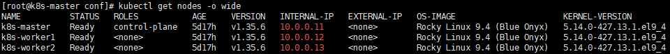
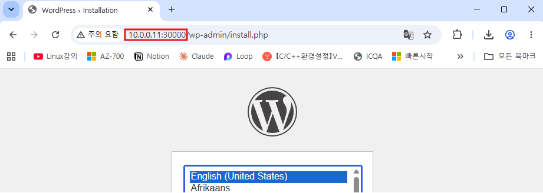
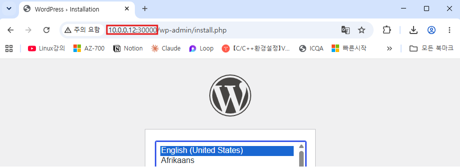
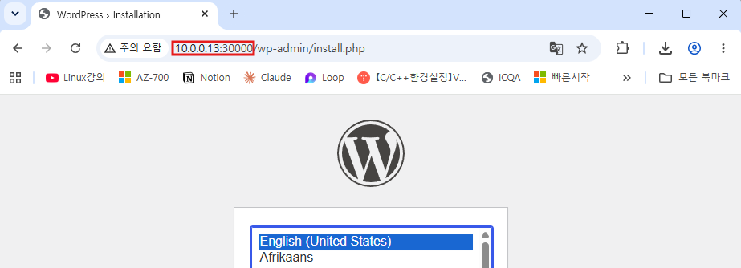

---
# Kubernetes MySQL + WordPress 배포

## 개요

ConfigMap 2개 → MySQL Pod(ClusterIP) → WordPress Deployment(5 replica) → NodePort(30000) 공개까지의 실습 기록.

| 요구사항                     | 리소스                           |
| ------------------------ | ----------------------------- |
| 1. ConfigMap 2개 작성       | `mysqlcon.yml`, `wordcon.yml` |
| 2. MySQL Pod + ClusterIP | `mysql.yml`                   |
| 3. WordPress 5 replica   | `word-deploy.yml`             |
| 4. NodePort 30000 공개     | `word-svc.yml`                |
| 5. 외부 접속 테스트             | 브라우저                          |

---
## 1. ConfigMap 작성

### mysqlcon.yml

```yaml
apiVersion: v1
kind: ConfigMap
metadata:
  name: mysqlenv
data:
  MYSQL_ROOT_PASSWORD: It12345!
  MYSQL_DATABASE: word
  MYSQL_USER: jhjang
  MYSQL_PASSWORD: It12345!
```

### wordcon.yml

```yaml
apiVersion: v1
kind: ConfigMap
metadata:
  name: wordenv
data:
  WORDPRESS_DB_HOST: svc-mysql
  WORDPRESS_DB_USER: jhjang
  WORDPRESS_DB_PASSWORD: It12345!
  WORDPRESS_DB_NAME: word
```

```bash
kubectl apply -f mysqlcon.yml
kubectl apply -f wordcon.yml
kubectl get configmap
```

---
## 2. MySQL Pod 생성 + ClusterIP 노출

### mysql.yml

```yaml
apiVersion: v1
kind: Pod
metadata:
  name: mysql
  labels:
    app: mysql
spec:
  containers:
  - name: m1
    image: mysql:8.0
    imagePullPolicy: IfNotPresent
    ports:
    - containerPort: 3306
    envFrom:
    - configMapRef:
        name: mysqlenv
```

```bash
kubectl apply -f mysql.yml
kubectl expose pod mysql --name svc-mysql --port 3306
kubectl get pods,svc
```

---
## 3. WordPress Deployment (replica 5)

### word-deploy.yml

```yaml
apiVersion: apps/v1
kind: Deployment
metadata:
  name: word-deploy
  labels:
    app: wordpress
spec:
  replicas: 5
  selector:
    matchLabels:
      app: wordpress
  template:
    metadata:
      labels:
        app: wordpress
    spec:
      containers:
      - name: w1
        image: wordpress
        imagePullPolicy: IfNotPresent
        ports:
        - containerPort: 80
        envFrom:
        - configMapRef:
            name: wordenv
```

```bash
kubectl apply -f word-deploy.yml
kubectl get pods -o wide
```

---
## 4. NodePort 30000 공개

### word-svc.yml

```yaml
apiVersion: v1
kind: Service
metadata:
  name: svc-word
spec:
  type: NodePort
  selector:
    app: wordpress
  ports:
  - port: 80
    targetPort: 80
    nodePort: 30000
```

```bash
kubectl apply -f word-svc.yml
kubectl get svc
```

---
## 5. 접속 테스트

노드 IP 확인:

```bash
kubectl get nodes -o wide
```



브라우저에서 각 노드 IP로 접속 (NodePort는 모든 노드에서 동일하게 열림):

```
http://10.0.0.11:30000
http://10.0.0.12:30000
http://10.0.0.13:30000
```







세 노드 모두 동일한 WordPress 언어 선택 화면이 뜬다. NodePort는 마스터 포함 전 노드에서 열리며, kube-proxy가 실제 Pod로 트래픽을 라우팅한다.

---
## 트러블슈팅

- `--dry-run=server`는 검증만 하고 실제 생성 안 함. 실제 생성하려면 옵션 제거.
- `kubectl delete wordenv`처럼 리소스 타입 생략 시 에러. `kubectl delete configmap wordenv`로 타입 명시 필요.
- `http://IP:PORT`는 브라우저 주소창에 입력. 터미널에 치면 `No such file or directory` 에러.
- ConfigMap 수정은 이미 실행 중인 Pod/Deployment에 자동 반영 안 됨. 재생성 필요.