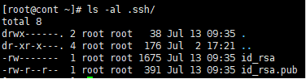
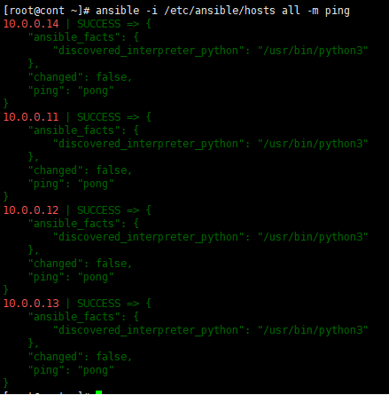
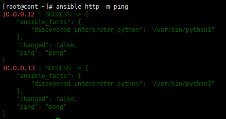

---

## 개요

컨트롤 노드(`cont`) 1대 + 노드 3대(`node1~3`) 구조에서 SSH 키 기반 통신 설정 → ansible 설치 → 인벤토리 작성 → ad-hoc 명령 테스트 → 플레이북 작성까지의 실습 기록.

| 단계            | 내용                                          |
| ------------- | ------------------------------------------- |
| 1. 호스트 준비     | 호스트네임 설정, SSH 키 배포                          |
| 2. ansible 설치 | epel-release 통해 설치                          |
| 3. 인벤토리 작성    | `/etc/ansible/hosts`                        |
| 4. ad-hoc 명령  | `-m ping`, `-m file`, `-m shell`, `-m user` |
| 5. playbook   | `test.yml`, `user.yml`                      |

---
## 1. 호스트 준비

### 호스트네임 설정

```bash
hostnamectl set-hostname cont    # 컨트롤 노드
hostnamectl set-hostname node1
hostnamectl set-hostname node2
hostnamectl set-hostname node3
```

### SSH 키 생성 및 배포 (cont에서 실행)

```bash
ssh-keygen -m PEM -t rsa -b 2048 -q -N ""
```



```bash
scp .ssh/id_rsa.pub root@10.0.0.11:/root/.ssh/authorized_keys
scp .ssh/id_rsa.pub root@10.0.0.12:/root/.ssh/authorized_keys
scp .ssh/id_rsa.pub root@10.0.0.13:/root/.ssh/authorized_keys
scp .ssh/id_rsa.pub root@10.0.0.14:/root/.ssh/authorized_keys
```


---
## 2. ansible 설치

```bash
dnf install -y epel-release
dnf install -y ansible
ansible --version
```


---
## 3. 인벤토리 작성

`/etc/ansible/hosts`는 ansible의 기본 인벤토리 경로라서, 여기에 작성해두면 `-i` 옵션 없이도 자동으로 읽힌다.

```bash
vi /etc/ansible/hosts
```

```ini
[all]
10.0.0.[11:14]

[node]
10.0.0.12
10.0.0.13
10.0.0.14

[web]
10.0.0.12

[was]
10.0.0.13

[db]
10.0.0.14

[http:children]
web
was
```

`[http:children]`은 그룹 상속 문법으로, `http` 그룹을 대상으로 실행하면 `web` + `was`에 속한 호스트 전체에 적용된다.

---
## 4. ad-hoc 명령 테스트

### ping 모듈로 연결 확인

```bash
ansible -i /etc/ansible/hosts all -m ping
ansible all -m ping          # -i 생략 가능 (기본 경로라서 동일 동작)
```



```bash
ansible http -m ping         # web + was 그룹 대상
```



### file 모듈 — 역등성 확인

```bash
ansible node -m file -a "path=/test state=directory"
ansible node -m file -a "path=/test state=absent"
ansible node -m shell -a "ls -al /"
```

`state=absent`를 두 번 실행해보면:
- 1회차: `"changed": true` (실제로 삭제)
- 2회차: `"changed": false` (이미 없어서 skip)

이렇게 이미 원하는 상태면 아무 것도 하지 않는 것이 **역등성(Idempotency)**이다.

### shell 모듈 — 사용자 생성/삭제 (역등성 X)

```bash
ansible node -m shell -a "useradd a"
ansible node -m shell -a "tail -5 /etc/passwd"

ansible node -m shell -a "userdel -r a"
ansible node -m shell -a "tail -5 /etc/passwd"
ansible node -m shell -a "ls -al /home"
ansible node -m shell -a "ls -al /var/spool/mail"
```

비밀번호까지 같이 설정:

```bash
ansible node -m shell -a "useradd a; echo 'It1' | passwd --stdin a"
ansible node -m shell -a "tail -5 /etc/passwd"
```

### user 모듈 — 사용자 생성 (역등성 O)

```bash
ansible node -m user -a "name=b"
ansible node -m shell -a "tail -5 /etc/passwd"

# 비밀번호 해시까지 지정
ansible node -m user -a "name=n update_password=always password={{ 'It1' | password_hash('sha512') }}"
ansible node -m shell -a "tail -5 /etc/shadow"
```

`shell`로 `useradd`를 반복 실행하면 이미 있는 사용자라 에러가 나지만, `user` 모듈은 이미 있으면 그냥 skip 처리된다. 이 차이가 역등성 보장 여부의 핵심이다.

---
## 5. playbook 작성

### 5-1. 파일/디렉토리 생성 (`test.yml`)

```bash
mkdir /file
cd /file
vi test.yml
```

```yaml
---
- name: make file /test
  hosts: node
  gather_facts: false
  ignore_errors: true
  tasks:
    - name: make file test
      file:
        path: /test
        state: touch
        mode: '0777'

    - name: make directory /tbabo
      file:
        path: /tbabo
        state: directory
        mode: '0777'
```

```bash
ansible-playbook test.yml

# alias 등록
alias ap='ansible-playbook'
ap test.yml
```

결과 확인:

```bash
ansible node -m shell -a "ls -al /"
```

### 5-2. 사용자 생성 (`user.yml`, web 그룹 대상)

```bash
cd /file
vi user.yml
```

```yaml
---
- name: create user a & password 'It1'
  hosts: web
  gather_facts: false
  ignore_errors: true
  tasks:
    - name: create user a
      user:
        name: a
        update_password: always
        password: "{{ 'It1' | password_hash('sha512') }}"
```

```bash
ap user.yml
ansible web -m shell -a "tail -5 /etc/shadow"
```

### 5-3. 사용자 삭제 (홈 디렉토리까지 완전 삭제)

`user.yml`에 태스크를 하나 더 추가해서, 계정과 사용 흔적(홈 디렉토리, 메일 스풀)까지 같이 삭제해본다.

```yaml
    - name: delete user a & directory
      user:
        name: a
        remove: true
        state: absent
```

```bash
ap user.yml
ansible web -m shell -a "ls -al /home"
ansible web -m shell -a "ls -al /var/spool/mail"
```

| 옵션 | 역할 |
|---|---|
| `state: absent` | 계정 자체를 삭제 (`/etc/passwd`, `/etc/shadow`에서 제거) — `userdel`과 동일 |
| `remove: true` | 계정 삭제 시 홈 디렉토리(`/home/a`), 메일 스풀(`/var/spool/mail/a`)까지 같이 삭제 — `userdel -r`과 동일 |

`remove: true`가 없으면 계정만 지워지고 `/home/a`는 그대로 남는다. 확인 명령 결과에 `a` 관련 흔적이 없어야 정상이다.

| shell 명령 | user 모듈 |
|---|---|
| `useradd a` | `user: name=a` |
| `userdel -r a` | `user: name=a state=absent remove=true` |

### 5-4. work.yml — 단계별로 기능을 추가하며 작성

ad-hoc 명령을 하나씩 실행하던 것을 `work.yml` 플레이북으로 옮겼다. 사용자 추가 → 비밀번호 설정 → uid 지정 → 파일/디렉토리 생성 순으로 태스크를 하나씩 쌓아가며 작성했다.

```bash
cd /file
vi work.yml
ap work.yml     # = ansible-playbook work.yml
```

**1단계 — 사용자 a, b 추가**

```yaml
---
- name: user add a,b & fix permission & file/directory create
  hosts: db
  gather_facts: false
  ignore_errors: true
  tasks:
    - name: user add
      user:
        name: "{{ item }}"
      with_items:
        - a
        - b
```

**2단계 — 비밀번호(It1) 설정 추가**

```yaml
    - name: user add
      user:
        name: "{{ item }}"
        update_password: always
        password: "{{ 'It1' | password_hash('sha512') }}"
      with_items:
        - a
        - b
```

**3단계 — uid 지정 (a=2000, b=3000) 추가**

```yaml
    - name: user add
      user:
        name: "{{ item.user }}"
        uid: "{{ item.uid }}"
        update_password: always
        password: "{{ 'It1' | password_hash('sha512') }}"
      with_items:
        - { user: a, uid: 2000 }
        - { user: b, uid: 3000 }
```

**4단계 — /test 파일, /tbabo 디렉토리 생성 및 권한 설정 추가 (최종본)**

```yaml
---
- name: user add a,b & fix permission & file/directory create
  hosts: db
  gather_facts: false
  ignore_errors: true
  tasks:
    - name: user add
      user:
        name: "{{ item.user }}"
        uid: "{{ item.uid }}"
        update_password: always
        password: "{{ 'It1' | password_hash('sha512') }}"
      with_items:
        - { user: a, uid: 2000 }
        - { user: b, uid: 3000 }

    - name: create /test file
      file:
        path: /test
        owner: a
        group: b
        mode: '0777'
        state: touch

    - name: create /tbabo directory
      file:
        path: /tbabo
        owner: a
        group: b
        mode: '0777'
        state: directory
```

```bash
ap work.yml
ansible db -m shell -a "tail -5 /etc/passwd"
ansible db -m shell -a "tail -5 /etc/shadow"
ansible db -m shell -a "ls -al /"
```

`/etc/passwd`에서 `a:x:2000:...`, `b:x:3000:...`로 uid가 반영됐고, `/etc/shadow`에서 두 계정 모두 sha512 해시(`$6$`로 시작)가 채워진 것을 확인했다. `/test`(파일), `/tbabo`(디렉토리)도 소유자 `a`, 그룹 `b`, 권한 `777`로 생성됐다.

**배운 점**

- `with_items` + 딕셔너리 리스트(`{ key: value, ... }`)를 쓰면 반복되는 태스크를 하나로 줄이면서도 항목별로 다른 값(uid 등)을 넘길 수 있다.
- 태스크 하나에는 모듈 하나만 실행 가능하므로, 파일 생성과 디렉토리 생성처럼 `state` 값이 다른 작업은 별도의 태스크로 분리해야 한다.
- `password_hash` 필터는 실행할 때마다 salt를 새로 생성하므로, 이 태스크는 반복 실행 시 매번 `changed: true`가 뜬다 — 완전한 역등성은 아니라는 점을 확인.

---

### 5-5. work.yml — 사용자 및 파일/디렉토리 삭제

앞서 만든 사용자(a, b)와 파일/디렉토리(/test, /tbabo)를 반대로 삭제하는 플레이북도 같은 방식(`with_items`)으로 작성했다.

```yaml
---
- name: delete user & file
  hosts: db
  gather_facts: false
  ignore_errors: true
  tasks:
    - name: delete user
      user:
        name: "{{ item }}"
        remove: yes
        state: absent
      with_items:
        - a
        - b

    - name: delete file
      file:
        path: "{{ item }}"
        state: absent
      with_items:
        - /tbabo
        - /test
```

```bash
ap work.yml
ansible db -m shell -a "tail -5 /etc/passwd"
ansible db -m shell -a "ls -al /"
ansible db -m shell -a "ls -al /home"
```

사용자 삭제 태스크와 파일/디렉토리 삭제 태스크를 각각 `with_items`로 묶어, 계정 2개와 경로 2개를 한 태스크씩으로 처리했다. `remove: yes`로 홈 디렉토리까지 같이 삭제되고, `file` 모듈은 대상이 파일이든 디렉토리든 `state: absent` 하나로 둘 다 삭제된다.

## 실습

**요구사항 (DB 호스트 대상)**

1. 사용자 `a`(uid=2000), `b`(uid=3000) 생성, 비밀번호는 `It1`
2. `/test` 파일과 `/tbabo` 디렉토리 생성
3. 2번의 파일 및 디렉토리를 `user: a`, `group: b`로 설정
4. 권한은 `0777`로 설정
5. `/etc/passwd`와 `ls -al /` 결과값을 ansible ad-hoc 명령어로 확인

**풀이**

```bash
# 1. 사용자 a(uid=2000), b(uid=3000) 생성, 비밀번호 It1
ansible db -m user -a "name=a uid=2000 update_password=always password={{ 'It1' | password_hash('sha512') }}"
ansible db -m user -a "name=b uid=3000 update_password=always password={{ 'It1' | password_hash('sha512') }}"

# 2. /test 파일, /tbabo 디렉토리 생성
ansible db -m file -a "path=/test state=touch"
ansible db -m file -a "path=/tbabo state=directory"

# 3~4. 소유자 a, 그룹 b, 권한 0777로 설정
ansible db -m file -a "path=/test owner=a group=b mode=0777"
ansible db -m file -a "path=/tbabo owner=a group=b mode=0777"

# 5. 결과 확인
ansible db -m shell -a "tail -5 /etc/passwd"
ansible db -m shell -a "ls -al /"
```

`uid`는 `user` 모듈 옵션으로 지정 가능하며, 이미 해당 uid를 가진 사용자가 없으면 그대로 생성된다.
`owner`, `group`, `mode`는 `file` 모듈에서 생성과 동시에 지정할 수도 있지만, 여기서는 생성(2번)과 소유권/권한 설정(3~4번)을 구분해서 단계별로 확인하기 위해 나눠서 실행했다.

## 정리

- 인벤토리 기본 경로는 `/etc/ansible/hosts`이며, `-i` 옵션 없이도 이 경로를 자동으로 읽는다.
- `file`, `user` 같은 전용 모듈은 현재 상태를 확인한 뒤 다르면 변경하고 같으면 skip하므로 **역등성이 보장**된다.
- `command`, `shell`, `script` 모듈은 매번 그대로 실행되기 때문에 **역등성이 보장되지 않는다.** 반복 실행 시 에러가 나거나 상태가 계속 바뀔 수 있어, 부득이하게 사용해야 한다면 `creates:` / `removes:` 옵션이나 `when` 조건으로 흉내내야 한다.
- YAML 문법에서 콜론 뒤 공백, 리스트 하이픈 뒤 공백은 필수이며, 이를 지키지 않으면 플레이북 실행 자체가 실패한다.
