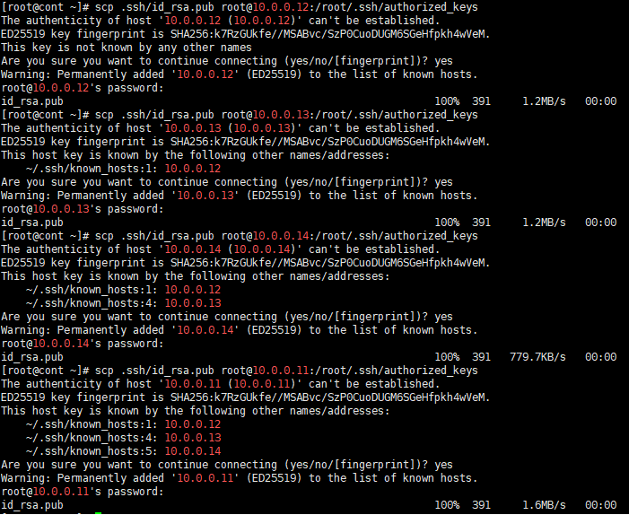
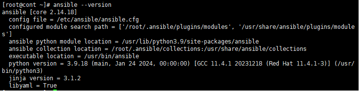

---
ad-hoc

ansible -i /etc/ansible/hosts

ansible all -m ping
(ansible 모듈)

---
hostnamectl set-hostname cont

hostnamectl set-hostname node1
hostnamectl set-hostname node2
hostnamectl set-hostname node3

ssh-keygen -m PEM -t rsa -b 2048 -q -N ""


scp .ssh/id_rsa.pub root@10.0.0.12:/root/.ssh/authorized_keys
scp .ssh/id_rsa.pub root@10.0.0.13:/root/.ssh/authorized_keys
scp .ssh/id_rsa.pub root@10.0.0.14:/root/.ssh/authorized_keys
scp .ssh/id_rsa.pub root@10.0.0.11:/root/.ssh/authorized_keys



dnf install -y epel-release
dnf install -y ansible
ansible -version



- ansible 설치 후 인벤토리 생성
vi /etc/ansible/hosts

```
[all]
10.0.0.[11:14]

[node]
10.0.0.12
10.0.0.13
10.0.0.14

[web]
10.0.0.12

[was]
10.0.0.13

[db]
10.0.0.14

[http:children]
web
was
```

ansible -i /etc/ansible/hosts all -m ping
ansible all -m ping 으로 해도 됨


ansible http -m ping


ansible playbook


ansible 최상위에 test 디렉토리 생성
역등성보장 스크립트파일은 역등성보장x