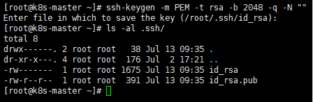

---
ad-hoc

ansible -i /etc/ansible/hosts

ansible all -m ping
(ansible 모듈)

---
hostnamectl set-hostname cont

hostnamectl set-hostname node1
hostnamectl set-hostname node2
hostnamectl set-hostname node3

ssh-keygen -m PEM -t rsa -b 2048 -q -N ""

scp .ssh/