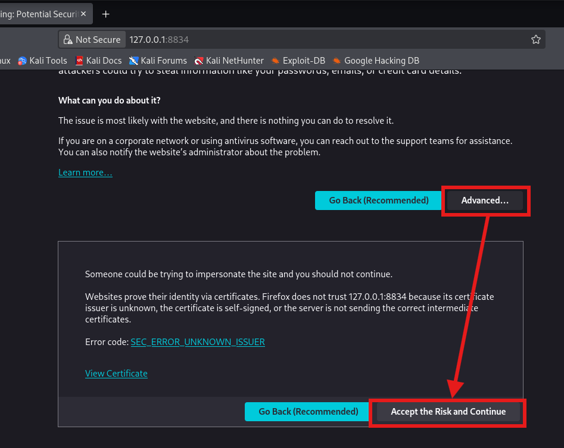
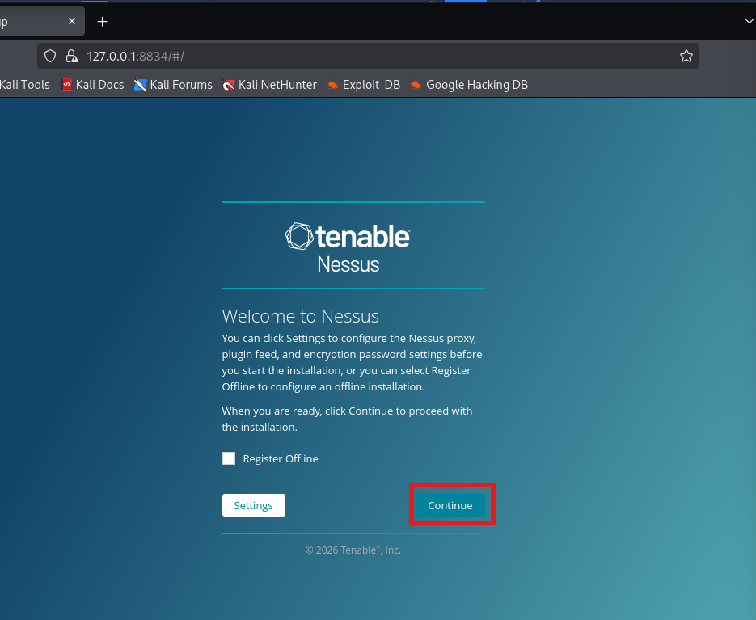
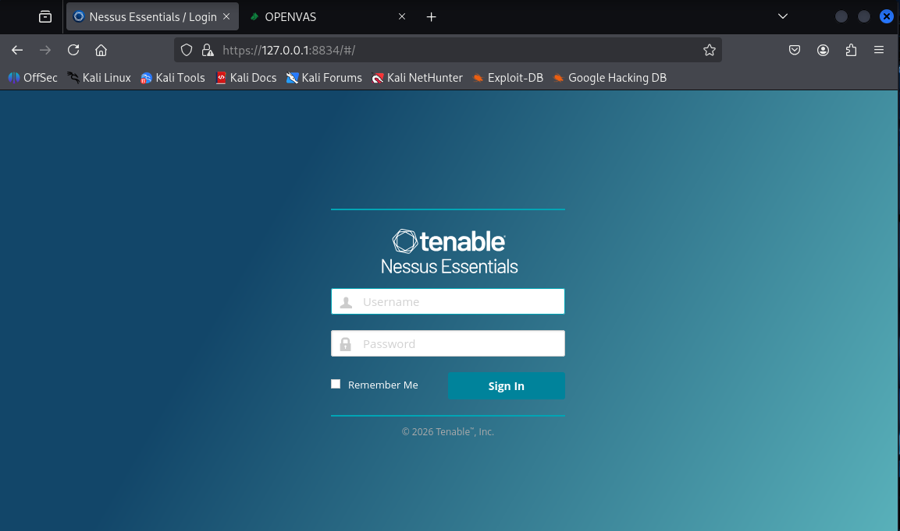
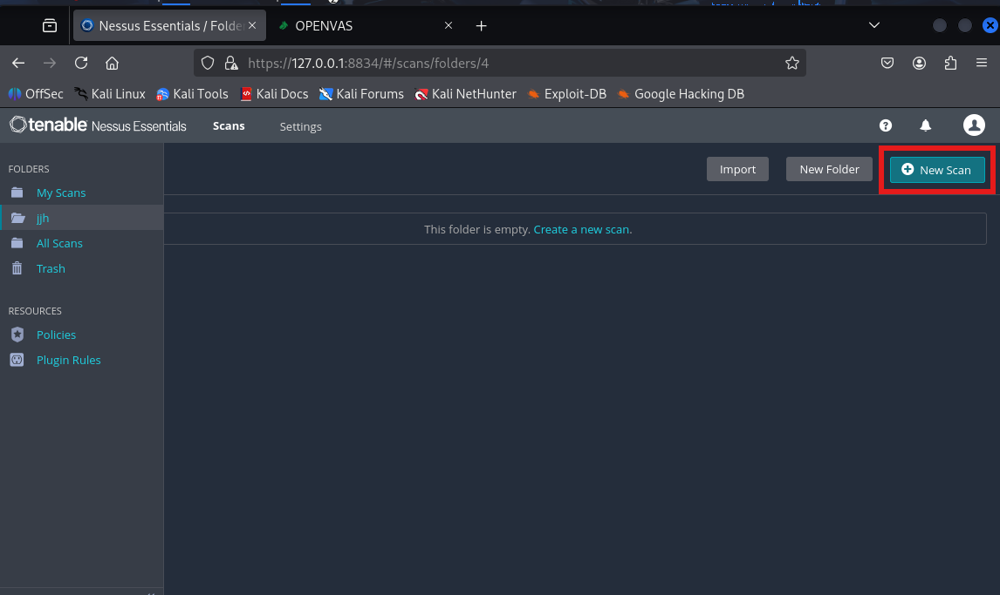
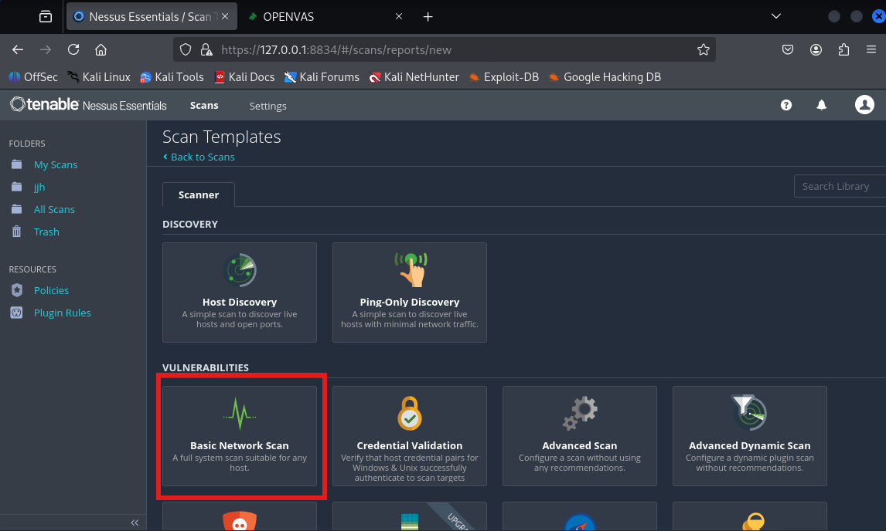
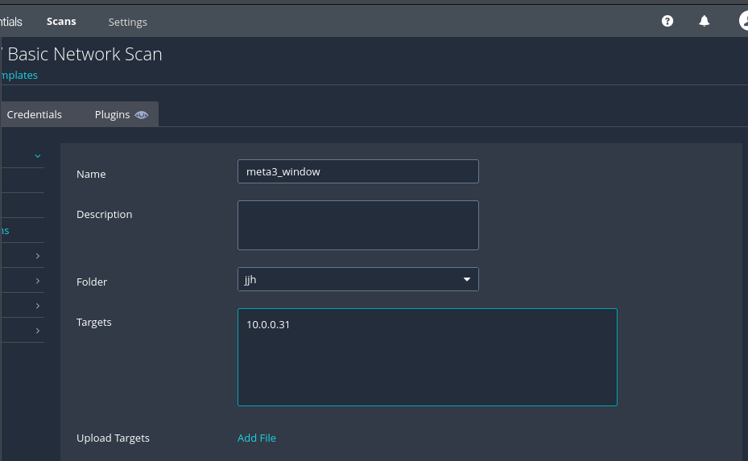
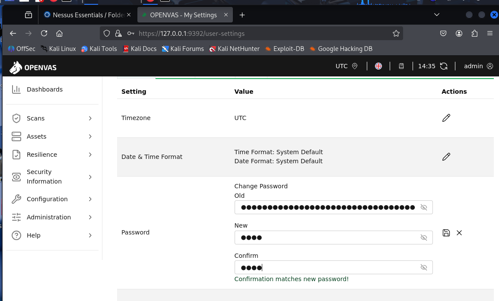
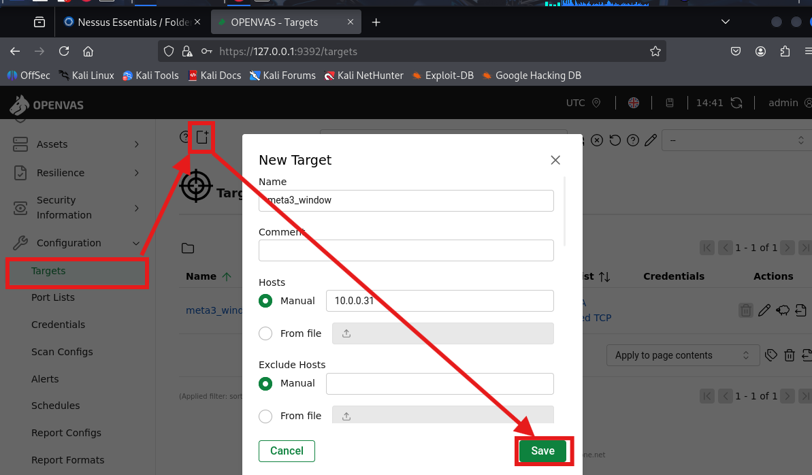
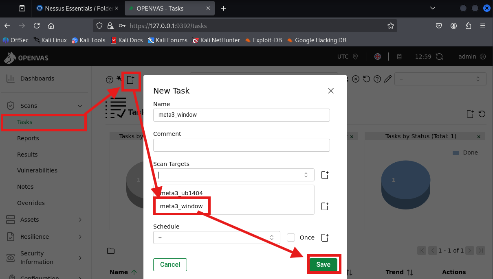

---
## Nessuss & OpenVAS 로 취약점 검사

**Nessus**

```bash
systemctl enable --now nessusd

# 만약 똑같이 안뜨면
systemctl restart nessusd
```

	접속 주소: https://127.0.0.1:8834












	타겟 ip주소 입력


**OpenVAS**

```bash
gvm-check-setup
gvm-start
```

	접속 주소: https://127.0.0.1:9392



	gvm-setup할때 admin/password 를 알려주는데 이거 꼭 기억하고 사이트에서 비번 바꿔주기





