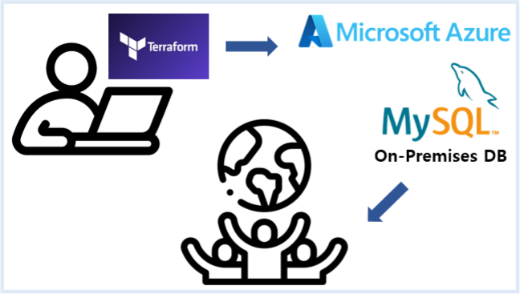
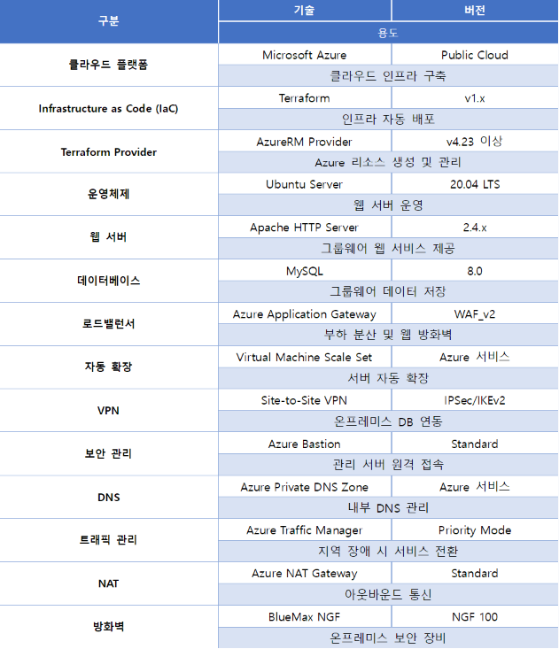

---
## 개요

Azure 클라우드와 온프레미스 데이터베이스를 **Site-to-Site VPN**으로 연동해, 고가용성·보안성·자동화를 갖춘 하이브리드 클라우드 그룹웨어 인프라를 직접 설계·구축했다. GUI 대신 **Terraform 코드로 인프라 전체를 자동화**하는 것이 목표였다.

**핵심 키워드**: Terraform IaC · Application Gateway(WAF) · VMSS Auto Scaling · Traffic Manager · Site-to-Site VPN · Azure Key Vault

📷 5페이지 — 프로젝트 목표 / 6~7페이지 — 사용 기술 및 선정 배경 / 8~9페이지 — 추진 일정 및 역할 분담

---

## 아키텍처 설계 (1차 → 3차)

- **1차**: Site-to-Site VPN 기본 구조 → 단일 Hub 집중, 장애·DR 이중화 취약점 발견
- **2차**: 리전별 Hub 이중화 + Front Door 검토 → 규모 대비 구조 과도하게 복잡
- **3차(최종)**: Front Door 제거, **Traffic Manager**로 단순화. 양 리전(Korea Central/South) 대칭 구성으로 이중화 완성

📷 10페이지 — 1차 아키텍처 구성도 / 12~13페이지 — 2차 아키텍처 구성도 / 14~16페이지 — 3차(최종) 아키텍처 구성도 및 네트워크 구성

---

## Terraform으로 인프라 자동화

**Bootstrap**

- Key Vault·Storage Account를 별도 리소스 그룹(`team604tuna-infra`)에 우선 생성
- 이유: 민감정보를 본 인프라 코드와 분리

📷 20~22페이지 — Bootstrap 리소스 그룹/Storage Account/Key Vault 생성 화면

**리소스 그룹 / 네트워크**

- Resource Group 이름·리전을 변수(`rgname`, `loca`)로 관리
- Korea Central `tuna-vnet1`(10.101.0.0/16), Korea South `tuna-vnet2`(10.102.0.0/16)

📷 23페이지 — 리소스 그룹 생성 코드 / 24~26페이지 — VNet 구성 코드 및 서브넷 구성표

**Public IP / NAT Gateway**

- Application Gateway는 고정 공인 IP(Static)로 구성
- NAT Gateway로 VMSS 아웃바운드 인터넷 통신 처리

📷 27~30페이지 — Public IP 생성 코드(AppGW/VPN GW/Bastion/NAT GW)

**NSG / Azure Bastion**

- AppGW NSG: HTTP/HTTPS만 허용
- VMSS NSG: AppGW→HTTP, Bastion→SSH만 허용
- Bastion NSG: HTTPS/SSH/RDP만 허용

📷 31~35페이지 — NSG 생성 코드(AppGW/VMSS/Bastion), NSG-Subnet 연결 코드

**Application Gateway (WAF)**

- WAF_v2, Prevention 모드, OWASP CRS 3.2 적용
- `/wp-admin`, `/wp-json`은 WAF 예외 처리
- Health Probe(`/health.html`)로 비정상 인스턴스 자동 제외

📷 36~40페이지 — WAF 정책 생성 코드, Application Gateway 생성 코드, Backend Pool/Listener 구성

**VMSS & Auto Scaling**

- SSH 키 인증만 허용(비밀번호 인증 비활성화)
- 최소 1 / 기본 2 / 최대 5대, CPU 70%↑ Scale-Out / 20%↓ Scale-In
- Managed Identity로 Key Vault 접근

📷 41~44페이지 — VMSS 생성 코드, Managed Identity 연동 코드, Auto Scaling 정책 코드

**Site-to-Site VPN — 가장 까다로웠던 구간**

- Azure VPN Gateway ↔ 실제 **BlueMax NGF 100 방화벽 장비**
- AES256 + SHA256 암호화
- 방화벽 정책은 필요한 통신만 허용(DB MySQL, DB SSH, 리전별 VMSS 접근, 백업 동기화)

📷 45페이지 — Azure VPN Gateway 생성 코드 / 47페이지 — 실제 사용한 BlueMax NGF 100 장비 사진 / 48~49페이지 — VPN 지점연결설정 화면 / 50페이지 — 방화벽 정책 설정 및 Hit Count 확인 화면

**Private DNS / Traffic Manager**

- `db.tuna.internal`로 DB IP 대신 도메인 접근(TTL 300초)
- Traffic Manager: Priority 방식, Korea Central 1순위
- Health Monitoring: 30초 간격, 3회 실패 시 Failover

📷 50~51페이지 — Private DNS 구성 코드/흐름도 / 52~56페이지 — Traffic Manager Profile/Health Monitoring/Endpoint 구성

**Key Vault**

- Terraform은 `data` 소스로 기존 Key Vault만 조회(신규 생성 X)
- VMSS는 `Get`/`List` 권한만 최소 부여
- `.tfvars`, `.tfstate`, `*.pem`, `id_rsa`는 `.gitignore` 처리

📷 57~60페이지 — Key Vault Data Source 참조 코드, Access Policy/Managed Identity 구성 코드

**결과**: `terraform apply`로 **총 63개 리소스** 정상 생성

📷 61페이지 — Terraform Apply 완료 결과 / 62~64페이지 — Bootstrap/Global/리전별(Central·South) 최종 산출물 화면

---

## 트러블슈팅

- MySQL Charset 미지원 → 지원 Charset으로 수정
- NIC 생성 실패(IP-서브넷 불일치) → 서브넷 재설계
- VPN 실패(IPSec 설정 불일치) → 암호화 정책·PSK 재설정
- 민감정보 평문 저장 → Key Vault로 전환

📷 61페이지 — 테스트 단계에서 발생한 장애 목록

---

## 테스트 및 검증

**VPN 연결**: Azure Portal `Connected` 상태 + BlueMax NGF `ESTABLISHED`/CHILD_SA 로그 교차 확인. 방화벽 Hit Count 기준 **Korea Central 6,724건, Korea South 350건**의 실제 MySQL 트래픽 통과 확인

📷 65~67페이지 — VPN 연동 구조도 / Azure·BlueMax 연결 상태 화면 / Hit Count 확인 화면

**DB 연동**: DNS 조회·MySQL 접속·데이터 조회 전부 성공. Backup DB Server를 Crontab(새벽 2시)으로 자동 백업 구성, `640` 권한으로 접속 정보 보호

📷 68~71페이지 — MySQL 서버 접속 검증, 백업 스크립트/크론탭 설정, 백업 검증 화면

**애플리케이션 기능**: WordPress 그룹웨어 휴가 신청서 작성 → DB INSERT → 관리자 화면 조회까지 실제 동작 확인. 입력값 검증(Sanitization)·CSRF 방어(Nonce) 적용

📷 72~73페이지 — 부서 목록 동적 출력, 휴가신청서 등록/INSERT 확인 화면

**WAF/Application Gateway**: Health Probe 정상 동작, WAF Prevention 모드 활성 상태 확인

📷 74~75페이지 — Health Probe 화면, WAF 검증 상태 화면

**VMSS/Auto Scaling**: `tuna-vmss1`(Central)·`tuna-vmss2`(South) 모두 Running 상태. 의도적으로 부하를 걸어 CPU 70%↑ → 인스턴스 자동 증설 직접 확인

📷 76~79페이지 — VMSS 인스턴스 실행 상태, Scaling 동작 화면, Auto Scaling 상태 확인

**Traffic Manager Failover**: `nslookup`으로 FQDN(`tuna-team604.trafficmanager.net`) 조회 → Priority 1(Korea Central) 정상 응답 확인. FQDN 접속 시 WordPress 서비스 화면 정상 출력

📷 80~83페이지 — Traffic Manager Endpoint/DNS 확인, FQDN 접속 화면, Health Monitoring 설정 화면

**종합 결과**: Site-to-Site VPN, DB 연동, Private DNS, Application Gateway, WAF, VMSS, Auto Scaling, Traffic Manager, Key Vault — **9개 항목 전체 성공**

📷 84페이지 — 종합 검증 결과

---

## 정리 및 회고

- 아키텍처를 3차에 걸쳐 개선하며, "그럴듯한 구조"가 항상 정답은 아니라는 걸 배웠다. Front Door를 걷어내고 Traffic Manager로 단순화한 게 대표 사례다.
- Terraform + Key Vault로 "코드에 비밀정보를 남기지 않는" 인프라 자동화를 처음부터 끝까지 직접 경험했다.
- VPN 트래픽을 Azure·온프레미스 양쪽 로그로 교차 확인하고, CPU 부하를 직접 걸어 Auto Scaling 동작까지 재현해서 검증하는 습관을 들였다.
- DB가 아직 단일 장애점(SPOF)이라는 한계는 있다. 이 부분은 다음 프로젝트(하이브리드 클라우드 보안 구축)에서 실시간 이중화로 보완했다.

📷 85페이지 — 결론 및 향후 개선사항