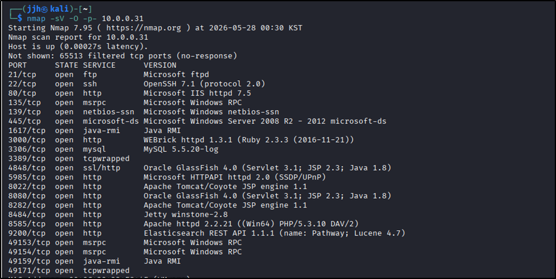
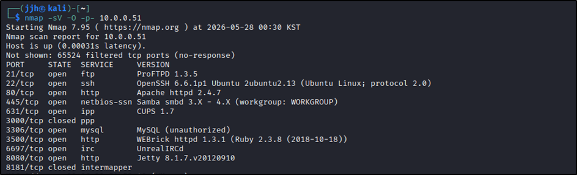
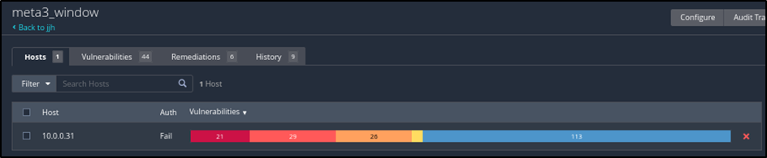
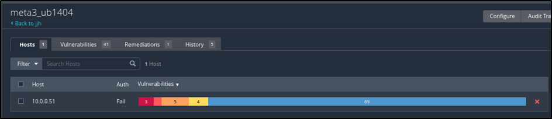
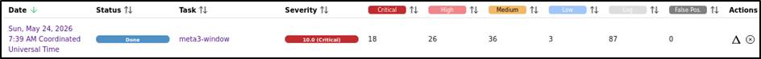
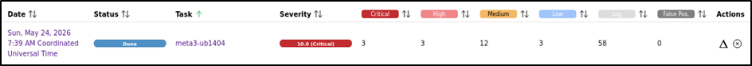
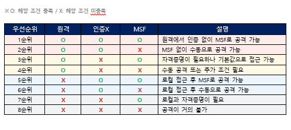

---
## 개요

**PTES(Penetration Testing Execution Standard) 방법론**을 기반으로, 취약하게 구성된 Metasploitable3 (Windows / Linux) 2대를 대상으로 정보 수집부터 취약점 진단, 익스플로잇, 권한 상승, 플래그 수집까지 전 과정을 수행한 모의침투 프로젝트.

단순히 여러 공격 기법을 시도해보는 데 그치지 않고, **공격자 관점에서 실제로 취약점이 시스템에 미치는 영향을 검증**하고, 검증된 취약점에 대한 현실적인 보안 대응 방안을 도출하는 것을 목표로 진행했다.

**핵심 키워드**: PTES 방법론 · Nmap · Nessus/OpenVAS · Metasploit Framework · 권한 상승 · Post-Exploitation

---

## 1. 진단 개요

| 항목 | 내용 |
|---|---|
| 진단 대상 | Metasploitable3 Windows (10.0.0.31) / Ubuntu 14.04 (10.0.0.51) |
| 공격자 환경 | Kali Linux (10.0.0.41) |
| 도구 | Nmap, Nessus, OpenVAS, Metasploit Framework |
| 방법론 | PTES 7단계 (대상 선정 → 정보 수집 → 위협 모델링 → 취약점 분석 → 공격 → 후속 공격 → 결과 보고) |

---

## 2. 정보 수집 — Nmap 스캔 결과

**Windows (10.0.0.31)** — 열린 포트 다수 중 특히 위험도가 높았던 항목:

| 포트 | 서비스 | 비고 |
|---|---|---|
| 21/tcp | Microsoft ftpd | 기본 자격증명(vagrant:vagrant) 취약 |
| 445/tcp | Microsoft-DS (SMBv1) | MS17-010 (EternalBlue) 취약 |
| 1617/tcp | Java RMI | JMX 비인증 공격 취약 |
| 3389/tcp | Microsoft RDP | BlueKeep 취약 |
| 8022/tcp | ManageEngine (Tomcat) | RCE 취약 |
| 9200/tcp | Elasticsearch 1.1.1 | 구버전 RCE 취약 |

**Linux (10.0.0.51)** — 주요 항목:

| 포트 | 서비스 | 비고 |
|---|---|---|
| 21/tcp | ProFTPD 1.3.5 | mod_copy RCE 취약 |
| 80/tcp | Apache 2.4.7 | Drupal 7 Coder RCE 취약 |
| 6697/tcp | UnrealIRCd | 백도어 존재 (CVE-2010-2075) |
| 8080/tcp | Jetty (Apache Continuum) | CI 서버 RCE 취약 |

---

## 3. 자동화 취약점 스캔 (Nessus / OpenVAS)

Nmap으로 확인한 서비스를 기반으로 Nessus와 OpenVAS 두 스캐너로 교차 진단을 수행했다.

| 위험 등급 | Nessus(Win) | Nessus(Linux) | OpenVAS(Win) | OpenVAS(Linux) |
|---|---|---|---|---|
| Critical | 21 | 3 | 18 | 3 |
| High | 29 | 5 | 26 | 3 |
| Medium | 26 | 4 | 36 | 12 |
| Low | 113 | 69 | 3 | 3 |
| **Total** | **189** | **81** | **83** | **21** |

> Windows에서 272건, Linux에서 102건의 취약점이 발견됐다. 자동화 도구만으로는 잡히지 않는 Jenkins Script Console, UnrealIRCd 백도어, PwnKit 같은 취약점은 Nmap 결과와 수동 분석을 통해 추가로 찾아냈다.

**공격 우선순위 선정 기준**: 원격 접근 가능 여부 → 인증 필요 여부 → Metasploit 모듈 존재 여부, 3가지 기준을 조합해 8단계로 우선순위를 나누고, 동일 조건이면 CVSS 점수 순으로 정렬했다.

---

## 4. 취약점 익스플로잇

### Windows — 주요 침투 경로 (일부)

| 취약점 | 결과 |
|---|---|
| ManageEngine DC FileUploadServlet RCE (CVE-2015-8249) | 원격 코드 실행 성공 |
| BlueKeep RDP RCE (CVE-2019-0708) | 원격 코드 실행 성공 |
| EternalBlue SMB RCE (MS17-010) | SYSTEM 권한 획득 |
| JMX 비인증 RCE | 원격 코드 실행 성공 |
| TrackPopupMenu 권한 상승 | 일반 권한 → SYSTEM 상승 |

그 외 Jenkins Script Console, Rails RCE, Elasticsearch RCE, Tomcat PUT JSP, PHP CGI RCE, Axis2/SSH/FTP/GlassFish/MySQL 기본 자격증명 등 총 15개 경로로 침투를 검증했다.

> 🖼️ *사진 자리 — 보고서 24p~38p 중 대표 익스플로잇 성공 화면 (예: EternalBlue meterpreter 세션 획득 화면)*

### Linux — 주요 침투 경로 (일부)

| 취약점 | 결과 |
|---|---|
| ProFTPD mod_copy (CVE-2015-3306) | 인증 없이 웹쉘 업로드 성공 |
| Drupal Coder RCE | 원격 코드 실행 성공 |
| UnrealIRCd 백도어 (CVE-2010-2075) | 원격 명령 실행 성공 |
| PwnKit (CVE-2021-4034) | 일반 권한 → root 권한 상승 |

그 외 Drupal SQLi, HTTP PUT/DELETE, SSH/FTP 기본 자격증명, Apache Continuum RCE 등 총 10개 경로로 침투를 검증했다.

> 🖼️ *사진 자리 — 보고서 42p~52p 중 대표 익스플로잇 성공 화면 (예: PwnKit 권한 상승 후 id 실행 결과)*

**최종 결과**: Windows는 Administrator, Linux는 root 권한 획득에 성공.

---

## 5. Post-Exploitation — 플래그 수집

권한 상승 후 내부 시스템을 탐색해 숨겨진 플래그(총 25개, 카드 모티브로 명명)를 수집했다. 단순 파일 탐색이 아니라 다양한 은닉 기법이 적용돼 있어 분석 난이도가 높았다:

- **스테가노그래피**: PNG metadata, 이미지 내 Hex 인코딩 값에 플래그 은닉
- **QR 코드 분할 은닉**: 100여 개의 QR 코드 조각을 하나의 Hex 값으로 조합
- **오디오 은닉**: VoIP 음성 스트림 / Wireshark 캡처 음성에 URL 은닉
- **압축/인코딩 이중 은닉**: WAV 파일 내 Zlib 압축 데이터, Base64 + 파일 결합
- **네트워크 기법**: Port Knocking으로 포트 자체를 은닉
- **DB 은닉**: BLOB 컬럼에 ZIP 파일 통째로 저장

> 🖼️ *사진 자리 — 보고서 53p~82p 중 가장 인상 깊었던 플래그 수집 과정 1~2개 (예: QR 코드 조합/디코딩 화면, Red Joker 이미지 복원 화면)*

Hard mode 플래그(Red Joker, 2 of Spades, 5 of Diamonds, 8 of Hearts)는 GitHub에서 Metasploitable3 소스를 직접 클론해 Chef Cookbook 내 플래그 파일 경로를 확인하고, VirtualBox/Vagrant 환경을 직접 구성해서 찾아냈다.

---

## 6. 보안 권고사항 (요약)

| 취약점 | 권고 내용 |
|---|---|
| SMB EternalBlue | MS17-010 패치 적용, SMBv1 비활성화 |
| RDP BlueKeep | 최신 패치 적용, RDP 외부 노출 차단 |
| ProFTPD mod_copy | 1.3.5a 이상 업그레이드 또는 mod_copy 비활성화 |
| Drupal Coder RCE | 불필요한 개발용 모듈 즉시 삭제 |
| UnrealIRCd 백도어 | 정상 버전으로 즉시 교체 |
| 기본 자격증명 전반 | 비밀번호 변경, SSH 키 기반 인증 전환 |
| PwnKit | PolicyKit 0.105-33 이상 업그레이드, pkexec SUID 비트 제거 |

---

## 정리 및 회고

- Windows 272건, Linux 102건의 취약점을 진단했고, 최고 권한(Administrator/root) 탈취까지 실제로 검증했다. **"관리자 권한을 뺏는 것만 위험하다"는 편견이 깨진 계기**였다 — TrackPopupMenu, PwnKit 같은 권한 상승 취약점 하나로도 충분히 치명적이었다.
- 자동화 스캐너(Nessus/OpenVAS)만으로는 Jenkins Script Console, UnrealIRCd 백도어, PwnKit 같은 취약점을 온전히 잡아내지 못했다. **자동화 도구 + 수동 분석을 병행해야 한다**는 걸 체감했다.
- 아쉬운 점은 두 가지다. meterpreter 세션 획득 이후 **상대 시스템에 남은 로그를 분석하지 못한 점**, 그리고 정리한 보안 권고사항을 **실제로 적용해서 재검증(트러블슈팅)까지는 하지 못한 점**. 다음 프로젝트에서 보완하고 싶은 부분이다.
