---
## 개요

앞선 Azure 인프라 프로젝트의 후속으로, 온프레미스 영역을 실제 기업 내부망 구조로 구체화하고 클라우드-온프레미스 간 보안 체계를 강화한 프로젝트. **L2·L3 스위치 기반 VLAN 분리, DB 접근 통제, 중앙 로그 수집, DB 백업/이중화**까지 직접 구성했다.

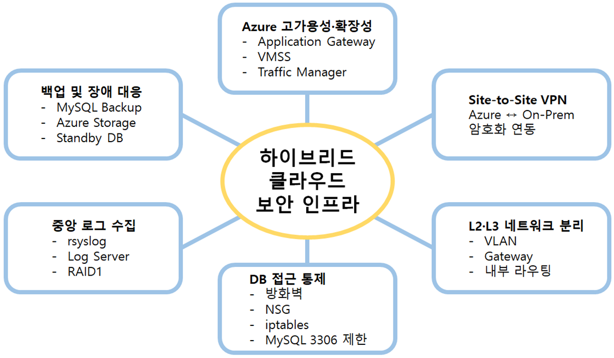

**핵심 키워드**: L2/L3 스위치 VLAN 분리 · iptables 접근 제어 · rsyslog 중앙 로그 수집 · RAID1 · Azure Database for MySQL(Standby) · ELK(Filebeat/Logstash/Kibana)

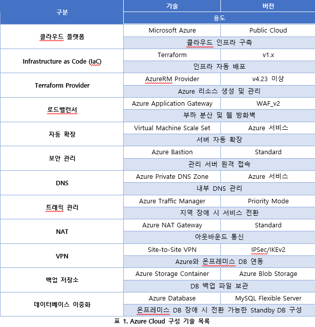

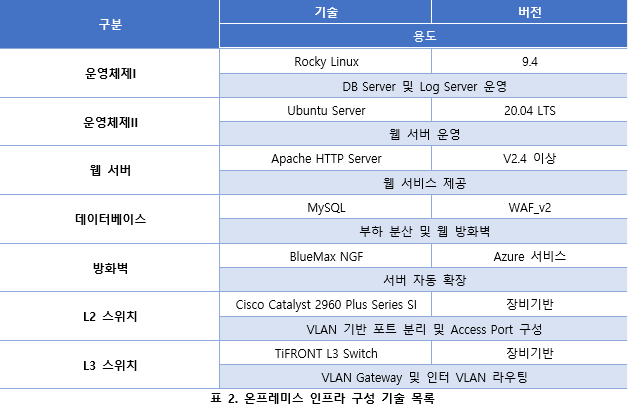

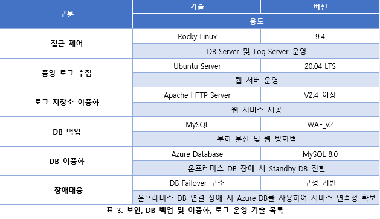

---

## 아키텍처 설계 (1단계 → 2단계)

- **1단계**: 기본 네트워크 구성으로 전체 틀 확인 → 개선 필요사항 도출
- **2단계(최종)**: Azure 이중 리전 + 온프레미스 VLAN 구조를 결합한 하이브리드 아키텍처로 확정

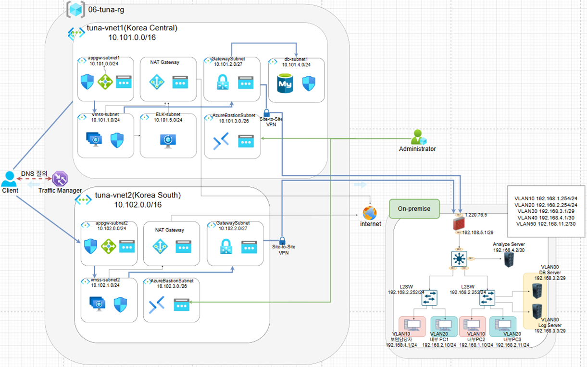

---

## Terraform 인프라 구현

- Bootstrap 환경 구성 → Backend 초기화 → Resource Group → 이중 리전 네트워크 순으로 코드화
- Public IP/NAT Gateway, 보안 접속(NSG/Bastion), Site-to-Site VPN, DNS, Application Gateway, VMSS까지 자동화
- Traffic Manager + Key Vault/Managed Identity 구성
- **Azure Database for MySQL Flexible Server**를 Standby DB로 구성
- 백업 및 장애 대응 자동화 연동까지 Terraform으로 관리

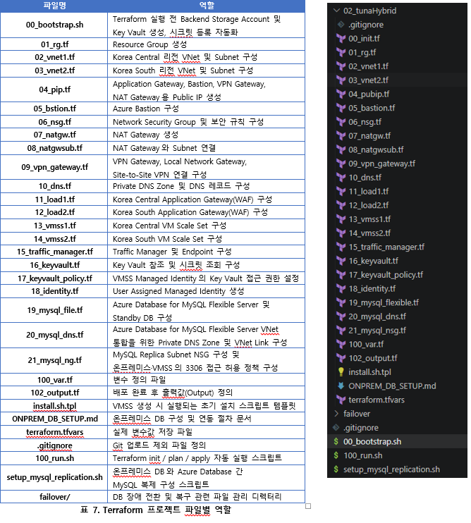

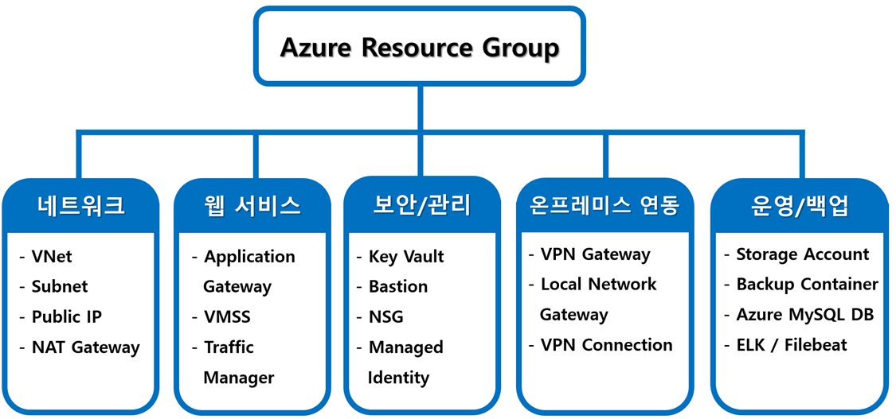

---

## 온프레미스 네트워크: VLAN 분리

- L2 스위치 2대 + L3 스위치 + Bluemax 방화벽으로 내부망 구성
- VLAN10/20/30/40/50으로 역할별 분리, 각 스위치에 Hostname·배너·NTP·Syslog·VLAN·ACL 설정 적용
- 서버망(VLAN30)에 DB Server, Log Server 배치

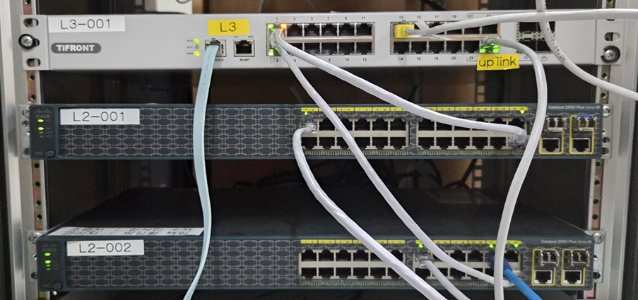

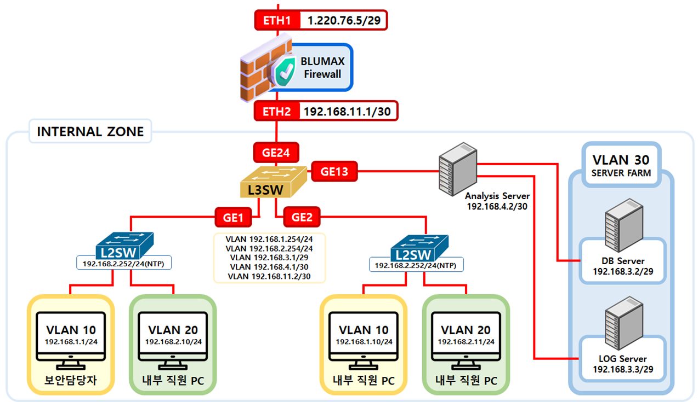

---

## DB Server & 접근 제어

- MySQL 서비스 정상 실행, 3306 포트 Listen 상태 확인
- iptables 기본 정책 DROP, 관리 PC SSH·Azure VMSS 대역 MySQL만 허용
- 허용 외 접근은 `IPTABLES_DROP` 로그로 기록 후 차단

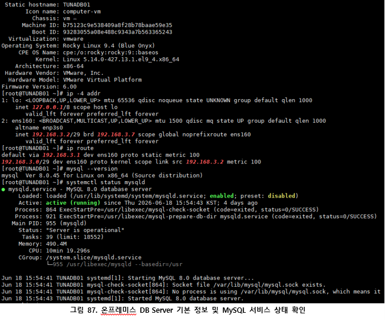

---

## 로그 수집 (RAID1 + rsyslog)

- Log Server에 5GB 디스크 2개 추가 → **RAID1**(`/dev/md0`, sdb1+sdc1) 구성
- `/var/log/remote`에 ext4로 마운트, 단일 디스크 장애에도 로그 보존
- rsyslog로 TCP/UDP 514 포트 수신 설정, 송신 장비 IP·날짜별로 로그 분류 저장

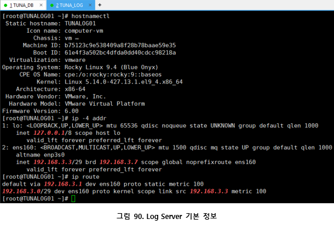

---

## DB 백업 & Standby DB

- 백업 스크립트 → Key Vault에서 DB 접속 정보 조회 → MySQL 백업 → Azure Storage(`dbbackup` 컨테이너) 업로드
- cron으로 자동 백업 등록
- **Azure Database for MySQL Flexible Server를 Standby DB로 구성** — 온프레미스 DB 데이터가 Standby 환경에 반영되는 것 확인, 장애 시 대체 DB로 전환 가능한 기반 마련

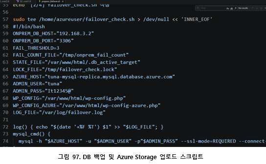

---

## Site-to-Site VPN & ELK 로그 수집

- Azure VPN Gateway ↔ BlueMax 방화벽 IPSec VPN 연동
- **ELK**: Filebeat → Logstash → Elasticsearch → Kibana 흐름으로 Apache 웹 로그 수집·시각화

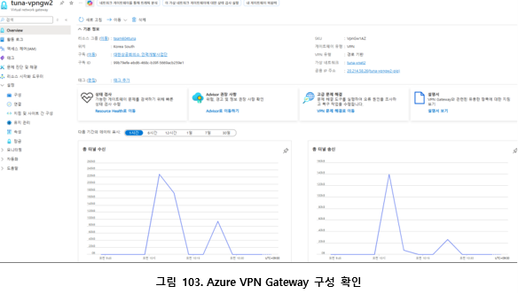

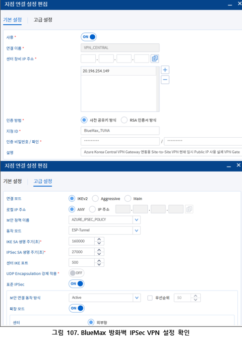

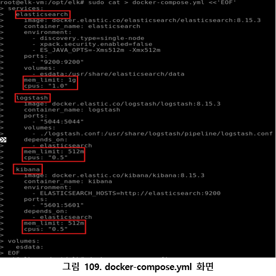

---

## 테스트 및 검증

- **웹 서비스 접속**: Traffic Manager FQDN으로 TUNA Vacation System 화면 정상 출력, Application Gateway Health Check·Backend Health 정상

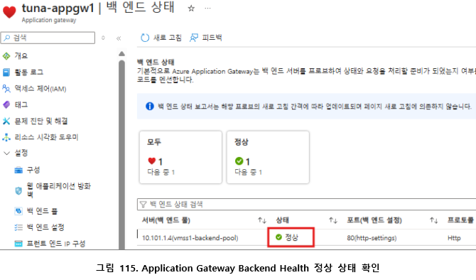

- **Traffic Manager 장애 조치**: Korea Central Priority 1 / Korea South Priority 2, Health Monitoring 정상, 장애 조치 전/후 접속 화면으로 전환 확인

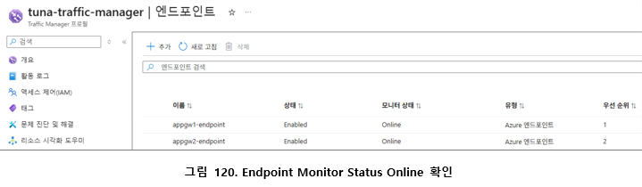

- **VPN 연결**: Azure `Connected` + BlueMax 터널 `UP`, Azure VNet ↔ 온프레미스 VLAN30 통신 경로 확인

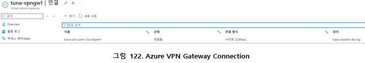

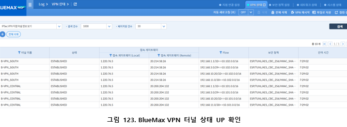

- **VMSS-DB 통신**: `nslookup db.tuna.internal` → 192.168.3.2 정상 해석, `nc -vz db.tuna.internal 3306` 연결 성공, DB Server의 `tcpdump`로 실제 유입 트래픽 확인 (ICMP는 정책상 응답 없음 — 정상)

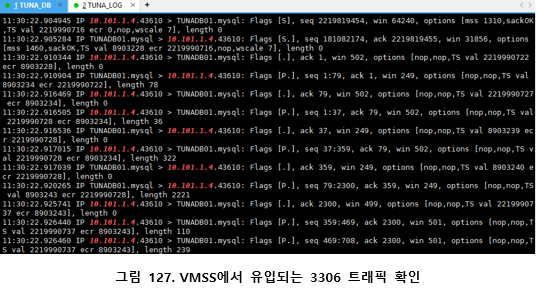

- **DB 접근 제어**: 허용 대역만 MySQL 접근 성공, `iptables -L -n -v` 및 BlueMax Hit Count 증가로 정책 동작 확인

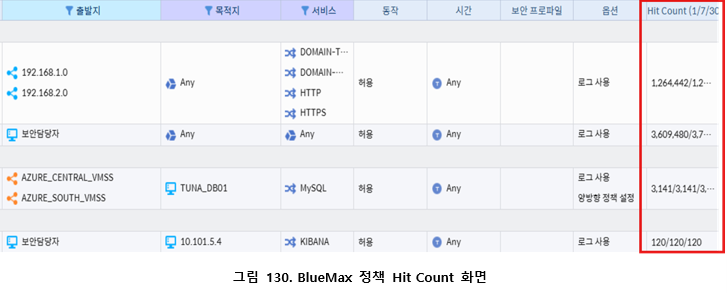

- **중앙 로그 수집**: `/var/log/remote/192.168.3.2/` 경로에 장비별·날짜별 로그 파일 저장 확인

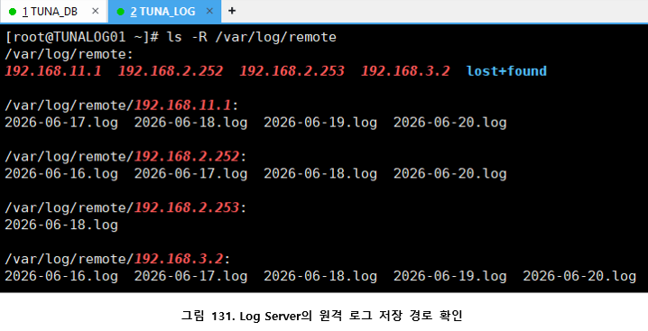

- **DB 백업/Standby**: Azure Storage 업로드 확인, Azure MySQL Standby DB 복제 상태 확인

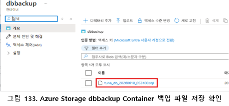

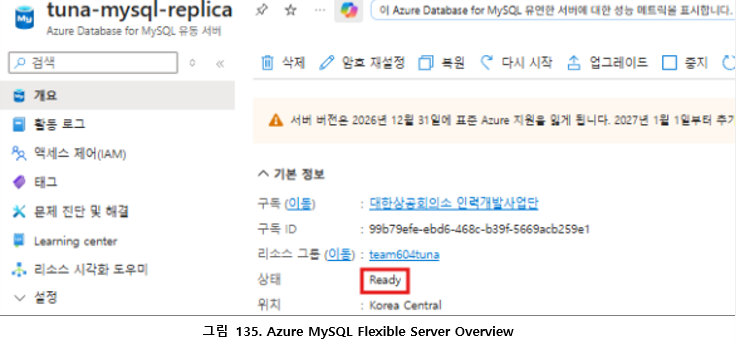

- **ELK**: Kibana에서 `web-logs-*` Data View 생성, `web-logs-2026.06.17` 인덱스 정상 인식

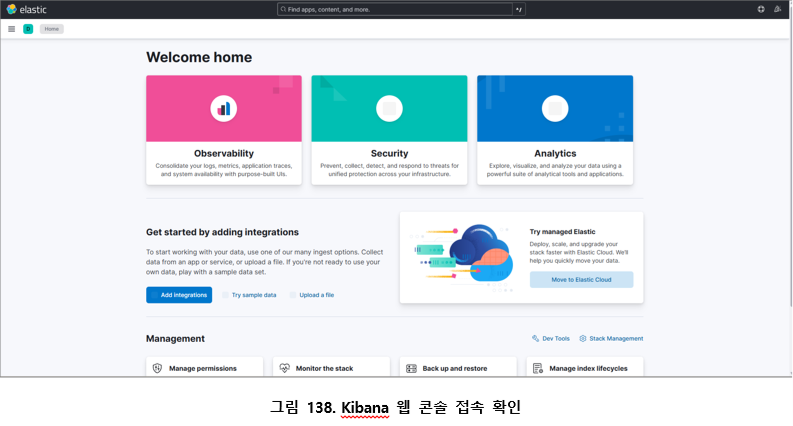

---

## 정리 및 회고

- 방화벽 하나로 "보안이 됐다"고 넘어가지 않고, **네트워크 분리 → 접근 제어 → 로그 수집 → DB 백업/이중화**까지 계층별로 직접 쌓아 올렸다.
- `nslookup`, `nc -vz`, `tcpdump`처럼 명령어 레벨로 직접 재현해서 검증하는 습관을 들였다. "설정했다"가 아니라 "패킷이 실제로 오가는 걸 확인했다"는 근거를 남기고 싶었다.
- 이전 프로젝트(Azure 인프라)에서 부족했던 "온프레미스 디테일"과 "DB 장애 대응"을 이번에 실제로 보완했다.