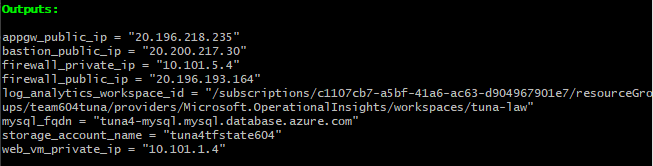
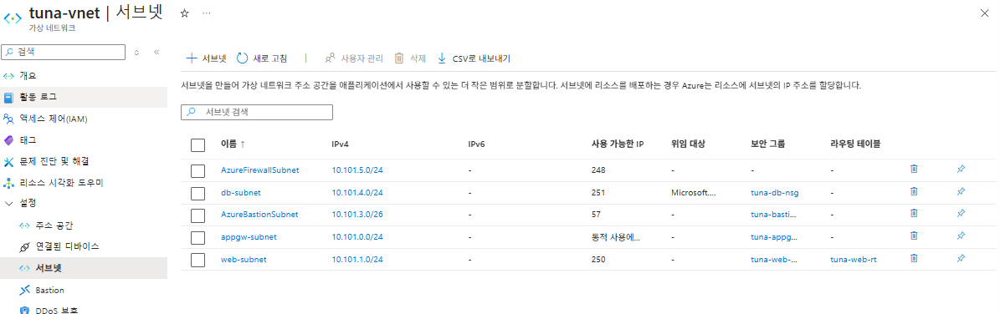
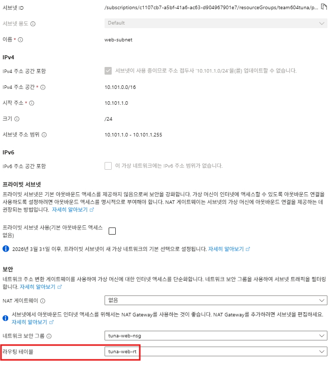
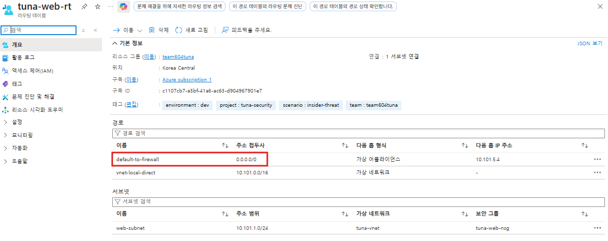
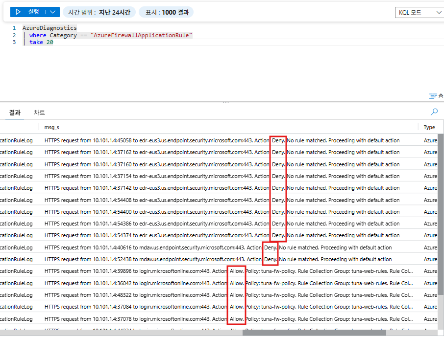
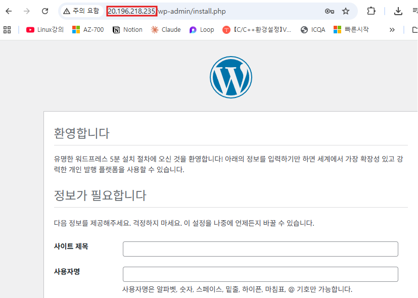
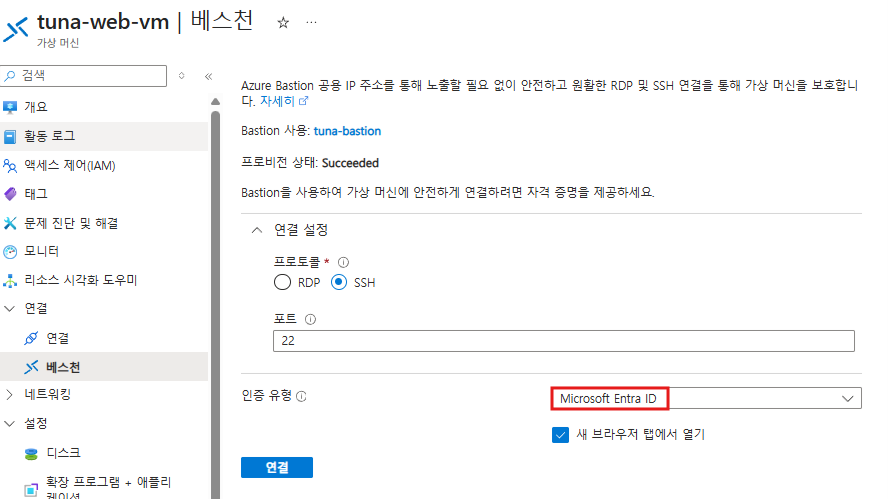
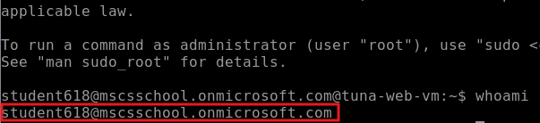

---
# Azure 클라우드 데이터 및 App 보안 프로젝트 — 상세 기록

## 1. 프로젝트 목표

기존 인프라(WordPress + Azure MySQL Flexible Server, Application Gateway/WAF, Azure Firewall, Bastion 구조)에 **"내부자 위협(Insider Threat)" 시나리오**를 적용해, 아래 질문에 실제로 답할 수 있는 인프라를 만드는 것이 목표였다.

- DB 패스워드를 아예 없앨 수 있는가? (Entra ID 전용 인증)
- 팀원이 늘어나거나 퇴사할 때, 권한을 자동으로 주고 회수할 수 있는가?
- VM이 SSH로 뚫려도, 그 사람이 DB 전체 권한까지 가져갈 수 없게 만들 수 있는가?
- 이 모든 걸 Terraform 코드 하나로 재현 가능하게 만들 수 있는가?

---

## 2. 최초 코드 리뷰에서 발견한 문제

업로드된 초기 코드(`4차project_code.zip`)를 검토하며 아래 문제를 확인했다.

|문제|내용|
|---|---|
|MySQL AAD 일반 사용자 등록 코드 부재|`tuna-web-vm`을 DB 사용자로 등록하는 `CREATE AADUSER`가 코드 어디에도 없음|
|민감정보 노출|`.gitignore` 대상(`terraform.tfvars`, `team_members.env`)인데 zip에는 그대로 포함되어 있었음|
|약한 기본 비밀번호|`00_bootstrap.sh`에 `DB_PASSWORD="${DB_PASSWORD:-It12345@}"` 하드코딩|
|NSG-UDR 정책 중복|Web NSG가 Internet 80/443 직접 허용 + Deny 규칙 동시 존재 (UDR로 실질 우회는 안 되지만 일관성 부족)|
|Before/After 데모 취약점|`upload.php`(웹쉘), `search.php`(SQLi), `ssrf.php` — 의도된 교육용 코드, After 조치는 주석 처리 상태|

---

## 3. MySQL Entra ID 인증 — 실제 겪은 문제와 해결 순서

### 3-1. az-cli 구버전 문제

VM에 설치된 `azure-cli`가 **2.0.81(2018년 버전)** 이라 `az mysql flexible-server` 명령어 자체가 없었음.

- **원인**: `install.sh.tpl`의 `curl -sL https://aka.ms/InstallAzureCLIDeb | bash` 스크립트가 Microsoft 저장소를 등록하려 했는데, Azure Firewall이 `packages.microsoft.com`을 차단해 실패 → 이어지는 `apt install azure-cli`가 Ubuntu 기본 저장소의 방치된 구버전을 대신 설치
- **해결**: Firewall `allow-web-outbound` 규칙에 `packages.microsoft.com`, `aka.ms`, `azurecliprod.blob.core.windows.net` 추가. 이후 `curl | bash` 방식 자체를 지양하고, GPG 키 등록 + apt 저장소 등록을 명시적으로 하는 방식으로 `install.sh.tpl` 재작성

### 3-2. AAD Admin 계정 불일치

`az mysql flexible-server ad-admin list`로 확인해보니 등록된 admin이 의도한 계정(student618)이 아니라 **student612**였음. Portal에서 재등록.

### 3-3. 게스트 계정의 테넌트 불일치 (`ERROR 9123`)

게스트 계정(student618)이 홈 테넌트(mscsschool) 기준으로 `az login`하면 그 테넌트의 토큰이 발급되는데, MySQL 서버는 리소스 테넌트(sim981naver) 기준 토큰을 요구 → 불일치로 거부.

- **해결**: `az login --tenant <ID>`, `az account get-access-token --tenant <ID>`로 대상 테넌트를 명시

### 3-4. MySQL 사용자명 32자 제한 (`ERROR 1470`)

`mysql.user` 테이블 자체의 컬럼 길이 제한(32자, AAD 기능과 무관한 MySQL 고유 제약). 게스트 UPN(`student612_mscsschool.onmicrosoft.com#EXT#@sim981naver.onmicrosoft.com`, 70자)은 그대로 등록 불가.

- 최초엔 `CREATE AADUSER ... AS ...` 문법으로 우회 가능하다고 잘못 안내했다가, 실제로 그런 문법이 존재하지 않는다는 걸 확인 후 정정
- **최종 해결**: 로그인명은 32자 이내의 짧은 alias(`student612`, `former-employee` 등)로 등록하고, 신원 검증은 `IDENTIFIED BY '<Object ID>'`로 처리 (alias는 임의 이름, 실제 매칭은 Object ID)

### 3-5. Directory Role 위임 (PIM)

student618이 `tuna-mysql-identity`(MySQL 서버의 UserAssigned Identity)에 Directory Reader를 스스로 부여할 수 있도록, sim이 `Privileged Role Administrator`를 위임.

- PIM 화면 진입 시 "P2 라이선스 필요" 안내가 떴으나, "Active" 방식 즉시 할당은 P2 없이도 가능했음
- 역할 할당 직후 Portal에서 "할당 추가" 버튼이 잠긴 것처럼 보였는데, **로그아웃 후 재로그인**하니 세션 토큰이 갱신되며 해결됨 (권한 변경이 즉시 토큰에 반영되지 않는 문제)

---

## 4. Terraform 코드 자동화 — 파일별 상세 변경

### `01_var.tf`

- `extra_db_users` 변수 신설: 팀원을 `{login, object_id, subscription_role(선택)}` 맵으로 관리
- **버그 발견 및 수정**: 이 변수에 `sensitive = true`를 붙였더니, `for_each`의 값으로 sensitive 변수를 쓸 수 없다는 Terraform 제약(`Invalid for_each argument`)에 걸려 apply 자체가 실패함 → `sensitive` 속성 제거
- `lock_shared_ssh_key`(bool, 기본 false): 공유 SSH 키 잠금 여부를 제어하는 스위치
- `subid` 변수: 초기엔 `100_run.sh`가 환경변수(`TF_VAR_subid`)로 주입했으나, 스크립트를 거치지 않고 `terraform apply`를 단독 실행하면 값이 비어 파싱 에러가 반복됨 → `terraform.tfvars`에 고정값으로 직접 명시하는 방식으로 변경해 환경변수 의존성 제거

### `07_bastion.tf`

- `sku = "Standard"` 추가: Basic SKU에서는 Bastion 연결 화면에 "Microsoft Entra ID" 인증 옵션 자체가 나타나지 않음
- `tunneling_enabled = true`, `ip_connect_enabled = true`: 로컬 PC에서 Bastion을 거쳐 임의 사설 IP(MySQL 등)로 터널링하기 위해 추가 (이후 다른 방식으로 대체했지만 유지)

### `09_web_vm.tf`

- `azurerm_virtual_machine_extension.aad_login`(`AADSSHLoginForLinux`) 추가 — 개인별 Entra ID 신원으로 SSH 로그인
- RBAC 역할 할당 7개 추가:
    - 관리자(student618): VM `Reader` + `Virtual Machine Administrator Login`(sudo 가능), Bastion `Reader`
    - 팀원(`extra_db_users` 각각): VM `Reader` + `Virtual Machine User Login`(sudo 불가), Bastion `Reader`
    - 선택적 구독 스코프 역할(`subscription_role`): 과거 재직자의 실제 접근 패턴(예: 구독 Reader) 재현용
- **검증된 함정**: 계정에 구독/리소스그룹 스코프 `Owner`나 `Contributor`가 남아있으면, `Virtual Machine User Login`만 부여해도 `loginAsAdmin` 액션이 이미 포함되어 있어 sudo가 그대로 뚫림 — 최소 권한 테스트를 하려면 상위 스코프의 광범위한 권한부터 제거해야 함을 실제로 확인

### `11_mysql.tf`

- `GRANT ALL PRIVILEGES` → `SELECT, INSERT, UPDATE, DELETE, CREATE, ALTER, INDEX, DROP, CREATE TEMPORARY TABLES, LOCK TABLES`로 최소 권한화
- `CREATE AADUSER` 자동화 로직을 세 번에 걸쳐 재설계:
    1. **1차**: 로컬 PC에서 `mysql` 클라이언트로 직접 접속 (VNet 밖이라 사설 DB 접근 불가 — 구조적으로 실패)
    2. **2차**: Bastion IP 터널링(`az network bastion tunnel --target-ip-address`)으로 로컬 PC에서 임시 포트를 열어 우회 (MySQL 사설 IP는 Private DNS Zone A레코드를 ARM API로 조회해 확보) — 로컬에 `mysql` 클라이언트가 없어서 실행 불가
    3. **3차(최종)**: `az vm run-command invoke`로 **VM 안의 mysql 클라이언트를 원격 실행** — Bastion/SSH 인증 자체가 필요 없고, VM Agent를 통해 root 권한으로 직접 실행되므로 가장 안정적. 이 로직은 결국 Terraform `null_resource`에서 분리해 별도 셸 스크립트(`20_register_db_users.sh`)로 이전
- `audit_log_events` 값 버그: `"CONNECTION,QUERY_DDL,QUERY_DML"`로 잘못 지정했다가 `InvalidConfigurationValue` 에러로 발견 → 실제 허용값(`DDL,DML_SELECT,DML_NONSELECT,DCL,ADMIN,DML,GENERAL,CONNECTION,CONNECTION_V2,TABLE_ACCESS`) 확인 후 `"CONNECTION,DDL,DML"`로 수정

### `14_firewall.tf`

- `graph.microsoft.com` 추가 — `AADSSHLoginForLinux` 확장이 PAM 계정 조회 시 Microsoft Graph API를 호출하는데, 이게 막혀 있어 확장 설치가 `SSL_ERROR_SYSCALL`로 실패했던 걸 확인 후 추가
- `packages.microsoft.com` 등 az-cli 설치용 도메인은 이전 단계에서 이미 추가됨

### `15_log.tf`

- `audit_log_events` 오타 수정 (위 3-mysql 항목 참고)
- 진단 설정(`fw_diag`, `mysql_diag`, `waf_diag`) 3개가 반복적으로 "already exists" 에러를 냈던 문제: 원인은 `100_run.sh`의 `try_import` 함수가 `&>/dev/null`로 에러를 전부 숨겨서, 실패 원인을 알 수 없었던 것. 로그를 보이게 고친 뒤 확인해보니 실제로는 이미 state에 정상 반영되어 있었고, 반복 에러의 진짜 원인은 **`var.subid`가 비어있어 다른 리소스(`subscription_activity_diag`)가 에러를 내며 apply 전체가 중단**되던 것이었음

### `install.sh.tpl`

- MySQL 토큰 발급 로직: "cron이 50분마다 캐시 파일 갱신" 방식에 "캐시 파일이 없거나 비어있으면 IMDS 직접 호출" 폴백을 추가한 하이브리드 방식으로 변경
- IMDS(`169.254.169.254`) 접근을 `www-data`/`root` 프로세스로만 제한하는 iptables 규칙 추가 — 일반 SSH 로그인 계정이 VM의 Managed Identity 토큰을 도용해 DB에 직접 접속하는 경로 차단
- 공유 SSH 키(`azureuser`) 조건부 잠금 로직 추가: AAD SSH 로그인 확장이 실제로 설치 완료됐는지 최대 5분간 폴링 확인한 뒤에만 잠금 실행 — 확장 설치와 `custom_data`(cloud-init) 실행에는 순서 보장이 없어서, 무작정 잠그면 확장 설치가 안 끝난 상태에서 계정이 잠겨 VM에 아예 접근 못 하게 되는 락아웃 위험이 있었음을 사전에 발견하고 방지
- az-cli 설치를 `curl | bash` 방식에서 GPG 키 + apt 저장소 명시적 등록 방식으로 교체
- 부팅 초기 apt 잠금 충돌(unattended-upgrades 등과의 경합 추정) 대응: `apache2`, `azure-cli`, `iptables-persistent` 설치에 각각 최대 10회 재시도 로직(`apt_install_retry` 함수) 추가

### `100_run.sh`

- `try_import` 함수의 에러 은폐 문제 수정 → 이후 근본 원인(subid) 해결 후 아예 제거
- 3단계로 `20_register_db_users.sh` 자동 실행 추가

### `20_register_db_users.sh` (신규 파일)

- `az vm run-command invoke`로 VM 안의 mysql 클라이언트를 원격 실행해 `tuna-web-vm`, 팀원, 테스트 계정을 순차적으로 `CREATE AADUSER` 등록하는 자동화 스크립트
- 초기엔 `az ssh vm --command`를 시도했으나 해당 옵션이 실제로는 존재하지 않아(`unrecognized arguments`) `az vm run-command invoke`로 교체

---

## 5. 보안 검증 — "퇴사자(Former Employee)" 시나리오

실제 Entra ID 사용자를 하나 생성(`formerEmployee@sim981naver.onmicrosoft.com`)해 아래 권한만 부여하고 검증했다.

- 구독 스코프: `Reader`만 (loginAsAdmin 액션 없음)
- VM 스코프: `Reader` + `Virtual Machine User Login`
- Bastion 스코프: `Reader`
- MySQL: 최소 권한 계정 (`GRANT OPTION` 없음)

**검증 결과**

|항목|결과|
|---|---|
|Bastion → VM Entra ID SSH 로그인|성공 (개인 신원으로 접속)|
|`sudo su` 시도|관리자 재인증(디바이스 코드) 요구 화면으로 막힘 — 즉시 권한 상승 불가 확인|
|IMDS로 VM 신원(tuna-web-vm) 토큰 도용 시도|iptables 규칙에 의해 차단 확인|
|본인 명의 MySQL 계정 접속|정상 접속, 부여된 권한 범위 내 작업 가능|

---

## 6. 전체 자동화 완성 흐름

```
bash 100_run.sh
  → [1단계] Bootstrap (Key Vault/Storage 등 사전 리소스)
  → [2단계] terraform apply
      - 네트워크/방화벽/Bastion/VM/MySQL/RBAC 전체 생성
  → [3단계] 20_register_db_users.sh 자동 실행
      - az vm run-command invoke로 VM 원격 접속
      - tuna-web-vm / 팀원 / 테스트 계정 MySQL 등록
→ WordPress 정상 구동, DB 연결 확인
```

---

## 7. 최종적으로 남겨둔 과제 (완료하지 않은 것)

- VM 자체의 로그(syslog, auth.log, iptables 로그)가 아직 Log Analytics로 수집되지 않음 — 지금은 시나리오 재현 후 VM에 직접 들어가 로그를 확인해야 함
- Bastion 세션 로그, Key Vault 접근 로그, NSG Flow Log 미수집
- CI/CD 파이프라인(GitHub Actions + OIDC + self-hosted runner) 설계까지는 논의했으나, 시간 제약상 실제 구현은 보류하고 향후 과제로 남김
- `install.sh.tpl`의 az-cli 재시도 로직은 실제 근본 원인(apt 잠금 충돌)을 로그로 직접 확진한 것이 아니라 정황상 가장 유력한 추정에 기반한 방어 코드

---
# Azure 클라우드 데이터 및 App 보안 프로젝트 — 설계 기록

## 개요

WordPress + Azure MySQL Flexible Server + Application Gateway(WAF) + Azure Firewall + Bastion으로 구성된 인프라에, **"내부자 위협(Insider Threat)" 시나리오**를 적용했다. 목표는 "DB 패스워드 없이도 안전하게 인증하고, VM이 뚫려도 DB 전체 권한까지는 넘어가지 않으며, 팀원의 입/퇴사에 따라 권한을 코드로 자동 조정할 수 있는 인프라"였다.

**핵심 키워드**: Azure Firewall FQDN 화이트리스트 · MySQL Entra ID 전용 인증 · Bastion + AAD SSH 로그인 · RBAC 최소 권한 · IMDS 접근 통제

---

## 아키텍처 설계

```
Internet → Application Gateway(WAF) → Web VM(WordPress)
                                          ↓ (아웃바운드 전부 UDR로 강제 경유)
                                     Azure Firewall (FQDN 화이트리스트)
                                          ↓
                              MySQL Flexible Server (사설망 전용, Entra ID 인증)

관리자/팀원 → Azure Bastion(Standard) → Web VM (Entra ID SSH 로그인)
```

- **Web VM은 인터넷에 직접 나갈 수 없게** UDR로 모든 아웃바운드를 Azure Firewall로 강제 경유시켰다. VM이 뚫려도 공격자가 임의 서버로 통신(C2, 데이터 유출)하는 걸 기본 차단하기 위함이다.
- **MySQL은 delegated subnet + Private DNS Zone**으로 사설망 안에만 존재하게 해서, 인터넷은 물론 VNet 밖에서는 이름 해석조차 안 되게 했다.
- **Bastion을 통해서만 VM에 접근** 가능하게 하고, VM 관리 포트(22)는 인터넷에 노출하지 않았다.

---

## Azure Firewall — FQDN 화이트리스트 설계

VM의 모든 아웃바운드 트래픽이 Firewall을 거치기 때문에, VM이 정상 동작하는 데 꼭 필요한 도메인만 골라서 허용하는 방식(Default Deny + 화이트리스트)으로 설계했다.

|규칙|허용 도메인|필요한 이유|
|---|---|---|
|`allow-ubuntu-apt`|`archive.ubuntu.com`, `*.ubuntu.com`|OS 패키지(Apache, PHP 등) 설치|
|`allow-wordpress`|`*.wordpress.org`|WordPress 코어/플러그인 다운로드|
|`allow-microsoft-packages`|`packages.microsoft.com`, `aka.ms`|az-cli 최신 버전 설치 (기본 Ubuntu 저장소는 구버전만 있음)|
|`allow-entra-id-auth`|`login.microsoftonline.com`, `graph.microsoft.com`, `management.azure.com`|Entra ID 토큰 발급, AAD SSH 로그인의 계정 조회(Graph API)|
|`allow-keyvault`|`*.vault.azure.net`|Key Vault 시크릿 조회|

FQDN을 하나씩 여는 방식으로 설계했기 때문에, 새로운 기능(az-cli, AAD SSH 로그인 등)을 추가할 때마다 "이 기능이 실제로 어느 도메인과 통신하는가"를 하나씩 검증하며 규칙을 채워나갔다.

---

## MySQL — Entra ID 전용 인증 설계

패스워드를 아예 존재하지 않게 만드는 것이 목표였다.

- `azurerm_mysql_flexible_server_active_directory_administrator`로 **관리자 1명**을 Entra ID 계정으로 지정
- `aad_auth_only = ON`으로 **패스워드 인증 자체를 서버 레벨에서 차단** — 관리자 계정의 패스워드가 있어도 로그인에 쓸 수 없는 상태
- MySQL 서버에는 **UserAssigned Managed Identity**를 별도로 붙여, 이 Identity가 Entra ID 사용자/그룹의 존재 여부를 조회(Directory Reader 권한)할 수 있게 구성 — 이게 있어야 `CREATE AADUSER`가 실제로 유효한 계정인지 검증 가능
- **로그인 규칙**: MySQL 사용자명 컬럼은 32자 제한이 있어, 모든 사용자(사람/VM)는 짧은 alias로 등록하고 `IDENTIFIED BY '<Entra Object ID>'`로 실제 신원을 매칭하는 규칙을 정했다
- **권한 부여 규칙**: `GRANT ALL` 대신 애플리케이션이 실제로 필요로 하는 권한(`SELECT/INSERT/UPDATE/DELETE/CREATE/ALTER/INDEX/DROP` 등)만 명시적으로 부여 — DB 사용자 계정이 탈취돼도 사용자/권한 관리(`GRANT OPTION`)까지는 못 하게 설계

---

## Bastion + RBAC — 접근 통제 설계

"누가 VM에 들어올 수 있는가"와 "들어와서 뭘 할 수 있는가"를 분리해서 설계했다.

- **Bastion을 Standard SKU**로 구성 — Basic SKU는 Entra ID 인증 옵션 자체를 지원하지 않기 때문
- VM에 **`AADSSHLoginForLinux` 확장**을 설치해, 공유 SSH 키 대신 각자의 Entra ID 계정으로 로그인하도록 전환
- Azure RBAC 역할을 목적에 따라 분리 적용:
    - `Virtual Machine Administrator Login` — sudo 가능, 관리자에게만
    - `Virtual Machine User Login` — sudo 불가, 일반 팀원에게
    - `Reader` — VM/Bastion 리소스를 조회해 Portal 연결 화면에 진입하기 위한 최소 권한
- `terraform.tfvars`의 `extra_db_users` 맵 하나로 팀원을 등록하면, 위 역할들과 MySQL 계정 등록까지 `for_each`로 한 번에 반영되도록 설계 — **팀원 추가/제거가 코드 한 줄**이 되도록 만든 것이 핵심
- 필요하면 팀원별로 **구독 스코프 역할**(`subscription_role`)까지 선택적으로 얹을 수 있게 확장해, 실제 조직에서 흔한 "퇴사자가 구독 Reader 정도는 갖고 있던" 상황까지 재현 가능하게 만들었다

---

## VM 내부 — 신원 도용 방지 설계

Bastion과 RBAC만으로는 "VM 안에 들어온 사람이 VM 자체의 신원(Managed Identity)을 빌려 쓰는 것"까지는 막을 수 없다는 점을 확인하고, 아래를 추가로 설계했다.

- **iptables로 IMDS(169.254.169.254) 접근을 `www-data`, `root`로만 제한** — WordPress 프로세스는 정상 동작하되, 일반 SSH 로그인 계정은 VM의 Managed Identity 토큰을 뽑아 DB에 직접 접속하는 경로 자체가 차단됨
- 공유 SSH 키(`azureuser`)는 최종적으로 잠그도록 설계하되, **AAD SSH 로그인 확장이 실제로 설치 완료된 걸 확인한 뒤에만 잠그는 안전장치**를 넣어, 확장 설치 전에 계정이 먼저 잠겨 VM에 아예 못 들어가는 상황을 방지
- MySQL 접속 토큰은 **cron으로 주기 갱신되는 캐시를 우선 사용하고, 캐시가 없을 때만 IMDS를 직접 호출**하는 하이브리드 방식으로 설계해 안정성과 IMDS 호출 최소화를 동시에 확보

---

## 배포 자동화 설계

`bash 100_run.sh` 한 번으로 전체가 재현되는 것을 목표로 설계했다.

1. **Bootstrap**: Key Vault, Terraform state용 Storage Account 등 사전 리소스 준비
2. **Terraform apply**: 네트워크·방화벽·Bastion·VM·MySQL·RBAC 전체 생성
3. **DB 계정 자동 등록**: `az vm run-command invoke`로 VM 안의 mysql 클라이언트를 원격 실행시켜, 로컬 PC에 별도 클라이언트 설치 없이도 팀원/VM 계정을 자동 등록

또한 리소스 이름을 재사용해 재배포하는 경우(진단 설정 등 일부 리소스가 이름 기반으로 남아있는 케이스) 등을 대비해, **apply를 먼저 시도하고 실패 시 자동으로 문제 리소스를 import한 뒤 재시도하는 자기복구 로직**을 넣어, 사람이 매번 개입하지 않아도 배포가 끝까지 완료되도록 만들었다.

---

## 검증 — "퇴사자(Former Employee)" 시나리오

설계한 최소 권한 구조가 실제로 동작하는지, 구독 Reader + VM User Login만 가진 테스트 계정으로 직접 검증했다.

|검증 항목|결과|
|---|---|
|Bastion → Entra ID SSH 로그인|성공|
|`sudo su` 시도|관리자 재인증 요구로 차단|
|VM 신원(IMDS) 토큰 도용 시도|iptables 규칙으로 차단|
|본인 명의 MySQL 계정 접속|정상 접속, 부여된 최소 권한 범위 내 동작|

---

## 트러블슈팅 (요약)

|문제|원인|해결|
|---|---|---|
|az-cli 구버전 설치|Firewall이 `packages.microsoft.com` 차단|FQDN 허용 추가|
|AAD Admin 계정 불일치|등록된 관리자가 의도한 계정과 다름|Portal에서 재등록|
|MySQL 접속 시 테넌트 에러|게스트 계정 홈 테넌트 vs 리소스 테넌트 불일치|`--tenant` 명시|
|사용자명 32자 초과 에러|MySQL `mysql.user` 테이블 컬럼 길이 제한|alias + Object ID 매칭|
|AAD SSH 로그인 확장 설치 실패|`graph.microsoft.com` 차단|FQDN 허용 추가|
|RBAC 최소 권한 무력화|상위 스코프에 Owner/Contributor 잔존|상위 권한 제거 후 재검증|
|진단 설정 재배포 시 충돌|이름 기반 리소스 ID 특성상 이전 흔적 잔존 추정|배포 스크립트에 자동 import 로직 내장|

---

## 다음 과제

- VM 로그(syslog/auth.log/iptables), Bastion 세션 로그, Key Vault 접근 로그, NSG Flow Log의 Log Analytics 수집 확대
- CI/CD(GitHub Actions + OIDC + self-hosted runner) — 설계 완료, 구현은 다음 단계

---

# # 리소스 생성 및 검증 체크리스트 + 캡처 가이드

배포 완료 후, 아래 순서대로 확인하면서 캡처하면 보고서에 바로 쓸 수 있는 근거 자료가 됩니다.

---

## 1. 배포 완료 확인

**확인 방법**

```bash
terraform output
```

**캡처할 것**

- `terraform apply` 마지막 화면 — `Apply complete! Resources: N added, 0 changed, 0 destroyed`
- `terraform output` 실행 결과 전체 (appgw_public_ip, bastion_public_ip, mysql_fqdn 등)




---

## 2. 네트워크 구성 확인

**확인 방법**: Azure Portal → 리소스 그룹(`team604tuna`) → 리소스 목록

**캡처할 것**

- 리소스 그룹 전체 리소스 목록 화면 (한눈에 몇 개가 만들어졌는지 보이는 화면)


- 가상 네트워크(`tuna-vnet`) → 서브넷 탭 — Web/DB/Bastion/Firewall 서브넷이 분리되어 있는 화면



- `web_subnet`의 라우팅 테이블(UDR) 화면 — `0.0.0.0/0 → Firewall 사설 IP`로 강제 경유 설정된 것





---

## 3. Azure Firewall — FQDN 화이트리스트 확인

**확인 방법**: Azure Portal → `tuna-fw-policy`(Firewall Policy) → 규칙 모음(Rule Collection Groups)

**캡처할 것**

- Application Rule Collection 목록 — `allow-ubuntu-apt`, `allow-wordpress`, `allow-microsoft-packages`, `allow-entra-id-auth` 등 규칙 이름과 허용 FQDN이 보이는 화면


- (선택) Firewall 로그 — Log Analytics에서 실제 차단/허용된 트래픽 쿼리 결과

```kql
AzureDiagnostics
| where Category == "AzureFirewallApplicationRule"
| take 20
```



---

## 4. Application Gateway (WAF) 확인

**확인 방법**: Azure Portal → `tuna4-appgw` → 개요/백엔드 상태/WAF

**캡처할 것**

- 개요 화면 — 공인 IP, 상태(Running)
- 백엔드 상태(Backend health) — Web VM이 "정상(Healthy)"으로 표시된 화면


- WAF 정책 화면 — 모드(Prevention), OWASP CRS 버전


- 브라우저로 `http://<appgw_public_ip>` 접속해 WordPress 화면이 뜨는 캡처



---

## 5. Bastion + Entra ID 로그인 확인

**확인 방법**: Azure Portal → `tuna-bastion` → 연결

**캡처할 것**

- Bastion 개요 화면 — SKU가 "Standard"로 표시된 부분
- 연결 화면에서 **인증 유형 드롭다운에 "Microsoft Entra ID"가 포함된 화면** (이게 핵심 캡처)



- 실제 Entra ID로 로그인 성공한 VM 터미널 화면 (`whoami` 결과 등)



---

## 6. RBAC 최소 권한 확인

**확인 방법**: Azure Portal → `tuna-web-vm` → 액세스 제어(IAM) → 역할 할당

**캡처할 것**

- VM의 IAM 화면 — 관리자 계정에는 `Virtual Machine Administrator Login`, 팀원 계정에는 `Virtual Machine User Login`이 각각 부여된 걸 보여주는 화면
- CLI로 교차 확인한 결과:

```bash
az role assignment list --scope $(az vm show -g team604tuna -n tuna-web-vm --query id -o tsv) -o table
```

---

## 7. MySQL — Entra ID 전용 인증 확인

**확인 방법**: Azure Portal → `tuna4-mysql` → 인증(Authentication)

**캡처할 것**

- 인증 방식 화면 — "Microsoft Entra 인증만"(암호 인증 비활성화)으로 설정된 화면
- Entra 관리자(Administrator) 지정 화면
- CLI로 등록된 사용자 확인:

```sql
SELECT USER, HOST FROM mysql.user;
```

- Bastion 경유 VM에서 `mysql -u <alias> --password="$TOKEN"`으로 실제 접속 성공한 터미널 화면

---

## 8. VM 내부 보안 (iptables / 토큰) 확인

**확인 방법**: Bastion으로 VM 접속 후 직접 명령 실행

**캡처할 것**

- `sudo iptables -L -n -v` 결과 — IMDS(169.254.169.254)에 대한 규칙이 `www-data`/`root`만 ACCEPT, 나머지 DROP인 화면
- `crontab -l` 결과 — 토큰 갱신 cron 등록된 화면

---

## 9. "퇴사자(Former Employee)" 시나리오 — 이 프로젝트의 핵심 증거

**확인 방법**: 퇴사자 테스트 계정으로 직접 로그인해서 캡처 (가장 중요한 섹션)

**캡처할 것 (4개, 순서대로)**

|#|시나리오|캡처 대상|
|---|---|---|
|1|Bastion → Entra ID 로그인|연결 성공 후 터미널 프롬프트 (`formeremployee@...@tuna-web-vm:~$`)|
|2|`sudo su` 시도|"디바이스 코드로 인증하라"는 화면 (권한 없어 즉시 상승 안 됨을 보여줌)|
|3|IMDS 토큰 도용 시도|`curl -m 5 -H Metadata:true "http://169.254.169.254/..."` 실행 후 응답 없이 실패하는 화면|
|4|본인 MySQL 계정 접속|정상 접속 성공 화면 (`mysql>` 프롬프트)|

이 4개 캡처가 "최소 권한만 가진 계정은 VM에 들어와도 DB를 가져갈 수 없다"는 결론을 직접 증명하는 자료입니다.

---

## 10. 로그/모니터링 확인

**확인 방법**: Azure Portal → `tuna-law`(Log Analytics Workspace) → 로그

**캡처할 것**

- 진단 설정(Diagnostic settings) 목록 — Firewall/MySQL/App Gateway가 전부 이 Workspace로 연결된 화면
- MySQL Audit Log 쿼리 결과:

```kql
AzureDiagnostics
| where Category == "MySqlAuditLogs"
| take 20
```

---

## 11. 자동화 스크립트 동작 확인

**확인 방법**: 터미널 로그 그대로 캡처

**캡처할 것**

- `bash 100_run.sh` 전체 실행 로그 (Bootstrap → apply → DB 계정 등록 3단계가 순서대로 찍힌 화면)
- 마지막 `✅ 전체 배포 완료!` 메시지

---

## 캡처 우선순위 (시간이 부족할 경우)

1. **9번(퇴사자 시나리오 4종)** — 프로젝트 핵심 증거, 최우선
2. **4번(WordPress 정상 구동)** — 인프라가 실제로 동작한다는 증거
3. **5번(Bastion Entra ID 옵션)**, **7번(MySQL 인증 방식)** — 설계 핵심 증명
4. **3번(Firewall 규칙)**, **6번(RBAC)** — 설계 세부 증명
5. 나머지는 여유 있을 때 추가

