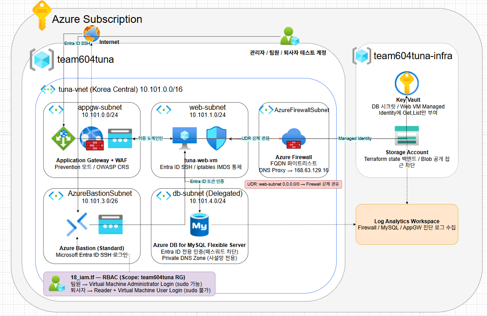

---
## 개요

WordPress + Azure MySQL Flexible Server + Application Gateway(WAF) + Azure Firewall + Bastion 구조에 **외부 침투 시나리오**와 **내부자 위협(Insider Threat) 시나리오**를 모두 적용했다. DB 패스워드 완전 제거, 팀원 입/퇴사 시 권한 자동 조정, VM 침투 시에도 DB 전체 권한 미획득, 전체 배포 자동화까지 직접 구축했다.

**핵심 키워드**: Azure Firewall FQDN 화이트리스트 · MySQL Entra ID 전용 인증 · Bastion + AAD SSH 로그인 · RBAC 최소 권한 · IMDS 접근 통제

---

## 공격 시나리오

이 프로젝트는 두 방향의 공격을 모두 가정하고 검증을 설계했다.

1. **외부 → 내부 침투 시나리오**: 외부 공격자가 웹 애플리케이션 취약점(SQLi, 웹쉘, SSRF)이나 관리 포트를 통해 뚫고 들어오려는 시도를 차단
2. **내부 → 외부 데이터 유출 시나리오**: 이미 내부 권한을 가진 계정(퇴사자, 낮은 권한 계정)이 데이터를 빼가거나 권한을 남용하려는 시도를 차단

---

## 아키텍처 설계

- Web VM 아웃바운드 → **UDR로 Firewall 강제 경유** (C2/데이터 유출 차단)
- MySQL → **delegated subnet + Private DNS Zone**, VNet 밖 이름 해석 불가
- VM 관리 포트(22) → **Bastion 경유만 허용**, 인터넷 미노출

퇴사자 계정으로는 team604tuna 리소스그룹밖에 볼 수 없음

Web / DB / Bastion / Firewall 서브넷 분리 + UDR 강제 경유

---

## Terraform 인프라 구현

**네트워크 보안 그룹(NSG) — 서브넷별 최소 인바운드**

- Web 서브넷: AppGW(80)·Bastion(SSH)에서만 인바운드 허용
- Bastion 서브넷: HTTPS/SSH/RDP만 허용
- DB/AppGW 서브넷도 각각 필요한 소스만 허용, 나머지 기본 차단

**Firewall DNS Proxy 강제 — FQDN 화이트리스트의 전제 조건**

- VNet DNS 서버를 **Azure Firewall 사설 IP로 강제 지정** (`null_resource` + `az network vnet update`)
- VM이 8.8.8.8 등 외부 DNS를 직접 써서 FQDN 필터링을 우회하는 경로 차단
- 모든 DNS 쿼리가 Firewall을 거치게 만들어야 FQDN 화이트리스트가 실제로 의미를 가짐

**Azure Firewall — FQDN 화이트리스트**

| 규칙 | 허용 도메인 | 용도 |
|---|---|---|
| `allow-ubuntu-apt` | `archive.ubuntu.com` | OS 패키지 설치 |
| `allow-wordpress` | `*.wordpress.org` | WordPress 코어/플러그인 |
| `allow-microsoft-packages` | `packages.microsoft.com`, `aka.ms` | az-cli 최신 버전 |
| `allow-entra-id-auth` | `login.microsoftonline.com`, `graph.microsoft.com`, `management.azure.com` | Entra ID 토큰, AAD SSH Graph 조회 |
| `allow-keyvault` | `*.vault.azure.net` | Key Vault 시크릿 |

**Application Gateway (WAF)** — Prevention 모드 · OWASP CRS · Health Probe

**Key Vault / Storage — 시크릿 및 State 관리**

- `team604tuna-infra` **별도 리소스그룹**에 분리 배치 (메인 인프라와 민감정보 분리)
- Key Vault: Access Policy 기반, Web VM Managed Identity에 `Get`/`List`만 부여 (최소 권한)
- Storage Account: HTTPS 전용 · TLS 1.2 최소 · **Blob 공개 접근 차단**, Terraform state 백엔드 겸용
- Private Endpoint는 미적용 (인증 기반 단일 방어) — 다음 과제로 남김

**MySQL — Entra ID 전용 인증**

- AAD 관리자 지정 + `aad_auth_only=ON` → **패스워드 인증 완전 차단**
- UserAssigned Managed Identity → Entra ID 사용자/그룹 조회(Directory Reader)
- 사용자명 32자 제한 → **alias + Object ID 매칭**
- `GRANT ALL` 대신 **필요 권한만** 부여, `GRANT OPTION` 배제

**Bastion + RBAC**

- Bastion **Standard SKU** (Basic은 Entra ID 인증 미지원)
- `AADSSHLoginForLinux` 확장 → 개인별 Entra ID SSH 로그인
- `Administrator Login`(sudo 가능, 관리자) / `User Login`(sudo 불가, 팀원) 역할 분리
- 변수 맵 하나로 VM/Bastion 권한 + MySQL 계정을 `for_each` 일괄 처리

**VM 내부 — 신원 도용 방지**

- iptables → IMDS(169.254.169.254) 접근을 **`www-data`/`root`로만 제한**
- 공유 SSH 키 잠금 → AAD 확장 설치 완료 확인 후에만 실행 (락아웃 방지)
- MySQL 토큰 → cron 캐시 + IMDS 폴백 하이브리드

UID 33(www-data)·0(root)만 ACCEPT, 나머지 DROP (514건 차단 이력)

**배포 자동화**

1. Bootstrap (Key Vault/Storage)
2. Terraform apply (네트워크/방화벽/Bastion/VM/MySQL/RBAC)
3. `az vm run-command invoke`로 DB 계정 자동 등록 (로컬 mysql 클라이언트 불필요)

리소스 이름 재사용 시 진단 설정 충돌 대비 → **apply 실패 시 자동 import 후 재시도**

---

## 외부 → 내부 침투 차단 검증

**SQL Injection**

검색 페이지에 입력값 검증 없이 쿼리를 직접 삽입하는 취약점을 의도적으로 구성해 시연했다. WAF Detection 모드에서는 공격이 그대로 통과해 사용자 정보가 노출됐고, Prevention 모드로 전환하자 OWASP CRS 룰(942100 Matched / 949110 Blocked)로 차단되는 것을 로그에서 직접 확인했다.

📷 그림 18~20 — 테스트 페이지 구성 / SQLi로 인한 정보 노출 / Prevention 모드 차단 결과
📷 그림 4 — WAF 로그 942100·949110 Matched/Blocked 확인
📷 표 6 — SQL Injection 검증 결과 목록

**웹쉘 업로드**

`uploads/` 폴더에 `.htaccess`로 PHP 실행을 허용해둔 취약한 상태에서 웹쉘을 업로드해 서버 명령 실행에 성공했다. 이후 PHP 실행 엔진을 끄고 WAF 커스텀 룰로 `/uploads/*.php`를 차단해, 동일 요청이 403 Forbidden으로 막히는 것을 확인했다.

📷 그림 7 — 방어 전 웹쉘을 통한 서버 명령어 실행 결과
📷 그림 8 — 업로드 디렉터리 PHP 실행 차단 Apache 설정
📷 그림 9 — WAF 적용 후 403 Forbidden 차단 결과
📷 표 7 — 웹쉘 업로드 및 실행 차단 검증 결과

**SSRF**

임의 URL 요청을 재현하는 테스트 페이지로 IMDS(169.254.169.254) 접근을 시도했다. Detection 모드에서 시도 자체는 확인되지만 차단되지 않았고, Prevention 모드에서 실제로 차단되는 것과 WAF 로그의 Matched/Blocked 이벤트를 함께 확인했다.

📷 그림 12 — Prevention 모드에서 SSRF 요청 차단 결과
📷 그림 13 — WAF 로그 기반 IMDS 접근 시도 Matched/Blocked 확인
📷 표 8 — SSRF 기반 IMDS 접근 시도 검증 결과

**외부 직접 접근 차단**

Web VM에 외부에서 SSH로 직접 접속을 시도했으나 차단됐고, 관리 접근은 NSG + Bastion 경로로만 허용되는 구조임을 Network Watcher로 직접 검증했다. Bastion + Entra ID 기반 정상 접속 경로도 함께 확인했다.

📷 그림 18 — 방어 후 외부 SSH 직접 접속 차단 결과
📷 그림 21 — Network Watcher 기반 비허용 포트 차단 확인
📷 그림 22 — Bastion Entra ID 기반 VM 접속 설정
📷 표 9 — NSG 및 Network Watcher 기반 접근 경로 검증 결과

**DB 접근 제어**

외부에서 DB로 직접 접근을 시도하면 차단되고, 내부 Web VM에서 Managed Identity 기반 Entra ID 토큰 인증으로만 정상 접속이 가능함을 확인했다. 애플리케이션 계정 권한도 필요한 CRUD 범위로만 한정돼 있었다.

📷 그림 27 — WordPress 정상 접속 결과
📷 표 10 — DB 접근 제어 및 최소 권한 검증 결과

📷 표 11 — 외부→내부 침투 차단 검증 결과 요약

---

## 내부 → 외부 데이터 유출 차단 검증

**미사용 계정 비활성화**

퇴사(ex-user) 시나리오로 Microsoft Entra ID에서 해당 계정을 비활성화 처리하고, 이후 로그인 시도가 차단되는 것을 확인했다.

📷 그림 29 — Entra ID에서 ex-user 계정 비활성화 설정

**RBAC 권한 분리**

직무별 최소 권한(RBAC) 구조로 역할을 분리해, Reader 권한만 가진 계정으로 WAF Managed Rules를 수정하려는 시도가 권한 부족으로 차단되는 것을 확인했다. 반대로 `Virtual Machine Administrator Login` 역할이 부여된 계정만 VM 접속 후 관리자 권한 전환이 가능함도 함께 검증했다.

📷 그림 31 — RBAC 기반 직무별 최소 권한 구조
📷 그림 32 — VM Administrator Login 역할 부여 화면
📷 그림 33 — 해당 계정으로 VM 접속 후 관리자 권한 전환 결과
📷 표 12 — RBAC 권한 분리 및 보안 설정 변경 차단 검증 결과

**"퇴사자(Former Employee)" 시나리오** — 계정을 비활성화하지 않고, 리소스그룹 `Reader` + VM `User Login`만 부여한 채 MySQL은 재직 시절 앱 계정 권한 그대로 둔 상태(오프보딩 누락)를 재현했다.

| 항목 | 결과 |
|---|---|
| Bastion → Entra ID SSH 로그인 | 성공 |
| `sudo su` | 재인증 요구로 차단 |
| 타 리소스그룹 조회 | 불가 |
| IMDS 토큰 도용 시도 | iptables 차단 |
| 본인 MySQL 계정 접속 | 정상 (재직 시절 권한 그대로) |
| MySQL 권한 범위 | `GRANT OPTION` 없는 CRUD로 한정 |

**Azure Firewall 기반 외부 데이터 유출 차단**

webhook.site로 DB 데이터를 외부로 전송하는 유출 시나리오를 재현했다. NSG만으로는 포트 단위 차단은 가능해도 애플리케이션 계층의 목적지 도메인 기반 차단이 어렵다는 한계를 확인하고, Azure Firewall로 전환했다. Firewall 적용 후 유출 시도는 차단되면서도, 허용된 정상 도메인(Ubuntu 업데이트, WordPress, Azure 서비스) 통신은 그대로 유지되는 것까지 확인했다.

📷 그림 35 — webhook.site 기반 DB 데이터 외부 전송 시도
📷 그림 39 — Firewall 허용 규칙 적용 후 Ubuntu 업데이트 성공 결과
📷 그림 40 — WordPress 허용 도메인 정상 통신 결과
📷 그림 41 — Azure 서비스 접근 결과
📷 표 13 — 내부→외부 데이터 유출 통제 검증 결과 요약

**결론**: DB 계정 회수(오프보딩)가 누락돼도, VM/구독 권한이 최소화되어 있으면 인프라 전체 장악으로 이어지지 않는다.

---

## 트러블슈팅

| 문제 | 원인 | 해결 |
|---|---|---|
| az-cli 구버전 | Firewall이 `packages.microsoft.com` 차단 | FQDN 허용 + GPG 키 명시적 등록 |
| AAD Admin 계정 불일치 | 등록된 관리자가 의도한 계정과 다름 | Portal 재등록 |
| MySQL 테넌트 에러 | 게스트 계정 홈/리소스 테넌트 불일치 | `--tenant` 명시 |
| 사용자명 32자 초과 | `mysql.user` 컬럼 길이 제한 | alias + Object ID 매칭 |
| AAD SSH 확장 설치 실패 | `graph.microsoft.com` 차단 | FQDN 허용 |
| RBAC 최소 권한 무력화 | 상위 Owner/Contributor의 loginAsAdmin 포함 | 검증 계정은 상위 권한 배제 |
| `CREATE AADUSER` 자동화 | 로컬 PC는 VNet 밖 | `az vm run-command invoke`로 VM 내부 실행 |
| 진단 설정 재배포 충돌 | 이름 기반 리소스 ID 흔적 잔존 | 자동 import 로직 내장 |

---

## 정리 및 회고

- 패스워드 제거보다 **VM 신원(Managed Identity) 도용 가능성**을 실제로 막아본 게 핵심 소득
- Owner/Contributor 잔존 시 하위 RBAC가 무력화됨을 직접 확인 — **권한은 더하기보다 안 남기기가 어렵다**
- 우회 대신 `az vm run-command`, iptables 카운터, Log Analytics 쿼리로 원인을 직접 확인하는 습관
- **"인프라 자동화"에서 "외부 침투와 내부자가 무엇을 할 수 있고 없는가"로** 검증의 중심을 옮긴 프로젝트
- VM/Bastion 세션 로그, Key Vault 접근 로그, CI/CD 파이프라인은 설계까지 마치고 다음 과제로 남김
- Key Vault/Storage에 Private Endpoint 적용 — 지금은 인증 기반 단일 방어, MySQL 수준의 네트워크 격리는 다음 과제
