---
## 개요

WordPress + Azure MySQL Flexible Server + Application Gateway(WAF) + Azure Firewall + Bastion 구조에 **내부자 위협(Insider Threat) 시나리오**를 적용했다. DB 패스워드 완전 제거, 팀원 입/퇴사 시 권한 자동 조정, VM 침투 시에도 DB 전체 권한 미획득, 전체 배포 자동화까지 직접 구축했다.

**핵심 키워드**: Azure Firewall FQDN 화이트리스트 · MySQL Entra ID 전용 인증 · Bastion + AAD SSH 로그인 · RBAC 최소 권한 · IMDS 접근 통제

---

## 아키텍처 설계

```
Internet → App Gateway(WAF) → Web VM(WordPress)
                                  ↓ UDR 강제 경유
                             Azure Firewall (FQDN 화이트리스트)
                                  ↓
                      MySQL Flexible Server (사설망 전용, Entra ID 인증)

관리자/팀원 → Bastion(Standard) → Web VM (Entra ID SSH 로그인)
```

- Web VM 아웃바운드 → **UDR로 Firewall 강제 경유** (C2/데이터 유출 차단)
- MySQL → **delegated subnet + Private DNS Zone**, VNet 밖 이름 해석 불가
- VM 관리 포트(22) → **Bastion 경유만 허용**, 인터넷 미노출

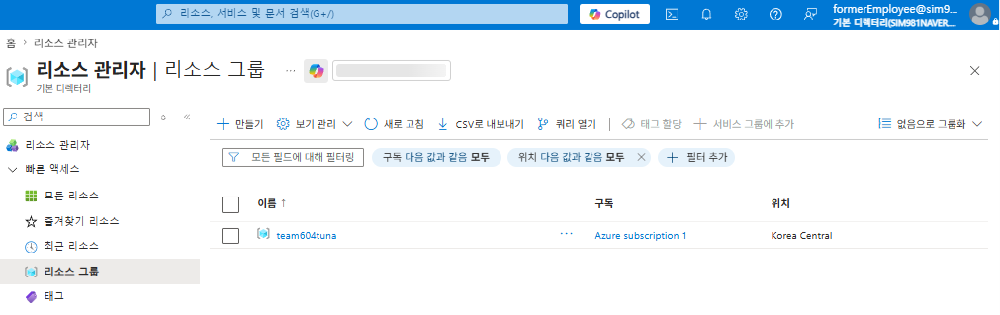

퇴사자 계정으로는 team604tuna 리소스그룹밖에 볼 수 없음


Web / DB / Bastion / Firewall 서브넷 분리 + UDR 강제 경유


---

## Terraform 인프라 구현

**네트워크 보안 그룹(NSG) — 서브넷별 최소 인바운드**

- Web 서브넷: AppGW(80)·Bastion(SSH)에서만 인바운드 허용
- Bastion 서브넷: HTTPS/SSH/RDP만 허용
- DB/AppGW 서브넷도 각각 필요한 소스만 허용, 나머지 기본 차단

**Firewall DNS Proxy 강제 — FQDN 화이트리스트의 전제 조건**

- VNet DNS 서버를 **Azure Firewall 사설 IP로 강제 지정** (`null_resource` + `az network vnet update`)
- VM이 8.8.8.8 등 외부 DNS를 직접 써서 FQDN 필터링을 우회하는 경로 차단
- 모든 DNS 쿼리가 Firewall을 거치게 만들어야 FQDN 화이트리스트가 실제로 의미를 가짐

**Azure Firewall — FQDN 화이트리스트**

| 규칙 | 허용 도메인 | 용도 |
|---|---|---|
| `allow-ubuntu-apt` | `archive.ubuntu.com` | OS 패키지 설치 |
| `allow-wordpress` | `*.wordpress.org` | WordPress 코어/플러그인 |
| `allow-microsoft-packages` | `packages.microsoft.com`, `aka.ms` | az-cli 최신 버전 |
| `allow-entra-id-auth` | `login.microsoftonline.com`, `graph.microsoft.com`, `management.azure.com` | Entra ID 토큰, AAD SSH Graph 조회 |
| `allow-keyvault` | `*.vault.azure.net` | Key Vault 시크릿 |

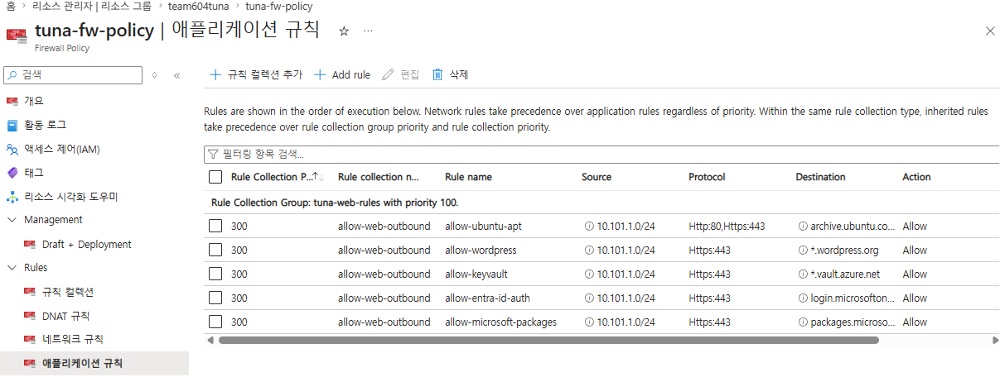

**Application Gateway (WAF)** — Prevention 모드 · OWASP CRS · Health Probe

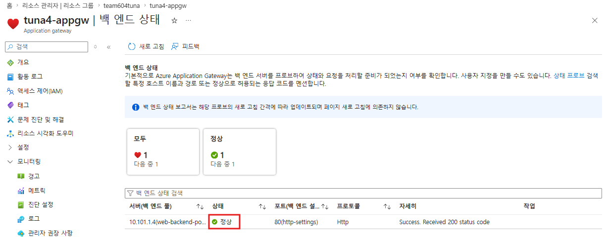

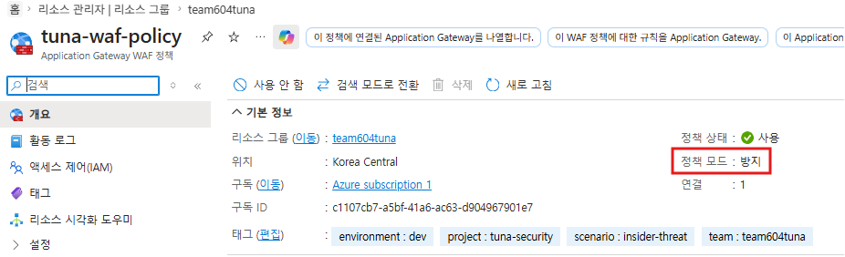


**Key Vault / Storage — 시크릿 및 State 관리**

- `team604tuna-infra` **별도 리소스그룹**에 분리 배치 (메인 인프라와 민감정보 분리)
- Key Vault: Access Policy 기반, Web VM Managed Identity에 `Get`/`List`만 부여 (최소 권한)
- Storage Account: HTTPS 전용 · TLS 1.2 최소 · **Blob 공개 접근 차단**, Terraform state 백엔드 겸용
- Private Endpoint는 미적용 (인증 기반 단일 방어) — 다음 과제로 남김

**MySQL — Entra ID 전용 인증**

- AAD 관리자 지정 + `aad_auth_only=ON` → **패스워드 인증 완전 차단**
- UserAssigned Managed Identity → Entra ID 사용자/그룹 조회(Directory Reader)
- 사용자명 32자 제한 → **alias + Object ID 매칭**
- `GRANT ALL` 대신 **필요 권한만** 부여, `GRANT OPTION` 배제

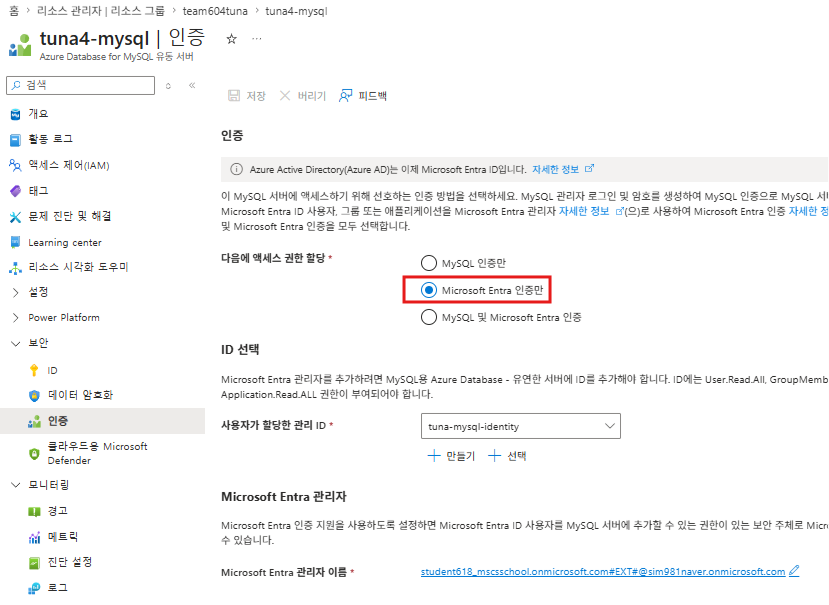

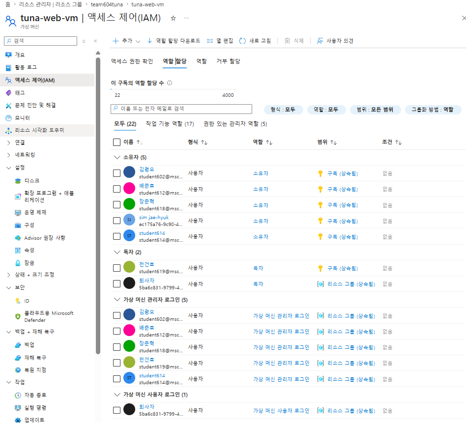

**Bastion + RBAC**

- Bastion **Standard SKU** (Basic은 Entra ID 인증 미지원)
- `AADSSHLoginForLinux` 확장 → 개인별 Entra ID SSH 로그인
- `Administrator Login`(sudo 가능, 관리자) / `User Login`(sudo 불가, 팀원) 역할 분리
- 변수 맵 하나로 VM/Bastion 권한 + MySQL 계정을 `for_each` 일괄 처리


**VM 내부 — 신원 도용 방지**

- iptables → IMDS(169.254.169.254) 접근을 **`www-data`/`root`로만 제한**
- 공유 SSH 키 잠금 → AAD 확장 설치 완료 확인 후에만 실행 (락아웃 방지)
- MySQL 토큰 → cron 캐시 + IMDS 폴백 하이브리드

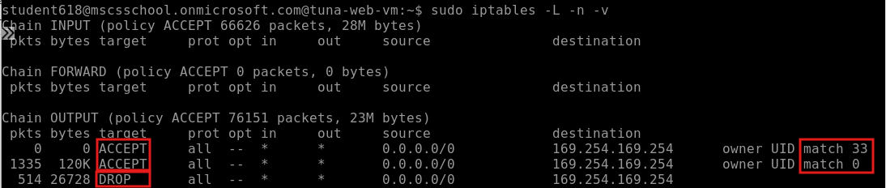

UID 33(www-data)·0(root)만 ACCEPT, 나머지 DROP (514건 차단 이력)

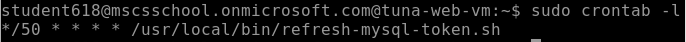

**배포 자동화**

1. Bootstrap (Key Vault/Storage)
2. Terraform apply (네트워크/방화벽/Bastion/VM/MySQL/RBAC)
3. `az vm run-command invoke`로 DB 계정 자동 등록 (로컬 mysql 클라이언트 불필요)

리소스 이름 재사용 시 진단 설정 충돌 대비 → **apply 실패 시 자동 import 후 재시도**


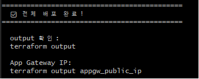

---

## 트러블슈팅

| 문제 | 원인 | 해결 |
|---|---|---|
| az-cli 구버전 | Firewall이 `packages.microsoft.com` 차단 | FQDN 허용 + GPG 키 명시적 등록 |
| AAD Admin 계정 불일치 | 등록된 관리자가 의도한 계정과 다름 | Portal 재등록 |
| MySQL 테넌트 에러 | 게스트 계정 홈/리소스 테넌트 불일치 | `--tenant` 명시 |
| 사용자명 32자 초과 | `mysql.user` 컬럼 길이 제한 | alias + Object ID 매칭 |
| AAD SSH 확장 설치 실패 | `graph.microsoft.com` 차단 | FQDN 허용 |
| RBAC 최소 권한 무력화 | 상위 Owner/Contributor의 loginAsAdmin 포함 | 검증 계정은 상위 권한 배제 |
| `CREATE AADUSER` 자동화 | 로컬 PC는 VNet 밖 | `az vm run-command invoke`로 VM 내부 실행 |
| 진단 설정 재배포 충돌 | 이름 기반 리소스 ID 흔적 잔존 | 자동 import 로직 내장 |

---

## 테스트 및 검증

**배포/로그**: `bash 100_run.sh` 전 과정 자동 완료 · Firewall/MySQL/AppGW 로그 전부 Log Analytics 연결 확인

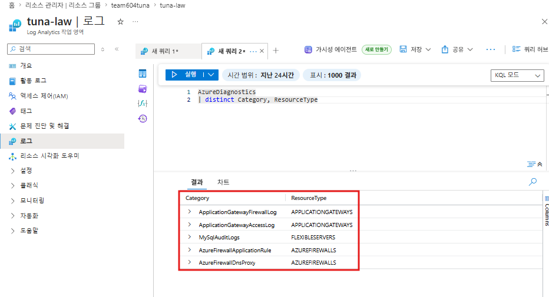

**"퇴사자(Former Employee)" 시나리오** — 리소스그룹 `Reader` + VM `User Login`만 부여, MySQL은 재직 시절 앱 계정 권한 그대로(오프보딩 누락 재현)

| 항목 | 결과 |
|---|---|
| Bastion → Entra ID SSH 로그인 | 성공 |
| `sudo su` | 재인증 요구로 차단 |
| 타 리소스그룹 조회 | 불가 |
| IMDS 토큰 도용 시도 | iptables 차단 |
| 본인 MySQL 계정 접속 | 정상 (재직 시절 권한 그대로) |
| MySQL 권한 범위 | `GRANT OPTION` 없는 CRUD로 한정 |

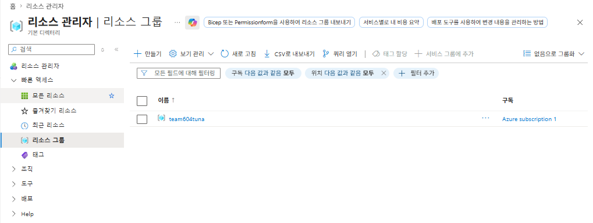

`team604tuna` 외 리소스그룹 조회 불가

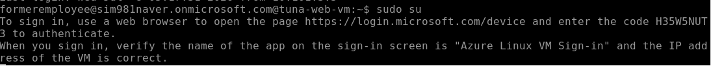

`sudo su` → 재인증 요구로 차단

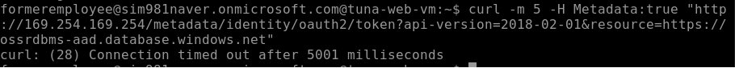

IMDS 접근 시도 → 연결 차단

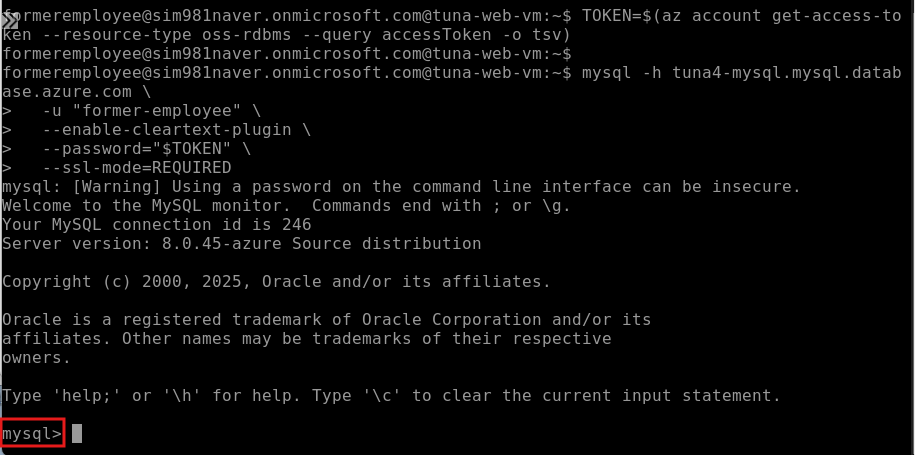

퇴사 전 등록된 MySQL 앱 계정 접속 성공

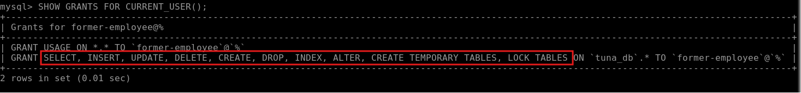

`SHOW GRANTS` — `tuna_db` CRUD 한정, `GRANT OPTION` 없음

**결론**: DB 계정 회수(오프보딩)가 누락돼도, VM/구독 권한이 최소화되어 있으면 인프라 전체 장악으로 이어지지 않는다.

---

## 정리 및 회고

- 패스워드 제거보다 **VM 신원(Managed Identity) 도용 가능성**을 실제로 막아본 게 핵심 소득
- Owner/Contributor 잔존 시 하위 RBAC가 무력화됨을 직접 확인 — **권한은 더하기보다 안 남기기가 어렵다**
- 우회 대신 `az vm run-command`, iptables 카운터, Log Analytics 쿼리로 원인을 직접 확인하는 습관
- **"인프라 자동화"에서 "내부자가 무엇을 할 수 있고 없는가"로** 검증의 중심을 옮긴 프로젝트
- VM/Bastion 세션 로그, Key Vault 접근 로그, CI/CD 파이프라인은 설계까지 마치고 다음 과제로 남김
- Key Vault/Storage에 Private Endpoint 적용 — 지금은 인증 기반 단일 방어, MySQL 수준의 네트워크 격리는 다음 과제
