---
## 개요

이전 프로젝트(App 보안 설계)의 WAF·Firewall·MySQL Entra ID 인증 기반 인프라 위에, 이번엔 **탐지·대응(CDR)** 계층을 추가했다. 웹쉘·SSRF·SQL Injection·MySQL 비정상 접속·권한 변경 공격을 재현하고, Microsoft Sentinel로 탐지한 뒤 이메일 알림과 공격자 IP 자동 차단까지 이어지는 파이프라인 전체를 구축·검증했다.

**핵심 키워드**: Microsoft Sentinel · Log Analytics · KQL · Automation Rule · Logic App Playbook · 오탐 분석 · 자동 대응

---

## 아키텍처 개요

- **Application Gateway (WAF_v2, Prevention)**: OWASP CRS 3.2 + 업로드 폴더 PHP 차단 커스텀 룰
- **Azure Firewall**: 아웃바운드 단일 출구, DNS Proxy 강제 경유
- **Azure Bastion**: Entra ID SSH 로그인
- **MySQL Flexible Server**: Entra ID 전용 인증, Audit Log
- **Log Analytics + Sentinel**: 4개 로그 소스 통합, 분석 규칙 6개로 Incident 자동 생성
- **Automation Rule + Logic App Playbook**: Incident 발생 시 이메일 자동 발송, High는 공격자 IP 자동 차단

---

## Terraform 인프라 구현

**Bootstrap**: Key Vault·Storage Account를 별도 리소스그룹(`team604tuna05-infra`)에 분리 배치


<sub>[terraform apply 완료 로그]</sub>


<sub>[`team604tuna05-infra` 리소스그룹 개요]</sub>

**Sentinel 분석 규칙 6개**

| 규칙 | 대상 로그 | 심각도 |
|---|---|---|
| 웹쉘 업로드 | WAF FirewallLog | High |
| SSRF/IMDS | WAF FirewallLog | High |
| SQL Injection | WAF FirewallLog | Medium |
| MySQL 비정상 접속 | MySqlAuditLogs | Medium |
| 방화벽 미허용 아웃바운드 | Firewall Rule | Medium |
| 권한 변경 | Activity Log | Medium |

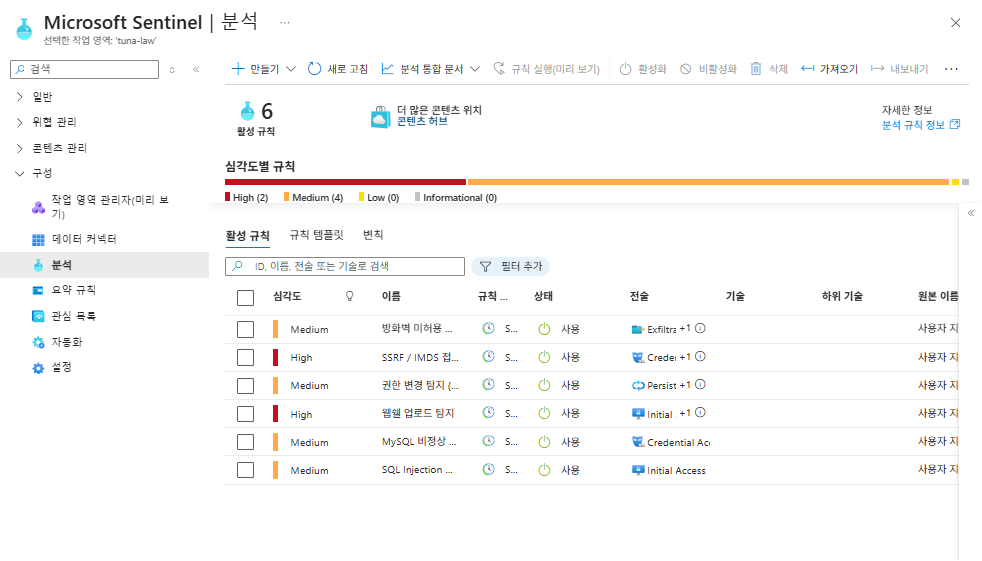
<sub>[Sentinel 분석 규칙 6개 활성화 화면]</sub>

---

## WordPress 초기 설치

App Gateway 공인 IP로 접속해 WordPress 설치를 완료했다.


<sub>[WordPress 설치 정보 입력 화면]</sub>

---

## MySQL Entra ID 인증 검증

VM Managed Identity Object ID와 MySQL AAD 사용자를 대조해 인증 경로를 검증했다. WordPress가 비밀번호 없이 AAD 토큰만으로 접속되는 것까지 확인했다.

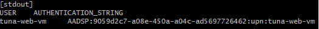
<sub>[`mysql.user` 조회 결과 — Object ID 일치 확인]</sub>


<sub>[WordPress 정상 접속 화면]</sub>

---

## 웹쉘 업로드 탐지 검증

`/upload.php`로 웹쉘 업로드를 시도하니 WAF가 403으로 차단했다. Sentinel 규칙의 KQL을 실제 로그에 맞게 수정한 뒤, 실제 시도 횟수(2회)와 정확히 일치하는 탐지 결과를 확인했다.

```
AzureDiagnostics
| where Category == "ApplicationGatewayFirewallLog"
| where ruleId_s == "933110" or (requestUri_s has "/uploads/" and requestUri_s endswith ".php")
| extend AttackerIP = clientIp_s
```


<sub>[`shell.php` 파일 선택]</sub>


<sub>[업로드 시도 → 403 Forbidden]</sub>


<sub>[원본 로그 — 933110(Matched)·949110(Blocked)]</sub>

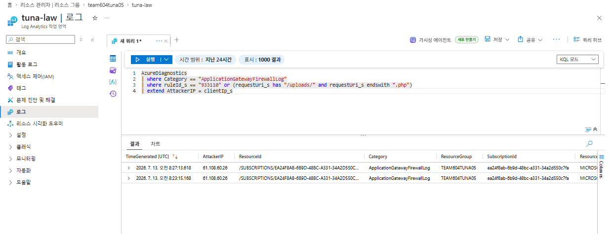
<sub>[수정된 쿼리 실행 결과 — 2건 정확히 일치]</sub>

---

## SSRF / SQL Injection 탐지 검증

SSRF와 SQLi 모두 WAF Prevention 모드에서 403으로 차단됐다. SSRF는 OWASP CRS `931100`·`931130`, SQLi는 `942xxx` 계열 7~8개 룰이 매치됐다. 두 규칙 모두 KQL 수정 없이 처음부터 정확히 탐지됐다.

**SSRF**

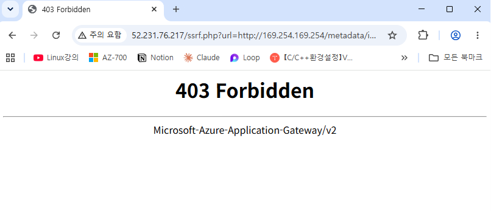
<sub>[SSRF 요청 → 403 차단]</sub>


<sub>[WAF 로그 — 931100·931130 매치]</sub>


<sub>[SSRF 탐지 쿼리 결과 — 4건]</sub>

**SQL Injection**

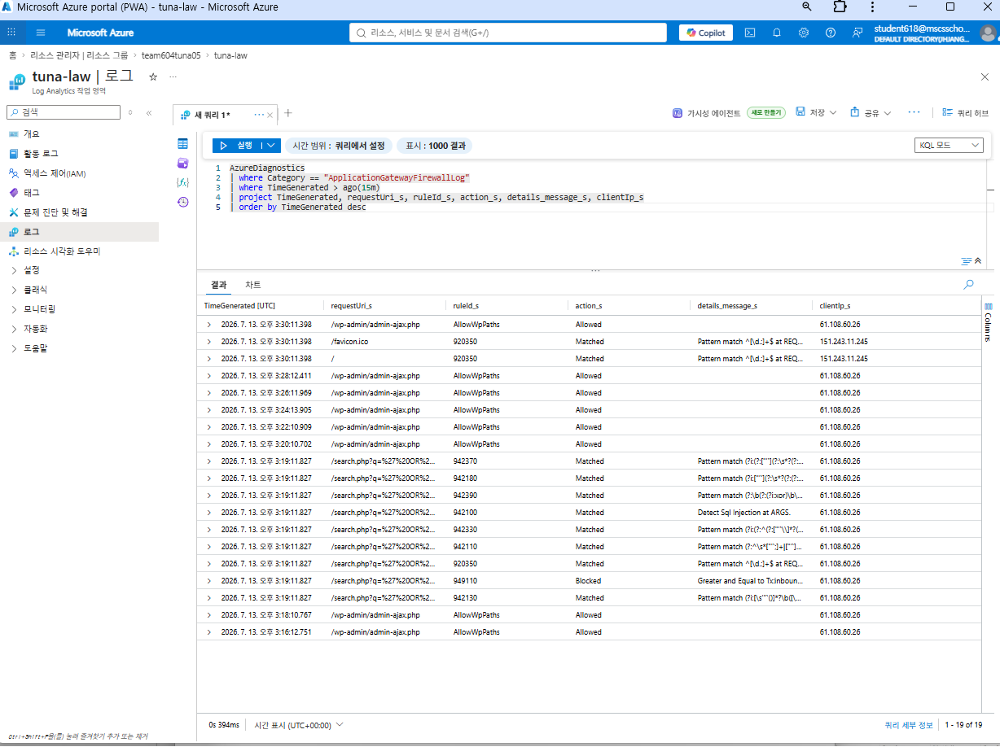
<sub>[WAF 로그 — 942xxx 계열 7~8개 매치]</sub>

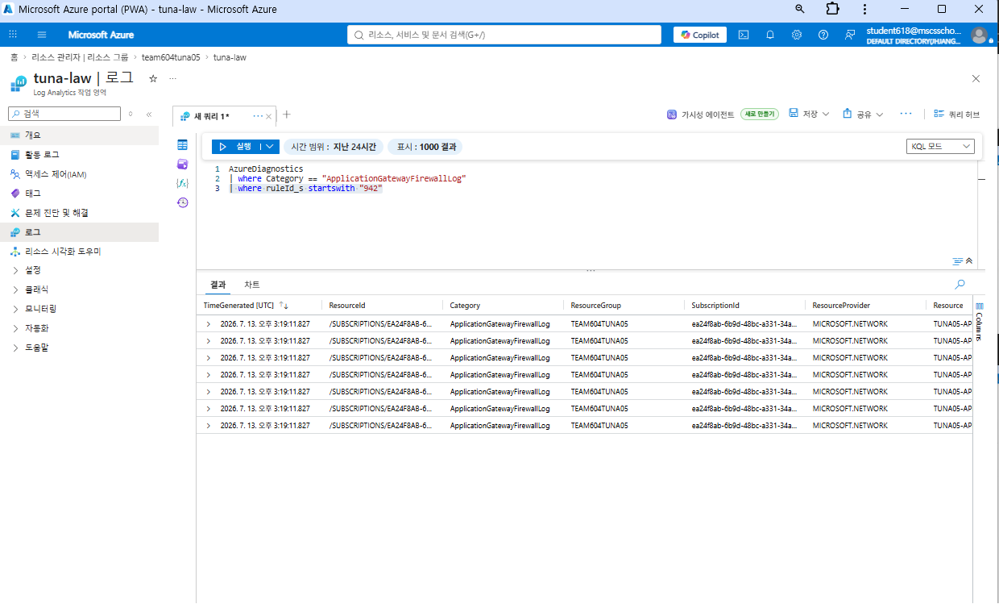
<sub>[SQLi 탐지 쿼리 결과 — 7건]</sub>

---

## Incident 발생 현황 및 오탐 분석

Sentinel 사고 메뉴에서 Incident 35건을 확인했다 (High 1, Medium 34). Medium 34건이 전부 방화벽 아웃바운드 규칙 하나에서 반복 발생해 오탐 여부를 점검했다.


<sub>[Sentinel 사고 메뉴 — High 1건 / Medium 34건]</sub>

원본 로그를 확인하니 34건 전부 `wp-cron.php`가 App Gateway 공인 IP를 자기 호출하는 정상 동작이었다.


<sub>[`wp-cron.php` 자기참조 트래픽 — 오탐 확인]</sub>

제외 조건을 걸고 재조회하니 18건이 남았고, 확인 결과 전부 OS/WordPress/Azure 인프라의 정상 배경 트래픽이었다.


<sub>[1차 제외 후 재조회 — 18건]</sub>


<sub>[18건 상세 — 전부 정상 트래픽]</sub>

**Incident 35건 중 34건(97%)이 오탐**이었다. 정상 트래픽 목적지를 제외 조건에 추가해 규칙을 수정했다.

```bash
AzureDiagnostics
| where Category in ("AzureFirewallApplicationRule", "AzureFirewallNetworkRule")
| where msg_s has "Deny"
| where msg_s !has "wp-cron.php"
| where msg_s !has "52.231.76.217"
| where msg_s !has "api.snapcraft.io"
| where msg_s !has "wordpress.org"
| where msg_s !has "visualstudio.com"
| where msg_s !has "blob.storage.azure.net"
```

수정 후 재확인하니 오탐 34건이 `raw.githubusercontent.com` 관련 1건으로 줄었다. 반복되지 않는 일회성이라 우선순위는 낮지만, 원인은 아직 미확인이다.

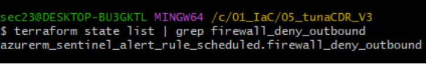
<sub>[수정 규칙 재조회 — 34건 → 1건]</sub>


<sub>[남은 1건 — `raw.githubusercontent.com`, 원인 미확인]</sub>

---

## 알림 자동화 (Playbook) 구축

Office 365 Outlook 커넥터로 먼저 시도했으나, 사용 계정이 REST API 미지원 게스트/샌드박스 사서함이라 연결이 실패했다.

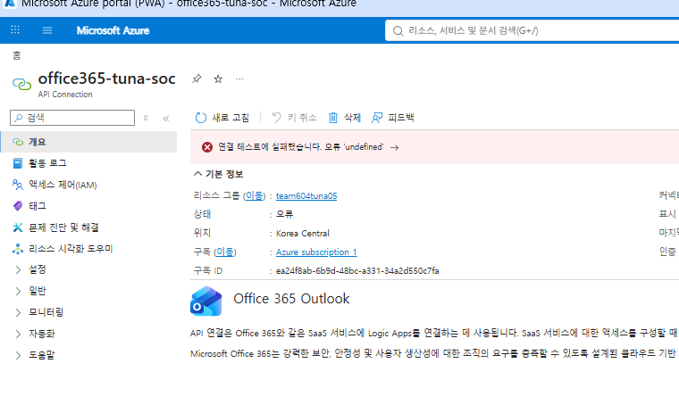
<sub>[Office 365 연결 테스트 실패]</sub>

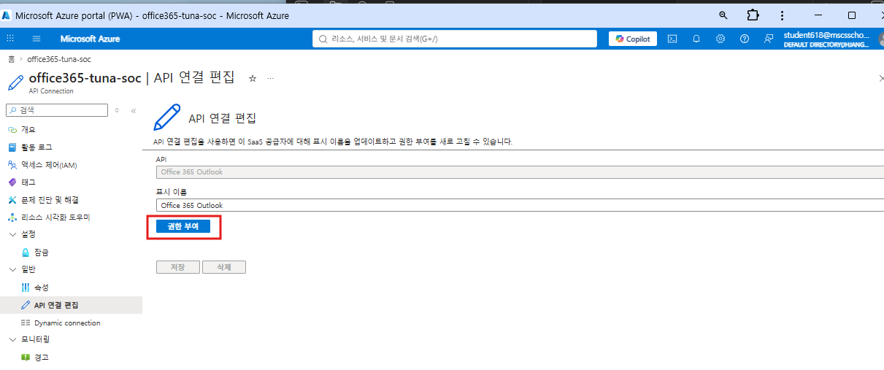
<sub>[권한 부여 오류 — REST API 미지원 사서함]</sub>

대신 **SMTP 커넥터(기본 인증)로 Gmail에서 직접 발송**하는 방식으로 전환했다. 2단계 인증과 앱 비밀번호를 설정했다.


<sub>[2단계 인증 활성화]</sub>

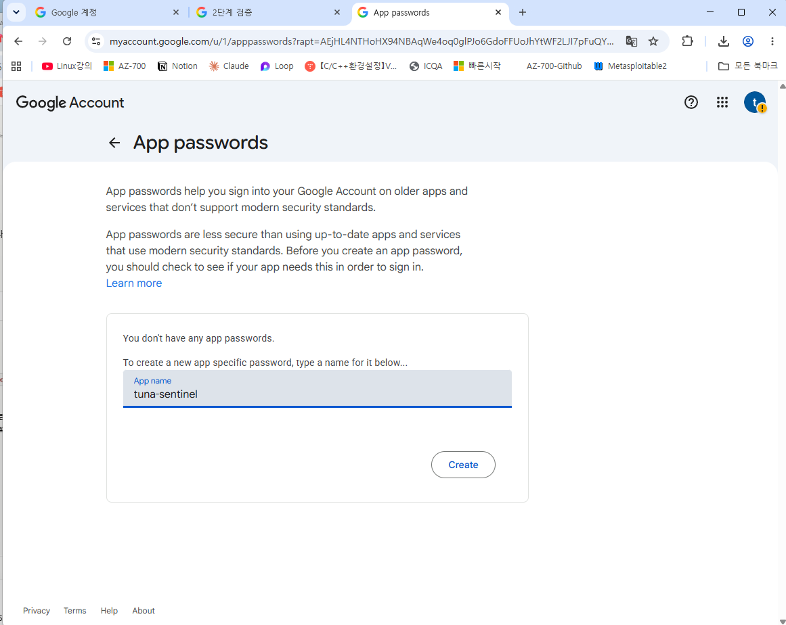
<sub>[앱 비밀번호 발급]</sub>


<sub>[16자리 앱 비밀번호 발급 완료]</sub>

Sentinel Incident 트리거(`azuresentinel` 커넥터)는 Azure 정책상 사람이 Portal에서 1회 로그인 승인해야 연결된다. Terraform으로 트리거·액션 내용까지 관리하면 재배포할 때마다 이 연결이 초기화되는 문제를 겪었다. 그래서 **Logic App은 Terraform으로 빈 껍데기만 만들고, 트리거·액션은 Portal Designer에서 완성**하는 방식으로 확정했다.


<sub>[Microsoft Sentinel 인시던트 추가]</sub>

/file-20260715160911128.png)
<sub>[Microsoft Sentinel 인시던트 수동으로 계정 연결]</sub>


<sub>[메일 발송 액션 매개변수 선택]</sub>


<sub>[받는사람/제목/본문 입력 완료]</sub>

여기부터는 밑의 코드를 붙여넣기해서 Publish 해도 된다.
SQL Injection을 재현해 새 Incident를 발생시킨 뒤, 실제로 메일이 도착하는 것을 확인했다.

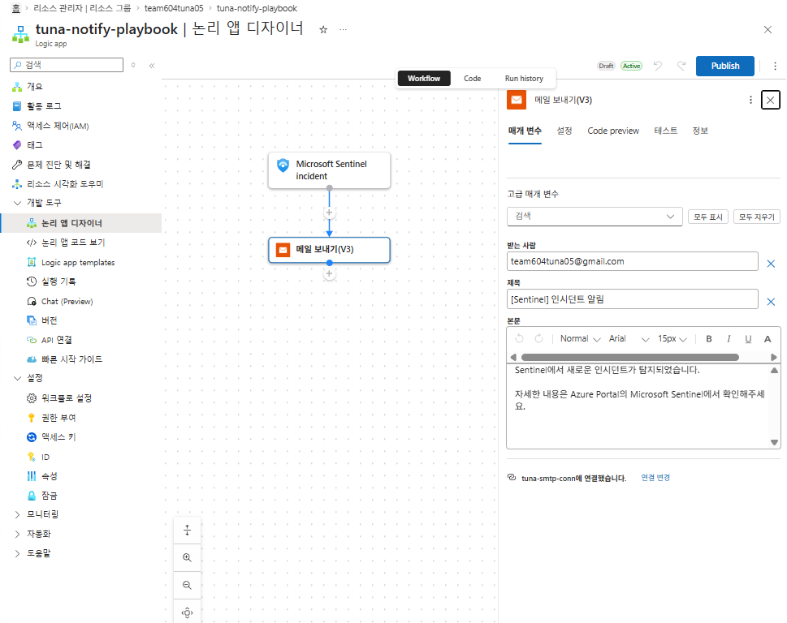
<sub>[받는사람/제목/본문 입력 완료]</sub>

```bash
{
    "definition": {
        "metadata": {
            "notes": {}
        },
        "$schema": "https://schema.management.azure.com/providers/Microsoft.Logic/schemas/2016-06-01/workflowdefinition.json#",
        "contentVersion": "1.0.0.0",
        "triggers": {
            "Microsoft_Sentinel_incident": {
                "type": "ApiConnectionWebhook",
                "inputs": {
                    "host": {
                        "connection": {
                            "name": "@parameters('$connections')['azuresentinel']['connectionId']"
                        }
                    },
                    "body": {
                        "callback_url": "@listCallbackUrl()"
                    },
                    "path": "/incident-creation"
                }
            }
        },
        "actions": {
            "메일_보내기(V3)": {
                "type": "ApiConnection",
                "inputs": {
                    "host": {
                        "connection": {
                            "name": "@parameters('$connections')['smtp']['connectionId']"
                        }
                    },
                    "method": "post",
                    "body": {
                        "To": "team604tuna05@gmail.com",
                        "Subject": "[Sentinel] 인시던트 알림",
                        "Body": "<p class=\"editor-paragraph\">Sentinel에서 새로운 인시던트가 탐지되었습니다.</p><br><p class=\"editor-paragraph\">자세한 내용은 Azure Portal의 Microsoft Sentinel에서 확인해주세요.</p>"
                    },
                    "path": "/SendEmailV3"
                },
                "runAfter": {}
            }
        },
        "parameters": {
            "$connections": {
                "type": "Object",
                "defaultValue": {}
            }
        }
    },
    "parameters": {
        "$connections": {
            "type": "Object",
            "value": {
                "azuresentinel": {
                    "id": "/subscriptions/ea24f8ab-6b9d-48bc-a331-34a2d550c7fa/providers/Microsoft.Web/locations/koreacentral/managedApis/azuresentinel",
                    "connectionId": "/subscriptions/ea24f8ab-6b9d-48bc-a331-34a2d550c7fa/resourceGroups/team604tuna05/providers/Microsoft.Web/connections/azuresentinel",
                    "connectionName": "azuresentinel",
                    "connectionProperties": {}
                },
                "smtp": {
                    "id": "/subscriptions/ea24f8ab-6b9d-48bc-a331-34a2d550c7fa/providers/Microsoft.Web/locations/koreacentral/managedApis/smtp",
                    "connectionId": "/subscriptions/ea24f8ab-6b9d-48bc-a331-34a2d550c7fa/resourceGroups/team604tuna05/providers/Microsoft.Web/connections/smtp",
                    "connectionName": "smtp",
                    "connectionProperties": {}
                }
            }
        }
    }
}
```

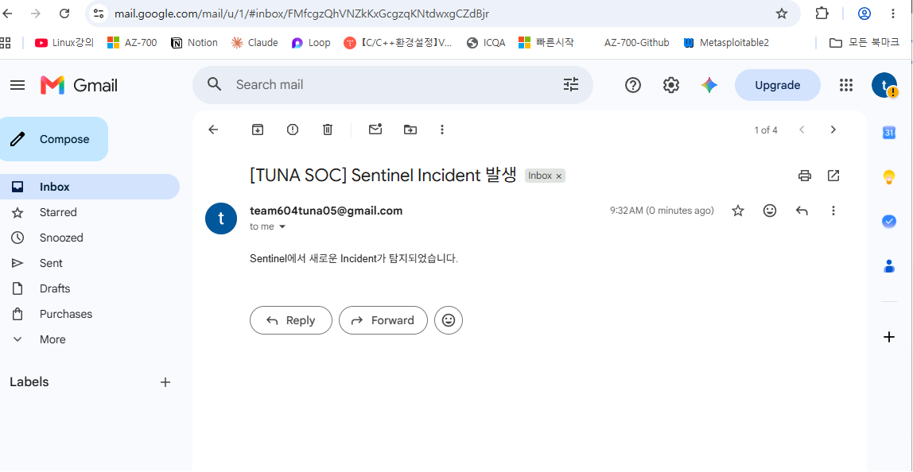
<sub>[실제 수신된 알림 이메일]</sub>

**왜 트리거 연결만 수동인가**: Terraform 코드만으로 Playbook이 Sentinel Incident 데이터 접근 권한까지 자동으로 얻을 수 있다면, 코드나 state 유출만으로 보안 이벤트 데이터에 무단 접근하는 자동화가 심어질 수 있다. Azure는 이 연결만큼은 사람이 직접 승인하도록 설계했다. 승인은 리소스 유지 중엔 최초 1회만 필요하고, 이후엔 완전 자동으로 반복된다.

---

## 공격자 IP 자동 차단 Playbook

High Incident 발생 시 공격자 IP를 WAF 커스텀 룰에 자동 추가하는 두 번째 Playbook을 만들었다. 로그인 인증이 필요 없는 **Managed Identity 기반 HTTP 액션**으로 구성해, 트리거 연결만 1회 완료하면 완전 자동화된다.

`PATCH`로 `customRules`만 갱신하려 했으나, ARM의 `PATCH`는 태그 수정 전용이라 실패했다(`OnlyTagsSupportedForPatch`).

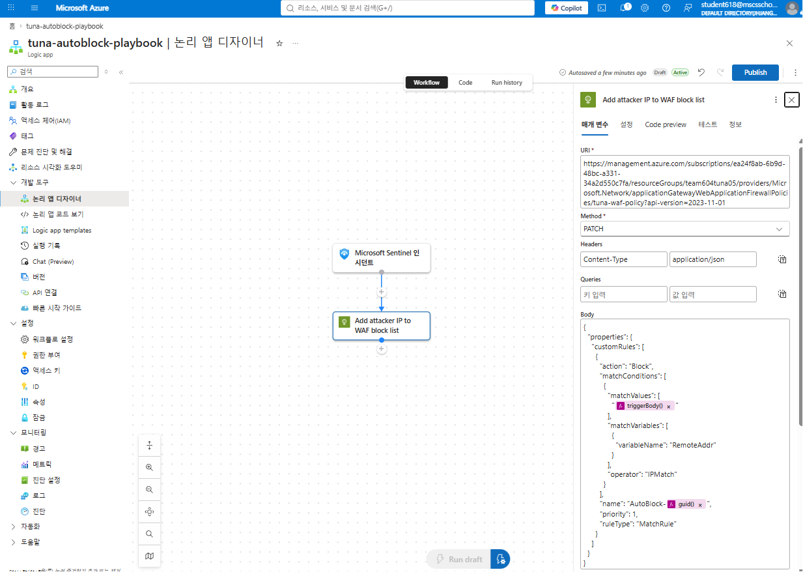
<sub>[HTTP 액션 최초 설정 — Method: PATCH]</sub>

`PUT`으로 바꾸니 `location` 속성 누락 오류(`LocationRequired`)가 났다. 기존 WAF 정책을 조회해 `location`·`managedRules`·`policySettings`까지 전부 포함한 완전한 Body로 재구성한 뒤에야 성공했다. 그 전엔 `managedRules`를 빠뜨려 OWASP 규칙셋이 통째로 날아가는 오류도 겪었다. 공격자 IP는 Incident의 `relatedEntities[0].properties.address` 경로에 담겨 있는 걸 실제 payload로 확인해 동적 콘텐츠로 연결했다.


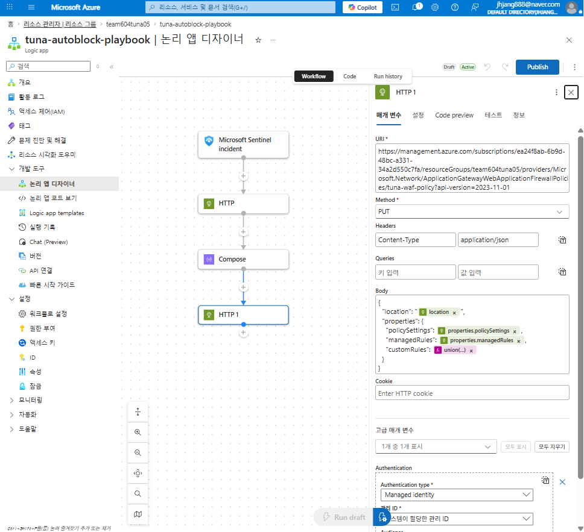
<sub>[수정된 HTTP 액션 — 동적 콘텐츠 연결, Managed Identity 인증]</sub>

```bash
{
    "definition": {
        "$schema": "https://schema.management.azure.com/providers/Microsoft.Logic/schemas/2016-06-01/workflowdefinition.json#",
        "contentVersion": "1.0.0.0",
        "triggers": {
            "Microsoft_Sentinel_incident": {
                "type": "ApiConnectionWebhook",
                "inputs": {
                    "host": {
                        "connection": {
                            "name": "@parameters('$connections')['azuresentinel']['connectionId']"
                        }
                    },
                    "body": {
                        "callback_url": "@listCallbackUrl()"
                    },
                    "path": "/incident-creation"
                }
            }
        },
        "actions": {
            "HTTP": {
                "type": "Http",
                "inputs": {
                    "uri": "https://management.azure.com/subscriptions/ea24f8ab-6b9d-48bc-a331-34a2d550c7fa/resourceGroups/team604tuna05/providers/Microsoft.Network/ApplicationGatewayWebApplicationFirewallPolicies/tuna-waf-policy?api-version=2023-11-01",
                    "method": "GET",
                    "authentication": {
                        "type": "ManagedServiceIdentity",
                        "audience": "https://management.azure.com/"
                    }
                },
                "runAfter": {},
                "runtimeConfiguration": {
                    "contentTransfer": {
                        "transferMode": "Chunked"
                    }
                }
            },
            "Compose": {
                "type": "Compose",
                "inputs": {
                    "action": "Block",
                    "matchConditions": [
                        {
                            "matchValues": [
                                "@{triggerBody()?['object']?['properties']?['relatedEntities']?[0]?['properties']?['address']}"
                            ],
                            "matchVariables": [
                                {
                                    "variableName": "RemoteAddr"
                                }
                            ],
                            "operator": "IPMatch"
                        }
                    ],
                    "name": "AutoBlockRule",
                    "priority": 1,
                    "ruleType": "MatchRule"
                },
                "runAfter": {
                    "HTTP": [
                        "SUCCEEDED"
                    ]
                }
            },
            "HTTP_1": {
                "type": "Http",
                "inputs": {
                    "uri": "https://management.azure.com/subscriptions/ea24f8ab-6b9d-48bc-a331-34a2d550c7fa/resourceGroups/team604tuna05/providers/Microsoft.Network/ApplicationGatewayWebApplicationFirewallPolicies/tuna-waf-policy?api-version=2023-11-01",
                    "method": "PUT",
                    "headers": {
                        "Content-Type": "application/json"
                    },
                    "body": {
                        "location": "@{body('HTTP')?['location']}",
                        "properties": {
                            "policySettings": "@body('HTTP')?['properties']?['policySettings']",
                            "managedRules": "@body('HTTP')?['properties']?['managedRules']",
                            "customRules": "@union(body('HTTP')?['properties']?['customRules'], createArray(outputs('Compose')))"
                        }
                    },
                    "authentication": {
                        "type": "ManagedServiceIdentity",
                        "audience": "https://management.azure.com/"
                    }
                },
                "runAfter": {
                    "Compose": [
                        "SUCCEEDED"
                    ]
                },
                "runtimeConfiguration": {
                    "contentTransfer": {
                        "transferMode": "Chunked"
                    }
                }
            }
        },
        "parameters": {
            "$connections": {
                "type": "Object",
                "defaultValue": {}
            }
        },
        "metadata": {
            "notes": {}
        }
    },
    "parameters": {
        "$connections": {
            "type": "Object",
            "value": {
                "azuresentinel": {
                    "id": "/subscriptions/ea24f8ab-6b9d-48bc-a331-34a2d550c7fa/providers/Microsoft.Web/locations/koreacentral/managedApis/azuresentinel",
                    "connectionId": "/subscriptions/ea24f8ab-6b9d-48bc-a331-34a2d550c7fa/resourceGroups/team604tuna05/providers/Microsoft.Web/connections/azuresentinel",
                    "connectionName": "azuresentinel",
                    "connectionProperties": {}
                }
            }
        }
    }
}
```

Automation Rule을 연결하려 하니 `Playbook resource ... is not using Microsoft Sentinel Incident trigger`라는 400 에러가 반복됐다. 원인은 포털이 한국어 UI로 트리거를 추가하면서 트리거 이름을 `Microsoft_Sentinel_incident`가 아니라 `Microsoft_Sentinel_인시던트`로 자동 번역해 저장한 것이었다. Sentinel은 트리거를 이 이름 문자열 자체로 식별하기 때문에, Code view에서 키 이름만 영문으로 되돌리고 나서야 연결이 정상 인식됐다.

SSRF를 재현하고 실행 기록을 확인하니, 여러 번 실패 끝에 성공(Succeeded)을 확인했다.


<sub>[실행 기록 — 여러 번 실패 끝에 Succeeded]</sub>

WAF 정책을 직접 조회해 `AutoBlock` 룰에 실제 공격자 IP가 등록된 걸 확인했다.

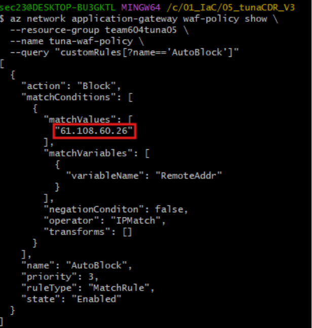
<sub>[`AutoBlock` 룰에 공격자 IP 등록 확인]</sub>

같은 IP로는 접속이 차단되고, 와이파이를 바꿔 다른 공인 IP로는 정상 접속되는 것까지 확인했다. (중간에 `https://` 접속이 안 됐던 건 WAF 차단이 아니라 443 포트 리스너 자체가 없어서였다.)


<sub>[차단된 IP로 접속 시도 → 연결 불가]</sub>

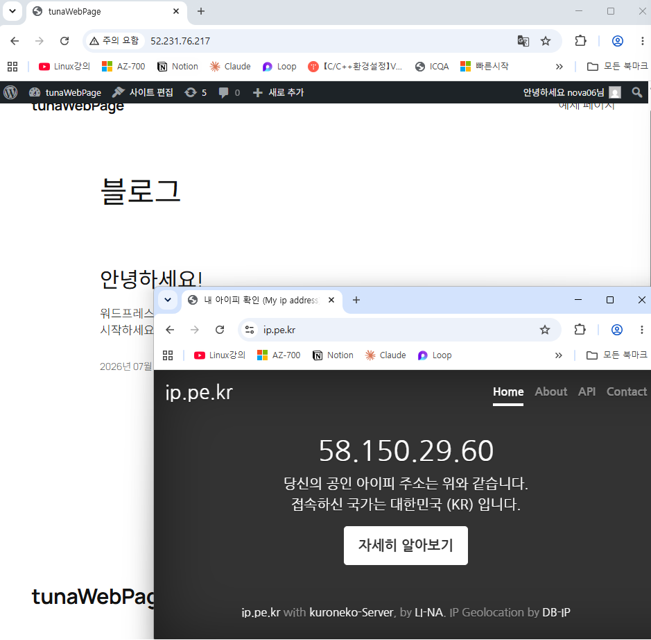
<sub>[다른 공인 IP로 접속 → 정상 접속]</sub>

---

## MySQL 비정상 접속 탐지 검증

`fakeuser` 계정으로 잘못된 비밀번호를 6회 시도해 브루트포스를 재현했다. MySQL이 AAD 인증 전용이라 전부 `Access denied`로 실패했다.


<sub>[브루트포스 재현 — 6회 연속 `Access denied`]</sub>

MySQL Audit Log를 조회하니 `event_class_s`/`event_subclass_s`가 예상("CONNECTION"/"FAILED_CONNECT")과 달리 `connection_log`/`CONNECT`였고, **이 로그엔 연결 성공/실패를 구분하는 필드 자체가 없었다.**

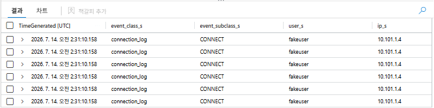
<sub>[실제 필드값 — `connection_log`/`CONNECT`]</sub>


<sub>[추가 필드 확인 — 성공/실패 구분 필드 없음]</sub>

"실패 유추" 대신 **정식 계정 목록에 없는 사용자명으로 접속 시도한 것 자체**를 탐지 조건으로 바꿨다.

```bash
AzureDiagnostics
| where Category == "MySqlAuditLogs"
| where event_class_s == "connection_log" and event_subclass_s == "CONNECT"
| where user_s !in ("tuna-web-vm", "student612", "former-employee")
```

배포 후 CLI로 확인한 결과, Incident가 정상 생성됐다.


<sub>[Incident 생성 확인 — `created` 타임스탬프]</sub>

---

## 권한 변경(RBAC) 탐지 검증

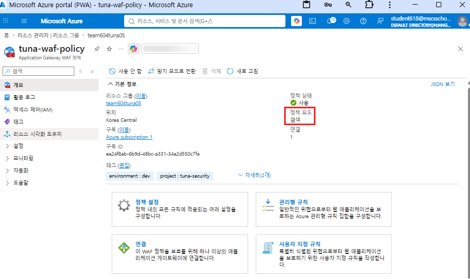
<sub>[Prevention → Detection 모드 전환 결과]</sub>

```bash
az network application-gateway waf-policy update \
  --resource-group team604tuna05 --name tuna-waf-policy \
  --set policySettings.mode=Detection
```

원래 규칙은 `AzureDiagnostics` 테이블을 봤는데, 실제 Activity Log는 **`AzureActivity`라는 별도 테이블**에 쌓였다. 필드명도 `Category`가 아니라 `CategoryValue`, `OperationName`이 아니라 `OperationNameValue`였고 값도 전부 대문자였다.

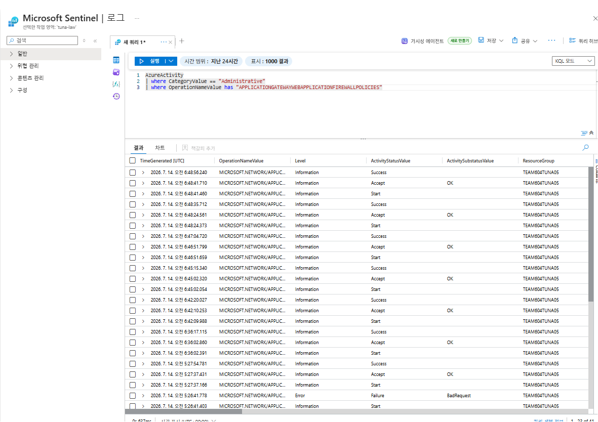
<sub>[AzureActivity 원본 로그 - 실제 필드명 확인]</sub>

정확한 스키마로 규칙을 다시 짰다.

```bash
AzureActivity
| where CategoryValue == "Administrative"
| where OperationNameValue has "ROLEASSIGNMENTS"
    or OperationNameValue has "APPLICATIONGATEWAYWEBAPPLICATIONFIREWALLPOLICIES"
    or OperationNameValue has "FIREWALLPOLICIES"
| extend Actor = Caller
```

수정된 쿼리로 재조회하니 WAF 모드 변경 이벤트가 정확히 잡혔다. 하나의 변경이 Start → Accept → Success 3단계로 기록되는 구조까지 확인했다.

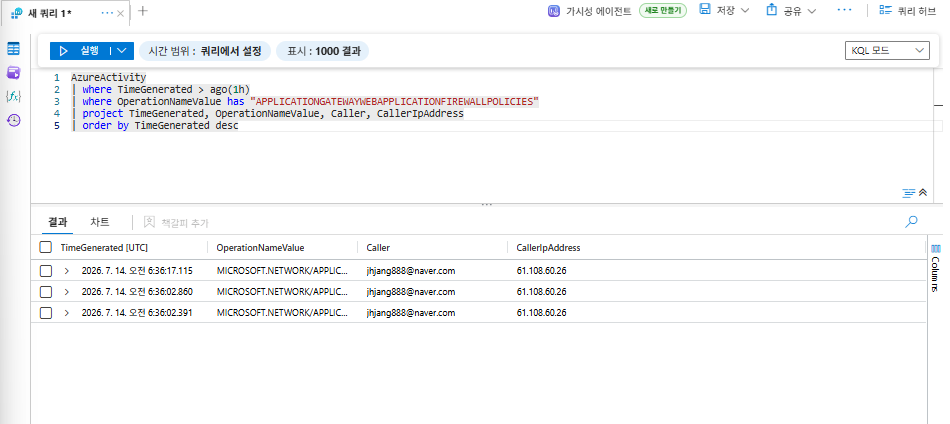
<sub>[수정된 쿼리 재조회 - WAF 모드 변경 이벤트 매치]</sub>

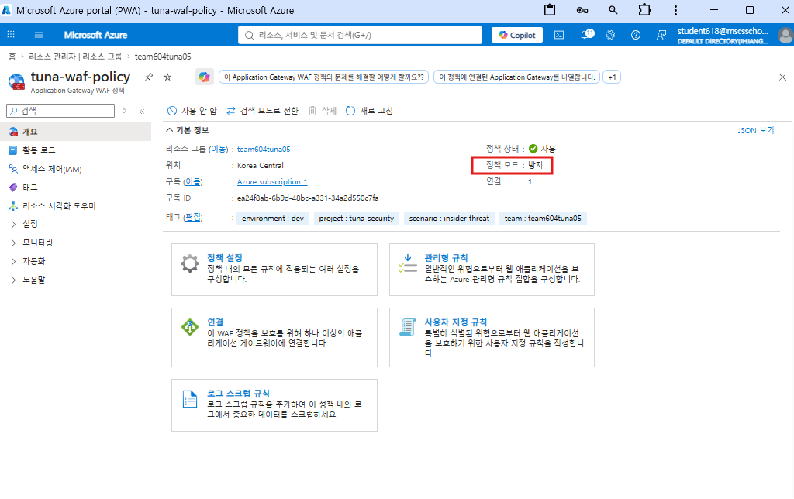
<sub>[WAF 모드 Prevention 복구 확인]</sub>

---

## 취약점 재현 및 탐지 검증 현황

| 공격 시나리오             | 재현  | WAF 차단            | Sentinel 탐지    | 자동 대응           |
| ------------------- | --- | ----------------- | -------------- | --------------- |
| 웹쉘 업로드              | ✅   | ✅ (933110→949110) | ✅ (KQL 수정)     | ✅ (High, 자동 차단) |
| SSRF                | ✅   | ✅ (931100/931130) | ✅ (수정 불필요)     | ✅ (High, 자동 차단) |
| SQL Injection       | ✅   | ✅ (942xxx)        | ✅ (수정 불필요)     | 이메일만 (Medium)   |
| MySQL 비정상 접속        | ✅   | - (인증 자체 거부)      | ✅ (KQL 재설계)    | 이메일만 (Medium)   |
| 방화벽 미허용 아웃바운드       | -   | -                 | ✅ (오탐 34건 수정)  | 이메일만 (Medium)   |
| 권한 변경 (RBAC/WAF 정책) | ✅   | -                 | ✅ (테이블·필드 재설계) | 이메일만 (Medium)   |

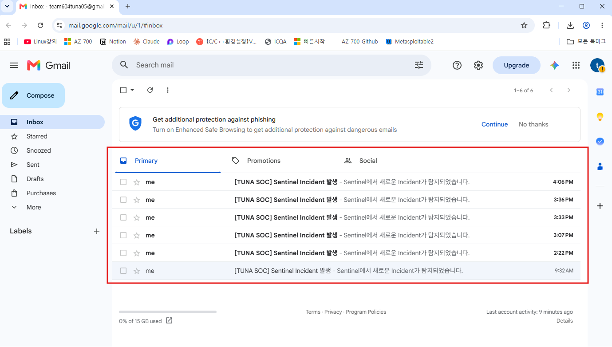
<sub>[이메일 확인]</sub>

---

## 트러블슈팅

| 문제                              | 원인                                                         | 해결                                        |
| ------------------------------- | ---------------------------------------------------------- | ----------------------------------------- |
| Storage Account 생성 실패           | 이름이 Azure 전역에서 이미 사용 중                                     | 이름 교체 후 재배포                               |
| WordPress DB 연결 오류              | 등록 스크립트가 내부 실패를 감지 못해 조용히 실패                               | 로그인 계정 검증 + ERROR 감지, OID 자동 갱신           |
| 웹쉘 규칙 결과 0건                     | 매치(933110)와 차단(949110)이 다른 로그 줄이라 AND 조건에 안 걸림             | 933110 매치 자체를 탐지 조건으로 수정                  |
| Incident 35건 중 34건 오탐           | 방화벽 규칙이 정상 배경 트래픽까지 탐지                                     | 정상 트래픽 제외 조건 추가                           |
| Office 365 이메일 연결 실패            | 사서함이 REST API 미지원 게스트 계정                                   | SMTP 커넥터로 전환                              |
| Playbook 재배포 시 워크플로우 초기화        | Terraform이 트리거/액션까지 관리해 apply마다 덮어씀                        | Logic App은 빈 껍데기만 관리, 트리거·액션은 Designer 전담 |
| Automation Rule 연결 시 트리거 인식 실패    | 한국어 포털 UI가 트리거 이름을 `Microsoft_Sentinel_인시던트`로 자동 번역 저장       | Code view에서 트리거 키 이름을 영문(`Microsoft_Sentinel_incident`)으로 수정 |
| 자동 차단 PATCH 실패                  | ARM PATCH는 태그 전용                                           | PUT으로 전환                                  |
| 자동 차단 PUT 실패 (location, 규칙셋 소실) | PUT은 전체 교체라 누락 시 소실 위험                                     | 기존 정책 전체 조회 후 완전한 Body로 재구성               |
| MySQL 규칙 미탐지                    | Audit Log에 성공/실패 구분 필드 자체가 없음                              | 미등록 계정 접속 시도로 조건 재설계                      |
| 권한 변경 규칙 미탐지                    | `AzureDiagnostics`가 아닌 `AzureActivity` 테이블, 필드명·대소문자 전부 다름 | 테이블·필드명 전면 수정                             |

---

## 정리 및 회고

- WAF 로그는 "매치"와 "차단"이 다른 줄에 남는다. 탐지 규칙은 실제 로그를 먼저 보고 그 구조에 맞춰 짜야 한다는 걸 체감했다.
- Incident 35건 중 34건이 오탐이었던 게 가장 값진 경험이었다. 탐지되는 것과 쓸모 있게 탐지되는 것은 다르다. 규칙 범위가 넓으면 진짜 위협이 노이즈에 묻힌다.
- Sentinel Incident 트리거의 인증은 Azure가 의도적으로 사람 승인을 요구하도록 설계했다. 반면 자동 차단 로직처럼 원래 자동화 가능한 부분은 API 스펙(PATCH 제약, 엔터티 경로)을 하나씩 검증하며 코드로 완성했다.
- 4번 프로젝트가 "침투를 막을 수 있는가"를 검증했다면, 이번은 "막은 뒤 사람이 알아채고 대응까지 자동으로 이어지는가"를 검증했다.
- 자동 차단은 오탐 시 정상 사용자를 차단할 위험이 있다. 방화벽 오탐 사례로 이걸 먼저 겪은 덕분에, 자동 차단 범위를 High 심각도로만 한정하는 설계를 할 수 있었다.
- 규칙 6개 중 절반 이상에서 "예상한 필드명과 실제가 달랐다." 코드부터 짜고 나중에 맞추는 순서로는 계속 어긋났고, 실제 로그를 먼저 조회하는 습관을 들인 뒤로는 검증 속도가 빨라졌다.
