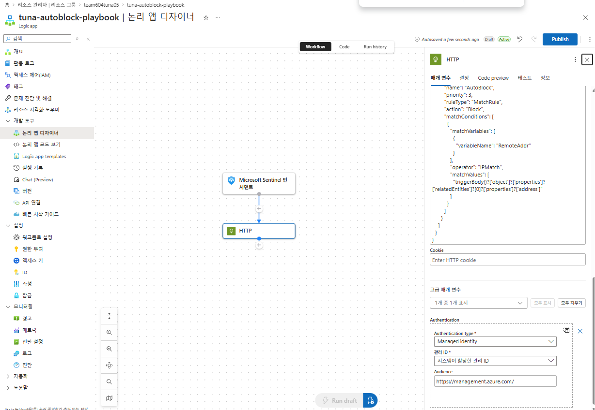
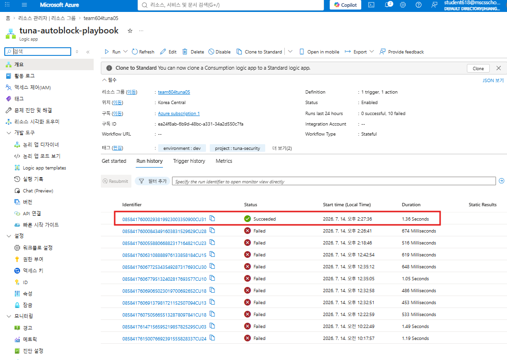
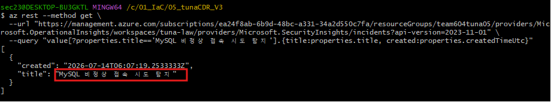

---
## 개요

이전 프로젝트(App 보안 설계)에서 구축한 WAF·Firewall·MySQL Entra ID 인증 기반 인프라 위에, 이번에는 **탐지·대응(Cloud Detection & Response)** 관점을 추가한 프로젝트다. 웹쉘 업로드·SSRF·SQL Injection·MySQL 비정상 접속 공격을 재현하고, Azure Firewall/WAF/MySQL 로그를 Microsoft Sentinel로 수집·분석해 실제 Incident를 생성한 뒤, 이메일 알림과 공격자 IP 자동 차단까지 이어지는 탐지·대응 파이프라인 전체를 구축·검증했다.

**핵심 키워드**: Microsoft Sentinel · Log Analytics · KQL 분석 규칙 · Automation Rule · Logic App Playbook · 오탐(False Positive) 분석 · 자동 대응

---

## 아키텍처 개요

기존 프로젝트의 네트워크 구조(Web/DB/Bastion/Firewall 서브넷 분리, UDR 강제 경유, MySQL delegated subnet)를 재사용하고, 그 위에 탐지·대응 계층을 추가했다.

- **Application Gateway (WAF_v2, Prevention 모드)**: OWASP CRS 3.2 + 업로드 폴더 PHP 실행 차단 커스텀 룰
- **Azure Firewall**: 아웃바운드 단일 출구, DNS Proxy로 VNet DNS 강제 경유
- **Azure Bastion (Standard)**: Entra ID 기반 SSH 로그인
- **MySQL Flexible Server**: Entra ID 전용 인증, Audit Log 활성화
- **Log Analytics + Microsoft Sentinel**: Firewall/WAF/MySQL/구독 Activity 로그 통합, 분석 규칙 6개로 Incident 자동 생성
- **Sentinel Automation Rule + Logic App Playbook**: Incident 발생 시 이메일 알림 자동 발송, High 심각도는 공격자 IP를 WAF에 자동 차단

---

## Terraform 인프라 구현

**Bootstrap**

- Key Vault·Storage Account를 별도 리소스그룹(`team604tuna05-infra`)에 분리 배치


<sub>[terraform apply 완료 로그 — `Apply complete!` 및 output 값(공인 IP, MySQL FQDN 등)]</sub>


<sub>[`team604tuna05-infra` 리소스그룹 개요 — Key Vault, Storage Account 생성 확인]</sub>

**Log Analytics & Sentinel 온보딩**

- `tuna-law` 워크스페이스 생성, 보존기간 30일 / `daily_quota_gb = 1`로 일일 수집량 상한 설정
- Firewall/MySQL/구독 Activity/WAF, 4개 소스 진단 설정 연결

**Sentinel 분석 규칙 6개**

| 규칙 | 대상 로그 | 심각도 |
|---|---|---|
| 웹쉘 업로드 | WAF FirewallLog | High |
| SSRF/IMDS | WAF FirewallLog | High |
| SQL Injection | WAF FirewallLog | Medium |
| MySQL 비정상 접속 | MySqlAuditLogs | Medium |
| 방화벽 미허용 아웃바운드 | Firewall App/Network Rule | Medium |
| 권한 변경 | Activity Log | Medium |


<sub>[Sentinel 분석 규칙 6개 활성화 화면 — 심각도 High 2 / Medium 4]</sub>

---

## WordPress 초기 설치

배포된 App Gateway 공인 IP로 접속해 WordPress 설치를 완료했다 (사이트 제목 `tunaWebPage`, 관리자 계정 `nova06`).


<sub>[WordPress 설치 정보 입력 화면]</sub>

---

## MySQL Entra ID 인증 검증

VM의 Managed Identity Object ID와 MySQL에 등록된 AAD 사용자 정보를 대조해 인증 경로를 검증했다. 배포 직후 DB 연결 오류가 있었으나, 계정 등록 스크립트의 오류 감지 로직 보강과 OID 자동 갱신 로직 추가로 해결했다(트러블슈팅 참고). WordPress가 비밀번호 없이 AAD 토큰만으로 정상 접속되는 것까지 확인했다.


<sub>[`mysql.user` 조회 결과 — `AUTHENTICATION_STRING`이 VM Managed Identity Object ID와 일치 확인]</sub>


<sub>[WordPress 사이트 정상 접속 화면]</sub>

---

## 웹쉘 업로드 탐지 검증

`/upload.php`로 PHP 웹쉘(`<?php system($_GET['cmd']); ?>`) 업로드를 시도한 결과, WAF Prevention 모드에서 요청 자체가 403 Forbidden으로 차단됐다. Sentinel 분석 규칙의 KQL을 실제 로그 구조에 맞게 수정한 뒤, 실제 시도 횟수(2회)와 정확히 일치하는 탐지 결과를 확인했다.

```kql
AzureDiagnostics
| where Category == "ApplicationGatewayFirewallLog"
| where ruleId_s == "933110" or (requestUri_s has "/uploads/" and requestUri_s endswith ".php")
| extend AttackerIP = clientIp_s
```


<sub>[`upload.php` 업로드 폼에서 `shell.php` 파일 선택]</sub>


<sub>[웹쉘 업로드 시도 → 403 Forbidden]</sub>


<sub>[원본 로그 조회 — 933110(Matched)·949110(Blocked) 확인]</sub>


<sub>[수정된 Sentinel 쿼리 실행 결과 — 실제 공격 횟수(2건)와 정확히 일치]</sub>

---

## SSRF / SQL Injection 탐지 검증

SSRF(`/ssrf.php?url=http://169.254.169.254/...`)와 SQL Injection(`/search.php?q=' OR '1'='1`) 모두 WAF Prevention 모드에서 요청 자체가 403 Forbidden으로 차단됐다. 로그에서는 SSRF가 OWASP CRS `931100`(절대 URL 접근)·`931130`(IP 직접 접근) 매치로, SQLi는 `942xxx` 계열 룰 7~8개가 동시에 매치되는 것으로 확인됐다. 두 규칙은 웹쉘과 달리 KQL 수정 없이 처음부터 정확하게 탐지됐다.

**SSRF**


<sub>[SSRF 요청 → 403 Forbidden 차단]</sub>


<sub>[WAF 로그 전체 조회 — 931100·931130 매치 확인]</sub>


<sub>[SSRF 탐지 Sentinel 쿼리 실행 결과 — 4건 매치]</sub>

**SQL Injection**


<sub>[WAF 로그 전체 조회 — 942xxx 계열 룰 7~8개 매치, `942100`에 "Detect Sql Injection at ARGS" 명시]</sub>


<sub>[SQL Injection 탐지 Sentinel 쿼리 실행 결과 — 7건 매치]</sub>

---

## Incident 발생 현황 및 오탐 분석

Sentinel "사고" 메뉴에서 총 35건의 Incident를 확인했다 (High 1건, Medium 34건). High 1건은 직접 재현한 SSRF 공격이었지만, Medium 34건이 전부 같은 규칙(방화벽 미허용 아웃바운드)에서 반복 발생하고 있어 오탐 여부 점검이 필요했다.


<sub>[Sentinel 사고 메뉴 — High 1건 / Medium 34건]</sub>

원본 로그(`msg_s`)를 직접 조회한 결과, 34건 전부 `wp-cron.php`로 WordPress가 자기 자신(App Gateway 공인 IP)을 주기적으로 호출하는 정상 동작이 화이트리스트 밖이라 차단된 것으로 확인됐다.


<sub>[Incident 상세 로그 — `wp-cron.php` 자기참조 트래픽, 오탐으로 확인]</sub>

`wp-cron.php` 등을 제외하고 재조회하니 18건이 남았고, 확인 결과 Ubuntu Snap 업데이트 체크, WordPress 코어 업데이트 체크, Azure Application Insights 텔레메트리, Azure 관리 디스크 백엔드 통신 등 전부 정상적인 OS/WordPress/Azure 인프라 배경 트래픽이었다.


<sub>[1차 제외 조건 적용 후 재조회 — 18건 남음]</sub>


<sub>[남은 18건 상세 확인 — 전부 정상 트래픽으로 판명]</sub>

**Incident 35건 중 34건(97%)이 오탐**으로 확인됐다. 규칙이 너무 광범위해 실제 위협이 노이즈에 묻힐 위험(Alert Fatigue)이 있어, 정상 트래픽 목적지를 제외하는 조건을 추가했다.

```kql
AzureDiagnostics
| where Category in ("AzureFirewallApplicationRule", "AzureFirewallNetworkRule")
| where msg_s has "Deny"
| where msg_s !has "wp-cron.php"
| where msg_s !has "52.231.76.217"
| where msg_s !has "api.snapcraft.io"
| where msg_s !has "wordpress.org"
| where msg_s !has "visualstudio.com"
| where msg_s !has "blob.storage.azure.net"
```

수정된 규칙으로 재확인한 결과, 34건이던 오탐이 `raw.githubusercontent.com` 관련 1건으로 줄었다. 반복되지 않는 일회성 시도라 우선순위는 낮지만 원인 확인이 필요한 항목으로 남겨뒀다.


<sub>[규칙 수정 적용 후 재조회 — 34건 → 1건으로 감소]</sub>


<sub>[남은 1건 상세 — `raw.githubusercontent.com` 접근 시도, 원인 미확인]</sub>

---

## 알림 자동화 (Playbook) 구축

Incident 발생 시 이메일로 알림을 받기 위해 Sentinel Automation Rule + Logic App Playbook 구조를 구축했다. 처음엔 Office 365 Outlook 커넥터로 시도했으나, 사용 중인 계정이 REST API를 지원하지 않는 게스트/샌드박스 사서함이라 연결 자체가 실패했다.


<sub>[Office 365 연결 테스트 실패]</sub>


<sub>[권한 부여 시도 및 오류 — REST API 미지원 사서함]</sub>

Office 365 커넥터(OAuth 인증) 대신 **SMTP 커넥터(기본 인증)로 Gmail에서 직접 발송하는 방식**으로 전환했다. SMTP 인증에는 2단계 인증과 앱 비밀번호가 필요해 순서대로 설정했다.


<sub>[Google 계정 2단계 인증 활성화]</sub>


<sub>[앱 비밀번호 발급 화면]</sub>


<sub>[16자리 앱 비밀번호 발급 완료]</sub>

Sentinel Incident 트리거(`azuresentinel` 커넥터)는 Azure 정책상 Portal에서 사람이 1회 로그인 승인해야만 연결이 완성된다. Terraform으로 트리거/액션 내용까지 직접 관리하면 재배포할 때마다 이 연결이 초기화되는 문제를 겪은 뒤, **Logic App은 Terraform으로 빈 껍데기만 만들고, 트리거·액션 내용은 Portal Designer에서 완성**하는 방식으로 최종 확정했다.


<sub>[SMTP 연결 생성 — 서버/사용자 이름/앱 비밀번호 입력]</sub>


<sub>[메일 보내기 액션 고급 매개변수 — 받는 사람/제목/본문 필드 선택]</sub>


<sub>[받는 사람/제목/본문 필드 값 입력 완료]</sub>


<sub>[워크플로우 Publish 완료 — 트리거/액션 정상 인식]</sub>

SQL Injection을 재현해 새 Incident를 발생시킨 뒤, `team604tuna05@gmail.com`으로 `[TUNA SOC] Sentinel Incident 발생` 메일이 실제로 도착하는 것을 확인했다. 탐지부터 알림까지 사람 개입 없이 자동으로 작동하는 것을 검증했다.


<sub>[Automation Rule 설정 — Playbook 연결 확인]</sub>


<sub>[실제 수신된 알림 이메일]</sub>

**왜 트리거 연결만 수동이어야 했는가**: Terraform 코드만으로 Playbook이 Sentinel Incident 데이터에 접근할 권한까지 자동 부여할 수 있다면, 코드나 Terraform state가 유출되는 것만으로 조직의 보안 이벤트 데이터에 임의로 접근하는 자동화가 몰래 심어질 수 있다. Azure는 이 연결만큼은 반드시 사람이 직접 로그인해 승인하도록 설계해뒀다. 이 승인은 리소스를 유지하는 한 최초 1회만 필요하고, 이후 탐지→Incident 생성→Playbook 실행→알림까지는 완전히 자동으로 반복된다.

---

## 공격자 IP 자동 차단 Playbook

High 심각도 Incident 발생 시 공격자 IP를 WAF 커스텀 룰에 자동으로 추가해 차단하는 두 번째 Playbook을 구축했다. 이메일 Playbook과 달리 로그인 인증이 필요 없는 **Managed Identity 기반 HTTP 액션**으로 구성해, 트리거 연결만 Designer에서 1회 완료하면 이후 완전 자동화가 가능하다.

첫 시도는 `PATCH` 메서드로 WAF 정책의 `customRules`만 갱신하려 했으나, Azure Resource Manager의 `PATCH`는 태그(tags) 수정 전용으로 제한되어 있어 실패했다(`OnlyTagsSupportedForPatch`).


<sub>[HTTP 액션 최초 설정 — Method: PATCH, Body에 `customRules` 배열(AllowWpPaths/BlockUploadsPhp/AutoBlock)]</sub>

```
{
  "error": {
    "code": "OnlyTagsSupportedForPatch",
    "message": "PATCH request content includes properties property. Only tags property is currently supported."
  }
}
```

`PUT`으로 전환하니, 이번엔 리소스 전체를 교체하는 `PUT`의 특성상 `location` 속성이 없다는 오류(`LocationRequired`)가 발생했다. 기존 WAF 정책을 조회해 `location`, `managedRules`(OWASP 규칙셋), `policySettings`까지 전부 포함한 완전한 Body로 재구성한 뒤에야 성공했다 — 그 전 단계에서는 `managedRules`를 빠뜨려 OWASP 규칙셋이 통째로 날아가는 오류(`ApplicationGatewayFirewallManagedRuleSetsNoValidPrimaryRuleSetsAttached`)도 겪었다.

공격자 IP는 Sentinel Incident의 `relatedEntities[0].properties.address` 경로에 담겨 있는 것을 실제 트리거 payload로 확인해 동적 콘텐츠로 연결했다.


<sub>[수정된 HTTP 액션 — `AutoBlock` 룰에 동적 콘텐츠(`relatedEntities[0].properties.address`) 연결, Authentication: Managed Identity]</sub>

SSRF를 다시 재현한 뒤 실행 기록을 확인한 결과, 여러 번의 실패 끝에 실제로 성공(Succeeded)한 실행을 확인했다.


<sub>[`tuna-autoblock-playbook` 실행 기록 — 여러 번의 실패 끝에 Succeeded 확인]</sub>

WAF 정책을 직접 조회해 `AutoBlock` 커스텀 룰에 실제 공격자 IP(`61.108.60.26`)가 자동으로 추가된 것을 확인했다.


<sub>[`az network application-gateway waf-policy show`로 조회 — `AutoBlock` 룰에 공격자 IP `61.108.60.26` 등록 확인]</sub>

이후 같은 공인 IP로는 사이트 접속이 실제로 차단되는 것까지 확인했다. 반대로 와이파이를 바꿔 다른 공인 IP(`58.150.29.60`)로 접속하니 정상적으로 열리는 것도 함께 확인해, 차단이 IP 단위로 정확히 적용된다는 것을 검증했다 (중간에 `https://`로 접속을 시도해 연결이 안 됐던 건, WAF 차단이 아니라 애초에 443 포트 리스너 자체가 없어서였다는 것도 함께 확인했다).


<sub>[차단된 공인 IP(`61.108.60.26`)로 접속 시도 → 사이트 연결 불가]</sub>


<sub>[와이파이를 바꿔 다른 공인 IP(`58.150.29.60`)로 접속 → 정상 접속 확인]</sub>

---

## MySQL 비정상 접속 탐지 검증

`fakeuser` 계정으로 잘못된 비밀번호를 6회 연속 시도해 브루트포스를 재현했다. MySQL이 AAD 인증 전용이라 모든 시도가 `Access denied`로 실패했다.


<sub>[`fakeuser` 브루트포스 재현 — 6회 연속 `Access denied`]</sub>

MySQL Audit Log(`MySqlAuditLogs`)를 직접 조회한 결과, `event_class_s`/`event_subclass_s` 필드가 예상("CONNECTION"/"FAILED_CONNECT")과 달리 실제로는 `connection_log`/`CONNECT`였고, **이 로그 스키마 자체에 연결 성공/실패를 구분하는 필드가 없다**는 것을 확인했다.


<sub>[실제 필드값 확인 — `event_class_s: connection_log`, `event_subclass_s: CONNECT`, `user_s: fakeuser`]</sub>


<sub>[추가 필드 확인 — `ip_s`, `is_aad_auth_s: false` 등 (성공/실패 구분 필드 없음을 재확인)]</sub>

그래서 "실패를 유추"하는 대신 **Terraform으로 등록한 정식 계정 목록에 없는 사용자명으로 접속을 시도한 것 자체**를 탐지 조건으로 변경했다.

```kql
AzureDiagnostics
| where Category == "MySqlAuditLogs"
| where event_class_s == "connection_log" and event_subclass_s == "CONNECT"
| where user_s !in ("tuna-web-vm", "student612", "former-employee")
```

수정된 규칙을 배포하고 CLI로 직접 확인한 결과, `MySQL 비정상 접속 시도 탐지` Incident가 정상적으로 생성됐다.


<sub>[`az rest`로 조회한 Incident 생성 확인 — `created` 타임스탬프와 제목("MySQL 비정상 접속 시도 탐지") 확인]</sub>


## 권한 변경

/file-20260714160156010.png)
먼저 prevention에서 detection으로 전환 --> 보안낮춤

/file-20260714160334239.png)


/file-20260714154550973.png)

---


## 취약점 재현 및 탐지 검증 현황

| 공격 시나리오 | 재현 | WAF 차단 | Sentinel 탐지 | 자동 대응 |
|---|---|---|---|---|
| 웹쉘 업로드 | ✅ | ✅ (933110→949110) | ✅ (KQL 수정) | ✅ (High, 자동 차단) |
| SSRF | ✅ | ✅ (931100/931130) | ✅ (수정 불필요) | ✅ (High, 자동 차단) |
| SQL Injection | ✅ | ✅ (942xxx) | ✅ (수정 불필요) | 이메일만 (Medium) |
| MySQL 비정상 접속 | ✅ | - (인증 자체 거부) | ✅ (KQL 재설계) | 이메일만 (Medium) |
| 방화벽 미허용 아웃바운드 | - | - | ✅ (오탐 34건 규명·수정) | 이메일만 (Medium) |
| 권한 변경 (RBAC/WAF 정책 수정) | 🔲 미착수 | - | 🔲 미검증 | 🔲 미검증 |

---

## 트러블슈팅

| 문제 | 원인 | 해결 |
|---|---|---|
| Storage Account 생성 실패 (`StorageAccountAlreadyTaken`) | 이름이 Azure 전역에서 이미 사용 중 | 이름 전면 교체 후 재배포 |
| WordPress DB 연결 오류 | 계정 등록 스크립트가 `az vm run-command`의 내부 실패를 감지 못해 조용히 실패 | 로그인 계정 검증 + ERROR 감지 로직 추가, `DROP` 후 재생성으로 OID 자동 갱신 |
| Sentinel 웹쉘 규칙 결과 0건 | 매치(933110)와 차단(949110)이 서로 다른 로그 줄에 기록되는데 AND로 묶어 매치 행이 없었음 | 933110 매치 자체를 탐지 조건으로 수정 |
| Incident 35건 중 34건 오탐 | 방화벽 아웃바운드 규칙이 WordPress cron/OS 업데이트 체크 등 정상 배경 트래픽까지 탐지 | 정상 트래픽 목적지를 제외 조건으로 추가 |
| Office 365 이메일 연결 실패 | 사서방이 REST API 미지원 샌드박스/게스트 계정 | SMTP 커넥터(Gmail 앱 비밀번호 기반)로 전환 |
| Playbook 재배포 시 워크플로우 초기화 | Terraform이 트리거/액션/연결 파라미터까지 관리하면서 apply할 때마다 Designer에서 완성한 상태를 덮어씀 | Logic App은 빈 껍데기만 Terraform 관리, 트리거·액션은 Portal Designer 전담으로 역할 분리 |
| WAF 자동 차단 PATCH 실패 (`OnlyTagsSupportedForPatch`) | ARM의 PATCH는 태그 수정 전용 | PUT으로 전환 |
| WAF 자동 차단 PUT 실패 (`LocationRequired`, 규칙셋 소실) | PUT은 리소스 전체 교체라 `location`/`managedRules`/`policySettings` 누락 시 소실 위험 | 기존 정책 전체를 조회해 모든 속성을 포함한 완전한 Body로 재구성 |
| MySQL 규칙이 계속 탐지 안 됨 | Audit Log 스키마에 연결 성공/실패 구분 필드 자체가 없어 잘못된 조건으로 설계됨 | 미등록 계정 접속 시도 자체를 탐지 조건으로 재설계 |

---

## 코드 버전 이력 요약

- 초기 배포 → MySQL 등록 스크립트 오류 감지·OID 자동 갱신 보강
- 웹쉘 탐지 규칙 KQL 실측 수정
- 방화벽 아웃바운드 규칙 오탐 제외 조건 추가
- Sentinel Automation Rule + Playbook 도입 (Office 365 → SMTP 전환)
- Playbook 관리 범위를 Terraform(빈 껍데기)과 Portal Designer(트리거·액션)로 분리
- 자동 IP 차단 액션 PATCH→PUT 전환, 정확한 엔터티 경로 반영
- MySQL 비정상 접속 규칙 재설계

---

## 남은 작업

- [ ] 권한 변경(RBAC/WAF 정책 수정) 규칙 재현 및 탐지 검증
- [ ] `raw.githubusercontent.com` 접근 원인 확인 (우선순위 낮음)
- [ ] 기존 오탐 Incident 34건 Sentinel에서 "닫힘" 처리 (선택)

---

## 정리 및 회고

- WAF 로그 하나만 봐도 "매치(Matched)"와 "차단(Blocked)"이 서로 다른 로그 줄에 남는다는 걸 실제로 겪고 나서야, 탐지 규칙은 반드시 실제 로그를 먼저 조회해보고 그 구조에 맞춰 짜야 한다는 걸 체감했다.
- Incident 35건 중 34건이 오탐이었던 게 이번 프로젝트에서 가장 값진 경험이었다. "탐지된다"와 "쓸모 있게 탐지된다"는 다르다 — 규칙 범위를 너무 넓게 잡으면 진짜 위협이 노이즈에 묻힌다는 걸(Alert Fatigue) 숫자로 직접 확인했다.
- Playbook 자동화는 인프라 코드화(Terraform)만으로 끝나지 않는 영역이 분명히 있었다. Sentinel Incident 트리거의 연결 인증만큼은 Azure가 의도적으로 사람의 승인을 요구하도록 설계해뒀고, 이건 보안상 합리적인 제약이라는 걸 이해하고 나니 막힘이 아니라 정상적인 설계로 받아들여졌다. 반면 자동 차단 로직(WAF PUT 액션)처럼 원래 완전 자동화가 가능한 부분은, 실제 API 스펙(PATCH 제약, 엔터티 경로)을 하나씩 검증해가며 끝까지 코드로 완성했다.
- 4번 프로젝트가 "침투를 막을 수 있는가"를 검증했다면, 이번 프로젝트는 "막은 뒤 그걸 사람이 알아채고, 대응까지 자동으로 이어지는가"를 검증한 것에 가깝다. 탐지 규칙 하나 배포하는 걸로 끝나는 게 아니라, 실제 로그로 검증하고 오탐을 줄이고 알림·자동 대응까지 도달시키는 전체 사이클을 처음부터 끝까지 겪어봤다.
- 자동 차단은 오탐 시 정상 사용자를 차단할 위험이 있어, 검증 없이 실제 운영에 적용하면 안 된다는 걸 방화벽 오탐 사례로 미리 배운 덕분에 자동 차단 범위를 High 심각도로만 한정하는 설계를 할 수 있었다.
- 남은 과제는 권한 변경(RBAC) 규칙의 실제 재현이다.
