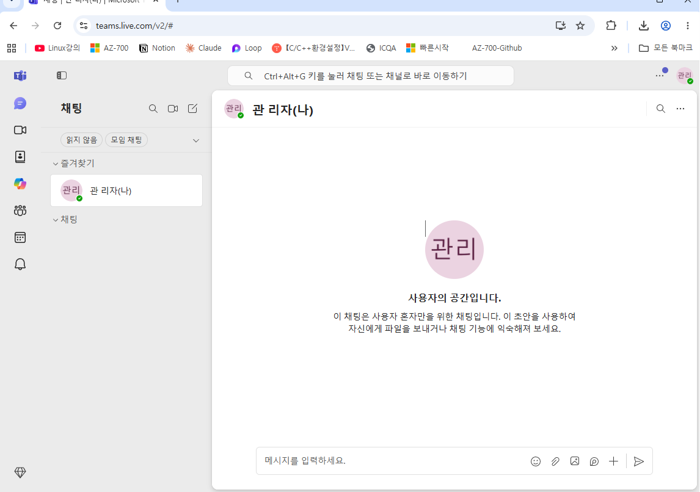
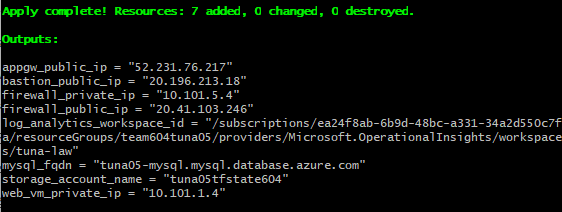
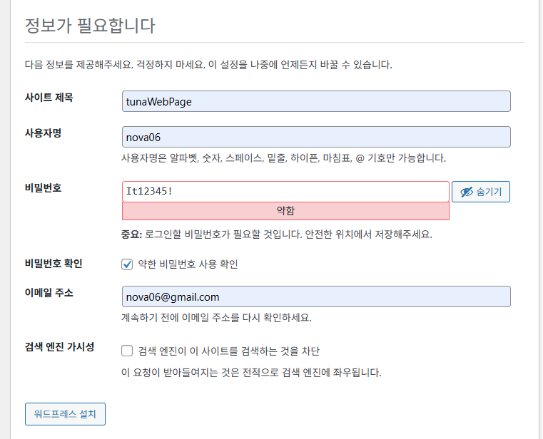
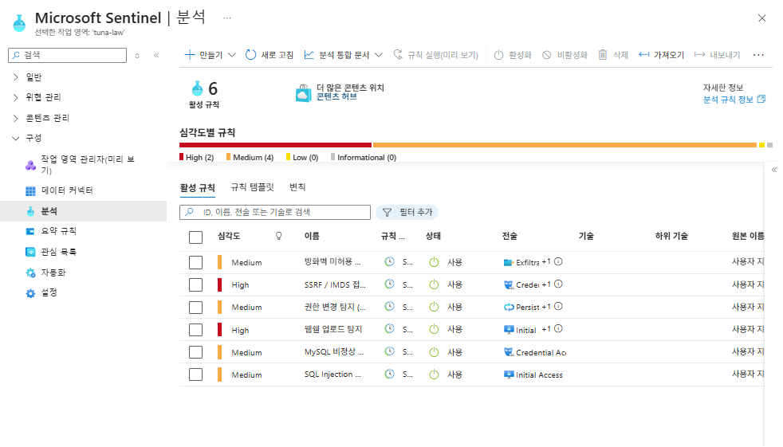
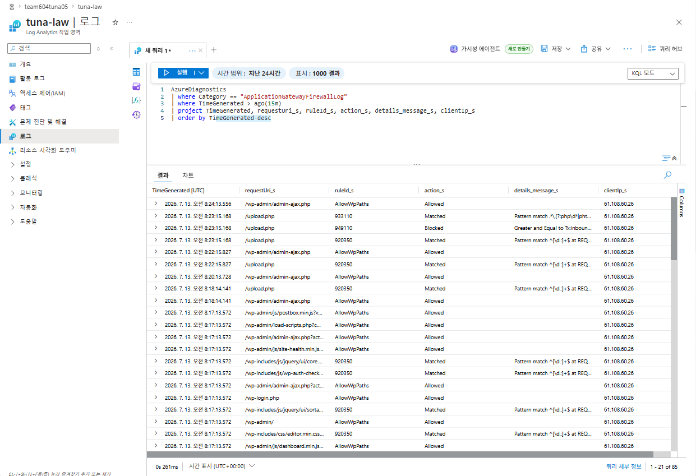

---
진행중

센티널, 탐지대응

팀즈 이메일 생성(알람용)

관리자 계정으로 추가
-> 먼가 문제..

워드 프레스 초기 설정
## sentinel

### 웹 쉘 업로드 공격

OWASP CRS 933xxx(PHP Injection) 룰이 매치되고 누적 이상 점수가 임계값을 넘어서 최종적으로 Blocked됨을 확인가능 --> 웹쉘 업로드 탐지 정상 작동

+추가로 /wp-admin, /wp-login.php 경로 - AllowWpPaths 커스텀 룰로 Allowed 처리됨을 확인 가능 --> WordPress 정상 사용 방해하지 않는지 검증

#### Sentinel 규칙 검증

