---
## 개요

이전 프로젝트(App 보안 설계)에서 구축한 WAF·Firewall·MySQL Entra ID 인증 기반 인프라 위에, 이번에는 **탐지·대응(Cloud Detection & Response)** 관점을 추가한 프로젝트. 웹쉘 업로드·SSRF·SQL Injection 공격을 재현하고, 이 공격들이 Azure Firewall/WAF/MySQL 로그에 어떻게 남는지 Microsoft Sentinel로 수집·분석해 실제 탐지·대응까지 이어지는 것을 목표로 진행중이다.

**핵심 키워드**: Microsoft Sentinel · Log Analytics Workspace · KQL 분석 규칙 · WAF/Firewall/MySQL 진단 로그 통합 · Incident 대응 · Playbook 자동화

---

## 아키텍처 개요

기존 프로젝트의 네트워크 구조(Web/DB/Bastion/Firewall 서브넷 분리, UDR 강제 경유, MySQL delegated subnet)를 그대로 재사용하고, 여기에 로그 수집·분석 계층을 얹었다.

- **Application Gateway (WAF_v2, Prevention 모드)**: OWASP CRS 3.2 + 업로드 폴더 PHP 실행 차단 커스텀 룰
- **Azure Firewall**: 아웃바운드 단일 출구, DNS Proxy로 VNet DNS 강제 경유
- **Azure Bastion (Standard)**: Entra ID 기반 SSH 로그인
- **MySQL Flexible Server**: Entra ID 전용 인증, Audit Log(CONNECTION/DDL/DML) 활성화
- **Log Analytics Workspace + Microsoft Sentinel**: Firewall/WAF/MySQL/구독 Activity 로그를 하나의 워크스페이스로 통합, Sentinel 온보딩까지 연결

---

## Terraform 인프라 구현

**Bootstrap**

- Key Vault·Storage Account를 이전과 동일하게 별도 리소스그룹(`team604tuna05-infra`)에 분리 배치


<sub>[terraform apply 완료 로그 — `Apply complete! Resources: 7 added, 0 changed, 0 destroyed.` 및 output 값(공인 IP, MySQL FQDN 등)]</sub>

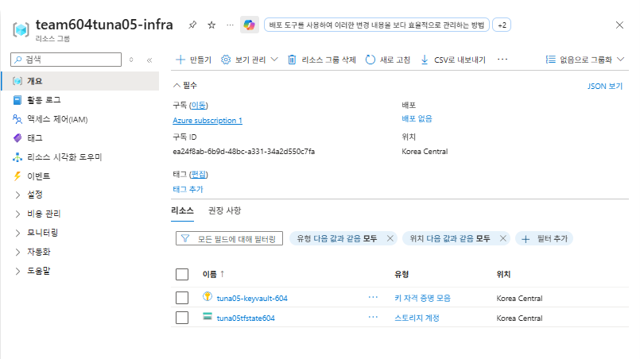
<sub>[`team604tuna05-infra` 리소스그룹 개요 — Key Vault, Storage Account 생성 확인]</sub>

**Log Analytics Workspace & Sentinel 온보딩**

- `tuna-law` 워크스페이스 생성, 보존기간 30일 / `daily_quota_gb = 1`로 일일 수집량 상한 설정
- `azurerm_sentinel_log_analytics_workspace_onboarding`으로 Sentinel(SecurityInsights) 활성화

**진단 설정(Diagnostic Settings) — 4개 소스 통합**

| 리소스 | 수집 로그/메트릭 |
|---|---|
| Azure Firewall | ApplicationRule, NetworkRule, DnsProxy 로그 + 전체 메트릭 |
| MySQL Flexible Server | SlowLogs, AuditLogs(CONNECTION/DDL/DML) + 전체 메트릭 |
| 구독 Activity Log | Administrative, Security 카테고리 |
| Application Gateway(WAF) | FirewallLog, AccessLog + 전체 메트릭 |

**Sentinel 분석 규칙(Analytics Rule) 6개 배포 — 전체 정상 활성화 확인**

Terraform(`19_sentinel_rules.tf`)으로 아래 6개 규칙을 코드화해 배포했고, Portal에서 6개 규칙 모두 심각도(High 2 / Medium 4)까지 정확히 반영되어 활성화된 것을 확인했다.

| 규칙 | 대상 로그 | 심각도 |
|---|---|---|
| 웹쉘 업로드 | WAF FirewallLog | High |
| SSRF/IMDS | WAF FirewallLog | High |
| SQL Injection | WAF FirewallLog | Medium |
| MySQL 비정상 접속 | MySqlAuditLogs | Medium |
| 방화벽 미허용 아웃바운드 | Firewall App/Network Rule | Medium |
| 권한 변경 | Activity Log | Medium |


<sub>[Sentinel 분석 규칙 6개 활성화 화면 — 심각도 High 2 / Medium 4]</sub>

---

## WordPress 초기 설치

배포된 App Gateway 공인 IP로 접속해 WordPress 설치 마법사를 완료했다 (사이트 제목 `tunaWebPage`, 관리자 계정 `nova06`).


<sub>[WordPress 설치 정보 입력 화면 — 사이트 제목 `tunaWebPage`, 사용자명 `nova06`]</sub>

---

## MySQL Entra ID 인증 검증

VM의 Managed Identity Object ID와 MySQL에 등록된 AAD 사용자 정보를 대조해 인증 경로를 검증했다. WordPress가 비밀번호 없이 AAD 토큰만으로 정상 접속되는 것까지 확인했다.


<sub>[`mysql.user` 조회 결과 — `AUTHENTICATION_STRING`이 VM Managed Identity Object ID와 일치 확인]</sub>

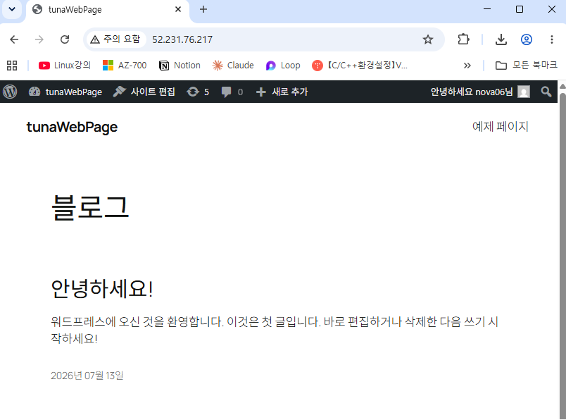
<sub>[WordPress 사이트 정상 접속 화면 (DB 연결 정상화 후)]</sub>

---

## 웹쉘 업로드 탐지 검증

`/upload.php`로 PHP 웹쉘(`<?php system($_GET['cmd']); ?>`) 업로드를 시도한 결과, **WAF Prevention 모드에서 요청 자체가 403 Forbidden으로 차단**되는 것을 확인했다. Sentinel 분석 규칙도 실제 로그 구조에 맞게 조정한 뒤, 실제 업로드 시도 횟수(2회)와 정확히 일치하는 탐지 결과를 확인했다.

```kql
AzureDiagnostics
| where Category == "ApplicationGatewayFirewallLog"
| where ruleId_s == "933110" or (requestUri_s has "/uploads/" and requestUri_s endswith ".php")
| extend AttackerIP = clientIp_s
```

**공격 시도**

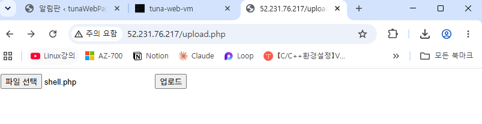
<sub>[`upload.php` 업로드 폼에서 `shell.php` 파일 선택]</sub>

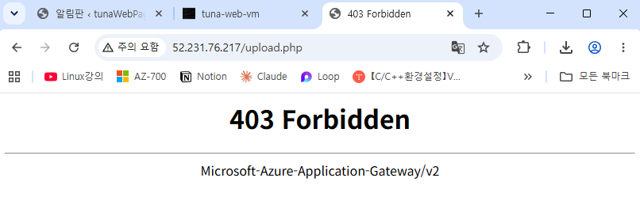
<sub>[웹쉘 업로드 시도 → 403 Forbidden (동일한 방식으로 2회 시도, 모두 차단됨)]</sub>

**로그 분석**

원본 로그 조회 시점에는 933110(Matched)과 949110(Blocked)이 서로 다른 로그 줄에 기록되는 구조가 확인됐다.


<sub>[원본 로그 조회 — `/upload.php`에서 933110(Matched)·949110(Blocked) 발견]</sub>

수정된 쿼리로 재확인한 결과:


<sub>[수정된 Sentinel 쿼리 실행 결과 — 실제 공격 횟수(2건)와 정확히 일치]</sub>

---

## SSRF / SQL Injection 탐지 검증

SSRF(`/ssrf.php?url=http://169.254.169.254/...`)와 SQL Injection(`/search.php?q=' OR '1'='1`) 모두 **WAF Prevention 모드에서 요청 자체가 403 Forbidden으로 차단**됐다. 로그에서는 SSRF가 OWASP CRS `931100`(절대 URL 접근)·`931130`(IP 직접 접근) 매치로, SQLi는 `942xxx` 계열 룰 7~8개가 동시에 매치되는 것으로 확인됐으며, 둘 다 `949110`(트랜잭션 이상 점수 초과)으로 최종 차단이 기록됐다.

두 규칙은 웹쉘과 달리 **KQL 수정 없이 처음부터 정확하게 탐지**됐다. 매치 조건(IMDS IP 문자열 포함, `942` 룰 prefix)이 전부 같은 로그 줄에 함께 기록되는 구조라, 웹쉘 때 겪었던 "조건이 서로 다른 줄에 흩어지는" 문제가 발생하지 않았다.

**SSRF**


<sub>[SSRF 요청(`/ssrf.php?url=http://169.254.169.254/...`) → 403 Forbidden 차단]</sub>

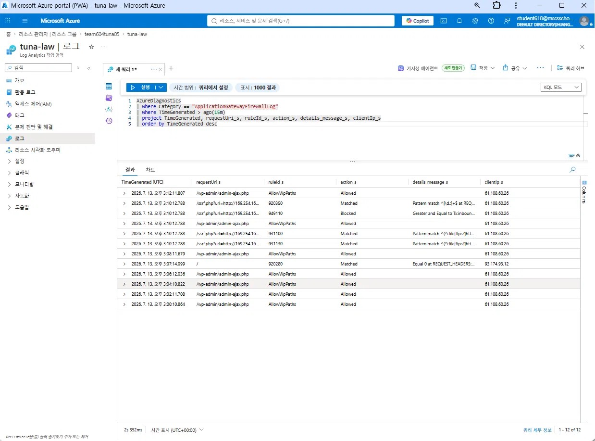
<sub>[WAF 로그 전체 조회 — SSRF 관련 931100(절대 URL 접근)·931130(IP 직접 접근) 매치 확인]</sub>

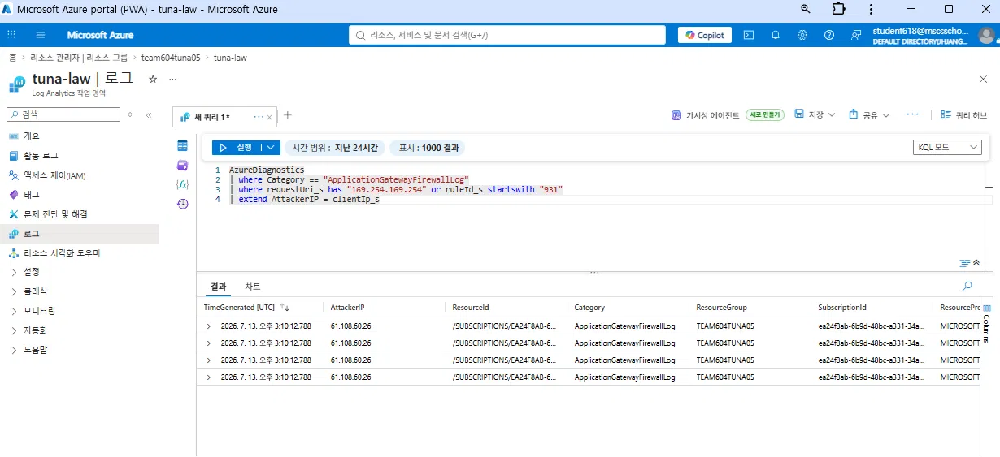
<sub>[SSRF 탐지 Sentinel 쿼리 실행 결과 — 4건 매치]</sub>

**SQL Injection**


<sub>[WAF 로그 전체 조회 — SQL Injection 관련 942xxx 계열 룰 7~8개 매치, `942100`에 "Detect Sql Injection at ARGS" 명시]</sub>


<sub>[SQL Injection 탐지 Sentinel 쿼리(`ruleId_s startswith "942"`) 실행 결과 — 7건 매치]</sub>

---

## Incident 발생 현황 및 오탐 분석

Sentinel "사고" 메뉴에서 총 **35건의 Incident**가 생성된 것을 확인했다 (High 1건, Medium 34건). High 1건은 직접 재현한 SSRF 공격이 정확히 잡힌 것이었지만, Medium 34건이 전부 같은 규칙(`방화벽 미허용 아웃바운드 탐지`)에서 반복 발생하고 있어 오탐 여부 점검이 필요했다.

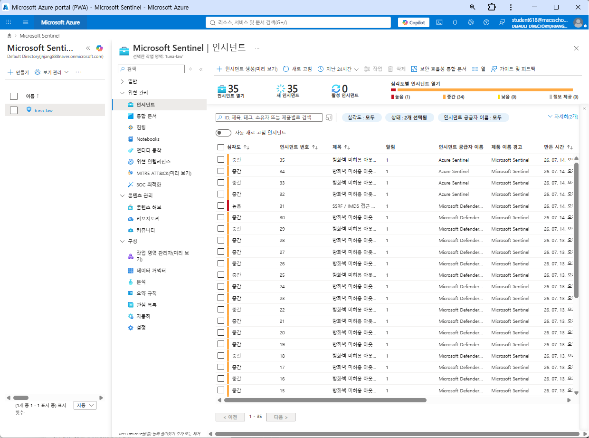
<sub>[Sentinel 사고 메뉴 — 위협 관리 > 인시던트, High 1건 / Medium 34건]</sub>

Incident 상세와 원본 로그(`msg_s`)를 직접 조회한 결과, 34건 전부 **`wp-cron.php`로 WordPress가 자기 자신(App Gateway 공인 IP)을 주기적으로 호출하는 정상 동작**이 화이트리스트 밖이라 차단된 것으로 확인됐다. 실제 공격이 아니라 WordPress 예약 작업(cron) 메커니즘의 배경 소음이었다.

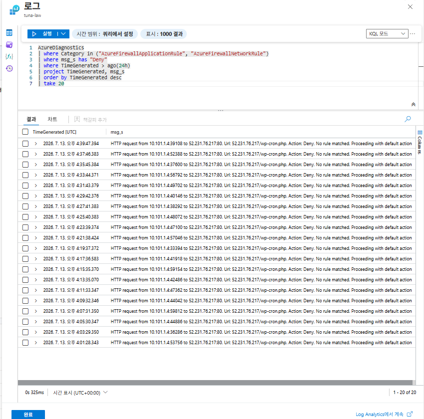
<sub>[Incident 상세 로그 — `wp-cron.php` 자기참조 트래픽, 오탐으로 확인]</sub>

`wp-cron.php` 등을 제외하고 재조회하니 18건이 남았고, 내용을 전부 확인한 결과 Ubuntu Snap 업데이트 체크(`api.snapcraft.io`), WordPress 코어 업데이트 체크(`wordpress.org`), Azure Application Insights 텔레메트리(`visualstudio.com`), Azure 관리 디스크 백엔드 통신(`blob.storage.azure.net`) 등 **전부 정상적인 OS/WordPress/Azure 인프라 배경 트래픽**이었다.

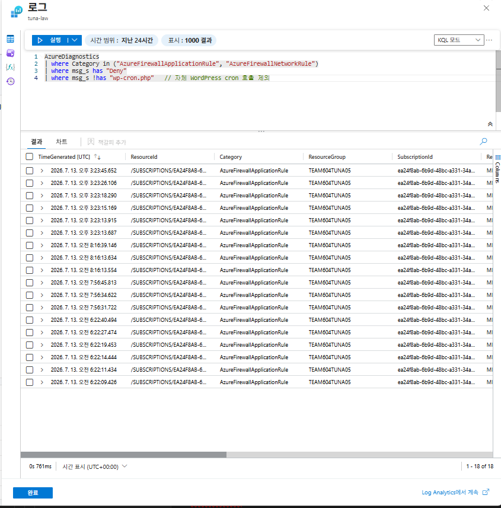
<sub>[1차 제외 조건 적용 후 재조회 — 18건 남음]</sub>

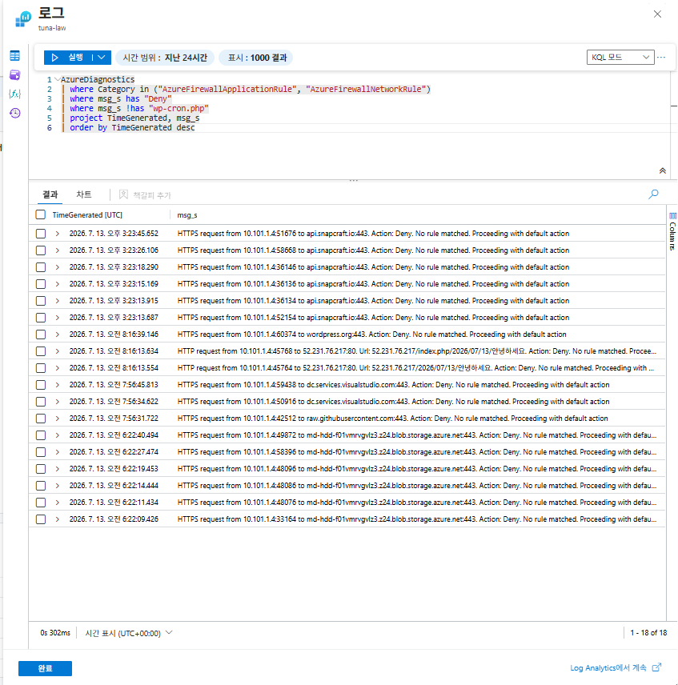
<sub>[남은 18건 상세 확인 — 전부 정상 트래픽으로 판명]</sub>

**결론: Incident 35건 중 34건(97%)이 오탐.** 규칙이 너무 광범위해 실제 위협이 노이즈에 묻힐 위험(Alert Fatigue)이 확인되어, `wp-cron.php`/자기 자신 호출/`api.snapcraft.io`/`wordpress.org`/`visualstudio.com`/`blob.storage.azure.net`을 제외하는 조건을 추가해 규칙을 수정했다(V7).

수정된 규칙으로 재확인한 결과, 34건이던 오탐이 **`raw.githubusercontent.com` 관련 1건**으로 줄었다. 이 1건은 VM에서 GitHub raw 파일을 요청하다 차단된 로그로, 반복되지 않는 일회성 시도라 우선순위는 낮지만 원인 확인이 필요한 항목으로 남겨뒀다.

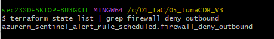
<sub>[V7 수정 규칙 적용 후 재조회 — 34건 → 1건으로 감소]</sub>

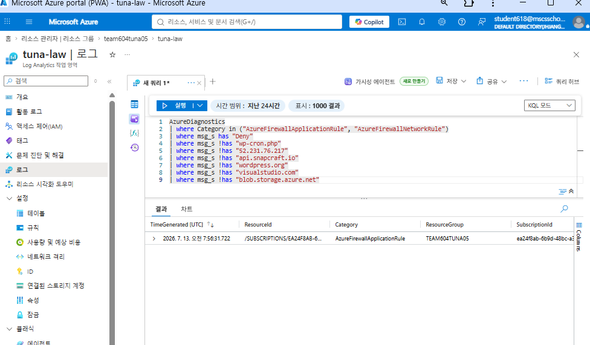
<sub>[남은 1건 상세 — `raw.githubusercontent.com` 접근 시도, 원인 미확인]</sub>

---

## 알림 자동화 (Playbook) 구축

Incident 발생 시 이메일로 알림을 받기 위해 Sentinel Automation Rule + Logic App Playbook 구조를 코드화했다. 처음엔 Office 365 Outlook 커넥터로 시도했으나, 연결 인증 단계에서 **"이 사서함에는 REST API가 아직 지원되지 않습니다"** 오류가 발생했다.


<sub>[Office 365 API Connection 연결 테스트 실패]</sub>


<sub>[권한 부여 시도 및 오류 메시지 — REST API 미지원 사서함(샌드박스/게스트 계정)]</sub>

원인은 `student618` 계정이 정식 Exchange 메일함이 아닌 게스트/샌드박스 계정이라 OAuth 기반 REST API 자체를 지원하지 않는 것으로 확인됐다. Office 365 커넥터(OAuth 인증) 대신, **SMTP 커넥터(기본 인증)로 Gmail(`team604tuna05@gmail.com`)에서 직접 발송하는 방식**으로 전환했다. SMTP 인증에는 2단계 인증과 앱 비밀번호가 필요해 순서대로 설정했다.

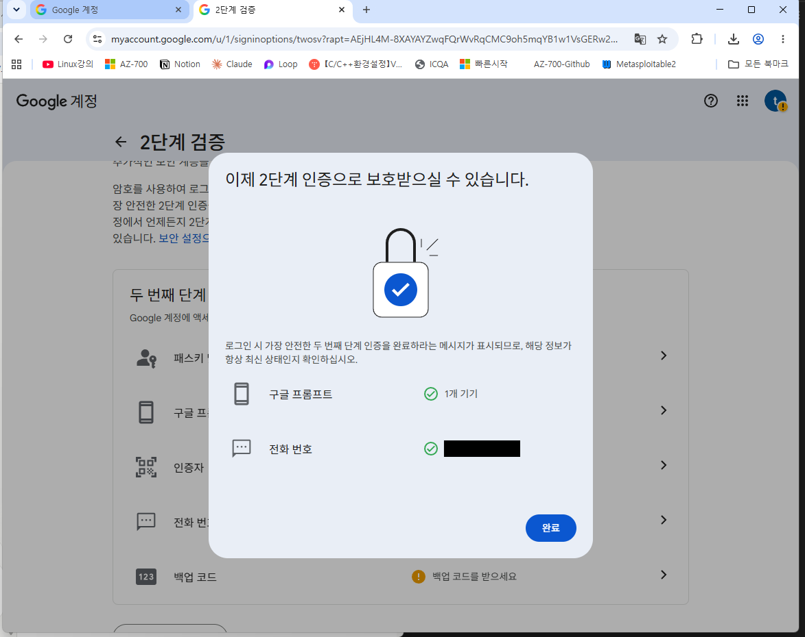
<sub>[Google 계정 2단계 인증 활성화]</sub>


<sub>[앱 비밀번호 발급 화면]</sub>

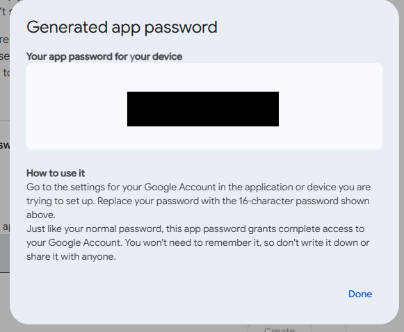
<sub>[16자리 앱 비밀번호 발급 완료]</sub>

SMTP 전환으로 OAuth 로그인 동의 없이 Terraform만으로 자동화가 가능해졌지만, Sentinel Incident 트리거 자체가 사용하는 `azuresentinel` 연결은 Azure 정책상 Portal에서 1회 수동 인증이 불가피하다는 것을 확인했다. 코드로 직접 작성한 Logic App 워크플로우가 반복적으로 구조적 오류(GUID 형식, 권한 부족, 연결 매핑 누락)를 일으켜, **Logic App 틀은 Terraform으로 배포하고 트리거·액션 배선은 Portal Designer에서 완성하는 방식**으로 전환해 최종적으로 완성했다.

Designer에서 "Microsoft Sentinel incident" 트리거를 검색해서 추가하고 `student618` 계정으로 1회 로그인 승인하니, Terraform으로 직접 작성했을 때와 달리 별도 파라미터 설정 없이 바로 연결이 완료됐다. 이어서 "SMTP - 메일 보내기(V3)" 액션을 추가하고 앞서 만들어둔 SMTP 연결 정보를 입력해 워크플로우를 완성하고 Publish했다.

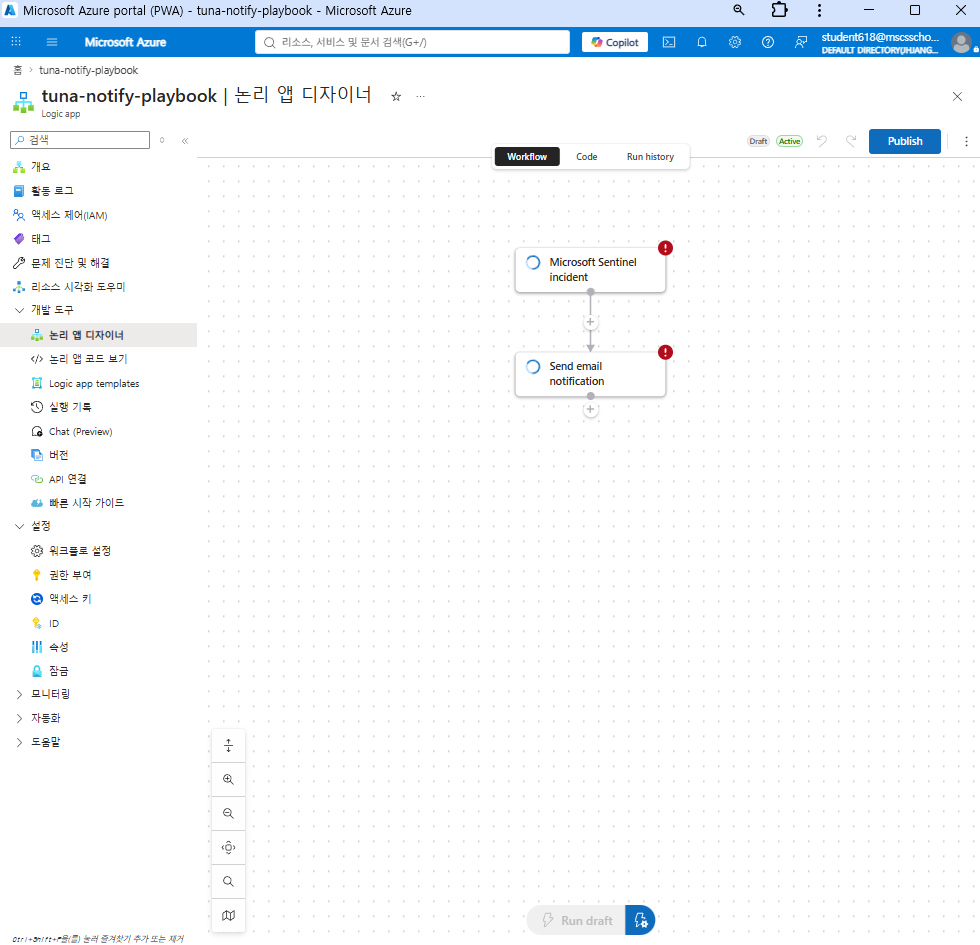
<sub>[SMTP 연결 생성 — 서버/사용자 이름/앱 비밀번호 입력]</sub>

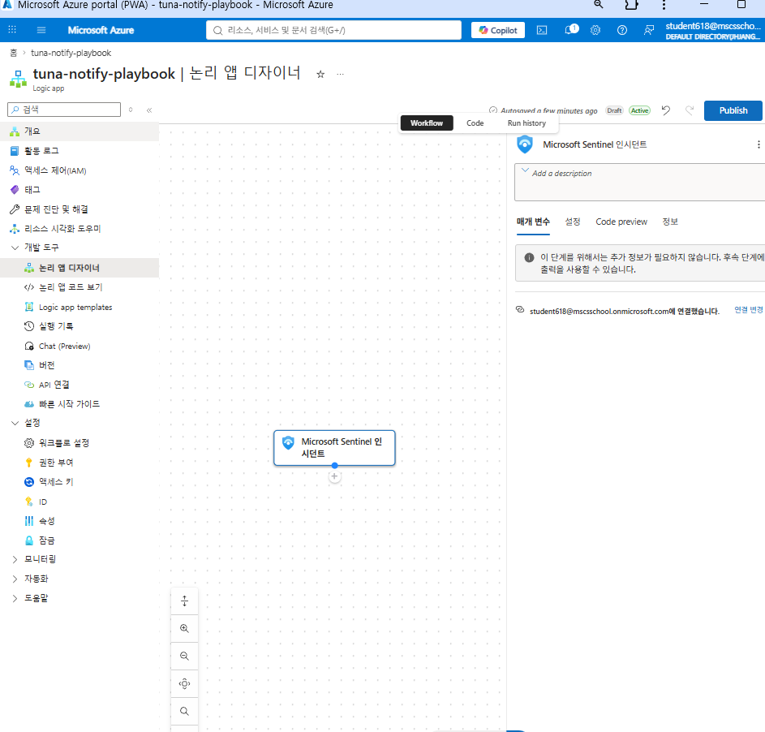
<sub>[메일 보내기 액션 고급 매개변수 — 받는 사람/제목/본문 필드 선택]</sub>

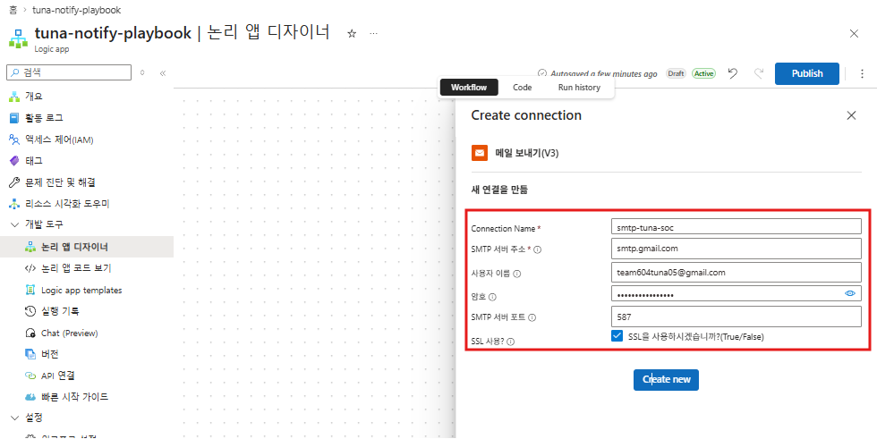
<sub>[받는 사람/제목/본문 필드 값 입력 완료]</sub>

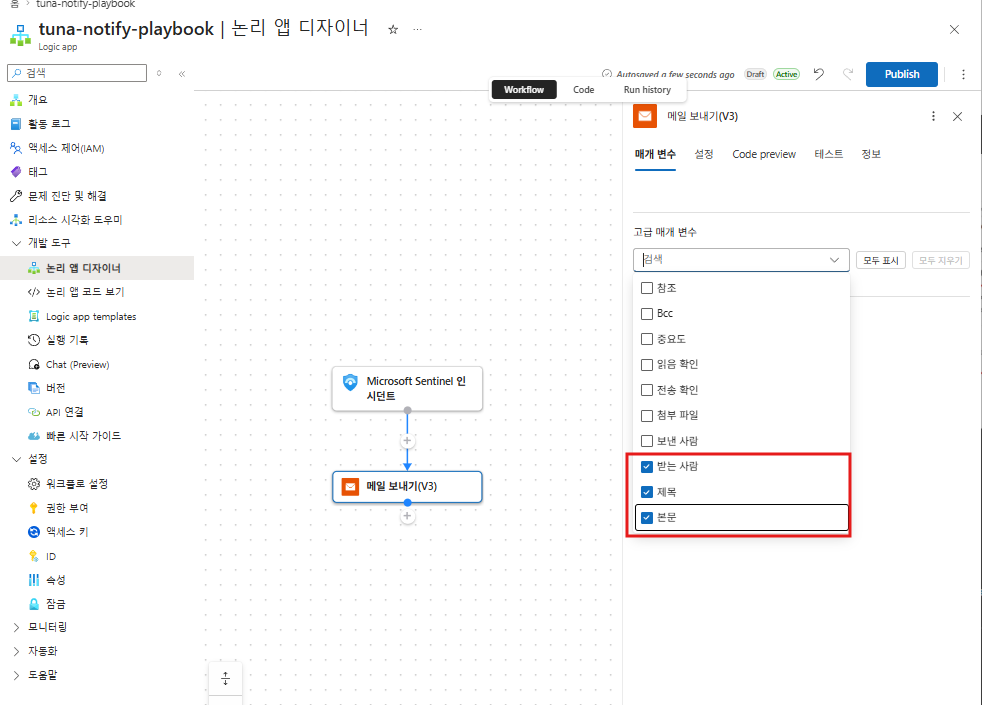
<sub>[워크플로우 Publish 완료 — 트리거/액션 모두 정상 인식]</sub>

SQL Injection을 재현해 새 Incident를 발생시킨 뒤 15분 정도 지나 확인한 결과, **`team604tuna05@gmail.com`으로 `[TUNA SOC] Sentinel Incident 발생` 메일이 실제로 도착**하는 것을 확인했다. 탐지부터 알림까지 전체 파이프라인이 사람 개입 없이 자동으로 작동하는 것을 검증한 것이다.

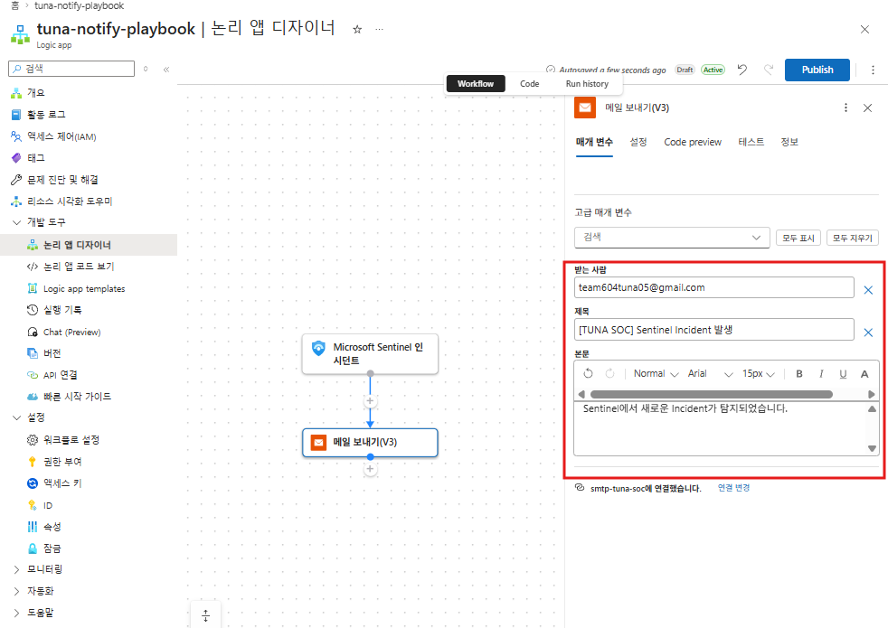
<sub>[Automation Rule 설정 — API로 조회한 결과, Playbook 연결 정상 확인]</sub>


<sub>[실제 수신된 알림 이메일 — `[TUNA SOC] Sentinel Incident 발생`]</sub>

**왜 트리거 연결만 수동이어야 했는가**: Terraform 코드만으로 Playbook이 Sentinel Incident 데이터에 접근할 권한까지 자동 부여할 수 있다면, 코드나 Terraform state가 유출되는 것만으로 조직의 보안 이벤트 데이터에 임의로 접근하는 자동화가 몰래 심어질 수 있다. 이를 막기 위해 Azure는 이 연결만큼은 반드시 사람이 직접 로그인해 승인하도록 설계해뒀다. 대신 이 승인은 리소스를 유지하는 한 최초 1회만 필요하고, 이후 탐지→Incident 생성→Playbook 실행→알림까지는 완전히 자동으로 반복된다.

- [x] Sentinel Incident 트리거를 Designer에서 연결
- [x] SMTP 액션으로 이메일 발송 완성
- [x] 실제 알림 수신 테스트
- [ ] 자동 IP 차단(`tuna-autoblock-playbook`) 동일한 방식으로 Designer에서 완성 및 검증
- [ ] 완성된 워크플로우를 ARM 템플릿으로 export하여 Terraform에 재반영


tuna-autoblock-playbook 연결확인


겨우성공

검증
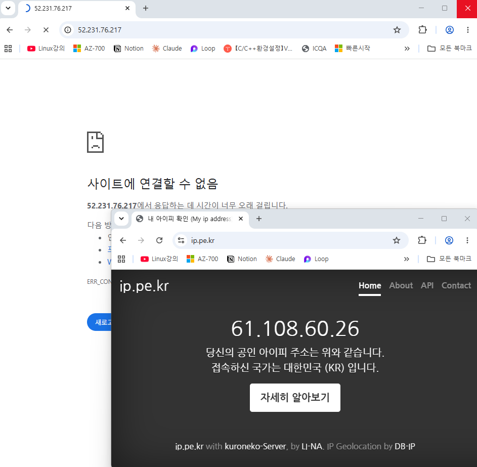
공인ip 61.108.60.26로는 웹 접속 실패


wifi 연결 후 다른 공인 ip 받아왔을땐 접속 성공

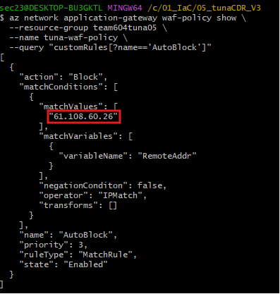
61.108.60.26 공인ip만 접속 안되는걸 확인 가능
## mysql 비정상 접속

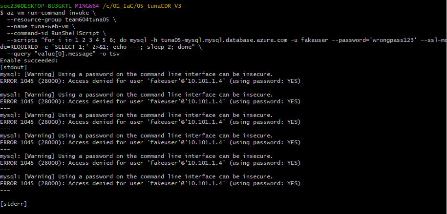
6번의 접속 시도 및 실패


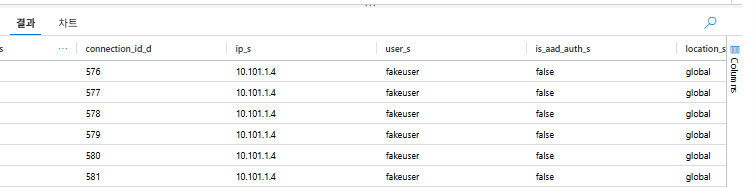
실패 로그 확인
## 권한 변경 (RBAC/WAF 정책 수정)

## 자동 IP 차단


---

## 취약점 재현 및 탐지 검증 현황

| 공격 시나리오                       | 재현  | WAF 차단 확인                  | Sentinel 규칙 검증                             |
| ----------------------------- | --- | -------------------------- | ------------------------------------------ |
| 웹쉘 업로드 (`/upload.php`)        | ✅   | ✅ (933110 → 949110)        | ✅ (KQL 수정, V6)                             |
| SSRF (`/ssrf.php`)            | ✅   | ✅ (931100/931130 → 949110) | ✅ (수정 불필요)                                 |
| SQL Injection (`/search.php`) | ✅   | ✅ (942xxx 8개 룰 → 949110)   | ✅ (수정 불필요)                                 |
| 방화벽 미허용 아웃바운드                 | -   | -                          | ✅ 오탐 34건 원인 규명 및 규칙 수정 (V7), 실제 공격 재현은 미실시 |
| MySQL 비정상 접속                  | 미착수 | -                          | -                                          |
| 권한 변경 (RBAC/WAF 정책 수정)        | 미착수 | -                          | -                                          |
| 알림 자동화 (Playbook)             | -   | -                          | ✅ Incident → 이메일 자동 발송 파이프라인 전체 검증 완료      |
| 자동 IP 차단 (Playbook)           | -   | -                          | 미검증                                        |

---

## 트러블슈팅

| 문제 | 원인 | 해결 |
|---|---|---|
| Storage Account 생성 실패 (`StorageAccountAlreadyTaken`) | 이름이 Azure 전역에서 이미 사용 중 | `tuna05` 계열로 이름 전면 교체 후 재배포 |
| WordPress DB 연결 오류 | `20_register_db_users.sh`가 `az vm run-command`의 내부 실패를 감지 못해 계정 등록이 조용히 실패 | 로그인 계정 검증 + ERROR 감지 로직 추가(V4), `DROP` 후 재생성으로 OID 자동 갱신(V5) |
| Sentinel 웹쉘 규칙 결과 0건 | 933110(Matched)과 949110(Blocked)이 서로 다른 로그 줄에 기록되는데, 두 조건을 AND로 묶어 매치 행이 없었음 | 933110 매치 자체를 탐지 조건으로 수정(V6) |
| Incident 35건 중 34건 오탐 | 방화벽 아웃바운드 규칙이 WordPress cron/OS 업데이트 체크 등 정상 배경 트래픽까지 전부 "데이터 유출 의심"으로 탐지 | 정상 트래픽 목적지를 제외 조건으로 추가 (V7) |
| Office 365 이메일 연결 실패 | `student618` 사서함이 REST API 미지원 샌드박스/게스트 계정 | SMTP 커넥터(Gmail 앱 비밀번호 기반 기본 인증)로 전환 |
| Sentinel Automation Rule 생성 실패 | `name`에 임의 문자열 사용(GUID 필요), Sentinel 서비스 주체에 Playbook 실행 권한 미부여 | `random_uuid`로 이름 생성, `Microsoft Sentinel Automation Contributor` 역할 할당 추가 |
| Logic App Designer에서 트리거 오류 (`Incomplete information`) | Terraform으로 raw JSON을 직접 작성한 Sentinel 트리거가 swagger 스펙의 필수 정보를 다 못 채움 | 트리거/액션을 비우고 Portal Designer에서 검색-추가 방식으로 재구성 |

---

## 코드 버전 이력

| 버전 | 변경 내용 |
|---|---|
| V3 | 최초 배포 성공 (네트워크/WAF/Firewall/Bastion/MySQL/Sentinel 로그 파이프라인) |
| V4 | `20_register_db_users.sh` 실패 감지 로직 추가 |
| V5 | `20_register_db_users.sh` — OID 갱신 문제 방지 (`DROP` 후 재생성) |
| V6 | `19_sentinel_rules.tf` — 웹쉘 탐지 규칙 KQL을 실측 로그 기준으로 수정 |
| V7 | `19_sentinel_rules.tf` — 방화벽 아웃바운드 규칙 오탐 제외 조건 추가 |
| V8 | `21_sentinel_playbooks.tf` — Automation Rule + Playbook(Office 365) 추가, GUID/권한 오류 수정 |
| V9 | Office 365 → SMTP 커넥터로 전환 |

---

## 남은 작업

- [x] Playbook 트리거/액션 Designer 완성 및 이메일 알림 수신 테스트
- [ ] 자동 대응(공격자 IP → WAF 자동 차단) Playbook 검증
- [ ] MySQL 비정상 접속 / 권한 변경 규칙 실제 재현 및 검증
- [ ] `raw.githubusercontent.com` 접근 원인 확인
- [ ] 기존 오탐 Incident 34건 Sentinel에서 "닫힘" 처리
- [ ] 완성된 Playbook 워크플로우를 ARM 템플릿으로 export하여 Terraform에 재반영

---

## 정리 및 회고

- WAF 로그 하나만 봐도 "매치(Matched)"와 "차단(Blocked)"이 서로 다른 로그 줄에 남는다는 걸 실제로 겪고 나서야, **탐지 규칙은 반드시 실제 로그를 먼저 조회해보고 그 구조에 맞춰 짜야 한다**는 걸 체감했다. 코드부터 짜고 나중에 맞춰보는 순서로는 계속 어긋났다.
- Incident 35건 중 34건이 오탐이었던 게 이번 프로젝트에서 가장 값진 경험이었다. **"탐지된다"와 "쓸모 있게 탐지된다"는 다르다** — 규칙 범위를 너무 넓게 잡으면 진짜 위협이 노이즈에 묻힌다는 걸(Alert Fatigue) 숫자로 직접 확인했다.
- Playbook 자동화는 인프라 코드화(Terraform)만으로 끝나지 않는 영역이 분명히 있었다. Sentinel Incident 트리거의 연결 인증만큼은 Azure가 의도적으로 사람의 승인을 요구하도록 설계해뒀고, 이건 보안상 합리적인 제약이라는 걸 이해하고 나니 오히려 막힘이 아니라 정상적인 설계로 받아들여졌다.
- 4번 프로젝트가 "침투를 막을 수 있는가"를 검증했다면, 이번 프로젝트는 "막은 뒤 그걸 사람이 알아챌 수 있는가, 그리고 대응까지 자동으로 이어지는가"를 검증한 것에 가깝다. 탐지 규칙 하나 배포하는 걸로 끝나는 게 아니라, 실제 로그로 검증하고 오탐을 줄이고 알림까지 도달시키는 전체 사이클을 처음부터 끝까지 겪어봤다.
- 남은 과제는 자동 IP 차단 Playbook 검증과 나머지 두 규칙(MySQL 비정상 접속, 권한 변경)의 실제 재현이다. 특히 자동 차단은 오탐 시 정상 사용자를 차단할 위험이 있어, 검증 없이 실제 운영에 적용하면 안 된다는 걸 이번 오탐 사례로 배웠다.
