**1. dhcp 설정**

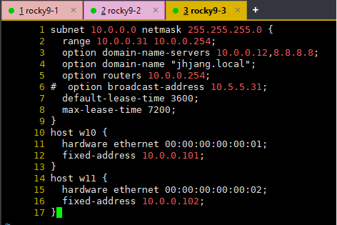
`dhcp 서버 설정파일`

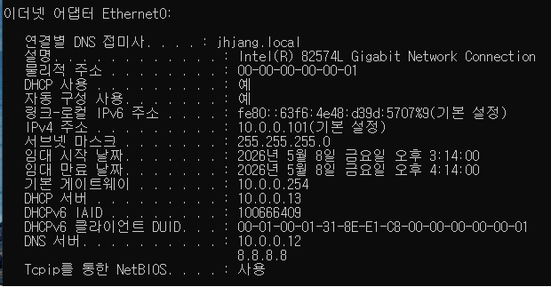
`win10 dhcp 연결`

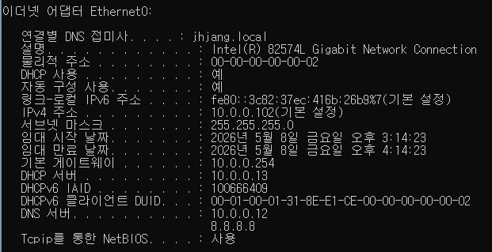
`win11 dhcp 연결`

**2. ftp 설정**
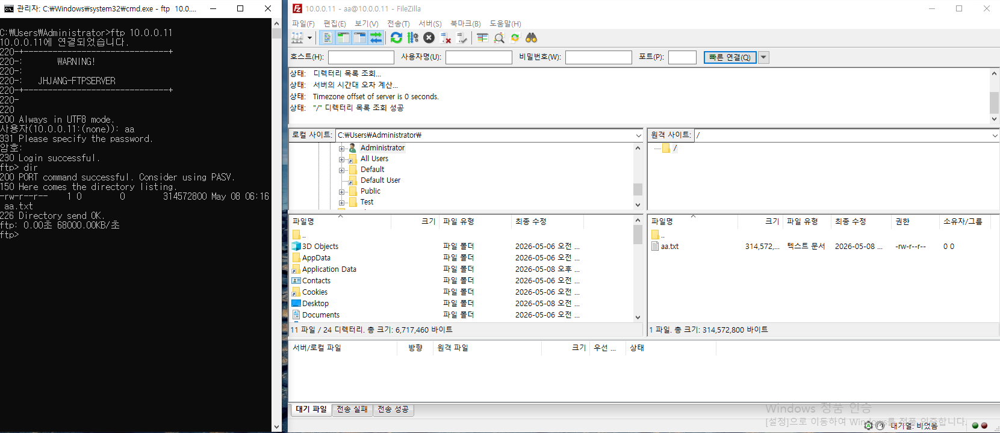
`ftp 연결 성공`

**3. dns존**
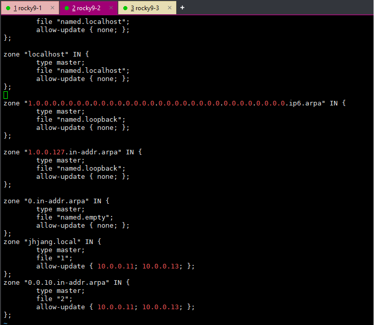
`주dns`

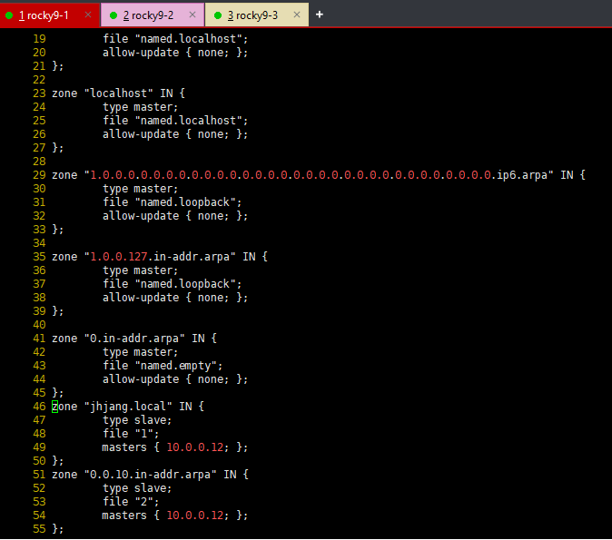
`보조dns`

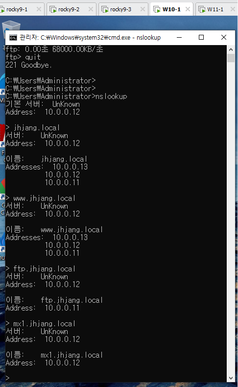

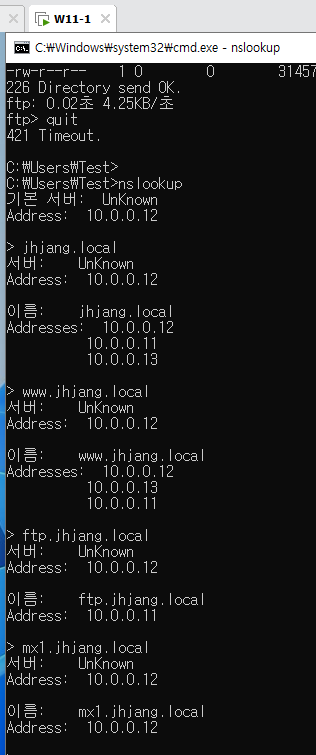
`nslookup 자료`

**4 웹 접속**

- w10
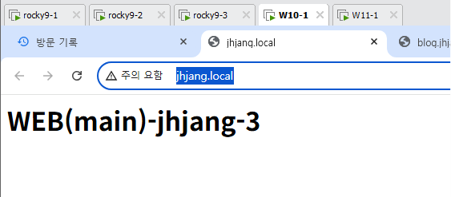
`main`

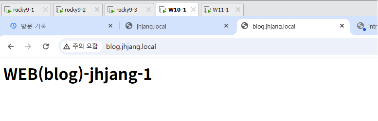
`blog`

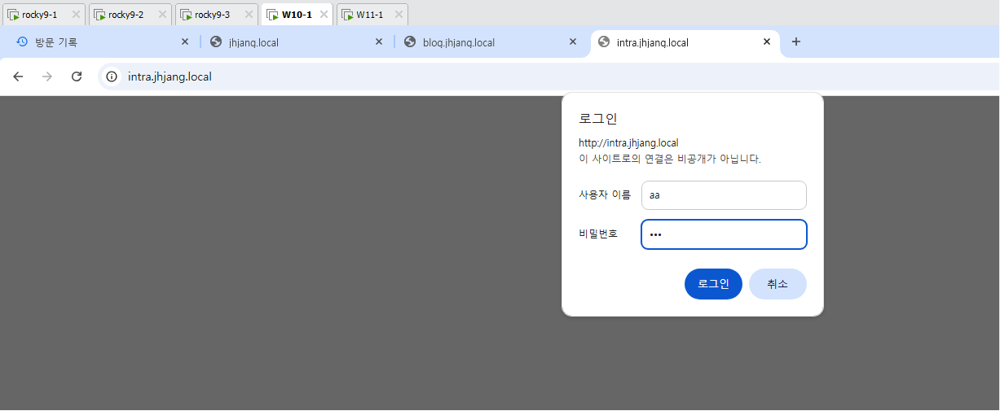
`intra(자격증명창)`

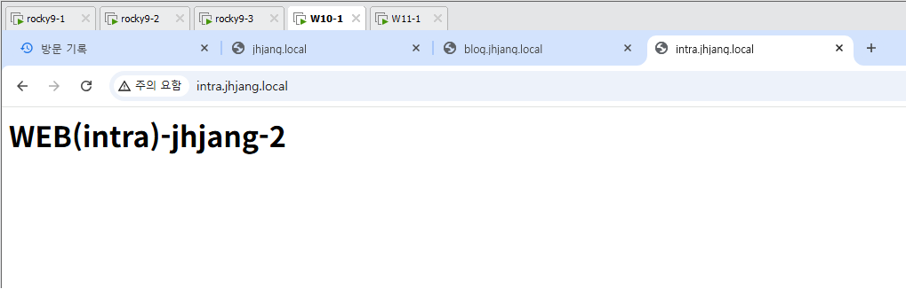`intra(로그인완료창)`

- w11
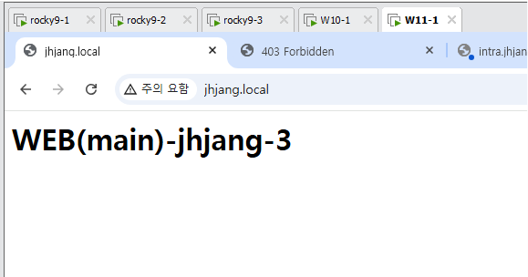
`main`

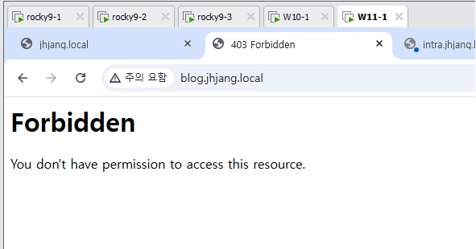
`blog`

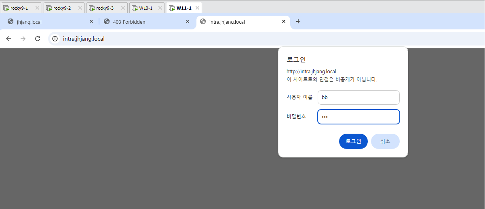
`intra(자격증명창)`

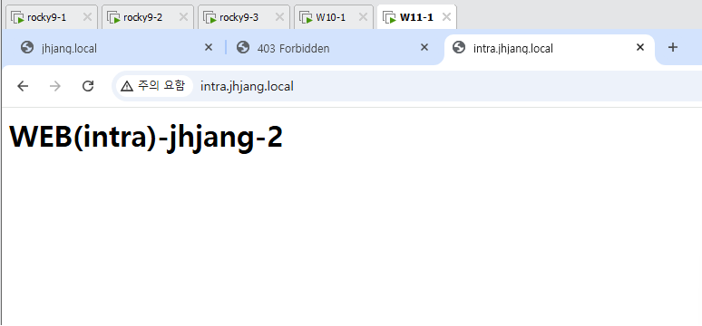
`intra(로그인완료창)`

**5. 썬더버드 테스트**
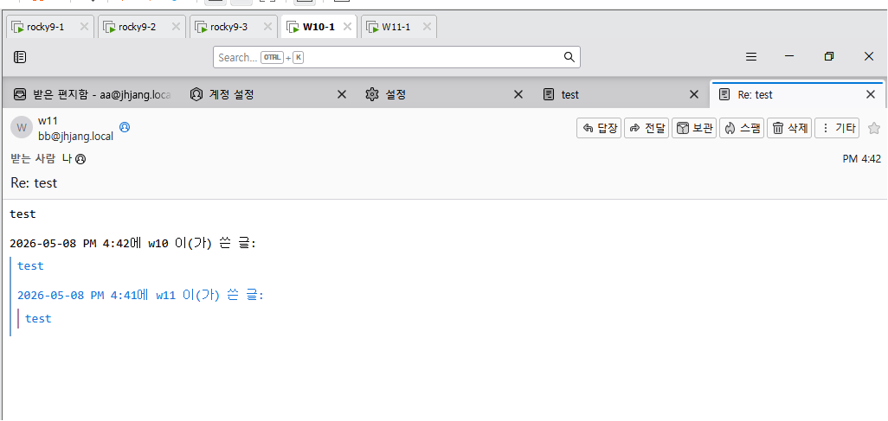