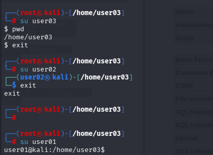
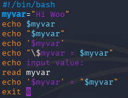
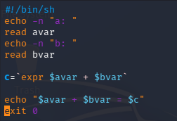
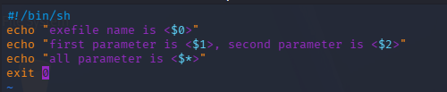
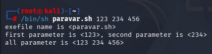
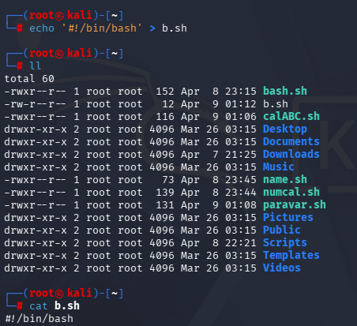

---
# meta2

	meta2에서 ip 확인
	kali의 firefox에서 meta2의 ip를 입력하면 모의해킹 연습이 가능하다.
	
	Brute Force
	File Inclusion
	XSS reflection
	XSS stored
	SQL Injection
	SQL Injection(blind)
	CSRF
	Upload
	Command Execution
	=> 취약점 공격
	

# 셸 스크립트 프로그래밍

	사용자를 추가할때는 adduser보다는 useradd를 추천
	useradd가 간단하게 추가 가능
	
	shell을 바꿀때는 chsh -s /bin/bash user01처럼 chsh를 쓰면 가능
	

	
	bash가 sh보다 쓰기 편함
	

	
	echo를 통해 변수를 출력하고 값을 출력하고 싶을땐 ' ' 가 아닌 \ 를 넣어야 변수명=값으로 인식된다.
	

	
	a값 + b값 = c값 출력
	

	

	
	파라미터값 추가해서 출력가능
	

	
	echo [문자열] > [생성할 파일명].[파일 형식]
	
	
	
	
	

