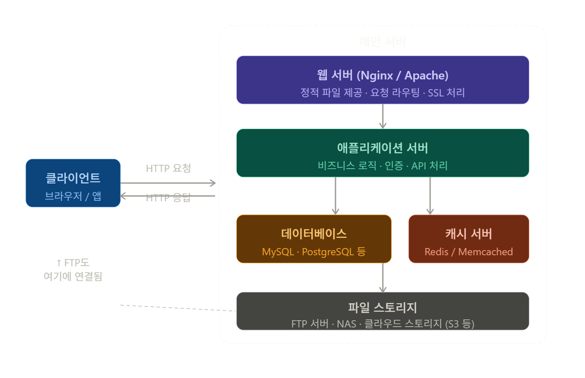

FTP, 메인서버에 대한 실습

pop3 110
imap 143

---
# 차단방식

	1. url 차단 방식
	2. 와일드카드 방식: 위 보완해서 나옴
	
	www.naver.com과 www.naver.com/MAIL은 다름
	
	그래서 www.naver.com* 여기서 *을 붙여서 차단
	
	3. 표준 문법
	
	Reg-ex 방식 사용: www\.secui\.com*
	
	
	hmail, antiserver, 메일