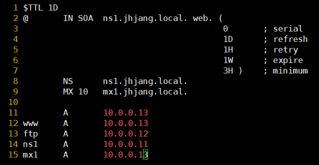
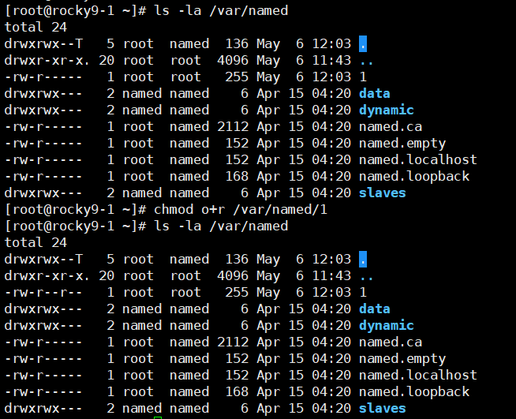
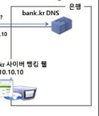
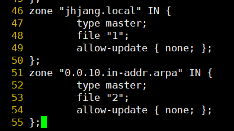
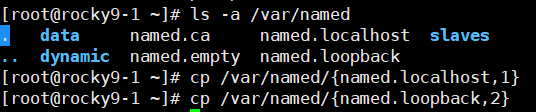
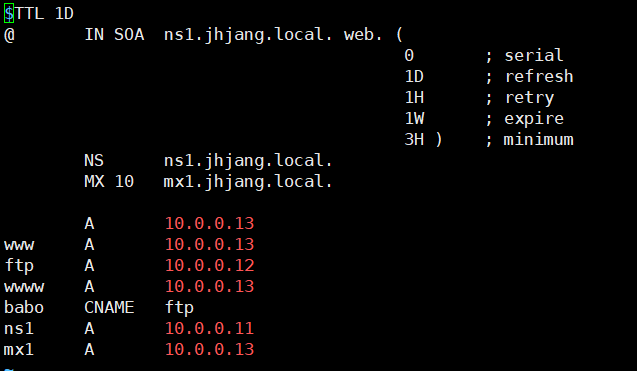
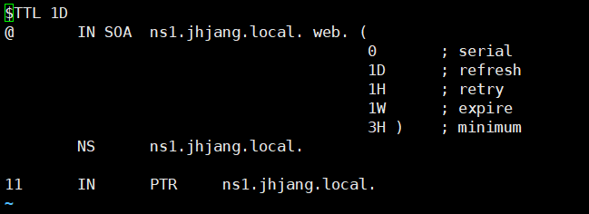
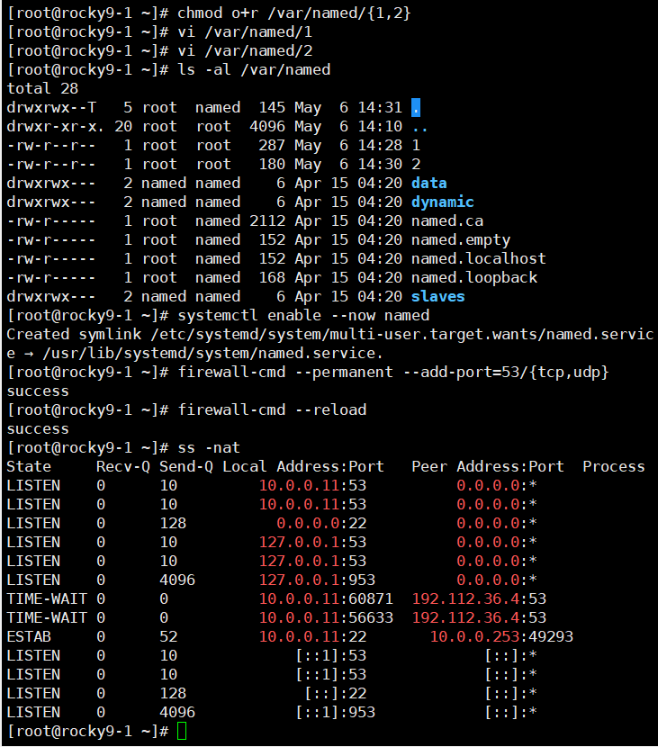
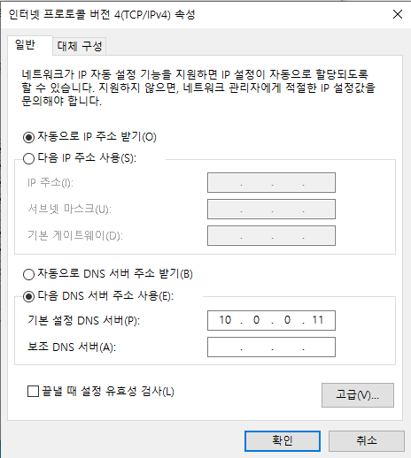

---

## 🖥️ 실습 환경

| 서버 | 역할 | IP |
|------|------|----|
| rocky9-1 | DHCP 서버 + DNS 서버 (bind) | 10.0.0.11 |
| rocky9-2 | FTP 서버 (vsftpd) | 10.0.0.12 |
| rocky9-3 | 웹 서버 (httpd) | 10.0.0.13 |
| win10 / win11 | 클라이언트 | - |

---

## 1. rocky9-1 — DHCP 서버 설치

```bash
dnf install -y dhcp-server
vi /etc/dhcp/dhcpd.conf
```

**vi 명령어 (예제 설정 가져오기):**
```
:r /example경로   # 예제 파일 불러오기
1,51d             # 1~51번 줄 삭제
10,28d            # 10~28번 줄 삭제
14,$d             # 14번 줄부터 끝까지 삭제
```


---

## 2. rocky9-2 — FTP 서버 설치 (vsftpd)

```bash
# 디렉토리 및 사용자 생성
mkdir /ftp
useradd a
useradd b
echo 'It1' | passwd --stdin a
echo 'It1' | passwd --stdin b

# 테스트용 더미 파일 생성 (300MB)
dd if=/dev/zero of=/home/a/a.txt bs=300M count=1
dd if=/dev/zero of=/home/b/b.txt bs=300M count=1

# vsftpd 설치 및 설정
dnf install -y vsftpd
vi /etc/vsftpd/vsftpd.conf
```

**vsftpd.conf 주요 설정:**
```
# 로그, 시간, 밴, chroot 활성화
# chroot 설정 시 마지막 줄에 아래 추가 필수
allow_writeable_chroot=YES
```

**방화벽 설정 (코드로 직접 수정):**
```bash
vi /etc/firewalld/zones/public.xml
# ※ 이 방법으로 수정하면 원본 파일이 직접 수정됨

ss -nat   # 현재 연결 상태 확인
```

---

## 3. rocky9-3 — 웹 서버 설치 (httpd)

```bash
dnf install -y httpd
systemctl enable --now httpd
firewall-cmd --permanent --add-port=80/tcp
firewall-cmd --reload
```

---

## 4. DNS 개념 정리

### DNS(Domain Name Service)란?
> URL(도메인)을 IP 주소로 변환해주는 서비스

| 항목 | 내용 |
|------|------|
| 포트 | **53번** |
| 기본 프로토콜 | **UDP** |
| TCP 사용 시점 | 데이터 512Byte 이상, Zone Transfer(영역전송) |

> 💡 **왜 root DNS가 13대로 제한되나?**  
> UDP 패킷 크기 제한(512Byte) 때문에 13개의 IP만 담을 수 있기 때문

---

### DNS 설정 파일 3가지

| 파일 경로 | 역할 |
|-----------|------|
| `/etc/named.conf` | 어떤 네트워크 인터페이스(IP)로 서비스할지 설정 |
| `/etc/named.rfc1912.zones` | 정방향 / 역방향 조회 영역 설정 |
| `/var/named/` | 실제 레코드 값이 담긴 존 파일 저장 위치 |

### 정방향 vs 역방향

| 구분 | 의미 | 예시 |
|------|------|------|
| 정방향 | 도메인 → IP | `www.jhjang.local` → `10.0.0.13` |
| 역방향 | IP → 도메인 | `10.0.0.13` → `www.jhjang.local` |

---

### DNS 캐시 포이즈닝 (Cache Poisoning)

> DNS 캐시를 악의적으로 조작해 사용자를 가짜 사이트로 유도하는 공격

**DNS 조회 순서:**
```
캐시 → /etc/hosts → Public DNS
```

**Windows 캐시 관련 명령어:**
```cmd
ipconfig /flushdns      # DNS 캐시 초기화
ipconfig /displaydns    # 현재 캐시 확인
set type=all            # nslookup에서 모든 레코드 조회
```

> ⚠️ `/etc/hosts` 파일은 일반 관리자로 수정 불가 → **administrator 계정**으로 접속 필요

**브라우저 개인정보 설정 (캐시 관련):**
- 설정 → 개인정보 검색 및 서비스
- 검색 데이터, 보안, 쿠키, 검색 및 연결된 경험 **모두 해제**


---

## 5. rocky9-1 — DNS 서버 설치 (BIND)

### 설치

```bash
dnf install -y bind bind-utils bind-libs
```

### 삭제 (초기화 시)

```bash
dnf autoremove -y bind bind-utils bind-libs
rm -rf /etc/named.conf.rpmsave /etc/named.rfc1912.zones.rpmsave /var/named
```

---

### 설치 순서 (전체 흐름)

```
1. dnf install -y bind bind-utils bind-libs

2. vi /etc/named.conf
   → 어떤 IP로 서비스할지 설정 (예: 10.0.0.11)

3. vi /etc/named.rfc1912.zones
   → 정방향 조회: 23~27번 줄
   → 역방향 조회: 41~45번 줄
   → 주 영역(master) / 보조 영역(slave) 설정
     ※ slave면 반드시 master를 가리켜야 함

4. /var/named/ 에 존 파일 생성
   → 정방향: named.localhost 기반
   → 역방향: named.loopback 기반
```




---

### 존 파일(Zone File) 작성 규칙

```dns
$TTL 1D                                  ; 캐시 유지 시간 (1일)
@       IN SOA  ns1.jhjang.local. web. (
                        0       ; serial  (변경 시 숫자 증가)
                        1D      ; refresh (보조 서버 갱신 주기)
                        1H      ; retry   (재시도 간격)
                        1W      ; expire  (만료 시간)
                        3H )    ; minimum (최소 TTL)

        NS      ns1.jhjang.local.        ; Name Server
        MX 10   mx1.jhjang.local.        ; Mail Server (우선순위 10)

        A       10.0.0.11                ; @ (도메인 자체) → IP
www     A       10.0.0.13
ftp     A       10.0.0.12
ns1     A       10.0.0.11
mx1     A       10.0.0.13
```

**⚠️ 주요 규칙:**

| 규칙 | 설명 |
|------|------|
| 문자열 뒤 `.` 필수 | `ns1.jhjang.local.` ← 점 빠지면 오류 |
| `@` 의미 | 도메인 그 자체 (`jhjang.local`) |
| ns1, mx1 등록 필수 | DNS에서 반드시 호스트 등록 필요 |
| `/var/named` 읽기 권한 | named 사용자에게 읽기 권한 부여 필요 |

> 💡 **rfc1912.zones에서 앞이 숫자로 시작하면** → 역방향 조회 영역










> ⚠️ KT 등 외부 도메인은 못 찾기 때문에 **내 DNS 서버 주소로 설정** 필요

---

## 삭제
rocky9-3
dnf autoremove -y httpd
firewall-cmd --permanent --remove-port=80/tcp
firewall-cmd --reload
firewall-cmd --list-all

---

3 서버 모두 httpd 설치

dnf install -y httpd
vi /var/www/html/index.html
systemctl enable --now httpd


## 🎯 최종 실습 목표

```
내 가상머신
    → 짝꿍의 DNS 서버 주소로 설정
    → 짝꿍의 도메인 입력 (예: www.jhjang.local)
    → 짝꿍의 웹 서버 접속 성공!
```
