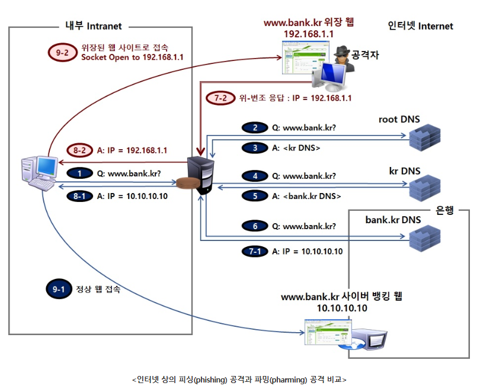
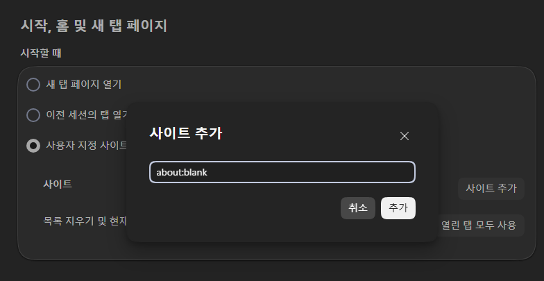
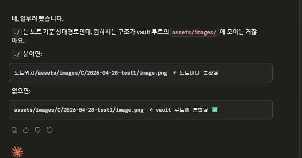
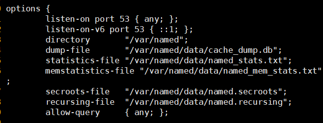

---
title:
date: 2026-05-06
categories:
  - security
comments: true
tags:
  - 김성대
---
---

| 오늘 실습에선 rocky9-1, rocky9-2, rocky9-3, win10, win11 모두 사용
## 1. rocky9-1에 dhcp 설치

```
dnf install -y dhcp-server

vi /etc/dhcp/dhcpd.conf
$ r /exmaple경로
1,51d
10,28d
14,$d
```


## 2. rocky9-2에 ftp 설치

```
mkdir /ftp
useradd a
useradd b
echo 'It1' | passwd --stdin a
echo 'It1' | passwd --stdin b
dd if=/dev/zero of=/home/a/a.txt bs=300M count=1
dd if=/dev/zero of=/home/b/b.txt bs=300M count=1

dnf install -y vsftpd
vi /etc/vsftpd/vsftpd.conf
log, time, ban, ch 활성화 및 /ftp 밑에 생성
마지막 줄
allow_writeable_chroot=YES
```

```
vi /etc/firewalld/zones/public.xml
코드로 수정하면 이 원본파일이 수정됨

ss -nat
```

---

1. DNS(Domain Name Service)
	1. URL을 IP Address로 변환
	2. Protocol: UDP
		1. TCP 사용:
			1. 전송하는 DATA가 512Byte 이상(전세계 root dns server가 13대로 제한)
			2. 영역전송(Zone Transfer)
	3. port: 53
	4. 설정파일
		1. /etc/named.conf
		2. /etc/named.rfc192.zones
		3. /var/named 디렉토리에 1.4.2. 지정한 영역파일 생성(레코드값 생성)


dns 캐시 포워즈닝


cache -> /etc/hosts -> public dns -> 

cmd
set type=all


administrator

개인정보 검색 및 서비스
검색데이터, 보안, 쿠키, 검색 및 연결된 경험 다 해제


```
ipconfig /flushdns
ipconfig /displaydns
```

/etc/hosts는 일반관리자로 수정안되고 administrator로 접속해야함



## rocky9-3 에 httpd 설치

```
dnf install -y httpd
systemctl enable --now httpd
firewall-cmd --permanent --add-port=80/tcp
firewall-cmd --reload
```


---

rocky9-1에 bind설치

```
dnf install -y bind bind-utils bind-libs
```

	vi /etc/named.conf
	vi /etc/named.rfc1912.zones




rfc1912.zones에서 앞이 숫자로 되어있다면 