---
title:
date: 2026-05-07
categories:
  - security
comments: true
tags:
  - 김성대
---
---
## 최종 목표

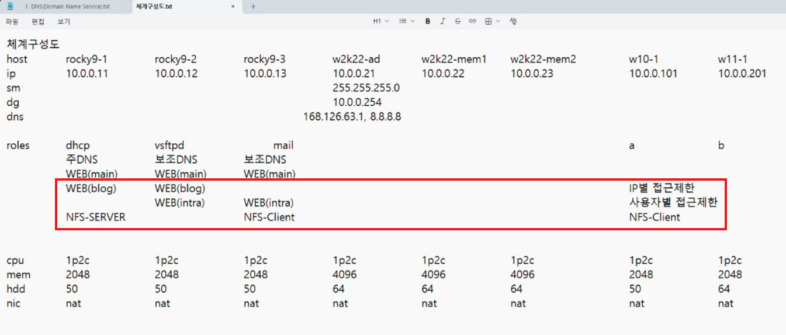


### 오늘 목표

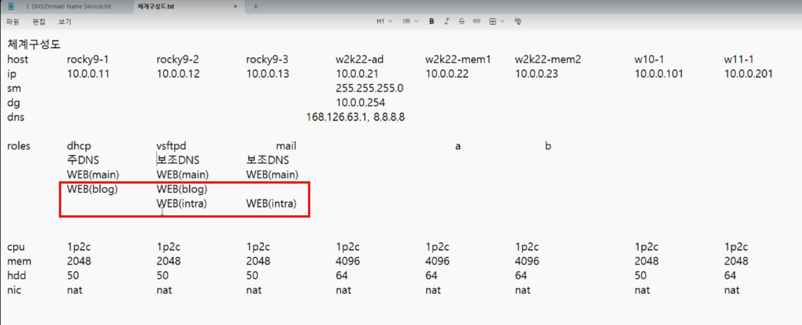


### 1. rocky9-1에 dhcp 설치

```bash
dnf install -y dhcp-server
```

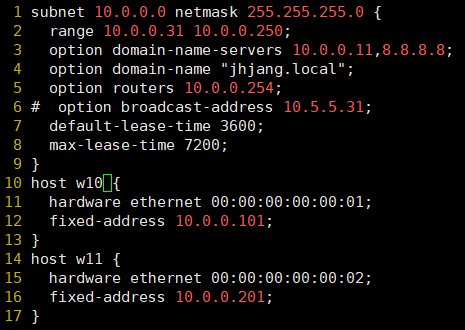
vi /etc/dhcp/dhcpd.conf


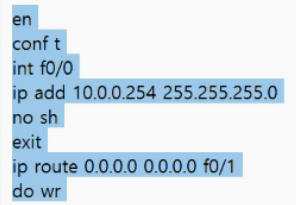


### 2. rocky9-2에 ftp 설치

```bash
dnf install -y vsftpd
useradd a
useradd b
echo 'It1' | passwd --stdin a
echo 'It1' | passwd --stdin b
dd if=/dev/zero of=/home/a/a.txt bs=300M count=1
dd if=/dev/zero of=/home/b/b.txt bs=300M count=1

mkdir /ftp
vi /ftp/ban
vi /ftp/ch
```

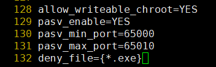
vi /etc/vsftpd/vsftpd.conf

```bash
systemctl enable --now vsftpd
```


### 3. 모든 서버에 bind 설치

```bash
dnf install -y bind bind-utils bind-libs
```

1. 주영역 만들기
```bash
vi /etc/named.conf
(any any 로 수정)

vi /etc/named.rfc1912.zones

cp /var/named/{named.localhost,1}
cp /var/named/{named.loopback,2}


```
url -> ip주소: 정방향
ip주소 -> host: 역방향 --> nslookup 했을 때 unknown으로 나옴
역방향이 문제 있더라도 정방향이 정상이면 문제 없음


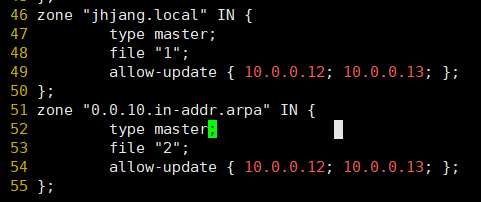

allow-update =마스터로부터 데이터를 가져가도록 허용하는 애들

맨 마지막 값은 입력할 수 없음 -> 레코드값에 들어가야되서

named.localhost: 정방향
named.loopback: 역방향

```bash
vi /var/named/1
```
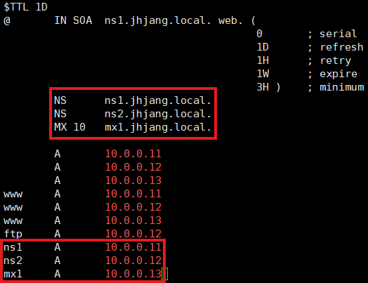

A: Ipv4꺼라 작성
AAAA: Ipv6꺼라 필요없으니 제거
위에 설정한 내용은 아래에도 똑같이 생성

```bash
chmod o+r /var/named/{1,2}

systemctl enable --now named


```
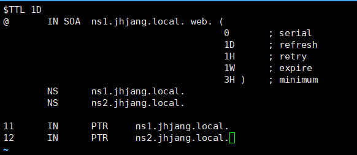systemctl restart named

w10
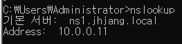

역방향을 설정하면 이름이 나오게 된다.

23,27co$
41,45co$

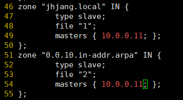

systemctl enable --now named
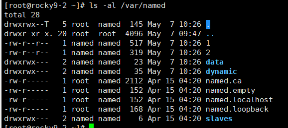

자동으로 1,2파일가져옴

firewall-cmd --permanent --add-port=53/{tcp,udp}


win11
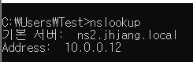


ns3에 대한 정보를 입력하지 않았기 때문에
rocky9-3에서의 역방향은 서비스는 되지만 unknown이라 뜸
ns3에 대한 정보를 추가해주면 뜸


---

## 웹서버

apache vs nginx
컨테이너에서는 nginx를 많이 쓰는 추세이다.

rocky 리눅스에서는 dnf install -y httpd로 아파치 설치 가능


tab키 2번: 안의 파일들 보임


91 -> root를 팀메일로 수정 web@jhjang.local
100

149 Indexes: 디렉토리 리스닝기술
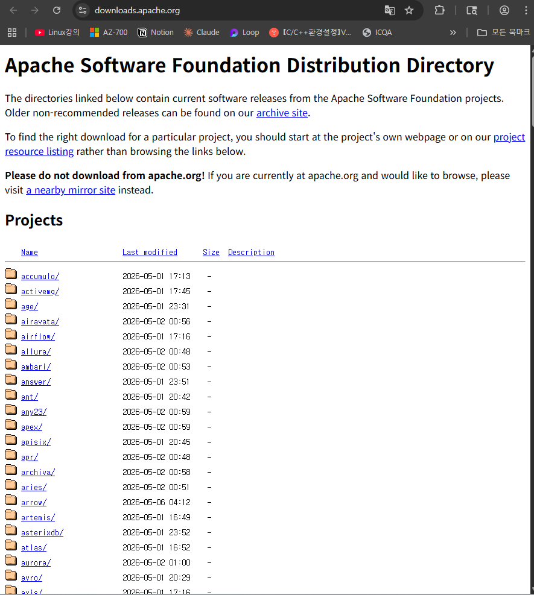
그래서 Indexes를 지워야 함.


/etc/httpd/conf.d/welcome.conf -> welcome.conf.bak로 바꾸면 오류페이지가 안보임


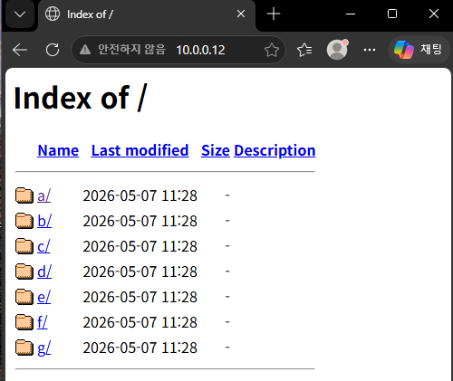
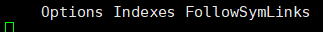
indexes를 지워버리면

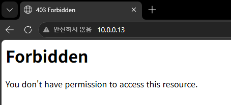
이렇게 뜸

mkdir /var/www/html/{a,b,c,d,e,f,g}
ls -al /var/www/html/
mv /etc/httpd/conf.d/{welcome.conf,welcome.conf.bak}


하나의 서버가지고 여러개의 웹 페이지를 서비스하려면?
1. ip 여러개 -> 여러 대 운영
2. 포트번호 변경 (80, 8080, ...)
3. 가상 호스트 구성


mkdir /var/www/blog
vi /var/www/blog/index.html


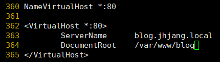
vi /etc/httpd/conf/httpd.conf

vi /var/named/1
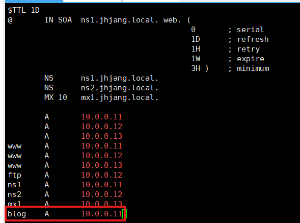
가상호스트는 dns의 도움을 무조건 필요로 한다.

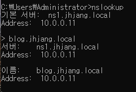
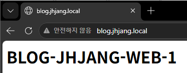


2번쨰는 블로그+인트라

mkdir /var/www/{blog,intra}
vi /var/www/blog/index.html
vi /var/www/intra/index.html

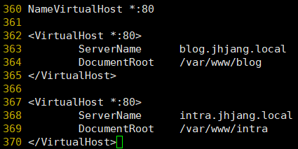


vi 명령어
G 문서 맨 끝 이동


리눅스 -> 앤서블

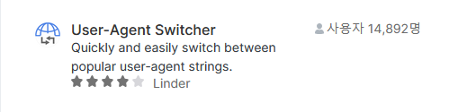
컴퓨터로 모바일 웹 접속 가능

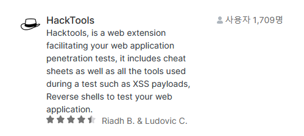sql injection 등 가능