---
# 오늘 목표

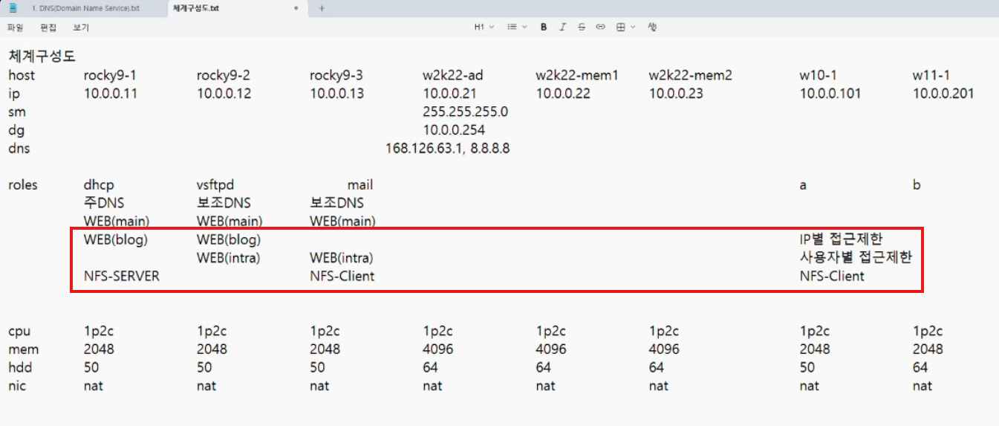

## 복습

**rocky9-1 (dhcp)(blog)**
```bash
dnf install -y dhcp-server
vi /etc/dhcp/dhcpd.conf
systemctl enable --now dhcpd

dnf install -y bind bind-utils bind-libs
vi /etc/named.conf
vi /etc/named.rfc1912.zones
ls -l /var/named
cp /var/named/{named.localhost,1}
cp /var/named/{named.loopback,2}
vi /var/named/1
vi /var/named/2
chmod o+r /var/named/{1,2}
ls -l /var/named
systemctl enable --now named
firewall-cmd --permanent --add-port=53/{tcp,udp}
firewall-cmd --reload
firewall-cmd --list-all
#dig naver.com @8.8.8.8 + trace #nslookup 대신 사용 가능

dnf install -y httpd
vi /etc/httpd/conf/httpd.conf
systemctl enable --now httpd
mkdir /var/www/blog
vi /var/www/html/index.html
vi /var/www/blog/index.html
vi /etc/httpd/conf.d/vir.conf
systemctl restart httpd
firewall-cmd --permanent --add-port=80/tcp
firewall-cmd --reload
firewall-cmd --list-all
mv /etc/httpd/conf.d/{welcome.conf,welcome.conf.bak}
systemctl restart httpd
```

**rocky9-2 (ftp)(blog,intra)**
```bash
dnf install -y vsftpd
useradd x
useradd y
echo 'It1' | passwd --stdin x
echo 'It1' | passwd --stdin y
dd if=/dev/zero of=/home/x/x.txt bs=300M count=1
dd if=/dev/zero of=/home/y/y.txt bs=300M count=1
mkdir /ftp
vi /ftp/ban
vi /ftp/ch
vi /etc/vsftpd/vsftpd.conf
systemctl enable --now vsftpd
vi /etc/firewalld/zones/public.xml
firewall-cmd --reload
firewall-cmd --list-all

dnf install -y bind bind-utils bind-libs
vi /etc/named.conf
vi /etc/named.rfc1912.zones
systemctl enable --now named
ls -l /var/named
firewall-cmd --permanent --add-port=53/{tcp,udp}
firewall-cmd --reload
firewall-cmd --list-all

dnf install -y httpd
vi /etc/httpd/conf/httpd.conf
systemctl enable --now httpd
mkdir /var/www/{blog,intra}
vi /var/www/html/index.html
vi /var/www/blog/index.html
vi /var/www/intra/index.html
vi /etc/httpd/conf.d/vir.conf
vi /var/www/intra/.htaccess
mkdir /web
htpasswd -c /web/.user x
htpasswd /web/.user y
cat /web/.user
systemctl restart httpd
firewall-cmd --permanent --add-port=80/tcp
firewall-cmd --reload
firewall-cmd --list-all
mv /etc/httpd/conf.d/{welcome.conf,welcome.conf.bak}
systemctl restart httpd
```

**rocky9-3 (intra)**
```bash
dnf install -y bind bind-utils bind-libs
vi /etc/named.conf
vi /etc/named.rfc1912.zones
systemctl enable --now named
firewall-cmd --permanent --add-port=53/{tcp,udp}
firewall-cmd --reload
ls -l /var/named

dnf install -y httpd
vi /etc/httpd/conf/httpd.conf
systemctl enable --now httpd
mkdir /var/www/intra
vi /var/www/html/index.html
vi /var/www/intra/index.html
vi /etc/httpd/conf.d/vir.conf
vi /var/www/intra/.htaccess
mkdir /web
htpasswd -c /web/.user x
htpasswd /web/.user y
cat /web/.user
systemctl restart httpd
firewall-cmd --permanent --add-port=80/tcp
firewall-cmd --reload
firewall-cmd --list-all
mv /etc/httpd/conf.d/{welcome.conf,welcome.conf.bak}
systemctl restart httpd
```

```bash
AuthName        "Test Auth"
AuthType        Basic   
AuthUserFile    /web/.user
Require user    x y
```
`vi /var/www/intra/.htaccess`


34번째줄 ServerRoot "/etc/httpd" 여기에 웹 관련파일 모두 모아둠
150 Options Indexes FollowSymLinks 에서 Indexes 삭제
로그 레벨 순서: debug, info, notic, warn, error, crit, alert emerg 외워두기

<html>
<body>
<h1>MAIN-JHJANG-WEB-1</h1>
</body>
</html>
httdx보다는 ldap이나 중앙집중식으로 사용자 인증방식을 더 많이 씀


---

## 메일
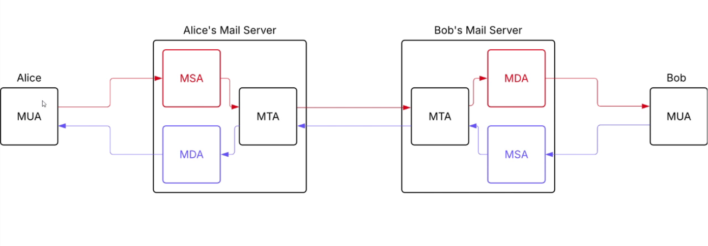
MTA는 주로 SMTP를 사용
MUA -> MSA -> SMTP -> MDA -> MUA

```bash
vi /etc/hosts
dnf install -y sendmail sendmail-cf dovecot
useradd x
useradd y
echo 'It1' | passwd --stdin x
echo 'It1' | passwd --stdin y
ls -al /var/spool/mail
ls -al /etc/mail #senmail.mc, sendmail.cf
vi /etc/mail/sendmail.mc
m4 /etc/mail/sendmail.mc > /etc/mail/sendmail.cf #m4로 인해 sendmail.mc에서 변경한 내용만 sendmail.cf로 이동, 38번째줄 귀신있는지 확인
vi /etc/mail/sendmail.cf
vi /etc/mail/local-host-names
vi /etc/mail/access
makemap hash /etc/mail/access < /etc/mail/access
vi /etc/group
systemctl enable --now sendmail
ss -nat

ls -al /etc/dovecot/
ls -al /etc/dovecot/conf.d
vi /etc/dovecot/dovecot.conf
vi /etc/dovecot/conf.d/10-auth.conf
vi /etc/dovecot/conf.d/10-mail.conf
vi /etc/dovecot/conf.d/10-master.conf
vi /etc/dovecot/conf.d/10-ssl.conf
systemctl enable --now dovecot
ss -nat
firewall-cmd --permanent --add-port={25,110,143}/tcp
firewall-cmd --reload
firewall-cmd --list-all
```


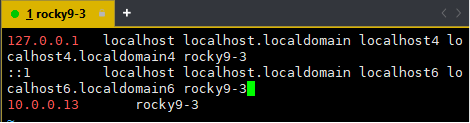
`vi /etc/hosts`

	메일서버에 이렇게 먼저 설정

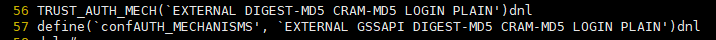
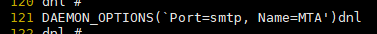
`vi /etc/mail/sendmail.mc`

	56,57: dnl 제거
	121: Addr=127.0.0.1 제거 -> 재부팅안해도됨


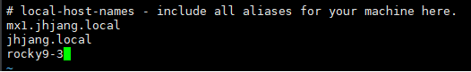
`vi /etc/mail/local-host-names`

	mx1.jhjang.local: 받는 메일 서버


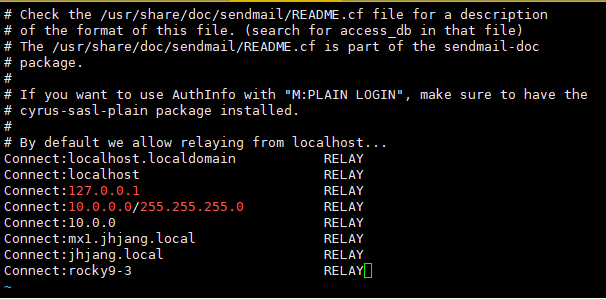
`vi /etc/mail/access`

	스팸메일을 대량으로 보낼 수 있음 -> 차단될 수 있는 문제 발생
	짝꿍한테 메일을 보낼땐 실제 IP주소를 적어야될 수 있음

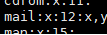
`vi /etc/group`

	mail에 x,y를 추가해줌

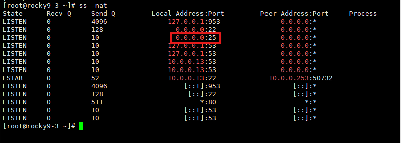

	25번 포트 확인


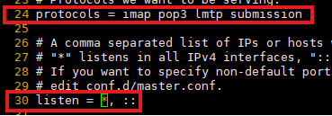
`vi /etc/dovecot/dovecot.conf

	여기서 우리는 imap과 pop3만 쓸 예정

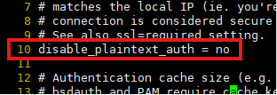
`vi /etc/dovecot/conf.d/10-auth.conf`

	disable_plaintext_auth = yes 를 no로 변경

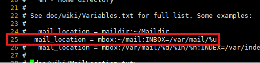
`vi /etc/dovecot/conf.d/10-mail.conf`


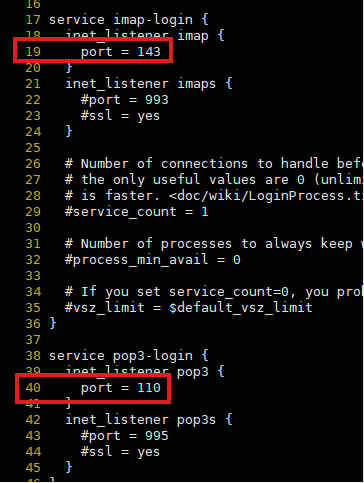
`vi /etc/dovecot/conf.d/10-master.conf`

	imap과 pop3부분 주석 제거

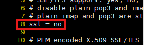
`vi /etc/dovecot/conf.d/10-ssl.conf`

	ssl = required 부분을 no로 변경


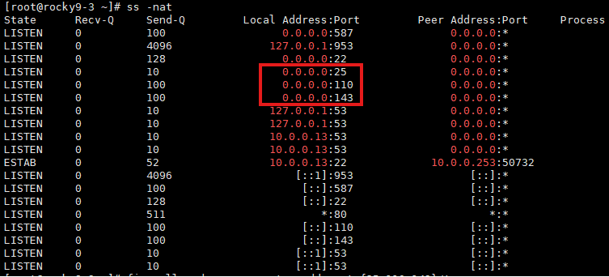
`ss -nat`

	25,110,143 포트 활성화 확인


---

### 썬더버드 설정

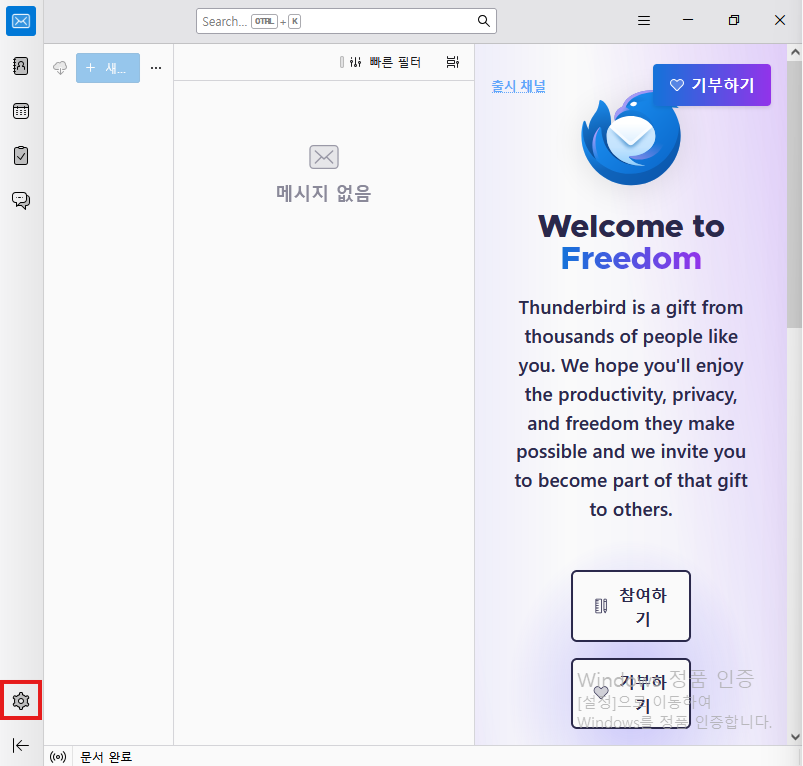

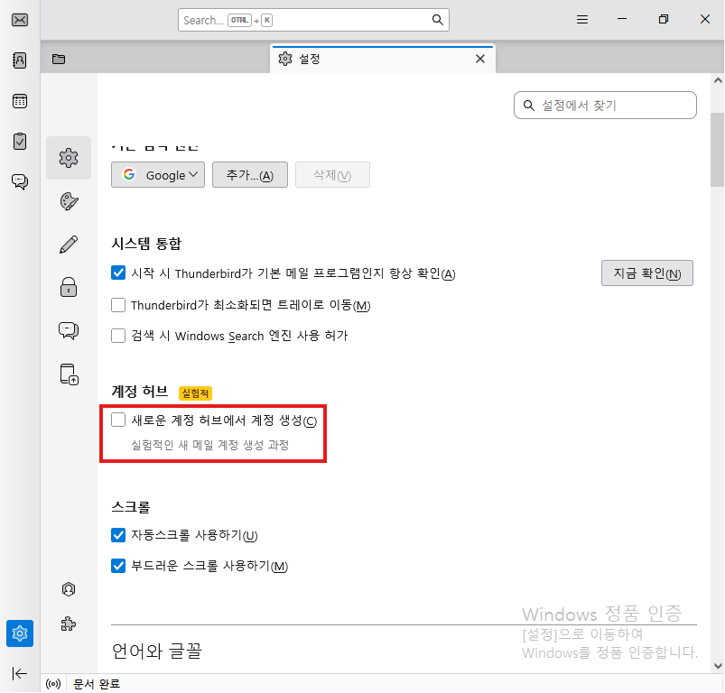


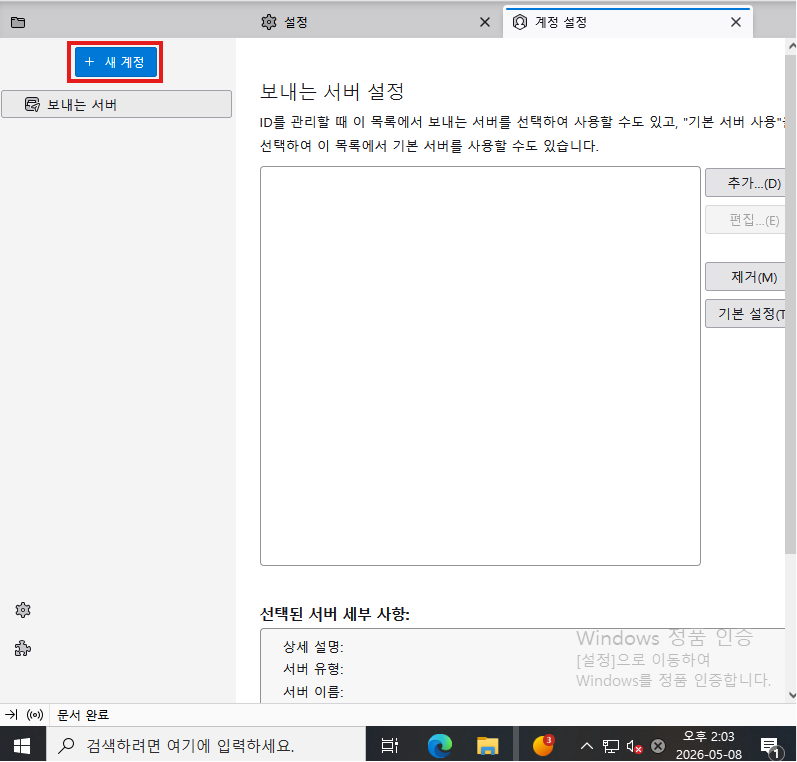

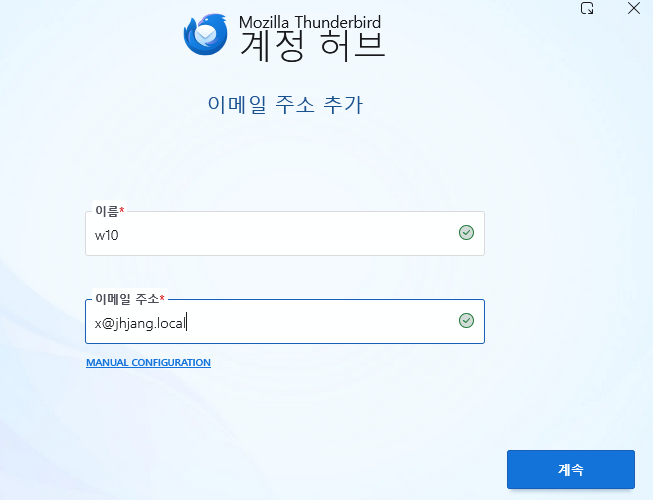

	메일계정 선택


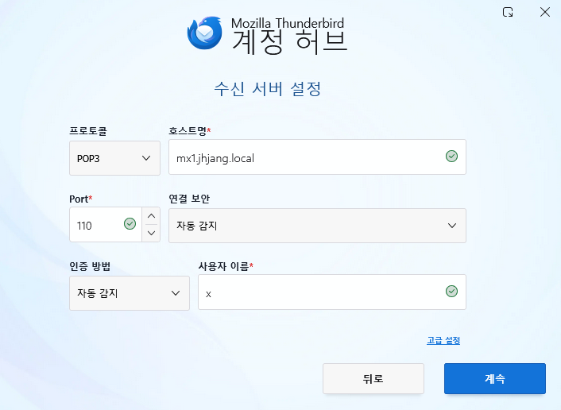

	수신자 설정
	동작을 잘 안하면 IP주소를 직접 넣어도 됨. 통상적으로는 DNS로 작성


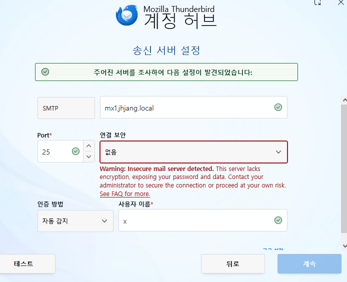

	송신자 설정


---

### 삭제 방법

```bash
dnf autoremove -y sendmail sendmail-cf dovecot
rm -rf /etc/mail /etc/dovecot
userdel -r x
userdel -r y
firewall-cmd --permanent --remove-port={25,110,143}/tcp
```

---

### 실습

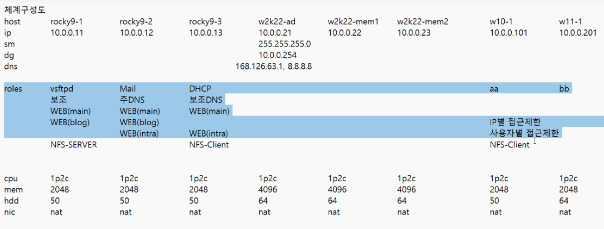

