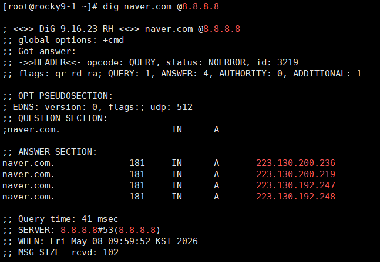

---
## 복습

nslookup 대신 사용할 수 있음

`dig naver.com @8.8.8.8`

```bash
dnf install -y dhcp-server
vi /etc/dhcp/dhcpd.conf
systemctl enable --now dhcpd


mkdir /var/www/blog
vi /var/www/html/index.html
vi /var/www/blog/index.html
vi /etc/httpd/conf.d/vir.conf
systemctl restart httpd
firewall-cmd --permanent --add-port=80/tcp
firewall-cmd --reload
```


34번째줄 ServerRoot "/etc/httpd" 여기에 웹 관련파일 모두 모아둠
150 Options Indexes FollowSymLinks 에서 Indexes 삭제
로그 레벨 순서: debug, info, notic, warn, error, crit, alert emerg 외워두기

<html>
<body>
<h1>MAIN-JHJANG-WEB-1</h1>
</body>
</html>
httdx보다는 ldap이나 중앙집중식으로 사용자 인증방식을 더 많이 씀