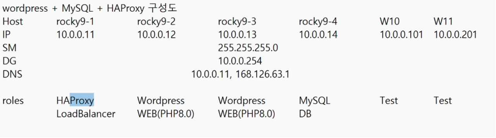
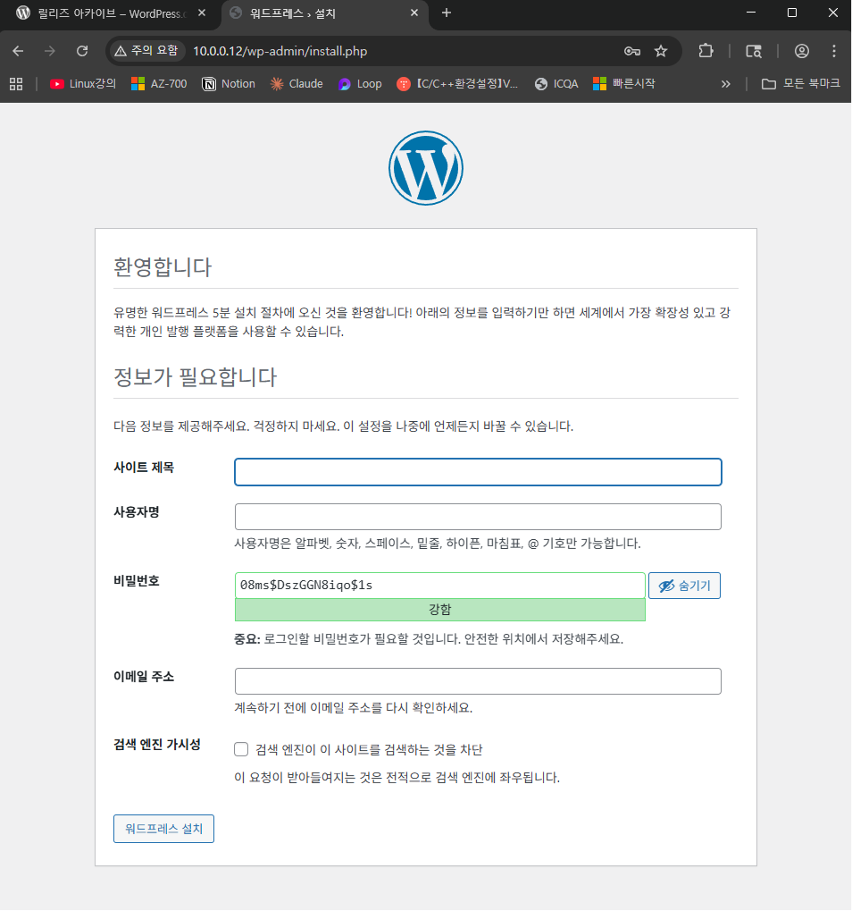
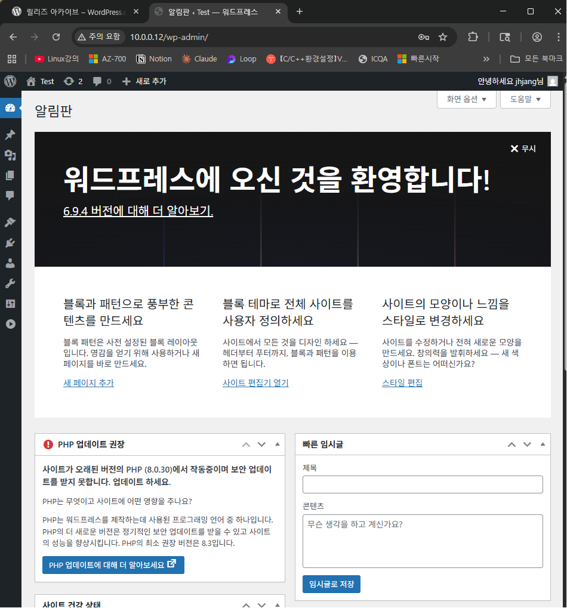

---
# 오늘의 목표




### Wordpress

**rocky9-2**
```bash
dnf install -y wget
wget https://ko.wordpress.org/wordpress-6.9.4-ko_KR.tar.gz
ls

dnf install -y tar
tar xvfz wordpress-6.9.4-ko_KR.tar.gz
ls
ls wordpress

dnf install -y httpd

# 전부
dnf install -y wget tar httpd php php-cli php-gd php-mysqlnd
wget https://ko.wordpress.org/wordpress-6.9.4-ko_KR.tar.gz
ls
tar xvfz wordpress-6.9.4-ko_KR.tar.gz


#sed, awk --> 반드시 숙지해야함
sed -i "s/DirectoryIndex index.html/DirectoryIndex index.php/g" /etc/httpd/conf/httpd.conf
vi /etc/httpd/conf/httpd/conf #:169 
cp /var/www/html/{wp-config-sample.php,wp-config.php}


sed -i "s/database_name_here/wordpress/g" /var/www/html/wp-config.php
sed -i "s/username_here/jhjang/g" /var/www/html/wp-config.php
sed -i "s/password_here/It12345@/g" /var/www/html/wp-config.php
sed -i "s/localhost/10.0.0.14/g" /var/www/html/wp-config.php
vi /var/www/html/wp-config.php
systemctl enable --now httpd
# 이러면 데이터 connection 오류가 나야 정상, php오류 뜨면 안됨
firewall-cmd --permanent --add-port=80/tcp
firewall-cmd --reload

```


**자동 스크립트 (wordpress)**
```bash
#! /bin/bash

dnf install -y wget tar httpd php php-cli php-gd php-mysqlnd
wget https://ko.wordpress.org/wordpress-6.9.4-ko_KR.tar.gz
tar xvfz wordpress-6.9.4-ko_KR.tar.gz
cp -ar wordpress/* /var/www/html/
ls /var/www/html/
sed -i "s/DirectoryIndex index.html/DirectoryIndex index.php/g" /etc/httpd/conf/httpd.conf
cp /var/www/html/{wp-config-sample.php,wp-config.php}
sed -i "s/database_name_here/wordpress/g" /var/www/html/wp-config.php
sed -i "s/username_here/jhjang/g" /var/www/html/wp-config.php
sed -i "s/password_here/It12345@/g" /var/www/html/wp-config.php
sed -i "s/localhost/10.0.0.14/g" /var/www/html/wp-config.php
echo $HOSTNAME > /var/www/html/health.html
systemctl enable --now httpd
firewall-cmd --permanent --add-port=80/tcp
firewall-cmd --reload
```


### 명령어
```bash
-a 시간도 다 선택
```


database_name_here: wordpress
username_here: jhjang
password_here: It12345!
localhost: 10.0.0.14

| name               | value     |
| ------------------ | --------- |
| database_name_here | wordpress |
| username_here      | jhjang    |
| password_here      | It12345!  |
| localhost          | 10.0.0.14 |
### MySQL

**rocky9-4**
```bash
dnf install -y mysql-server

systemctl enable --now mysqld
firewall-cmd --permanent --add-port=3306/tcp
firewall-cmd --reload
mysql -uroot
```

**mysql**
```bash
select user,host from mysql.user;
create user 'jhjang'@'%' identified by 'It12345@';
grant all privileges on *.* to 'jhjang'@'%';
select user,host from mysql.user;
```


### HAProxy

**rocky9-1**
```bash
dnf install -y mysql #mysql client만 설치됨
mysql -ujhjang -p -h 10.0.0.14
create database wordpress;
show databases;
```


### 결과 화면

robots.txt: 검색 엔진에 대한 가시성 부분



`10.0.0.12 접속화면`



```bash
scp word.sh root@10.0.0.13:/root/
```


```bash
sh word.sh
```


방법
1. 워드프레스 다운로드 검색
2. 릴리스 -> tar.gz 링크 주소 복사


**rocy9-4**
```bash
#! /bin/bash

dnf install -y mysql-server
systemctl enable --now mysqld
firewall-cmd --permanent --add-port=3306/tcp
firewall-cmd --reload
mysql -uroot -e "create user 'jhjang'@'%' identified by 'It12345@'; grant privileges on *.* to 'jhjang'@'%';"
```


**rocky9-1**
```bash
dnf install -y haproxy

vi /var/www/html/health.html #체크용 하나 만들어둠(server-1,server-2)
```

68: 80
72: app
87: 10.0.0.12:80
88: 10.0.0.13:80

### 로드 밸런싱

10.0.0.11/health.html 들어가보면 번갈아가면서 들어가는걸 볼 수 있음


```bash
#! /bin/bash

sed -i "s/*:5000/*:80/g" /etc/haproxy/haproxy.cfg
sed -i "s/use_backend static/use_backend app/g" /etc/haproxy/haproxy/cfg
sed -i "s/server app3/#server app3/g" /etc/haproxy/haproxy.cfg
sed -i "s/server app4/#server app4/g" /etc/haproxy/haproxy.cfg
systemctl enable --now haproxy
firewall-cmd --permanent -add-
```


---
3회차

1. touch: 파일의 현재 시간을 date 시간으로 바꾸는 명령어, 하지만 파일이 없을경우 0byte 파일 생성
2. cat: 파일 내용 출력, 여기에 리다이렉션 기호 > 를 넣으면 cat > b.txt 로 내용을 적어서 파일을 생성
3. vi: vi편집기

4. tar (c: create): tar cvf ab.tar a.txt b.txt / tar tvf ab.tar
	c x t r u -C v f
	gz gzip / bz bzip2 (gz보다 성능이 20~30% 좋음) -> -d 붙이면 공통으로 압축 해제됨
	0~9 숫자로 압축 가능
```
dnf install -y bzip2
```

5. tree /1
	dnf install -y tree

6. sed, awk 사용법 익히기
```bash
sed -i "s/DirectoryIndex index.html/DirectoryIndex index.php/g" /etc/httpd/conf/httpd.conf
```

7. sh
	sh: 권한 무시하고 실행 스크립트는 역등성(매번 결과값이 똑같음을 보장)을 보장하지않음 그래서 iac도구를 사용함
	