---

**powershell 명령어**
```bash
Install-WindowsFeature -name dhcp -includeManagementTools
```

	powershell로 윈도우 dhcp 설치 가능


	윈도우는 설치하면 자동으로 포트가 열림
	
	inetpub이라는 폳더 하나 생김 -> 공격자도 알기 때문에 새로운 폴더 생성
	
	폴더 생성 -> 사용자 생성


기본인증


<html>
<body>
<h1>JHJANG-WEB-2</h1>
</body>
</html>


---

## 주 DNS (ad)

정방향: 
역방향:


	리눅스 때 했던거랑 똑같음


---
## 보조영역

동작 -> 마스터에서 전송 -> dns껐다킴


---

포트 겹침 -> 가상 디렉터리

	바인딩 -> 도메인이름으로 수정

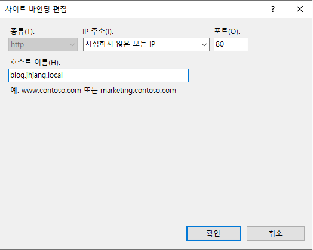


	아니면 웹 추가할때 설정

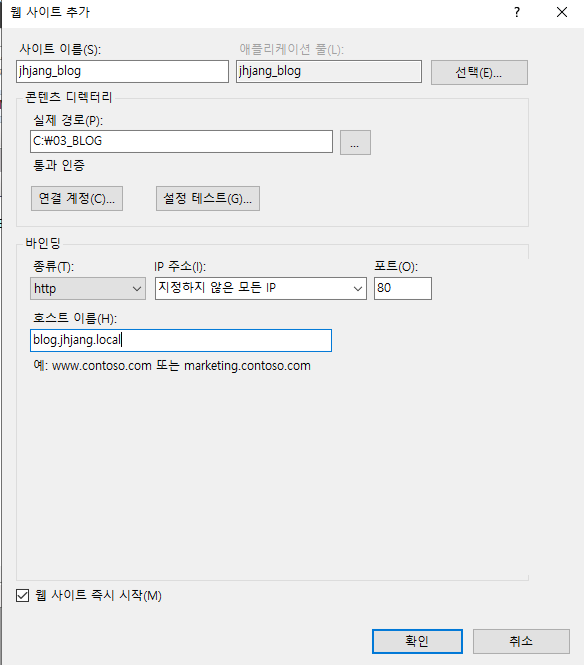

---
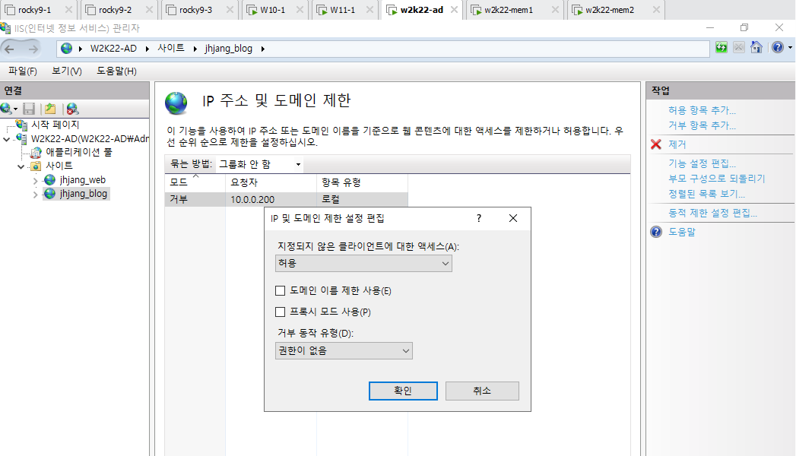


실제 pc에서 가상 머신으로 들어가는법
dns 주소 1차를 10.0.0.21로 바꿔준다.
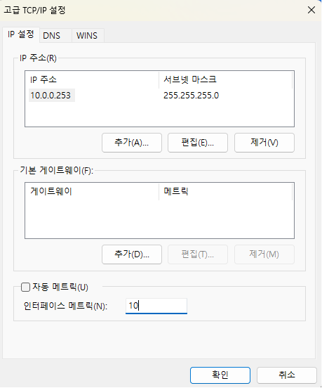

매트릭 값을 낮춤으로써 외부로 나가는것보다 먼저처리하도록 설정


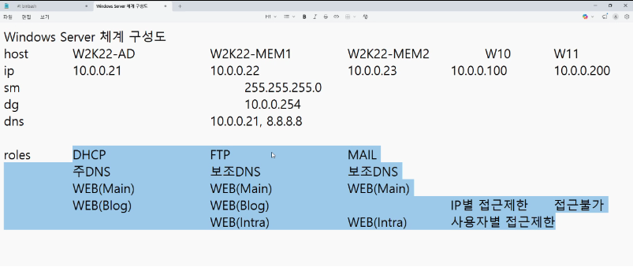


사용자 a와 b 추가가
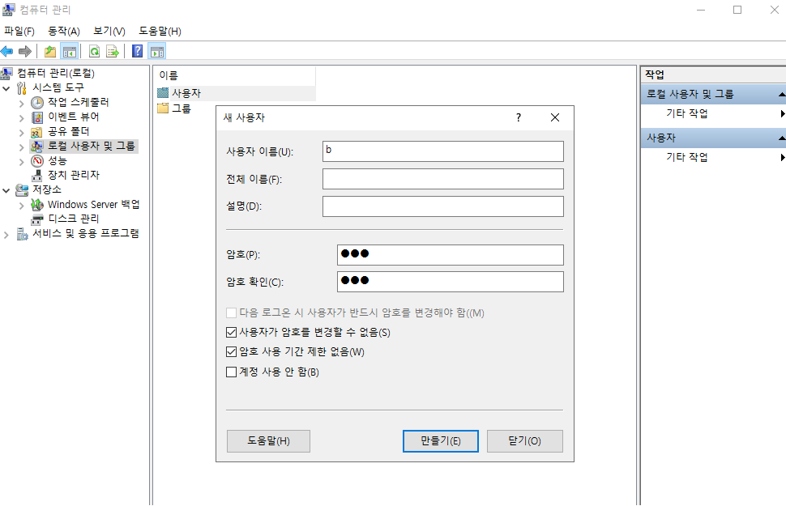

---

### WINDOW

	Active Directory

sysinternal.com
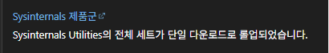

autoruns

w2k22-mem2
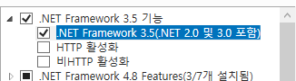


<html>
<body>
<h1>JHJANG-MAIN-1</h1>
</body>
</html>


DHCP

FTP

권한부여-인증 짝꿍


DNS
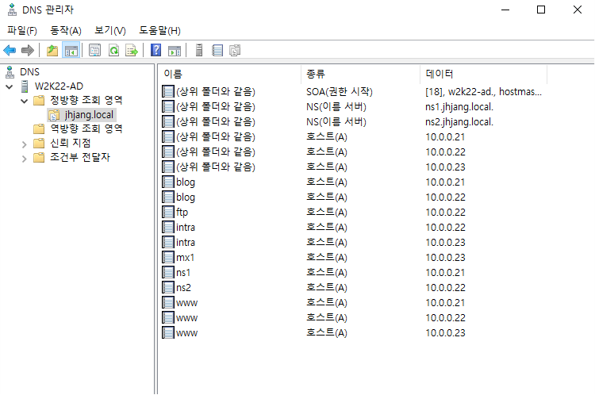


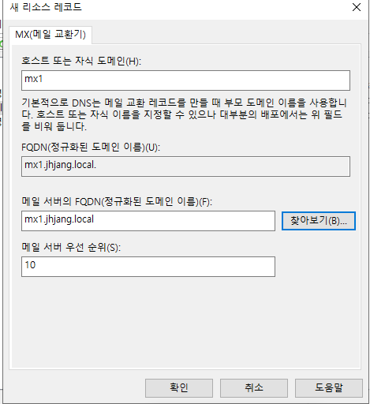


`allow_update 설정`

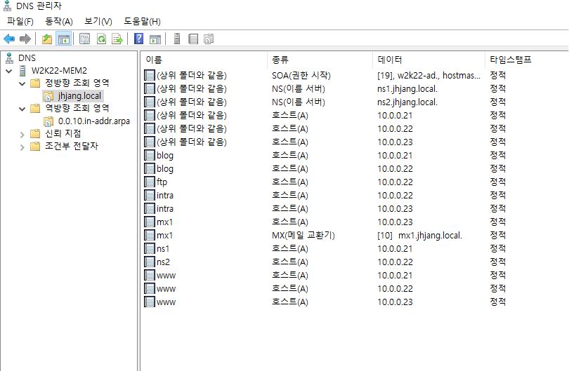
`보조영역 설정`


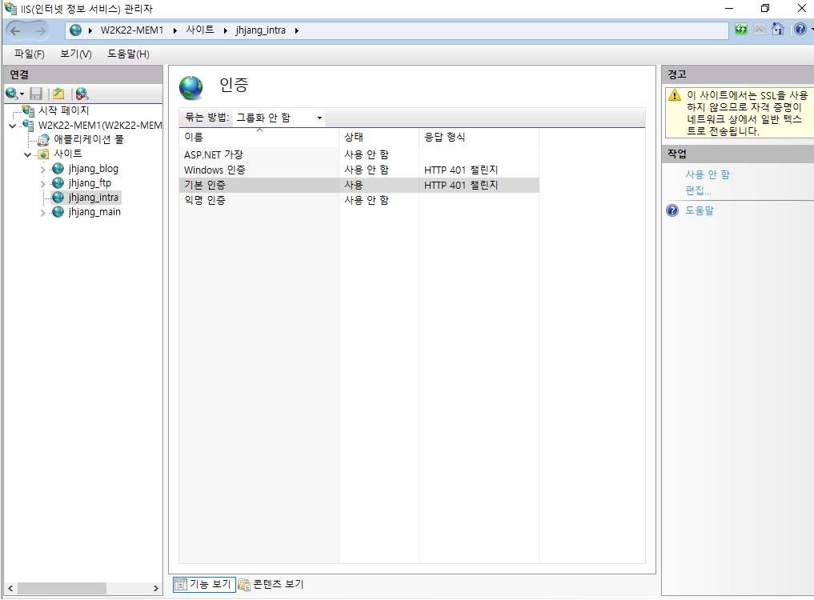


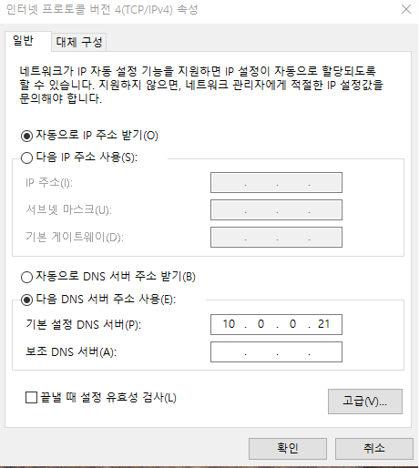

자꾸 외부로 나가려고 할땐 dns를 내부로 고정시켜준다

hmail

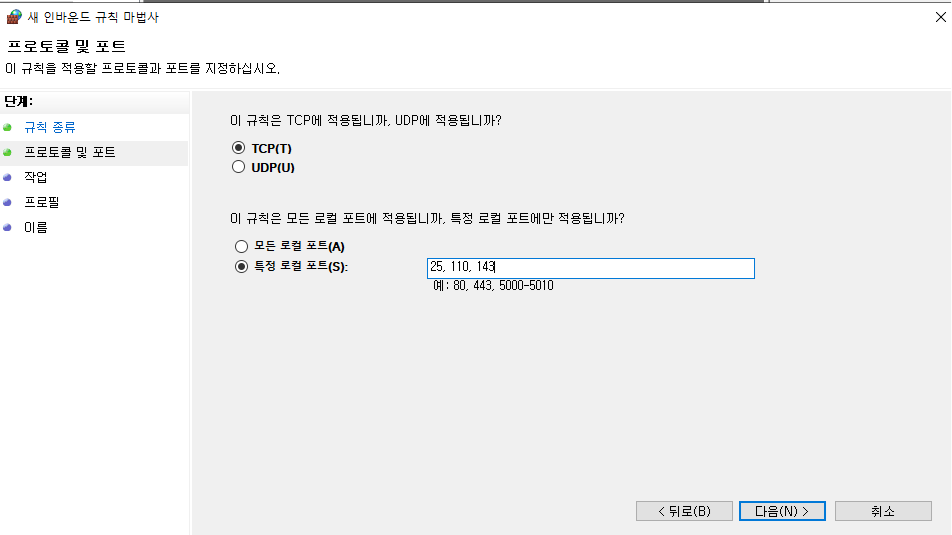


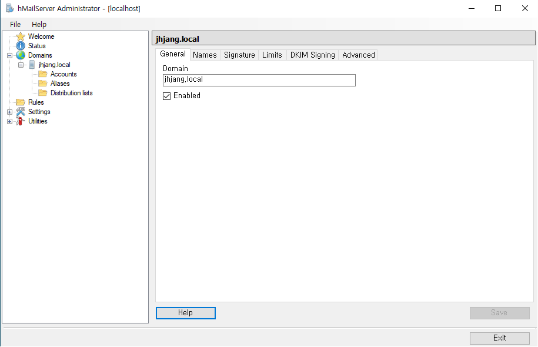


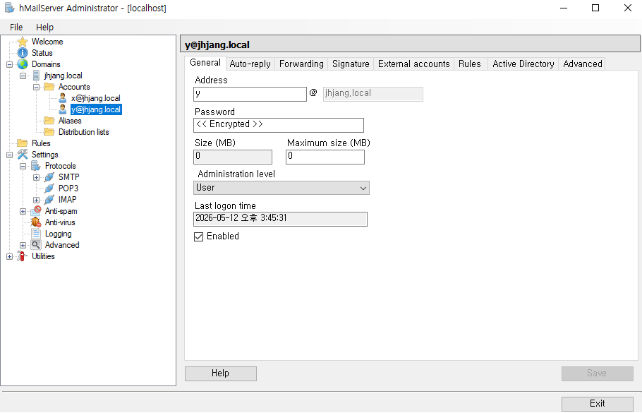

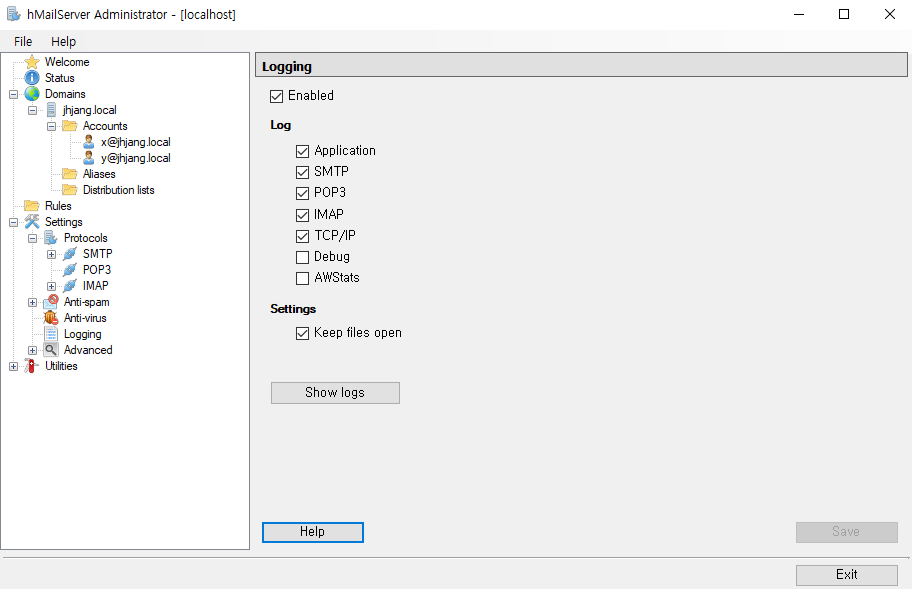

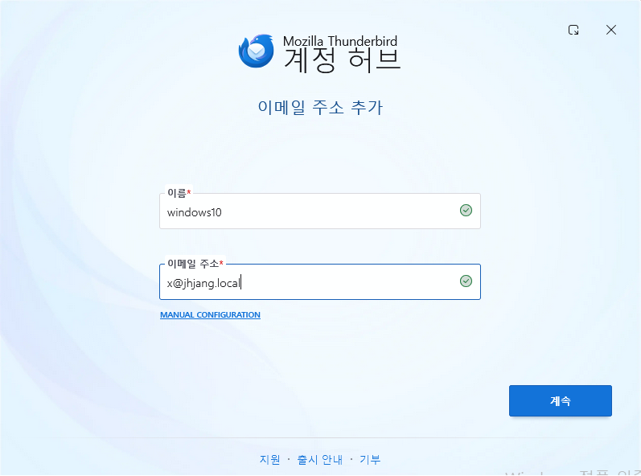

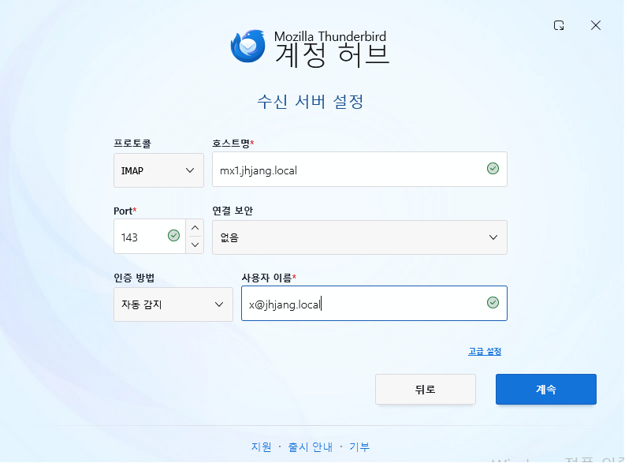


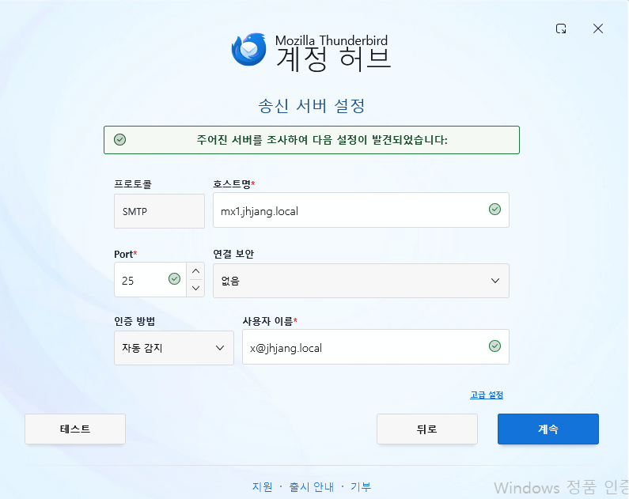


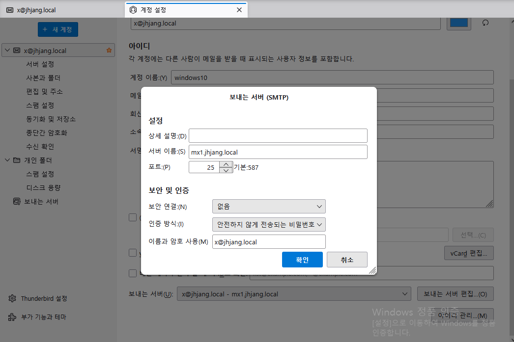

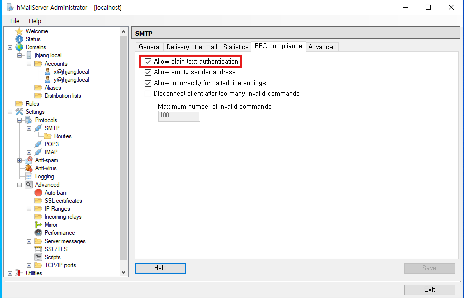