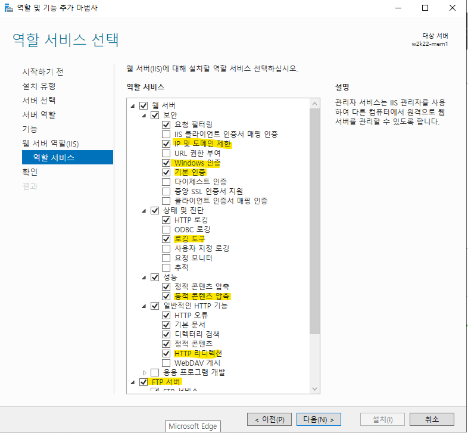
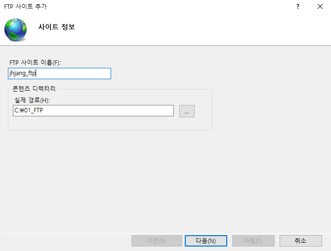
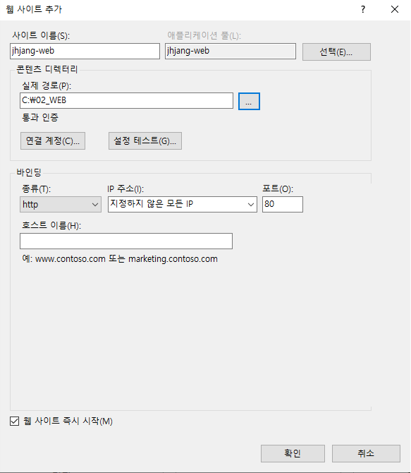
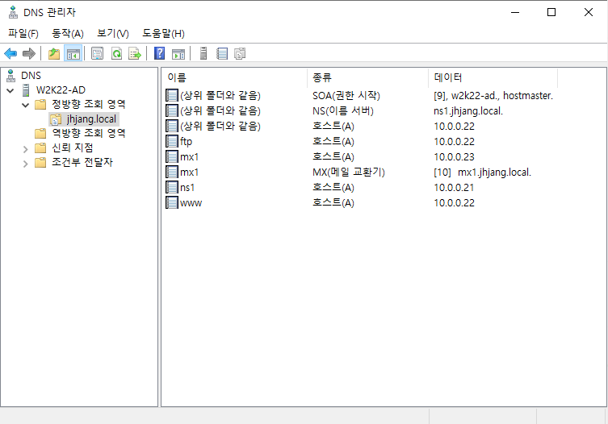
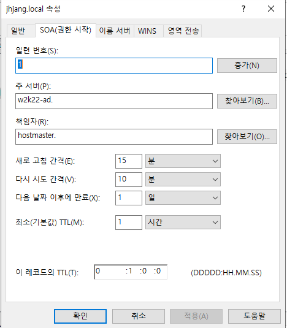
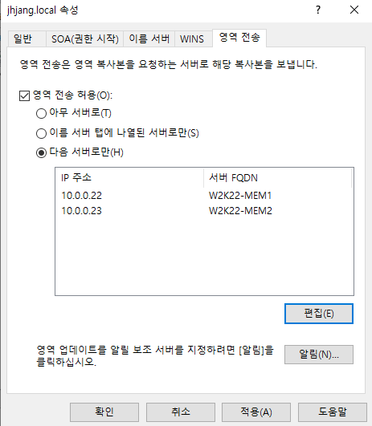

---

**powershell 명령어**
```bash
Install-WindowsFeature -name dhcp -includeManagementTools
```

	powershell로 윈도우 dhcp 설치 가능




	윈도우는 설치하면 자동으로 포트가 열림
	
	inetpub이라는 폳더 하나 생김 -> 공격자도 알기 때문에 새로운 폴더 생성
	
	폴더 생성 -> 사용자 생성


기본인증


<html>
<body>
<h1>JHJANG-WEB-2</h1>
</body>
</html>



---

## 주 DNS (ad)

정방향: 
역방향:






	리눅스 때 했던거랑 똑같음




---
## 보조영역

동작 -> 마스터에서 전송 -> dns껐다킴