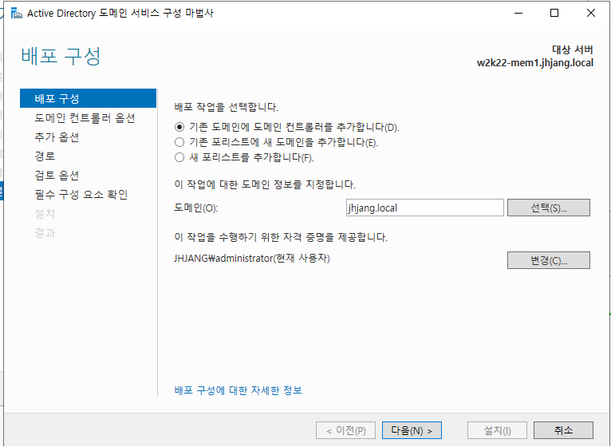
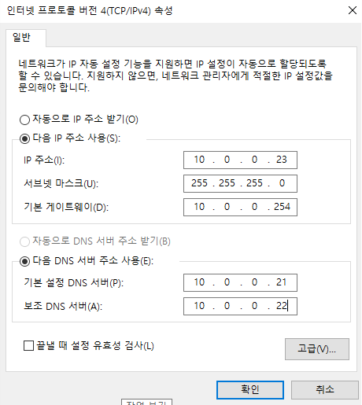
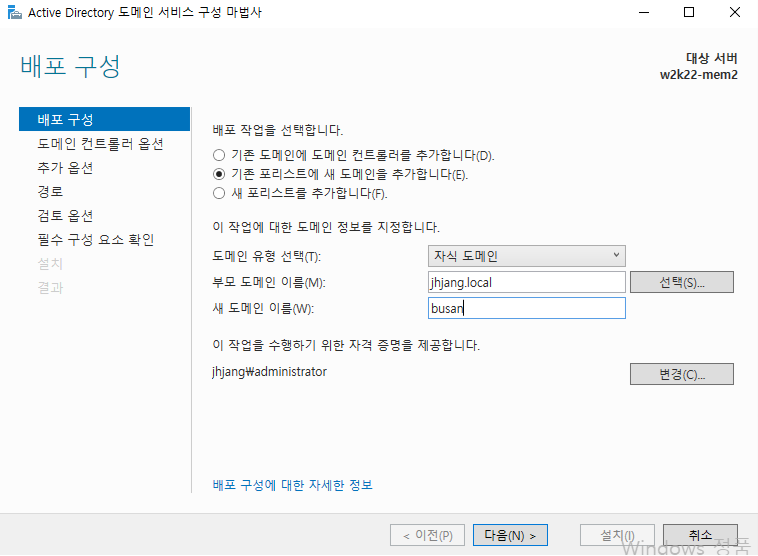
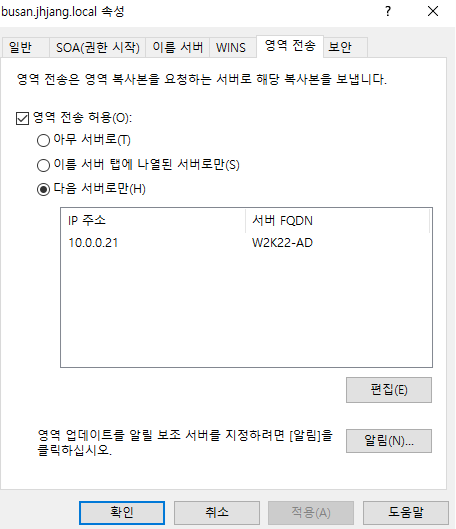
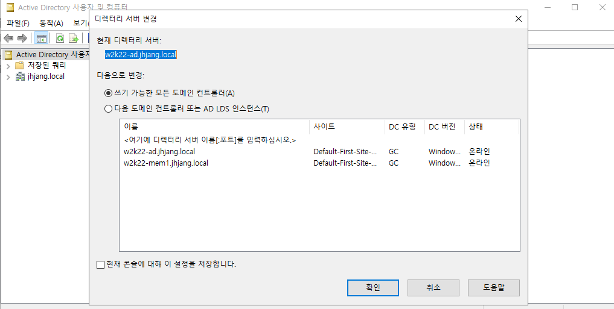
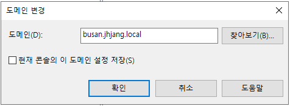
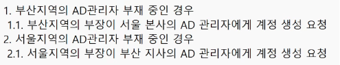
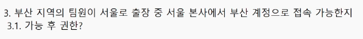

---
# Active Directory

윈도우 서버는 3가지로 나뉜다.

Windows Server( AD를 통한 인증, Group Policy를 통한 관리 )
	
	Standalone( Local Logon )
		독립실행형. 다른 서버와 상관 관계가 없음
		
	Member Server ( Domain Logon or Local Logon )
		DC의 자원(User, Group, Computer)을 갖어다 쓰기 위해서 구성
		Application은 Member Server에 설치를 권장함.
		
	Domain Controller ( Domain Logon )
		Domain 전체를 제어하는 서버
			일정한 영역
			Domain Name
			고객과 직원 계정 및 패스워드 정보 저장
			Application 설치 불가 -> 일반 사용자들도 접근 가능하기 때문
			

Administrator는 다 같은 최고 권위자가 아니다.

DC는 중앙집중형 장치
Single Sign On 토큰으로 모든 연관 사이트 접속가능, 한번털리면 다 털림, 상향평준화된 보안장치

RODC: ReadOnlyDomainController

local -> site -> domain -> ou

Infrastructure Master: 서로 포레스트안에 존재하는 관계에서 a사용자에 대한 내용을 복제할 경우 a 수정시 다른 쪽에서는 변경되지않는다. 이런 문제를 해결하는게 이거다.

---

# ADDS

	Active Directory Domain Service


|| 로드밸런싱


Active Directory는 철저하게 DNS에 포함됨


	DNS 체크는 해두는게 좋음
	패스워드는 길게?


새 도메인 Administrator의 암호는 이 컴퓨터의 로컬 Administrator의 암호와 같습니다.
	이걸 식별할줄 알아야함


	이 형태를 유지해야 Active Directory가 잘 만들어진거
	
	회색은 위임이다. _msdcs는 위에 _msdcd.jhjang.local을 위임한거


	이러면 nslookup으로 잘 찾음


	만약에 이름을 모를경우 .\administrator 입력 숨겨놓은 로컬계정으로 계정입력
	-> active directory 활성화안됨 -> 복구모드기때문
	
	local logon이기 때문에 domain controller에서는 로그인할 수 없음


안전 부팅 항목을 체크해제 후 재시작하면 됨


gpedit.msc


	로컬도 가지고 관리자도 가지도록 설정 가능


ncpa.cpl 에서 도메인 주소 10.0.0.21 변경


---

dns 확인
도구 -> active directory 사용자


adds랑 ads를 역할제거하고 접미사 제거 -> 초기화

ad - 도메인
2번째 - member

현재는 쌍둥이까지, domain 설치 -> 승격 ->포레스트추가 내 도메인
-> 
gc(id,pw가짐)문제있으면 일반사용자로그인안됨
윈도우는 netbios name을 더 중요시한다


```bash
Import-Module ADDSDeployment
Install-ADDSForest `
-CreateDnsDelegation:$false `
-DatabasePath "C:\Windows\NTDS" `
-DomainMode "WinThreshold" `
-DomainName "jhjang.local" `
-DomainNetbiosName "JHJANG" `
-ForestMode "WinThreshold" `
-InstallDns:$true `
-LogPath "C:\Windows\NTDS" `
-NoRebootOnCompletion:$false `
-SysvolPath "C:\Windows\SYSVOL" `
-Force:$true
```

완료되면 dns 확인
-> ipv6 dns 자동으로 변경 및 ipv4 dns 자기자신 실제 주소로(10.0.0.21) 변경

사용자 및 컴퓨터에서 Test_a와 Test_b 사용자 생성

=

w2k22-mem1은 멤버서버밖에 로그인안됨 -> 조인해줘야함
작업그룹에서 소속그룹의 도메인을 jhjang.local로 설정 -> 자격조건떠야함
만약 안뜨면 도메인 확인, ipv4의 dns주소 10.0.0.21잘 가리키는지 확인

만약되면 ad쪽에 computers에 mem1이 등록되어있는걸 확인 가능

mem1은 멤버 컨트롤러이므로 로컬 + 도메인 둘 다 로그인됨
	jhjang\administrator
	.\administrator

멤버서버만들고 로컬계정쓴다? -> 관리자계정안쓰겠다의미?
그래서 도메인계정으로 접속해야 관리자 권한받을 수 있음

도메인 계정으로 접속해야 a사용자 인증없이 추가 가능

만약 aa사용자 추가 후 일반사용자로 로그인
과연 앱설치가될까?

`네트워크 변경`


`앱 설치`

--> 불가능하다.


무슨오류가생긴다
-> 로컬계정로그인
-> 다시입력
-> 계정 다시 입력


sysdm.cpl -> 작업그룹 WORKGROUP

ad는 강제삭제해도상관없음
기능삭제
dns 접미사도 삭제


---

다시

**-ad-**

adds 설치

도메인 컨트롤러 - 도메인만 로그인
dns확인

```powershell
dcdiag /test:dns

```

사용자계정 a, b 추가 -> 로컬로그인불가

ipv4 내dns변경 ipv6 자동


**-mem1-**
멤버서버는 특별한 경우 아니면 domain administrator로 연결
Test a 를 Administartor로 추가

hmail 사용
.NET Framework 3.5 기능 설치필수
대체 원본 경로 지정 필수 (D:\sources\sxs)

도멩ㄴ

---
멤버

도메인 계정으로 설치 시 이미 세팅되어있음

---
자식서버만들기

mem2: 자식서버

(대규모지사)                                                (소규모지사)
자식 도메인                                                 RODC (엔지니어들이 만들어달라한거)
지역에 관리자가 존재                                     지역에 관리자가 부재해도 됨
물리적인 보안을 담보할 수 있어야 함.(접근통제)   물리적인 보안을 담보할 수 없어도 됨
상위단에 부모 도메인이 존재해야 함.                 상위단에 쓰기 가능한 DC가 존재해야 함.

부모 자식간 상호 Trust 관계 형성
부모 DC는 자식을 완벽하게 통제 가능
자식 DC는 부모DC에 대한 일반관리만 가능

다른 Domain영역


a.com
busan.a.com
daejeon.a.com





포레스트가 2016이니 2016보다 같거나 같아야함
NetBios이름이 다 떨어뜨리고 busan만 남기게됨

```powershell
#
# AD DS 배포용 Windows PowerShell 스크립트
#

Import-Module ADDSDeployment
Install-ADDSDomain `
-NoGlobalCatalog:$false `
-CreateDnsDelegation:$true `
-Credential (Get-Credential) `
-DatabasePath "C:\Windows\NTDS" `
-DomainMode "WinThreshold" `
-DomainType "ChildDomain" `
-InstallDns:$true `
-LogPath "C:\Windows\NTDS" `
-NewDomainName "busan" `
-NewDomainNetbiosName "BUSAN" `
-ParentDomainName "jhjang.local" `
-NoRebootOnCompletion:$false `
-SiteName "Default-First-Site-Name" `
-SysvolPath "C:\Windows\SYSVOL" `
-Force:$true
```

상대방의 주 영역을 보조영역가져온다.
본사 - 지사 ... 이런관계실습예정





dns설정

상대방 주영역을 내 서버에서 보조영역으로 가지고 있으면 따로 안물어봐도 됨


트러스트 관계 확인(부모-자식)



`같은 도메인`



`다른 도메인`

서울 -> 부산은 되지만 (완벽통제)
부산 -> 서울은 안됨 (일반관리)
--> 부모 자식 관계


---

실습





---


# Active Directory

## Windows Server 종류

> Windows Server는 **AD를 통한 인증**, **Group Policy를 통한 관리**를 기반으로 아래 3가지 역할로 나뉜다.

| 종류 | 로그인 방식 | 설명 |
|------|------------|------|
| **Standalone** | Local Logon | 독립 실행형. 다른 서버와 연관 관계 없음 |
| **Member Server** | Domain / Local Logon | DC의 자원(User, Group, Computer)을 가져다 사용. Application 설치 권장 |
| **Domain Controller** | Domain Logon | 도메인 전체를 제어하는 서버. Application 설치 불가 (일반 사용자도 접근 가능하기 때문) |

> ⚠️ **Administrator는 모두 동일한 최고 권위자가 아니다.**

---

## 핵심 개념

- **DC (Domain Controller)**: 중앙집중형 장치
- **SSO (Single Sign-On)**: 토큰으로 모든 연관 사이트 접속 가능 → 한 번 탈취되면 전체 탈취 위험 → 상향 평준화된 보안 장치 필요
- **RODC (Read Only Domain Controller)**: 읽기 전용 도메인 컨트롤러
- **Infrastructure Master**: 포레스트 내 다른 도메인 사용자 정보 변경 시 동기화 문제를 해결하는 FSMO 역할

### 계층 구조

```
local → site → domain → OU
```

---

# AD DS (Active Directory Domain Service)

> Active Directory는 철저하게 **DNS에 종속**되어 있다.  
> DC는 로드밸런싱도 지원한다.

## 설치 전 체크리스트

- DNS 설정 확인 필수
- 패스워드는 길게 설정
- **새 도메인 Administrator 암호 = 로컬 Administrator 암호** (반드시 식별할 것)

---

## Forest 설치

### PowerShell 스크립트

```powershell
Import-Module ADDSDeployment
Install-ADDSForest `
  -CreateDnsDelegation:$false `
  -DatabasePath "C:\Windows\NTDS" `
  -DomainMode "WinThreshold" `
  -DomainName "jhjang.local" `
  -DomainNetbiosName "JHJANG" `
  -ForestMode "WinThreshold" `
  -InstallDns:$true `
  -LogPath "C:\Windows\NTDS" `
  -NoRebootOnCompletion:$false `
  -SysvolPath "C:\Windows\SYSVOL" `
  -Force:$true
```

### 설치 완료 후 확인

- **IPv6 DNS** → 자동 변경됨
- **IPv4 DNS** → 자기 자신 주소로 변경 (예: `10.0.0.21`)
- 사용자 및 컴퓨터에서 `Test_a`, `Test_b` 사용자 생성

### DNS 정상 구성 확인

아래 형태를 유지해야 Active Directory가 정상적으로 구성된 것이다.


> 회색 항목 = **위임(Delegation)**  
> `_msdcs`는 `_msdcs.jhjang.local`을 위임한 것

아래와 같이 구성되면 `nslookup`으로 정상 조회된다.


---

## DNS 진단

```powershell
dcdiag /test:dns
```

---

## 로컬 로그인 / 복구 모드


- 이름을 모를 경우 `.\administrator` 입력 → 숨겨진 로컬 계정으로 접근
- Active Directory 활성화 안 됨 → **복구 모드이기 때문**
- DC는 **Local Logon 불가** (Domain Logon 전용)


> 💡 안전 부팅 항목 체크 해제 후 재시작하면 정상 부팅 가능

---

## 주요 관리 명령어

| 명령어 | 설명 |
|--------|------|
| `gpedit.msc` | 로컬 + 도메인 관리자 동시 설정 |
| `ncpa.cpl` | 네트워크 어댑터 설정 (DNS 주소 변경) |
| `sysdm.cpl` | 시스템 속성 (도메인/작업그룹 변경) |


---

## Member Server (w2k22-mem1) 설정

> w2k22-mem1은 멤버 서버이므로 반드시 **도메인에 조인**해야 한다.

### 조인 절차

1. `sysdm.cpl` → 소속 그룹 도메인을 `jhjang.local`로 변경
2. 자격 증명 입력창이 뜨면 정상
3. 안 뜨면 도메인 및 IPv4 DNS 주소 (`10.0.0.21`) 확인
4. 완료 후 AD의 **Computers** 항목에 `mem1` 등록 확인

### 로그인 방식

| 계정 종류 | 입력 형식 |
|-----------|----------|
| 도메인 계정 | `jhjang\administrator` |
| 로컬 계정 | `.\administrator` |

> 💡 **멤버 서버에서 로컬 계정 사용 = 관리자 권한 없음**  
> 관리자 권한을 받으려면 반드시 **도메인 계정으로 접속**해야 한다.

### 도메인 계정으로 접속 시


도메인 계정으로 접속 시 사용자 인증 없이 추가 가능

### 일반 사용자로 로그인 시 제한


> ❌ **네트워크 변경 불가 / 앱 설치 불가**

---

## 멤버 서버 운영 원칙

- 특별한 경우가 아니면 **Domain Administrator로 연결**
- `Test_a`를 Administrator로 추가

### hmail 설치 시 필수 조건

- `.NET Framework 3.5` 기능 설치 필수
- 대체 원본 경로 지정 필수: `D:\sources\sxs`

도메인 계정으로 설치 시 이미 세팅된 상태로 제공된다.


---

## 초기화 방법

1. ADDS 및 DNS 역할 제거
2. DNS 접미사 제거
3. `sysdm.cpl` → 작업 그룹 `WORKGROUP`으로 복귀

> AD는 강제 삭제해도 무방하다.

---

## 자식 도메인 만들기 (mem2)

### 자식 도메인 vs RODC 비교

| 항목 | 자식 도메인 (대규모 지사) | RODC (소규모 지사) |
|------|--------------------------|-------------------|
| 지역 관리자 | 필요 | 불필요 |
| 물리적 보안 | 반드시 담보 (접근 통제) | 담보 불필요 |
| 상위 요건 | 부모 도메인 필요 | 쓰기 가능한 DC 필요 |
| 비고 | 지역에 관리자 상주 | 엔지니어 요청 기반 구성 |

### 부모-자식 관계

- 부모 ↔ 자식 간 **상호 Trust 관계** 자동 형성
- 부모 DC → 자식 **완벽 통제 가능**
- 자식 DC → 부모에 대한 **일반 관리만 가능**

```
서울(부모) → 부산(자식) : 가능 ✅
부산(자식) → 서울(부모) : 불가 ❌
```

### 도메인 계층 구조 예시

```
a.com
├── busan.a.com
└── daejeon.a.com
```


> ⚠️ 포레스트 기능 수준이 2016이므로 **같거나 낮은 수준**으로 설정  
> NetBIOS 이름은 서브도메인만 남김 (예: `BUSAN`)

### 자식 도메인 설치 PowerShell 스크립트

```powershell
# AD DS 배포용 Windows PowerShell 스크립트

Import-Module ADDSDeployment
Install-ADDSDomain `
  -NoGlobalCatalog:$false `
  -CreateDnsDelegation:$true `
  -Credential (Get-Credential) `
  -DatabasePath "C:\Windows\NTDS" `
  -DomainMode "WinThreshold" `
  -DomainType "ChildDomain" `
  -InstallDns:$true `
  -LogPath "C:\Windows\NTDS" `
  -NewDomainName "busan" `
  -NewDomainNetbiosName "BUSAN" `
  -ParentDomainName "jhjang.local" `
  -NoRebootOnCompletion:$false `
  -SiteName "Default-First-Site-Name" `
  -SysvolPath "C:\Windows\SYSVOL" `
  -Force:$true
```

---

## DNS 보조 영역 설정

상대방의 주 영역을 내 서버에서 **보조 영역(Secondary Zone)** 으로 가져오면, 별도로 쿼리하지 않아도 된다.


> 📌 다음 실습 예정: 본사-지사 관계에서 보조 영역 가져오기

---

## Trust 관계 확인 (부모-자식)

### 같은 도메인


### 다른 도메인


| 방향 | 가능 여부 | 이유 |
|------|----------|------|
| 서울(부모) → 부산(자식) | ✅ 가능 | 완벽 통제 |
| 부산(자식) → 서울(부모) | ❌ 불가 | 일반 관리만 가능 |

---

## 실습 결과


/file-20260513160523814.png)
w10에서 실습

/file-20260513160637721.png)
연결된걸 확인가능


busan\aa
폴더생성 -> 권한 -> 고급공유 -> 권한선택 -> 읽기 -> 


busan\administrator 로는 ad최고권한에 있는 내용을 지울 수 없음

/file-20260513162508635.png)
최고관리자로 바꿔야함

강제 제거는 절대 하지 말것(다른 도메인 컨트롤러안에있는 내용은 안지우고 감)

마지막 도메인 컨트롤러면 체크


.\test