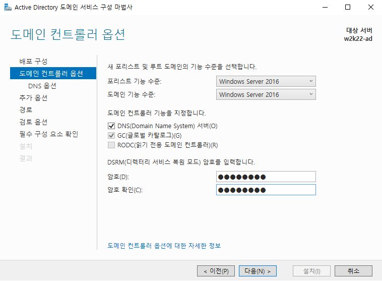
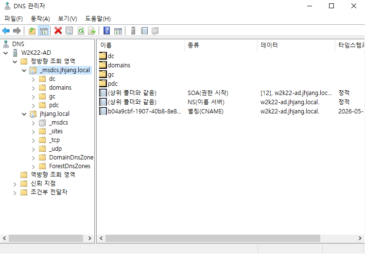
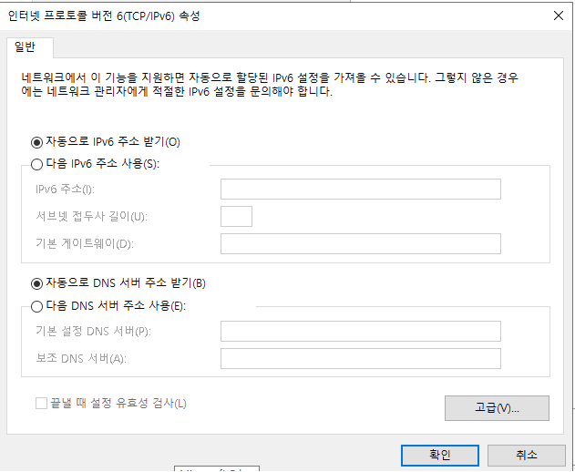
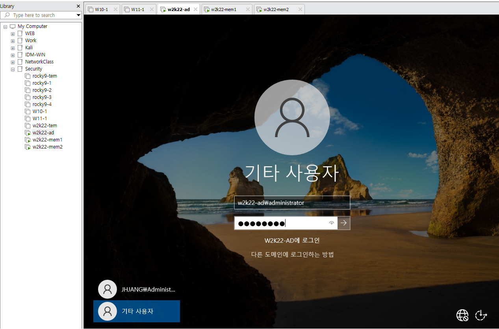
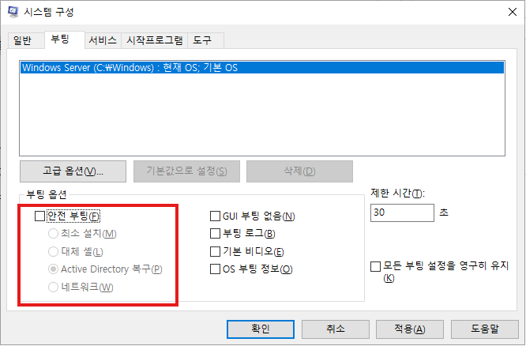
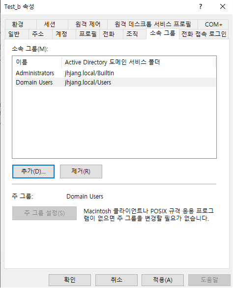
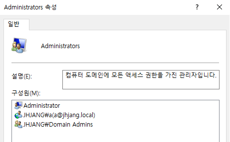
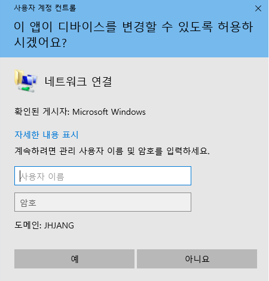
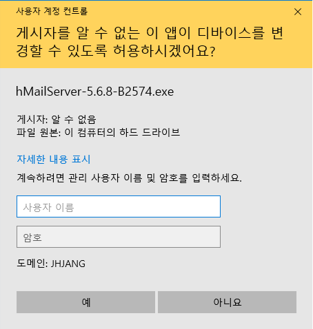

---
# Active Directory

윈도우 서버는 3가지로 나뉜다.

Windows Server( AD를 통한 인증, Group Policy를 통한 관리 )
	
	Standalone( Local Logon )
		독립실행형. 다른 서버와 상관 관계가 없음
		
	Member Server ( Domain Logon or Local Logon )
		DC의 자원(User, Group, Computer)을 갖어다 쓰기 위해서 구성
		Application은 Member Server에 설치를 권장함.
		
	Domain Controller ( Domain Logon )
		Domain 전체를 제어하는 서버
			일정한 영역
			Domain Name
			고객과 직원 계정 및 패스워드 정보 저장
			Application 설치 불가 -> 일반 사용자들도 접근 가능하기 때문
			

Administrator는 다 같은 최고 권위자가 아니다.

DC는 중앙집중형 장치
Single Sign On 토큰으로 모든 연관 사이트 접속가능, 한번털리면 다 털림, 상향평준화된 보안장치

RODC: ReadOnlyDomainController

local -> site -> domain -> ou

Infrastructure Master: 서로 포레스트안에 존재하는 관계에서 a사용자에 대한 내용을 복제할 경우 a 수정시 다른 쪽에서는 변경되지않는다. 이런 문제를 해결하는게 이거다.

---

# ADDS

	Active Directory Domain Service


|| 로드밸런싱


Active Directory는 철저하게 DNS에 포함됨




	DNS 체크는 해두는게 좋음
	패스워드는 길게?


새 도메인 Administrator의 암호는 이 컴퓨터의 로컬 Administrator의 암호와 같습니다.
	이걸 식별할줄 알아야함




	이 형태를 유지해야 Active Directory가 잘 만들어진거
	
	회색은 위임이다. _msdcs는 위에 _msdcd.jhjang.local을 위임한거




	이러면 nslookup으로 잘 찾음




	만약에 이름을 모를경우 .\administrator 입력 숨겨놓은 로컬계정으로 계정입력
	-> active directory 활성화안됨 -> 복구모드기때문
	
	local logon이기 때문에 domain controller에서는 로그인할 수 없음



안전 부팅 항목을 체크해제 후 재시작하면 됨


gpedit.msc




	로컬도 가지고 관리자도 가지도록 설정 가능


ncpa.cpl 에서 도메인 주소 10.0.0.21 변경


---

dns 확인
도구 -> active directory 사용자


adds랑 ads를 역할제거하고 접미사 제거 -> 초기화

ad - 도메인
2번째 - member

현재는 쌍둥이까지, domain 설치 -> 승격 ->포레스트추가 내 도메인
-> 
gc(id,pw가짐)문제있으면 일반사용자로그인안됨
윈도우는 netbios name을 더 중요시한다


```bash
Import-Module ADDSDeployment
Install-ADDSForest `
-CreateDnsDelegation:$false `
-DatabasePath "C:\Windows\NTDS" `
-DomainMode "WinThreshold" `
-DomainName "jhjang.local" `
-DomainNetbiosName "JHJANG" `
-ForestMode "WinThreshold" `
-InstallDns:$true `
-LogPath "C:\Windows\NTDS" `
-NoRebootOnCompletion:$false `
-SysvolPath "C:\Windows\SYSVOL" `
-Force:$true
```

완료되면 dns 확인
-> ipv6 dns 자동으로 변경 및 ipv4 dns 자기자신 실제 주소로(10.0.0.21) 변경

사용자 및 컴퓨터에서 Test_a와 Test_b 사용자 생성

=

w2k22-mem1은 멤버서버밖에 로그인안됨 -> 조인해줘야함
작업그룹에서 소속그룹의 도메인을 jhjang.local로 설정 -> 자격조건떠야함
만약 안뜨면 도메인 확인, ipv4의 dns주소 10.0.0.21잘 가리키는지 확인

만약되면 ad쪽에 computers에 mem1이 등록되어있는걸 확인 가능

mem1은 멤버 컨트롤러이므로 로컬 + 도메인 둘 다 로그인됨
	jhjang\administrator
	.\administrator

멤버서버만들고 로컬계정쓴다? -> 관리자계정안쓰겠다의미?
그래서 도메인계정으로 접속해야 관리자 권한받을 수 있음

도메인 계정으로 접속해야 a사용자 인증없이 추가 가능

만약 aa사용자 추가 후 일반사용자로 로그인
과연 앱설치가될까?

`네트워크 변경`


`앱 설치`

--> 불가능하다.


무슨오류가생긴다
-> 로컬계정로그인
-> 다시입력
-> 계정 다시 입력


sysdm.cpl -> 작업그룹 WORKGROUP

ad는 강제삭제해도상관없음
기능삭제
dns 접미사도 삭제


---

다시

**-ad-**

adds 설치

도메인 컨트롤러 - 도메인만 로그인
dns확인

```powershell
dcdiag /test:dns

```

사용자계정 a, b 추가 -> 로컬로그인불가

ipv4 내dns변경 ipv6 자동


**-mem1-**
멤버서버는 특별한 경우 아니면 domain administrator로 연결
Test a 를 Administartor로 추가

hmail 사용
.NET Framework 3.5 기능 설치필수
대체 원본 경로 지정 필수 (D:\sources\sxs)
