---
## 복습

**Active Directory**

	메타데이터 정리 수동
	

**w2k22-ad**

	ADDS 설치
	도메인 컨트롤러로 승격
	새 포리스트 추가 -> jhjang.local
	
```powershell
#
# AD DS 배포용 Windows PowerShell 스크립트
#

Import-Module ADDSDeployment
Install-ADDSForest `
-CreateDnsDelegation:$false `
-DatabasePath "C:\Windows\NTDS" `
-DomainMode "WinThreshold" `
-DomainName "jhjang.local" `
-DomainNetbiosName "JHJANG" `
-ForestMode "WinThreshold" `
-InstallDns:$true `
-LogPath "C:\Windows\NTDS" `
-NoRebootOnCompletion:$false `
-SysvolPath "C:\Windows\SYSVOL" `
-Force:$true
```
	설치 진행
	
	아이디로 administrator@jhjang.local을 권장함
	타겟이 존재한다면 administrator로 로그인해도 상관없음(밑에 JHJANG)
	
	dns 구조 확인 및 dcdiag dns로 확인
	
	가급적이면 ipv4로 바꿔주는게 좋음
	
	그룹정책에 의해 패스워드 최소 7자리 이상으로 바뀜
	
	도메인에 admin권한을 주지않으면 콘솔연결 불가능
	
	ip 서브넷 기반으로 서브넷나눔
	새 사이트 -> ko, jp
	10.0.0.0/24 -> ko
	20.0.0.0/24 -> jp
	
	
	로컬 사용자로 접속해야한다
	msconfig -> 안전부팅 -> active directory 부팅
	이때 active directory 동작x dc 접속안됨 -> 로컬접속
	
	.\administrator: 숨겨놓은 복원 계정으로 접속
	msconfig -> 안전부팅 해제 -> 재부팅
	.을 찍어봤자 로컬로그인은 안된다. (도메인 컨트롤러기 때문에 도메인 로그인만 가능하다.)
	
	JHJANG@Administrator
	It1
	로 로그인
	

**w2k22-mem1**

	쌍둥이 생성
	
	ipv4 dns를 ad서버로 변경
	
	도메인 컨트롤러를 만들려면 무조건 ADDS부터 만들어야 함
	
	스탠드 얼론이기때문에 
	jhjang\administrator
	It1
	을 입력해서 찾아줘야함
	
```powershell
#
# AD DS 배포용 Windows PowerShell 스크립트
#

Import-Module ADDSDeployment
Install-ADDSDomainController `
-NoGlobalCatalog:$false `
-CreateDnsDelegation:$false `
-Credential (Get-Credential) `
-CriticalReplicationOnly:$false `
-DatabasePath "C:\Windows\NTDS" `
-DomainName "jhjang.local" `
-InstallDns:$true `
-LogPath "C:\Windows\NTDS" `
-NoRebootOnCompletion:$false `
-SiteName "ko" `
-SysvolPath "C:\Windows\SYSVOL" `
-Force:$true
```
	설치 진행
	
	JHJANG@Administrator
	It1
	로 로그인
	
	ivp6 자동 dns로 변경
	
	ad의 도메인 컨트롤러 변경에서 mem1로 로그인하면 ad의 변경사항이 그대로 반영되는걸 볼 수 있음
	
	
	


**w2k22-mem2**

	얘는 ipv4 dns추가할 때 10.0.0.21, 10.0.0.22 둘 다 추가
	
	자식 도메인은 새 도메인 추가
	
```powershell
#
# AD DS 배포용 Windows PowerShell 스크립트
#

Import-Module ADDSDeployment
Install-ADDSDomain `
-NoGlobalCatalog:$false `
-CreateDnsDelegation:$true `
-Credential (Get-Credential) `
-DatabasePath "C:\Windows\NTDS" `
-DomainMode "WinThreshold" `
-DomainType "ChildDomain" `
-InstallDns:$true `
-LogPath "C:\Windows\NTDS" `
-NewDomainName "busan" `
-NewDomainNetbiosName "BUSAN" `
-ParentDomainName "jhjang.local" `
-NoRebootOnCompletion:$false `
-SiteName "ko" `
-SysvolPath "C:\Windows\SYSVOL" `
-Force:$true
```

	요구조건: 부산에 사용자 한명 추가해주세요.
	
	서울서버와 부산서버간 dns 보조영역을 상대방의 주영역으로 서로 생성해서 연결
	AD의 Active Directory 사용자 및 컴퓨터에서 부산서버로 도메인 변경을 진행
	그리고 새로운 사용자 추가하고 부산 서버에서 확인
	
	
	
	
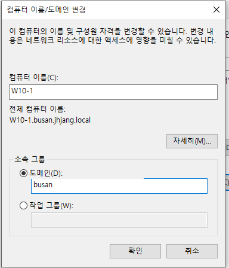

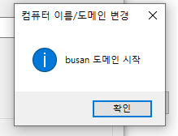

이러면 부산 서버에 사용자 및 컴퓨터 부분에 Computers에 등록됨

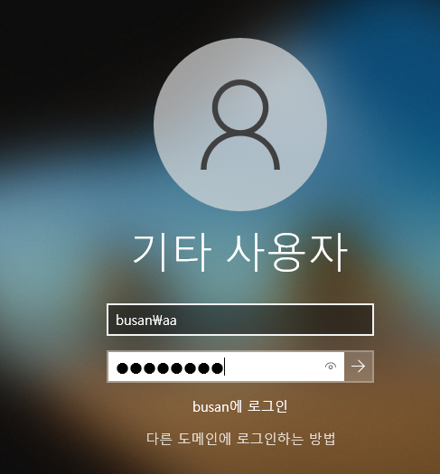

	부산쪽으로 로그인 성공

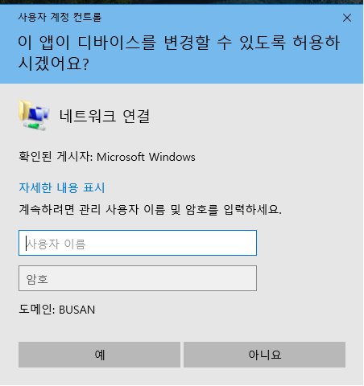

	일반사용자라 바꿀수없음

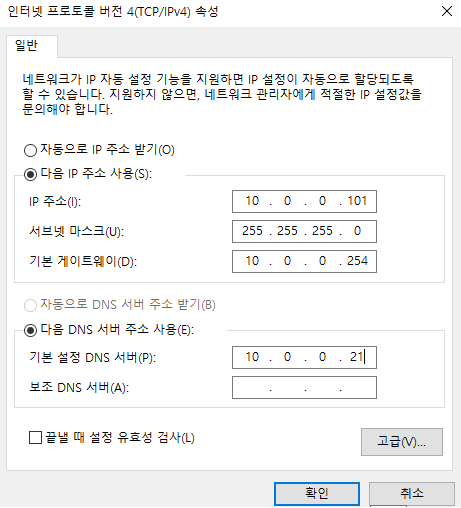

	하지만 관리자 id입력해서 연결


ad에서 공유폴더생성

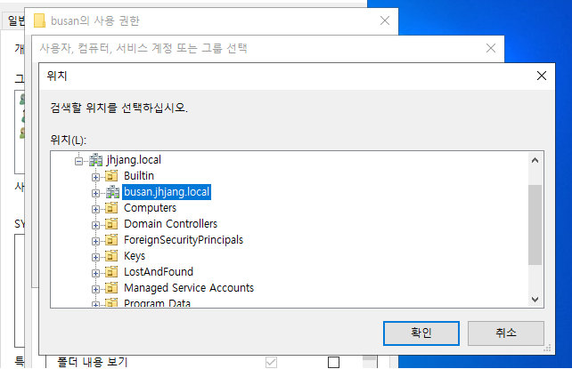

	Test_aa 사용자 추가해줌

읽기: 파일 내용 읽음, 내용 변경 불가, 삭제 불가, 이름변경 불가, 생성 불가
쓰기: 파일 생성 가능, 내용 변경 가능, 삭제 불가, 이름변경 불가
수정: 파일 생성 삭제, 이름 변경 가능 내용 변경 가능
-> 정확하게 알기

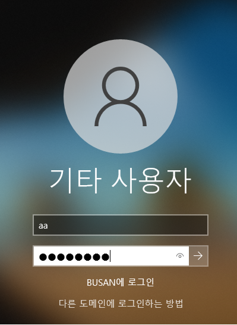

	부산 사용자로도 로그인이 됨됨

```
\\10.0.0.21
```

	공유폴더는 폴더 생성도 안됨
	why? -> 보안권한보다 공유권한이 더 작아서 (이부분다시확인)


---

FSMO
	특정 작업을 수행할 때 작업의 일관성을 유지하기 위해서
	특정 서버가 마스터 역할을 수행하는 것
		Forest 영역
			schema master (포리스트 전체에서 스키마의 일관성 유지)
			domain naming master (포리스트 전체에서 Domain Name의 일관성 유지)
		Domain 영역
			RID Master (사용자 계정 관리 RID는 기본적으로 DC에 500개가 할당. 그 이상의 사용자 계정 생성 시 RID Master 역할을 하는 DC에서 할당 받아야 함.)
			PDC: 사용자의 패스워드 변경 사항 추적
			서버 시간 동기화 (Kerberse환경에서는 서버끼리 5분 이상 시간 차이 발생 시 인증 불가능)
			그룹 정책의 시작점
			Infra Structure Master: 상호 참조하는 개체의 이름 변경 사항 추적

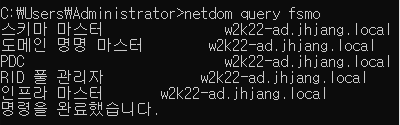
`netdom query fsmo`

	포리스트에 처음 만들어지는 dns는 무조건 얘가 가지고 있음

강제로 점유 시도?

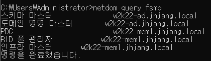
`작업 마스터 권한 넘기기`

	왜 필요할까?
	
	PDC를 예로들면
	비밀번호 추적 권한을 ad가 가지고 있었음
	만약 ad가 수리, 고장난다면 사용자들에게 비밀번호를 변경하지말라고 고지를 해야함
	이게 길어진다면 문제가 됨
	
	SM, DM, RM, P, IM의 역할을 분명하게 알자
	
	--> 무조건 마스터 권한을 넘기고 제거, 중지를 시켜야 한다.


	1. `regsvr32 schmmgmt.dll`
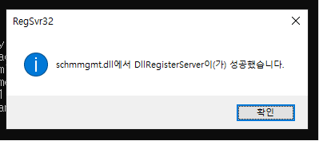


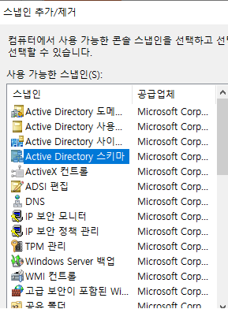

	다른 이름으로 저장 -> 바탕화면(AD)

	2. Active Directory 도메인 및 트러스트
		도메인 명명 마스터 작업마스터 존재

	3. Active Directory 사용자 및 컴퓨터
		RID
		PDC
		인프라
		

	RID, PDC는 성능 좋은 컴퓨터에 배치


cli로 
```
ntdsutil
Roles

#서버에 연결먼저
Connections
Connect to server w2k22-ad.jhjang.local #전송할 대상 서버

#대빵계정으로 로그인중이라 모두 가능
밑의 5줄 다 복사해서 넣으면됨
```


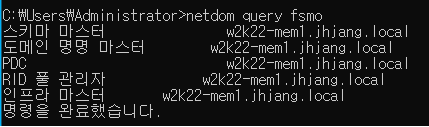

	모든 권한이 mem1에게 넘겨진걸 볼 수 있다.


---

**오늘 수업**

강제삭제를 왜 하면 안될까?

	수동삭제를 통해 배우는 시간

지역의 administrator 엔터프라이즈,스키마권한이없음
그래서 본사 관리자로 바꿔서 삭제해야함

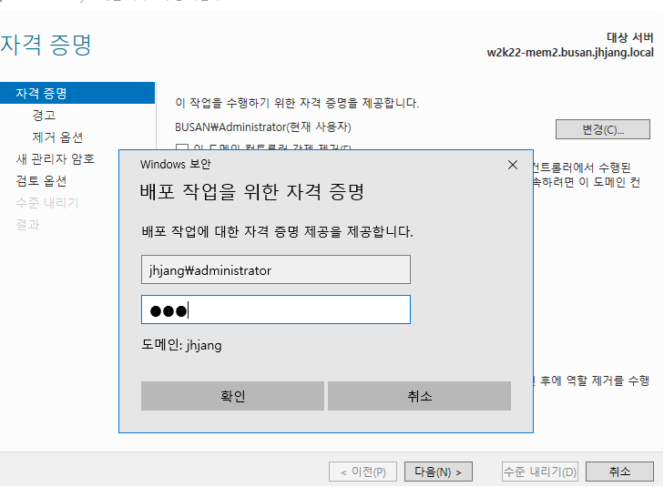


---
보충사항

++ gc가뭔지 잘 모르겠다(다시확인)

