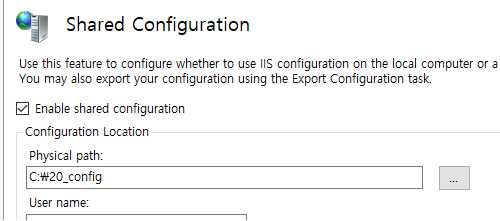
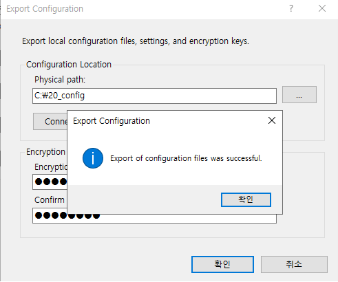
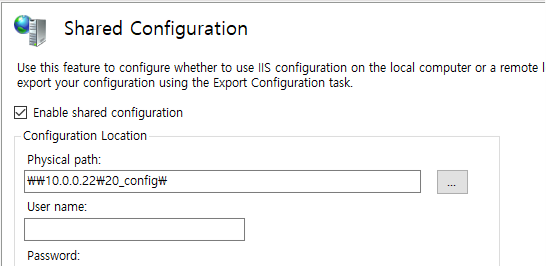
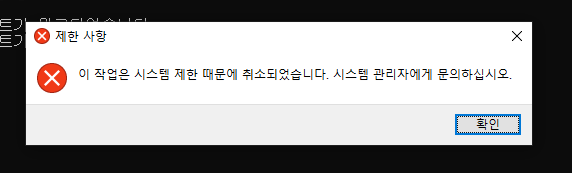
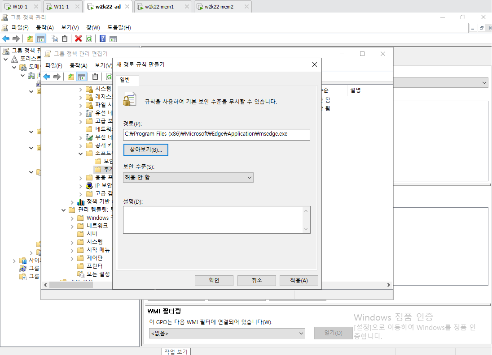
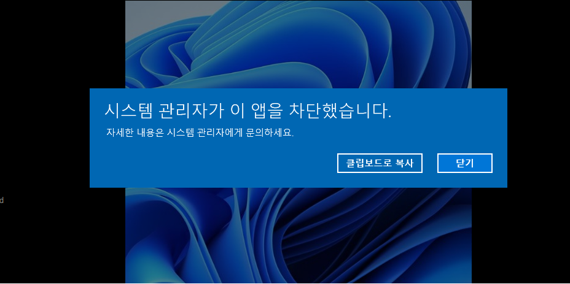
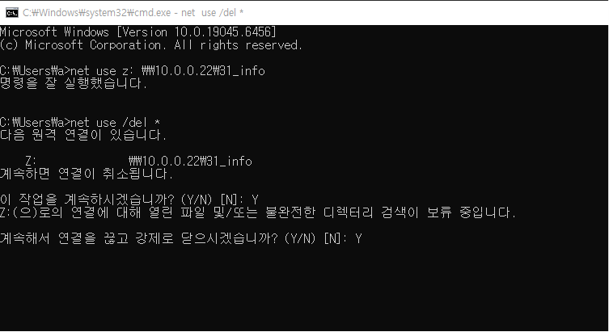
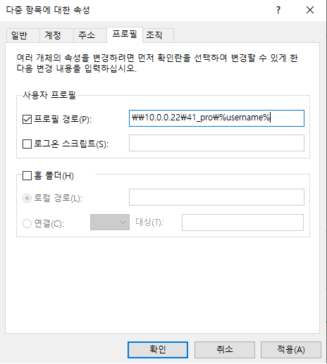
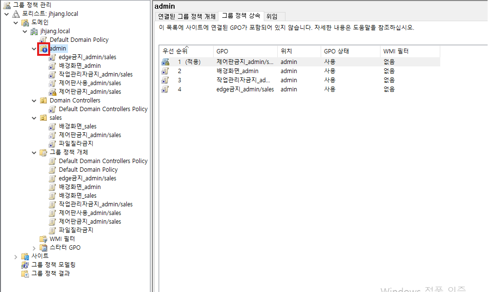

---

멤버 서버는 100%
스탠드 얼론은 몇퍼 사용 못함


## DHCP

**주 DHCP, 보조 DHCP**


	도메인 컨트롤러의 Administrator 계정을 사용


	다른 서버를 추가해서 하나의 관리 콘솔엥서 관리 가능(추가하지마셈 기능만 알아두기)


mem1: 주 dhcp
mem2: 보조 dhcp


mem1: 고급 -> 분할범위

보통 7:3으로 나누고 추가된 dhcp서버에 100밀리초 지연 시간 부여


	보조 dhcp가서 활성화 꼭 시켜주기

	별다른 문제 없으면 이전 ip를 받아오려고 함


**failover cluster**


	로드밸런싱이 가능하다


failover 클릭 -> 50대50으로 설정 -> 완료

	공유 저장소가 없이 복제해서 연결


---

IIS 구성 공유(mem1, mem2 동일한 구성)
DFS 복제 (mem1 contents, mem2로 복제)


	도메인의 사용자를 넣을 땐 저렇게 넣어야 한다.


	보안된 항목만이 체크되어있어서 자동으로 동적 업데이트 된다.


```javascript
<html>
<body>
<h1>JHJANG-MAIN-1</h1>
</body>
</html>
```


구성복제를 위한 과정

	mem1에 20_config폴더 생성







	mem2에서



	DFS복제

dfs관리->복제


---
그룹정책



제어판 잠금

밑에서부터 위로 적용 / 위쪽에 있는 설정이 아래쪽에 있는 설정을 덮어씌움
적용: 자물쇠버튼 위에 뭐가 있더라도 설정 다 무시


**edge차단**




"C:\Program Files (x86)\Microsoft\Edge\Application\msedge.exe" 해당경로를 차단




**스크립트**
```bash
@echo off echo. net use z: \\10.0.0.22\31_info echo ******************************************************************* echo [윈도우 포렌식 실습 도구] echo ******************************************************************* echo - 점검시간 - 시스템 생존시간 echo - 실행중인 서비스 목록 - DNS 연결 및 설정파일 정보 echo - 네트워크 등록정보 - 시작 레지스트리정보 echo - 네트워크 연결정보 - 계정 및 공유정보 echo - 개방된 포트정보 - 실행중인 프로세스/DLL정보 echo - 윈도우 패치정보 - 윈도우 주요실행파일 및 MD5목록 echo - 인터넷 접속 웹사이트정보 - Recycler 파일 목록 echo - 인터넷 Cache정보(pdf,doc,xls,hwp,ppt등) echo ******************************************************************* echo [점검PC이름] %COMPUTERNAME% 시스템 점검결과 > z:\%COMPUTERNAME%.txt echo. echo *************************************************************************** >> z:\%COMPUTERNAME%.txt echo 점검일시 >> z:\%COMPUTERNAME%.txt echo *************************************************************************** >> z:\%COMPUTERNAME%.txt date /t >> z:\%COMPUTERNAME%.txt time /t >> z:\%COMPUTERNAME%.txt echo *************************************************************************** >> z:\%COMPUTERNAME%.txt echo *************************************************************************** >> z:\%COMPUTERNAME%.txt echo DNS 쿼리정보(displaydns) >> z:\%COMPUTERNAME%.txt echo *************************************************************************** >> z:\%COMPUTERNAME%.txt ipconfig /displaydns >> z:\%COMPUTERNAME%.txt echo *************************************************************************** >> z:\%COMPUTERNAME%.txt echo DNS 설정 파일변조 확인 (hosts) >> z:\%COMPUTERNAME%.txt echo *************************************************************************** >> z:\%COMPUTERNAME%.txt type %windir%\system32\drivers\etc\hosts >> z:\%COMPUTERNAME%.txt echo. echo *************************************************************************** >> z:\%COMPUTERNAME%.txt echo 네트워크 정보(ipconfig,arp) >> z:\%COMPUTERNAME%.txt echo *************************************************************************** >> z:\%COMPUTERNAME%.txt ipconfig /all >> z:\%COMPUTERNAME%.txt arp -a >> z:\%COMPUTERNAME%.txt echo *************************************************************************** >> z:\%COMPUTERNAME%.txt echo 네트워크 연결정보(netstat -an) >> z:\%COMPUTERNAME%.txt echo *************************************************************************** >> z:\%COMPUTERNAME%.txt netstat -an >> z:\%COMPUTERNAME%.txt echo *************************************************************************** >> z:\%COMPUTERNAME%.txt echo 계정 및 공유정보(net) >> z:\%COMPUTERNAME%.txt echo *************************************************************************** >> z:\%COMPUTERNAME%.txt net user >> z:\%COMPUTERNAME%.txt net share >> z:\%COMPUTERNAME%.txt net use z: /del pause
```





**프로필**

개개인저장: 로컬프로필
중앙저장: 로밍프로필 (바탕화면, 다운로드, 문서, 사진, ...)


**폴더 리드렉션**





---

백업 시스템의 4가지 유형
	Mirror: 완벽하게 동일한 시스템, Active-Active, Active-Active 즉시, 비용
	hot: 완벽하게 동일한 시스템, Active-Standby, downtime 존재
	warm: 중요 정보시스템 준비, 수일-수주일
	cold: 필수 정보시스템만 준비, 수주일-수개월




문제1. 그림속의 ! 가 의미하는 바가 무엇인가?

	상속 차단