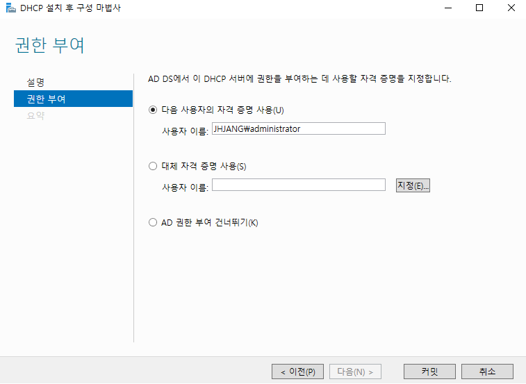
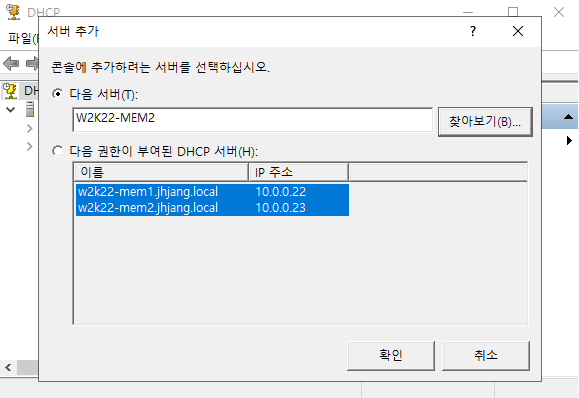
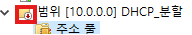
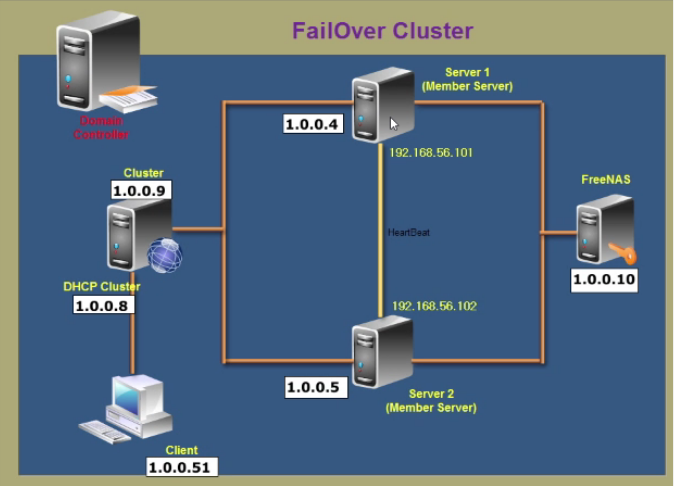
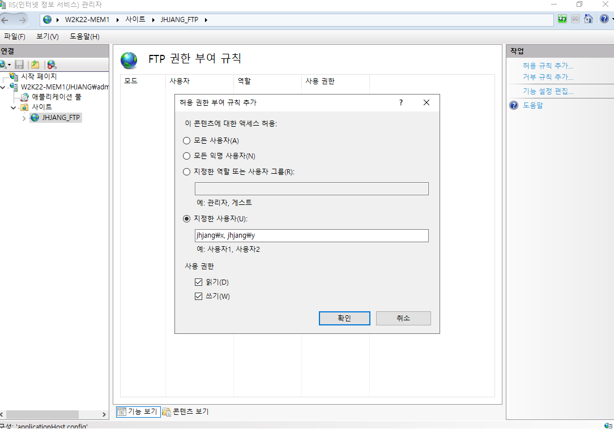
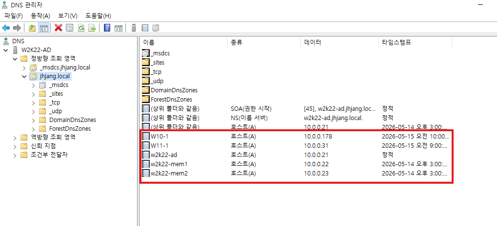
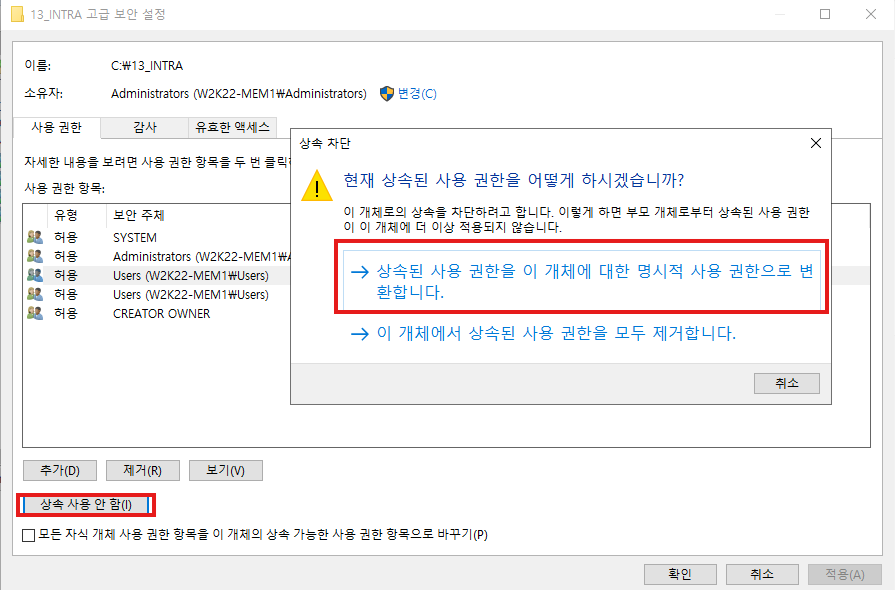
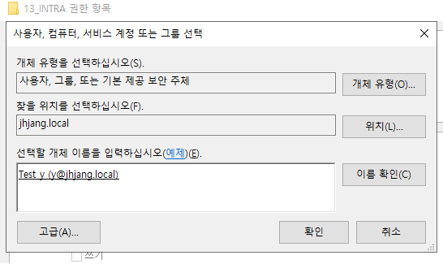
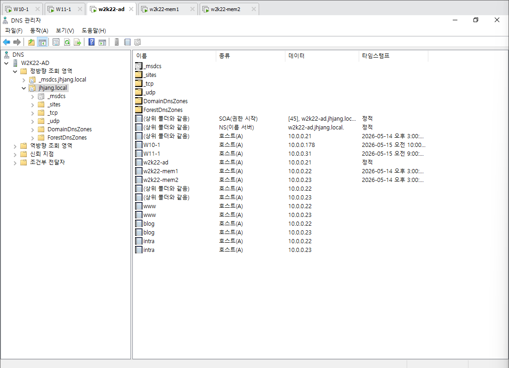

---

멤버 서버는 100%
스탠드 얼론은 몇퍼 사용 못함


## DHCP

**주 DHCP, 보조 DHCP**



	도메인 컨트롤러의 Administrator 계정을 사용



	다른 서버를 추가해서 하나의 관리 콘솔엥서 관리 가능(추가하지마셈 기능만 알아두기)


mem1: 주 dhcp
mem2: 보조 dhcp


mem1: 고급 -> 분할범위

보통 7:3으로 나누고 추가된 dhcp서버에 100밀리초 지연 시간 부여



	보조 dhcp가서 활성화 꼭 시켜주기

	별다른 문제 없으면 이전 ip를 받아오려고 함


**failover cluster**



	로드밸런싱이 가능하다


failover 클릭 -> 50대50으로 설정 -> 완료

	공유 저장소가 없이 복제해서 연결


---

IIS 구성 공유(mem1, mem2 동일한 구성)
DFS 복제 (mem1 contents, mem2로 복제)



	도메인의 사용자를 넣을 땐 저렇게 넣어야 한다.




	보안된 항목만이 체크되어있어서 자동으로 동적 업데이트 된다.


```javascript
<html>
<body>
<h1>JHJANG-MAIN-1</h1>
</body>
</html>
```









ㄱ


---

백업 시스템의 4가지 유형
	Mirror: 완벽하게 동일한 시스템, Active-Active, Active-Active 즉시, 비용
	hot: 완벽하게 동일한 시스템, Active-Standby, downtime 존재
	warm: 중요 정보시스템 준비, 수일-수주일
	cold: 필수 정보시스템만 준비, 수주일-수개월


