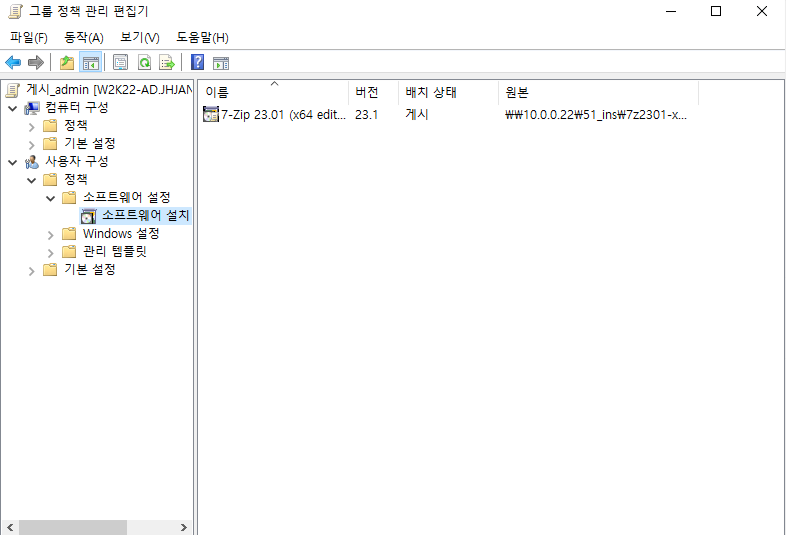
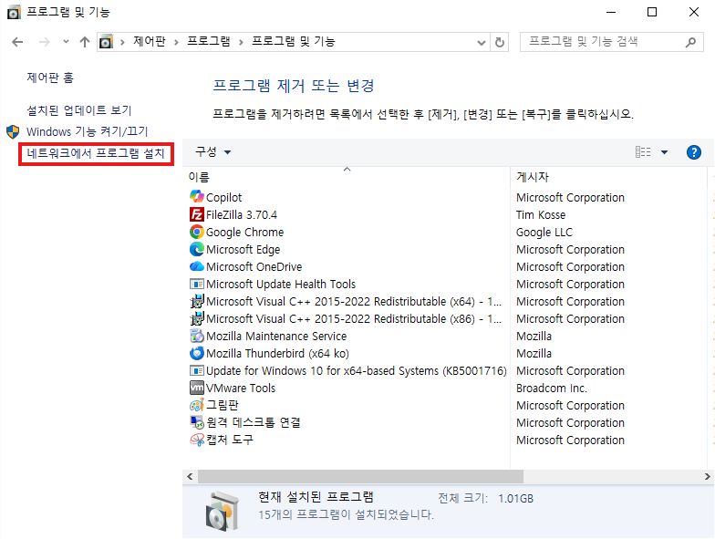
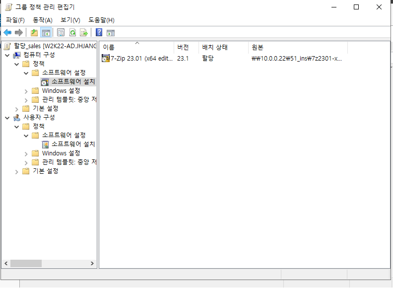
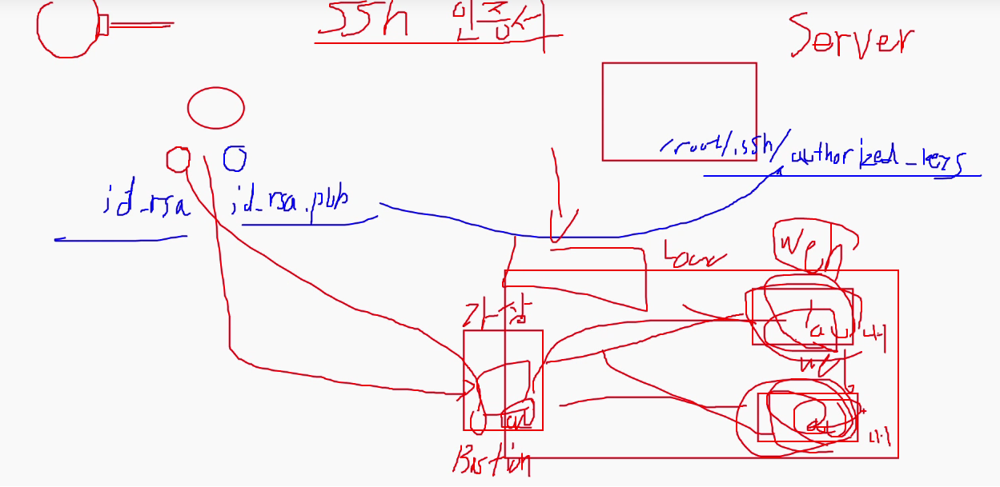
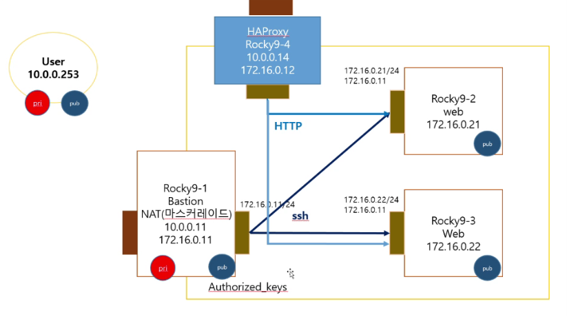

---
리디렉션?


	루트 경로를 \\\10.0.0.22\41_pro
	설정 독점 권한 제거, 사용자 프로필 위치로 리디렉션으로 변경
	
	Roaming, 바탕화면, 시작메뉴, 문서, 사진, 다운로드 적용
	
	같은 계정에 접속한 두 PC가 서로 실시간으로 업데이트 되는걸 볼 수 있다.


게시

	.msi 서로 다른 버전 2개 다운
	mem1서버의 51_ins 폴더에 집어넣음
	
	51_ins 폴더 권한 확인
	
	도메인 관리자가 만든 앱은 설치가능





	안에 게시로 설정한 앱이 존재함을 확인 가능


할당



	할당 하면 바로 설치 가능


---
모의해킹

kali, metasploitable3

패스워드 입력은 자동화에 걸림돌이 됨


---
1. 암호화 방식
	1. 대칭키(DES, 3DES, ARIA)
		1. 암호화 키와 복호화 키가 동일함.
		2. 암호화 토인할 상대가 많아지면 키가 기하 급수적으로 늘어남, 키 전달의 문제 발생
	2. 공개키(RSA, KCDSA)
		1. 암호화 키(공개키)와 복호화 키(개인키)가 다름(키전달의 문제점해결)
		2. 소인수 분해 복잡성

**인증서가지고 접속하는 법 (패스워드 없이)**

```cmd
ssh-keygen -t rsa -b 2048 -m PEM -q -N ""
```

	공개키에서는 띄어쓰기 한번만 인식한다. 그 뒤로는 인식하지 않는다.
	그래서 맨 뒤에 붙어있는 내 pc이름 부분은 삭제해도 된다.

```cmd
scp .ssh\id_rsa.pub root@10.0.0.11:/root/.ssh/authorized_keys
```

	?

```cmd
scp .ssh/jhjang.pub root@10.0.0.11:/root/.ssh/authorized_keys
```

	?

```cmd
ssh -i .ssh\jhjang root@10.0.0.11
```

	?

```cmd
scp -i .ssh/jhjang a.txt root@10.0.0.11:/root
```

	?

```cmd
scp -i .ssh\jhjang .ssh\id_rsa.pub root@10.0.0.11:/root/.ssh/authorized_keys
id_rsa.pub

ssh root@10.0.0.11
```

	?

**확장해서 클라우드에서 적용**

bastion 서버란?

	내부로 통하는 유일한 길





	Rocky9-1: NAT, Host-only
	Rocky9-2, 9-3: Host-only

1. Rocky9-1에 개인키, 공개키 넣기
```cmd
ssh-keygen -t rsa -b 2048 -m PEM -q -N ""
scp .ssh\id_rsa.pub root@10.0.0.11:/root/.ssh/authorized_keys

#ssh root@10.0.0.11

scp .ssh\id_rsa root@10.0.0.11:/root/.ssh/
```

2. Rocky9-2에 공개키 넣기
```bash
# Rocky9-1
scp .ssh/authorized_keys root@172.16.0.21:/root/.ssh/

rm -rf .ssh/known*
chmod 600 .ssh/id_rsa

ssh root@172.16.0.21
```

3. Rocky9-3에 공개키 넣기
```bash
# Rocky9-1
scp .ssh/authorized_keys root@172.16.0.22:/root/.ssh/

rm -rf .ssh/known*
chmod 600 .ssh/id_rsa

ssh root@172.16.0.22
```


**NAT 기능 추가**

	외부에서 내부로 들어오는건 안되지만 내부에서 외부로 나가는건 되도록 설정

```bash
# Rocky9-1
echo "net.ipv4.ip_forward = 1" > /etc/sysctl.d/ip_forward.conf

firewall-cmd --permanent --direct --add-rule ipv4 nat POSTROUTING 0 -o ens160 -j MASQUERADE

firewall-cmd --permanent --direct --add-rule ipv4 filter FORWARD 0 -i ens192 -o ens160 -j ACCEPT

firewall-cmd --reload

reboot

ssh root@172.16.0.21
ssh root@172.16.0.22
```

```bash
# Rocky9-2, 9-3
ping google.com #따로 nmtui에서 8.8.8.8 dns추가
```

**WEB 서버 설치**

```bash
# Rocky9-2, 9-3
dnf install -y httpd
```

**HAPROXY 서버 설치**

```bash
# Rocky9-4
dnf install -y haproxy
```


---
azure의 원칙

	450km 이상 떨어져 있어야 함(seoul<->busan이 예외적 사례)

