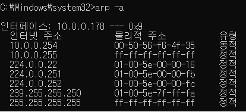
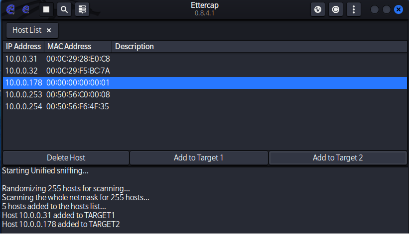
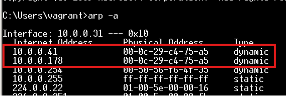
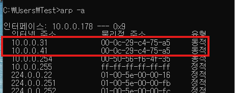
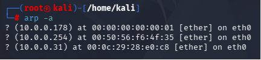
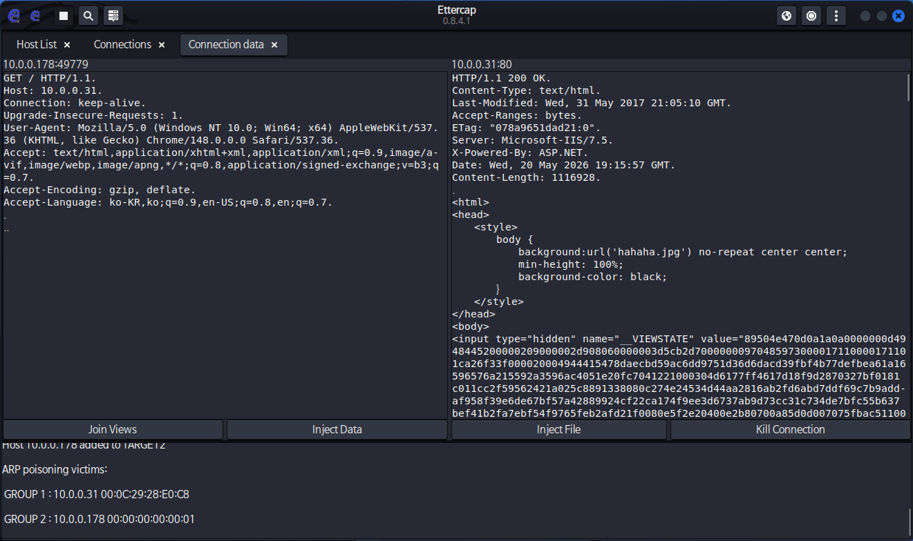
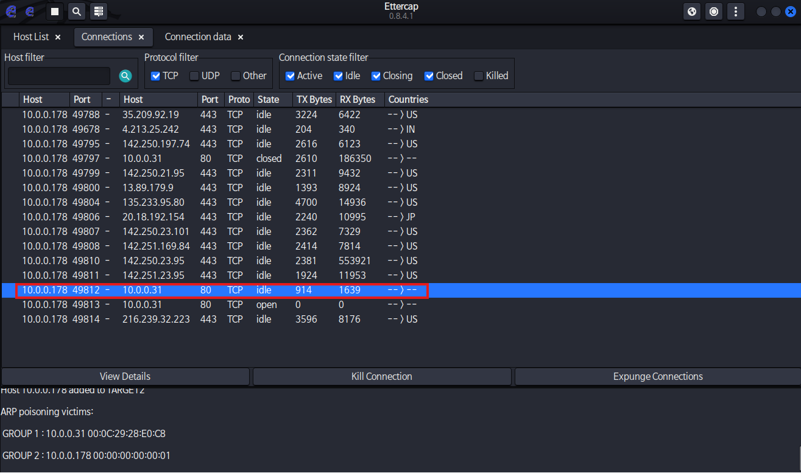
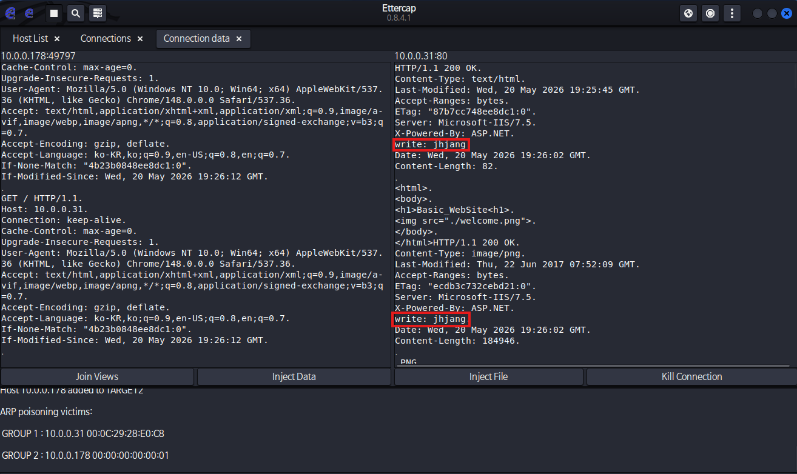
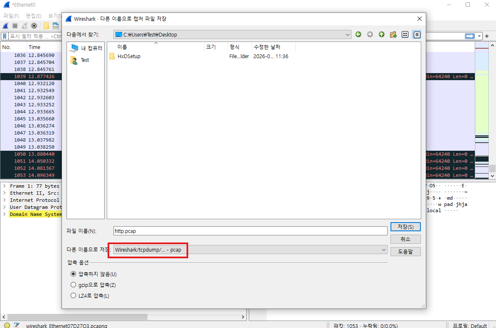
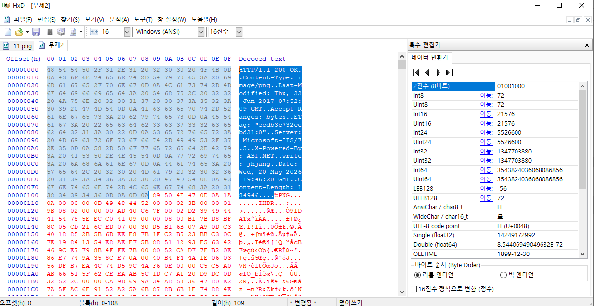

---

**취약점이 없는 시스템의 경우**
	1. 서비스 자체의 취약점 공격
		1. DHCP: Discover 메시지에 대한 응답으로 Offer 메시지 전송
		   이 때 Mac Address에 대한 검증 없이 무작위로 Offer 메시지 발송
		   공격자가 Mac Address를 속여 무작위로 Discover 메시지를 전송
		   결국 Offer메시지에서 응답한  IP Address자원은 한정적
		   따라서 DHCP에서 서비스할 IP 자원이 고갈됨
		 DHCP Starvation 공격(DDOS Attack)
		2. DNS: 외부 순환쿼리시 사용자의 요청에 의한 URL을 IP Address로 변경해서 전달 
		   이 때 해당 Name Server에서의 응답을 검증하지 않음 
		   공격자가 지속적으로 Public DNS에서 가짜 응답을 전송함 
		   Public DNS는 해당 응답을 Cache 저장 후 사용자에게 Attack가 전송한 IP Address 전달
		 DNS Cache Poisoning 공격
		3. SSH를 통한 터널링: 고객의 요청이 없는 한 요구사항 이외의 서비스는 임의로 구성하지 말아야 함 
		   사용하지 않는 원격데스크탑 서비스를 구성 후 방화벽에서 차단함 
		   SSH 터널링을 이용하면 방화벽에서 차단한 서비스에 접속가능

**용어**
1. 위험: 특정 위협이 취약점을 이용하여 발생할 수 있는 잠재적 손실이나 피해의 가능성
2. 위협: 모든 잠재적인 원인(조직 or 시스템), 외부적인 요인
3. 취약점: 보안상의 허점(System, Application), 내부적인 요인

---
**프로젝트**

	테라폼 사용 추가 → Azure 자동화

**DHCP Starvation**

	해결방법: NAC장비(IP, Mac Address관리)

Mac Address 필터링 기능

```bash
# Kali
ettercap -G &
```

	체크 표시한 뒤 돋보기 -> 목록
	Target1: 10.0.0.31 / Target2: 10.0.0.178
	지구본 -> ARP Poisoning
	view -> connections



	arp -a



meta3


w10


kali










	리눅스에 기본적으로 내장된걸로 해야 다른 곳에서 사용 가능?



	%PNG 부터 시작하도록 다 지워줌

**SSL 사용 이유**

	데이터 암호화
	종단 간 신뢰성 확보


---
**실습**
wireshark, winpcap다운

가급적이면 게이트웨이 주소는 정적으로 설정하는게 좋음ㅁ게


**프로젝트**

- 시스템 모의해킹

	보고서는 직접 쓰기