---

## 오늘 목표


### 1. 리소스 그룹 생성


	유효성 검사 통과하면 만들기


### 2. 가상 네트워크 생성(1)


##### 2.1. 서브넷 추가


	NAT 게이트웨이: Outbound 설정만 적용
	NSG: VM에 할당된 네트워크 인터페이스(우선적용), 서브넷에 설정 가능

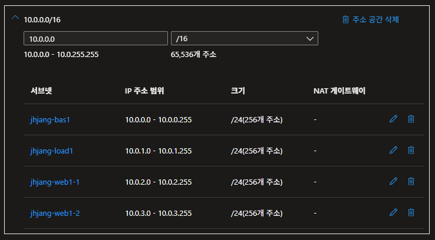

	유효성 검사 통과하면 만들기


### 2. 가상네트워크 생성(2)

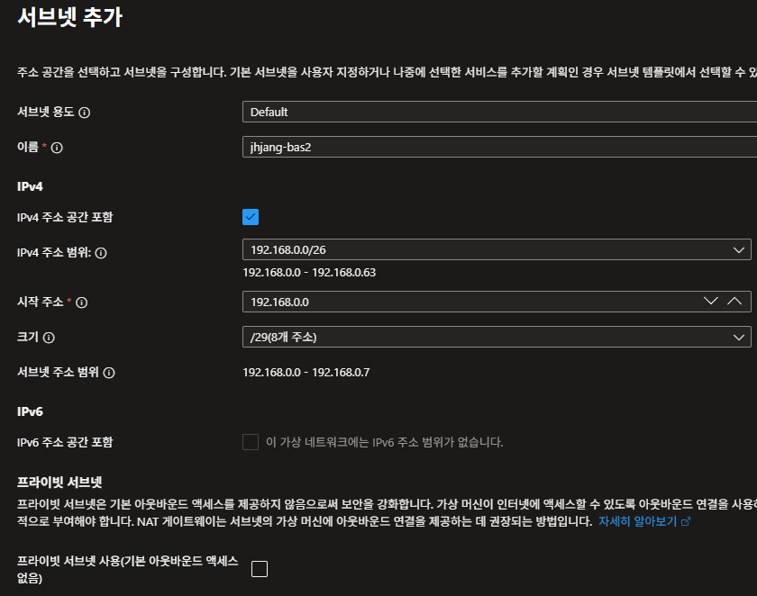

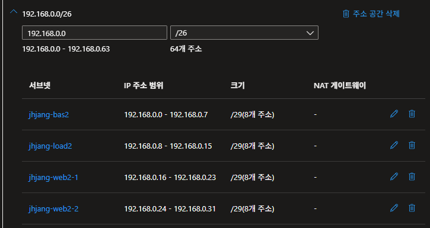


### 3.1. 공용IP 주소 생성


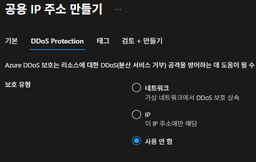

	jhjang-load1-pubip 도 똑같이 생성


### 3.2. 공용IP 접두사 만들기


	20.249.112.162/31 생성된 공용 IP 복사
	주소 2개이므로 162,163 할당 가능


	수동 지정 시 ip주소가 범위 내에 없으면 오류뜸


### 4. 가상머신 생성

##### 4.1. bas1


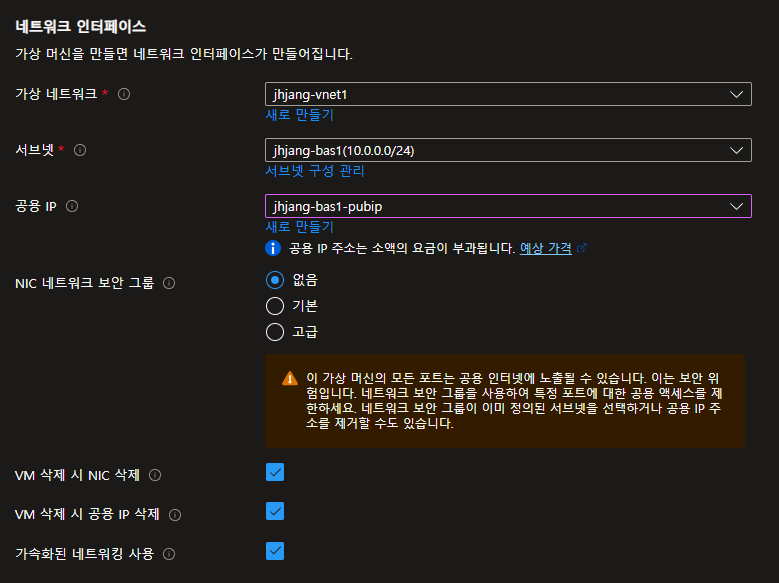

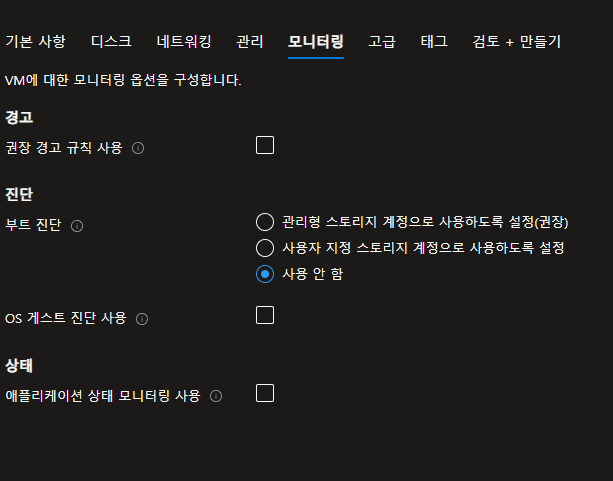

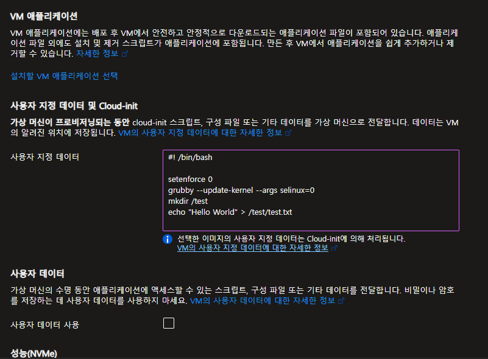

	유효성 검사 통과 시 만들기


##### 4.2. web1-1


	web이니 공용 ip 없음


##### 4.3. bas2

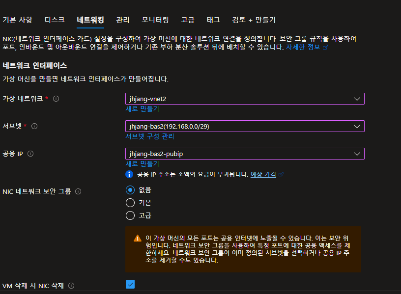

```bash
#! /bin/bash

setenforce 0
grubby --update-kernel --args selinux=0
echo -e "개인키"> /home/jhjang/.ssh/id_rsa
chmod 700 /home/jhjang/.ssh/id_rsa
```

	고급에 스크립트 추가

##### 4.4. web2-1

	똑같이 제작


### 5. nsg만들기


	우선순위는 100번이 최소이며 낮을수록 우선순위가 높다

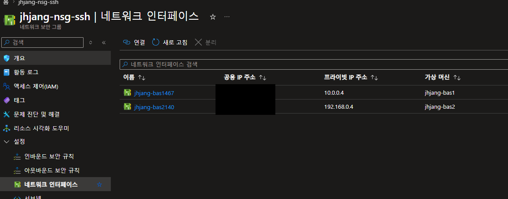

	그리고 vm 가서 찾아보기
			jhjang-bas1 | jhjang-web1-1 | jhjang-bas2 | jhjang-web2-1
	pri ip     10.0.0.4      10.0.2.4      192.168.0.4    192.168.0.20
	pub ip      x.x.x.x                      x.x.x.x
	jhjang

### 6. xshell 접속 테스트

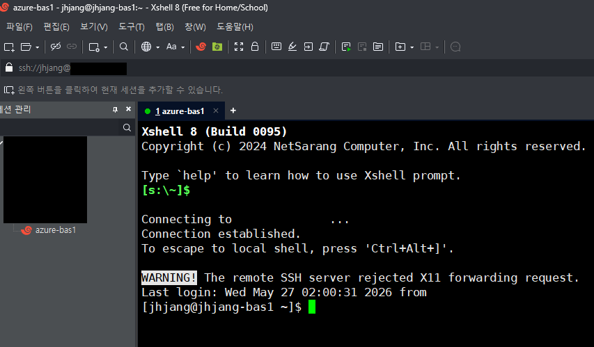

	ssh 접속 성공
	물리pc 파워쉘에서 SCP .\.ssh\id_rsa jhjang@공개키:/home/jhjang/.ssh/ 입력

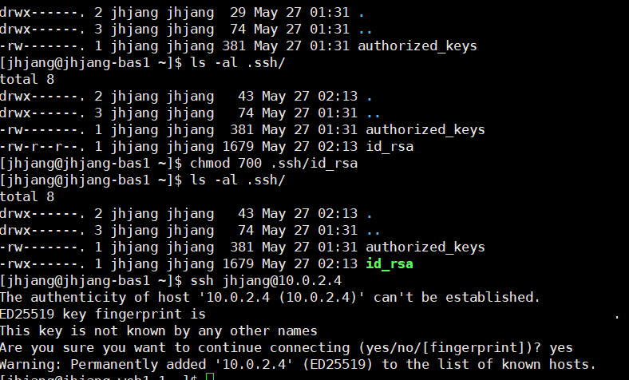

	개인키가 생기고 권한을 부여한 뒤 web1-1로 ssh 접속을 시도한 결과 성공
	아까 bas2는 고급에서 스크립트로 개인키 넣는 부분까지 추가했으므로 해당 과정 수행할 필요 없음

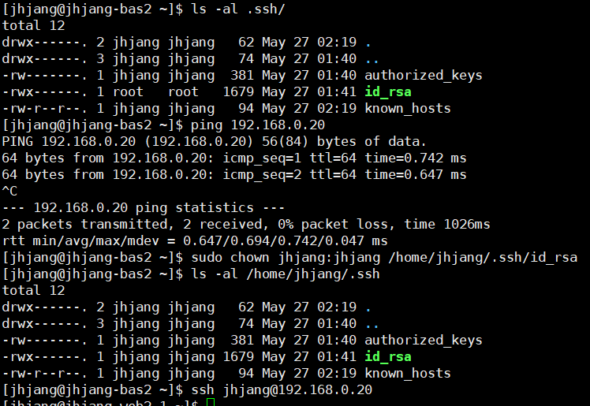

	chown으로 root에서 jhjang로 소유자를 변경해줘야 접속 가능

### 7. nat 게이트웨이 생성

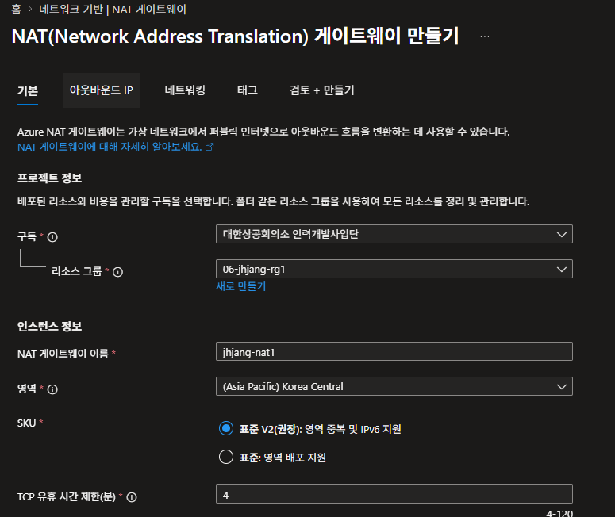

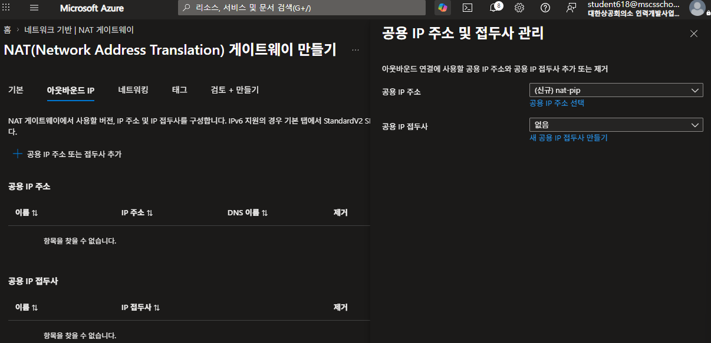

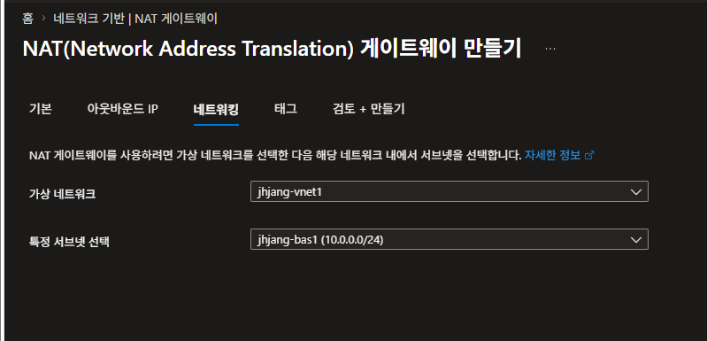


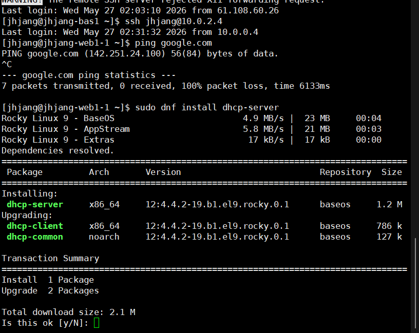

	인터넷이 잘 되는걸 볼 수 있다.
	Azure는 핑이 되는게 보이지않는다. 하지만 AWS는 핑이 된다.


> **구성 원리**
   물리pc(개인키) -- bastion(개인키, 공개키) -- web(공개키)
   vnet은 서로 다른 네트워크면 통신이 안됨 -> peering하면 서로 연결도 가능


---

## 테라폼

> 여러가지 클라우드에 대하여 배포관리

	1. Azure Portal 에서 구독 키 복사해놓기
	2. Azure CLI 설치
	3. 테라폼 하시코프 검색 -> Developer -> 테라폼 AMD64 설치
	4. registry.terraform.io (미리 접속하기)
	5. C:\01_IaC 경로를 등록해줘야 함
		5.1. 우선 01_IaC폴더에 terraform.exe 넣기
		5.2. sysdm.cpl -> 고급 -> 환경변수 -> 시스템변수 Path -> C:\01_IaC\ 추가
		5.3. 새로운 cmd창에서 terraform 입력 -> 메시지 나오면 성공
	6. cmd 창에서 az 입력 
		6.1. az login
	7. 코드 작성은 vs code로 작성


---
Azure는 자동으로 인터넷 게이트웨이가 붙는다.
AWS는 인터넷 게이트를 직접 붙여줘야 한다.