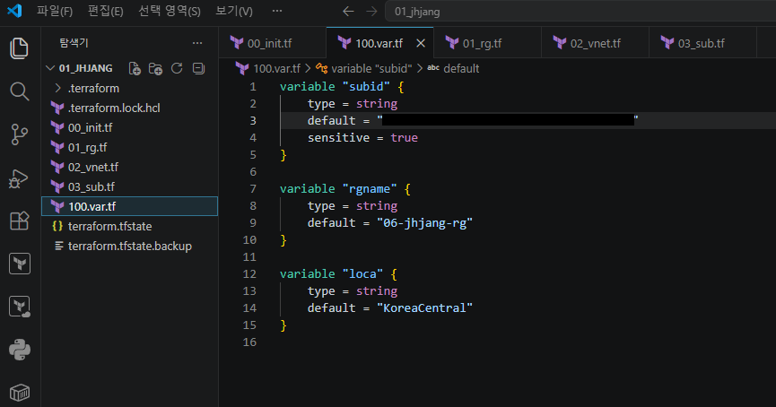

---

1. 서로 다른 Vnet에 존재하는 VM을 통신시키는 방법
	1.1. public ip 사용
	1.2. VPN으로 vnet을 연결
	1.3. Express Route
		전용 회선필요
		비용 비쌈
	1.4. Vnet Peering
		비용 저렴

 vpn사용 이유
	2.1. 암호화
	2.2. 종단간 신뢰성확보

site to site : ipsec
point to site: ssl

---

### 테라폼

	어제 한 부분에서 변수로 생성

1. 가상머신 생성(web1, web2)
2. 
