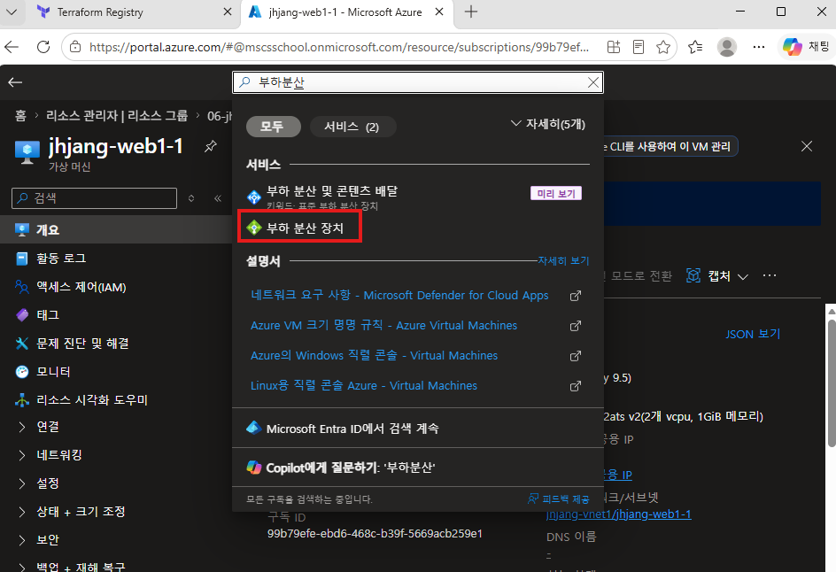
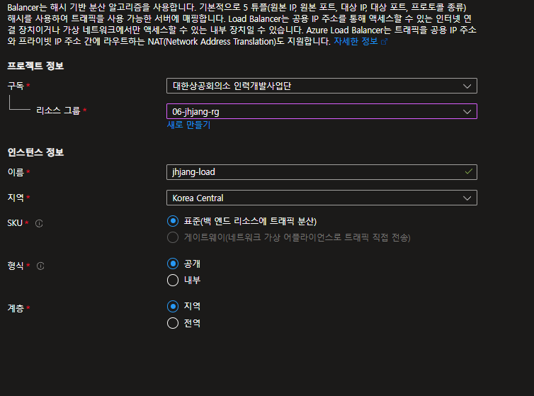
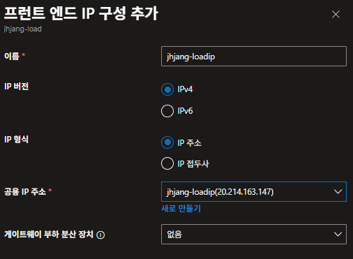
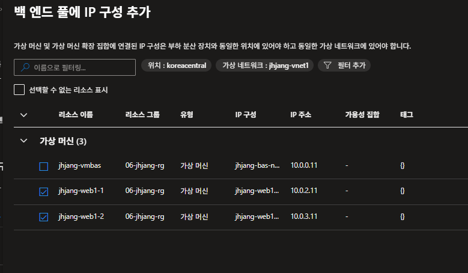
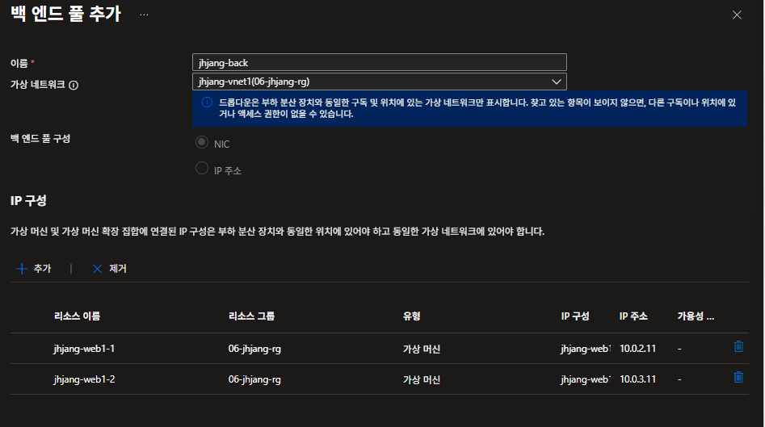
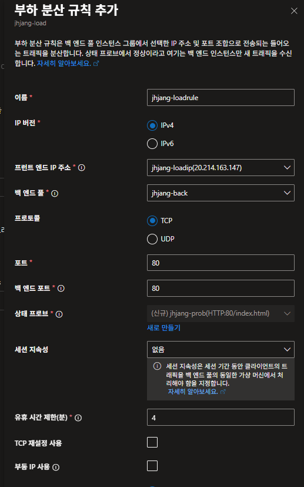
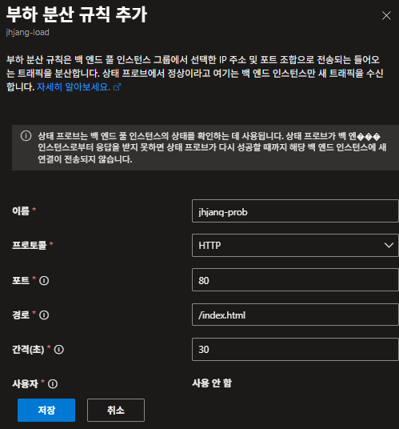
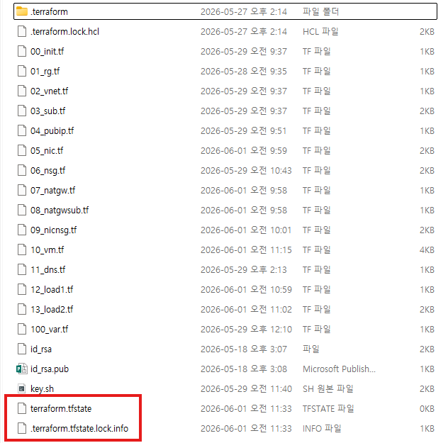

---

##### 1. Load Balancer (부하 분산 장치)



	표준 부하 장치

- 기본 사항



- 프런트 엔드 IP 구성



- 백 엔드 풀




- 인바운드 규칙





	- 부하 분산 규칙 추가
 


	snat: 내부 → 외부 IP 주소 바뀜
	dnat: port forwarding


	DNS 이름을 nslookup했을 때 로드밸런서 주소가 잘 나오면 사이트를 들어갈 수 있음


##### 중간에 잘 안될경우



	1. 리소스그룹을 destroy 해준다.
	2. 상태 파일들을 지워준다.
	3. 그리고 terraform init 명령어를 실행한다.
	4. 재설치해본다.

##### 테라폼으로 자동화

	리소스생성~로드밸런서

```bash
#! /bin/bash

setenforce 0
grubby --update-kernel --args selinux=0

dnf install -y tar httpd php php-mysqlnd php-curl php-gd php-opcache
wget https://ko.wordpress.org/wordpress-7.0-ko_KR.tar.gz
tar xvfz wordpress-7.0-ko_KR.tar.gz
cp -ar ./wordpress/* /var/www/html/
sed -i "s/DirectoryIndex index.html/DirectoryIndex index.php/g" /etc/httpd/conf/httpd.conf
cp /var/www/html/wp-config-sample.php /var/www/html/wp-config.php
sed -i "s/localhost/10.0.4.11/g" /var/www/html/wp-config.php
sed -i "s/database_name_here/wordpress/g" /var/www/html/wp-config.php
sed -i "s/password_here/It12345!/g" /var/www/html/wp-config.php
systemctl enable --now httpd
firewall-cmd --permanent --add-port=80/tcp
firewall-cmd --reload

```

