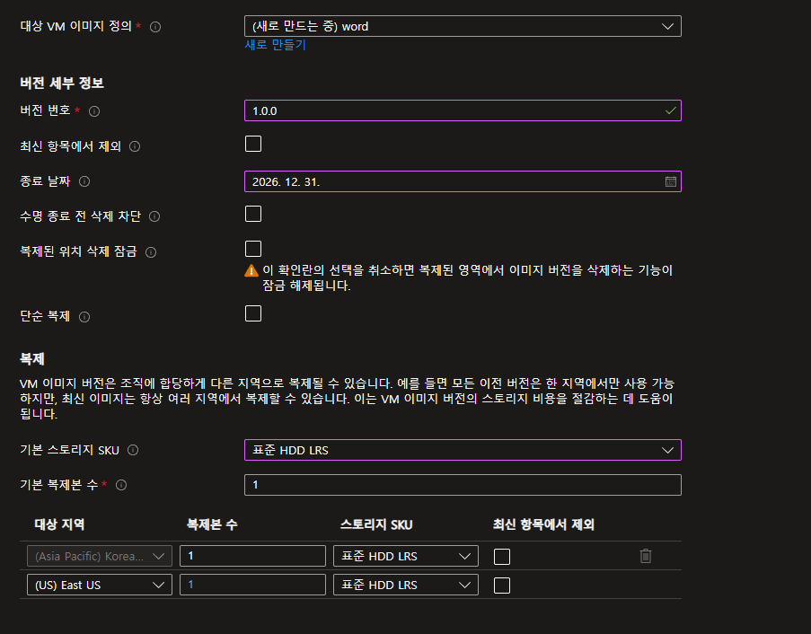
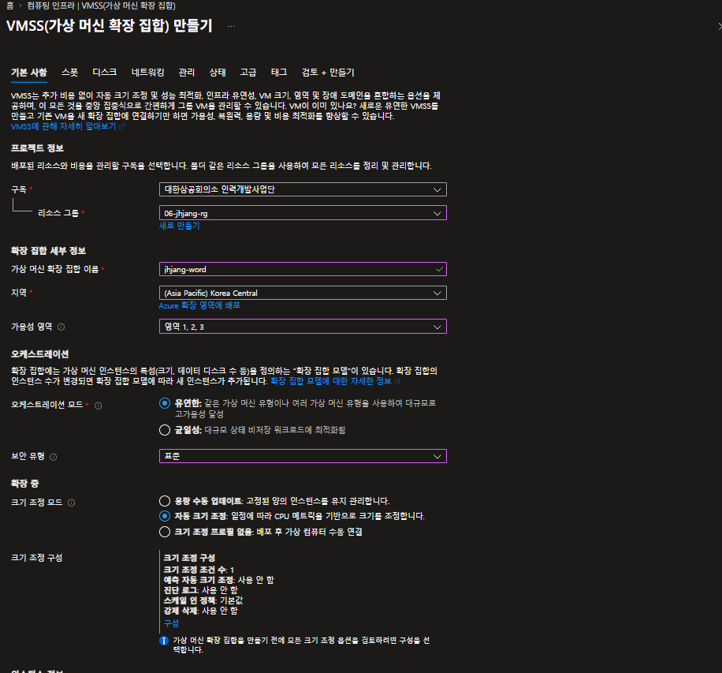
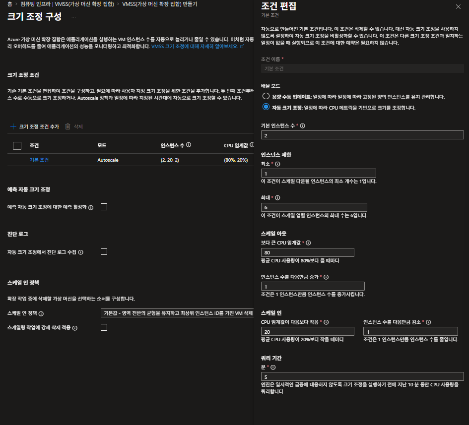
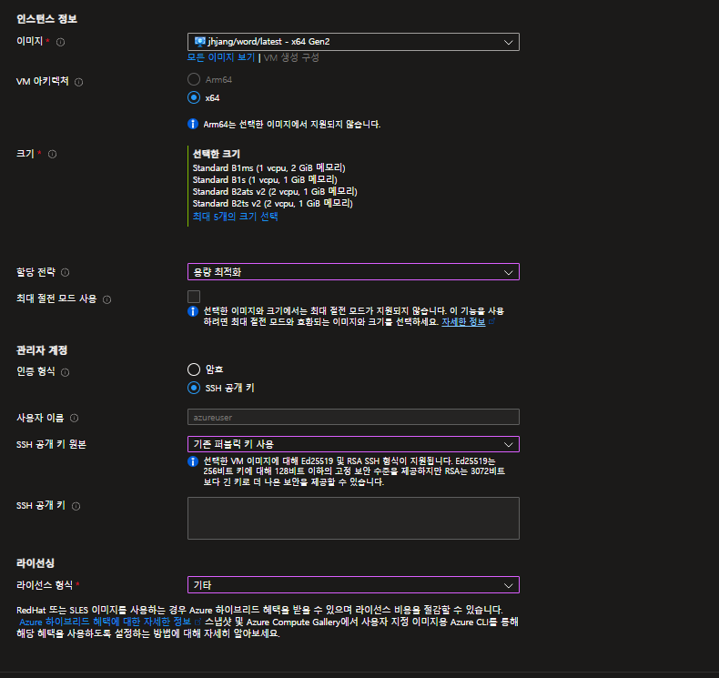
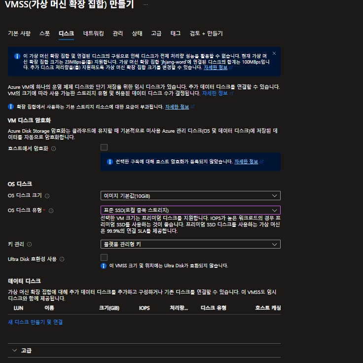
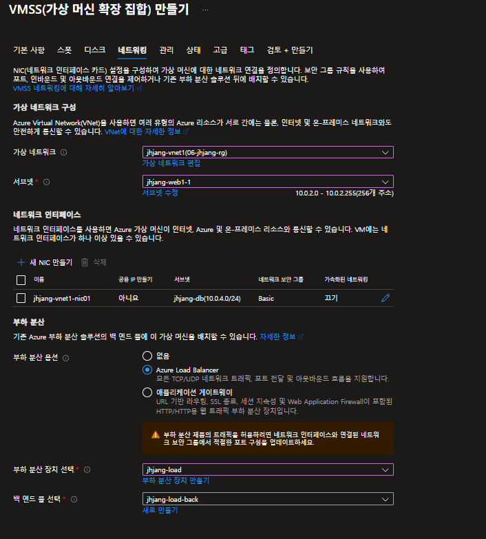
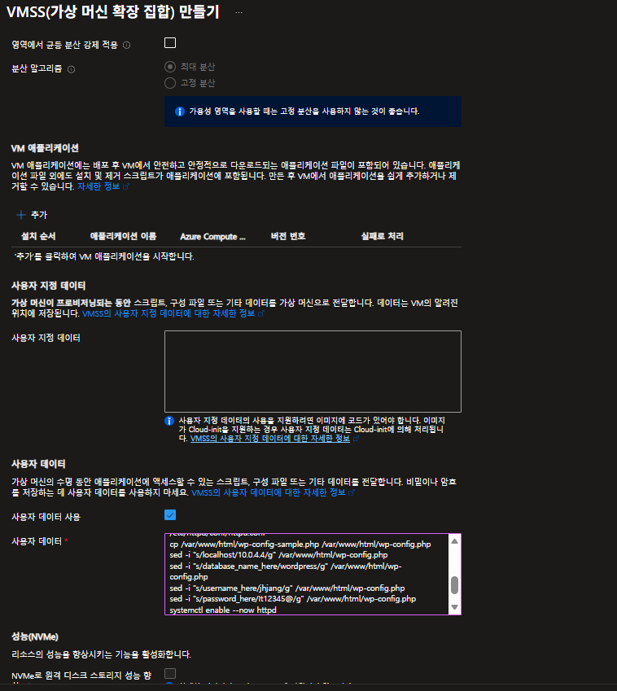

---
##### virtual machine scale set

	scale set하려면 우리가 이미지를 만들어야 함





##### VMSS 만들기







	스케일아웃: 가상머신개수늘리기
	스케일업: 성능높이기







	백엔드부분엔 scale set이 들어감


```bash
#! /bin/bash

setenforce 0
grubby --update-kernel --args selinux=0

dnf install -y wget httpd php php-mysqlnd php-curl php-gd php-opcache
wget https://ko.wordpress.org/wordpress-7.0-ko_KR.tar.gz
tar xvfz wordpress-7.0-ko_KR.tar.gz
cp -ar ./wordpress/* /var/www/html/
sed -i "s/DirectoryIndex index.html/DirectoryIndex index.php/g" /etc/httpd/conf/httpd.conf
cp /var/www/html/wp-config-sample.php /var/www/html/wp-config.php
sed -i "s/localhost/jhjangmysql.mysql.database.azure.com/g" /var/www/html/wp-config.php
sed -i "s/database_name_here/wordpress/g" /var/www/html/wp-config.php
sed -i "s/username_here/jhjang/g" /var/www/html/wp-config.php
sed -i "s/password_here/It12345@/g" /var/www/html/wp-config.php
echo $HOSTNAME > /var/www/html/index.html
systemctl enable --now httpd
systemctl restart httpd
firewall-cmd --permanent --add-port=80/tcp
firewall-cmd --reload
```

	userdata에 집어넣음




##### xshell 확인

